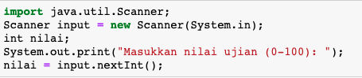
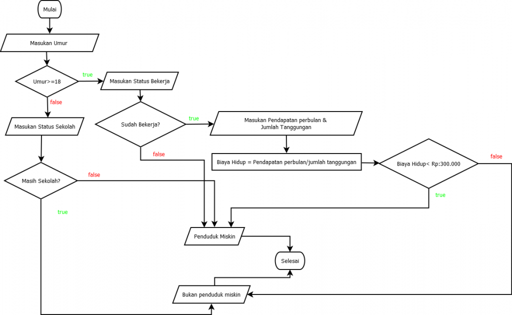

## JOBSHEET 6

## PEMILIHAN 2
## Perbaikan
#### Nama   : Rama Wijaya
#### Kelas  : 1A
#### NIM    : 2131710107

### Tujuan

Mahasiswa memahami tentang operator logika; Mahasiswa mampu menyelesaikan permasalahan dengan menggunakan sintaks pemilihan bersarang; Mahasiswa mampu membuat sebuah program Java yang memanfaatkan sintaks pemilihan bersarang


### Alat dan Bahan
+ PC/laptop
+ Browser(chrome, firefox, safari)
+ Koneksi internet

### Praktikum

#### Percobaan 1

#### Waktu percobaan : 40 menit

1. Tambahkan library Scanner, deklarasi Scanner

2. Buatlah variabel nilai yang memiliki tipe data int untuk menampung data yang diinput melalui keyboard

    


```Java
// Ketik kode di sini
import java.util.Scanner;
Scanner input = new Scanner(System.in);
int nilai;
System.out.print("Masukkan nilai ujian (0-100): ");
nilai = input.nextInt();
```

    Masukkan nilai ujian (0-100):  105


#### Penjelasan
> digunakan untuk mengambil masukkan user berupa angka, dengan menggunakan library Scanner, dan input-an dimasukkan kedalam variabel nilai.
___

3. Buatlah struktur pengecekan kondisi bersarang. Pengecekan pertama digunakan untuk memastikan bahwa nilai yang dimasukkan berada pada rentang 0 – 100. Jika nilai berada pada rentang 0 – 100, maka akan dilakukan pengecekan status kelulusan mahasiswa, yaitu jika nilai di antara 90 – 100 maka nilainya A, jika nilai di antara 80 – 89 maka nilainya B, jika nilai di antara 60 – 79 maka nilainya C, jika nilai di antara 50 – 59 maka nilainya D, dan jika nilai di antara 0 – 49 maka nilainya E. Sedangkan jika nilai berada di luar rentang 0 – 100, maka ditampilkan informasi bahwa nilai yang dimasukkan tidak valid.

    


```Java
// Ketik kode di sini
if(nilai >= 0 && nilai <= 100){
    if(nilai >= 90 && nilai <= 100){
        System.out.println("Nilai A, EXCELLENT!");
    } else if (nilai >= 80 && nilai <= 89){
        System.out.println("Nilai B, Pertahankan prestasi Anda!");
    } else if (nilai >= 60 && nilai <= 79){
        System.out.println("Nilai C, Tingkatkan prestasi Anda!");
    } else if (nilai >= 50 && nilai <= 59){
        System.out.println("Nilai D, Tingkatkan belajar Anda!");
    } else {
        System.out.println("Nilai E, Anda tidak lulus!");
    }
} else {
    System.out.println("Nilai yang Anda masukkan tidak valid!");
}
```

    Nilai yang Anda masukkan tidak valid!


#### Penjelasan
> Melakukan pengecekan terhadap variabel `nilai`, jika nilainya antara 0-100 maka akan masuk kedalam if yang ada didalamnya lalu melakukan pengecekan sesuai kondisi, jika tidak akan mengeluarkan output "Nilai yang Anda masukkan tidak valid!".
___

##### Pertanyaan

1. Modifikasi kode program pada Percobaan 1 sehingga jika nilai yang dimasukkan kurang dari 0 akan ditampilkan output “Nilai yang Anda masukkan kurang dari 0” dan jika nilai yang dimasukkan lebih dari 100 akan ditampilkan output “Nilai yang Anda masukkan lebih dari 100”!

2. Jelaskan fungsi sintaks if (nilai >= 0 && nilai <= 100)!

3. Ubah operator && menjadi || pada sintaks if (nilai >= 0 && nilai <= 100). Jalankan program dengan memasukkan nilai = 105. Amati apa yang terjadi! Mengapa hasilnya demikian?


```Java
// Jawaban pertanyaan
// Jawaban Ke 1:
if(nilai >= 0 && nilai <= 100){
    if(nilai >= 90 && nilai <= 100){
        System.out.println("Nilai A, EXCELLENT!");
    } else if (nilai >= 80 && nilai <= 89){
        System.out.println("Nilai B, Pertahankan prestasi Anda!");
    } else if (nilai >= 60 && nilai <= 79){
        System.out.println("Nilai C, Tingkatkan prestasi Anda!");
    } else if (nilai >= 50 && nilai <= 59){
        System.out.println("Nilai D, Tingkatkan belajar Anda!");
    } else {
        System.out.println("Nilai E, Anda tidak lulus!");
    }
} else if(nilai < 0) {
    System.out.println("Nilai yang Anda masukkan kurang dari 0");
} else if(nilai > 100) {
    System.out.println("Nilai yang Anda masukkan lebih dari 100");
} else {
    System.out.println("Nilai yang Anda masukkan tidak valid!");
}
```

    Nilai yang Anda masukkan lebih dari 100


> Jawaban 2 => untuk mengecek variabel nilai jika dalam rentang 0-100 <br>
___


```Java
// Jawaban Ke 3:
if(nilai >= 0 || nilai <= 100){
    if(nilai >= 90 && nilai <= 100){
        System.out.println("Nilai A, EXCELLENT!");
    } else if (nilai >= 80 && nilai <= 89){
        System.out.println("Nilai B, Pertahankan prestasi Anda!");
    } else if (nilai >= 60 && nilai <= 79){
        System.out.println("Nilai C, Tingkatkan prestasi Anda!");
    } else if (nilai >= 50 && nilai <= 59){
        System.out.println("Nilai D, Tingkatkan belajar Anda!");
    } else {
        System.out.println("Nilai E, Anda tidak lulus!");
    }
} else if(nilai < 0) {
    System.out.println("Nilai yang Anda masukkan kurang dari 0");
} else if(nilai > 100) {
    System.out.println("Nilai yang Anda masukkan lebih dari 100");
} else {
    System.out.println("Nilai yang Anda masukkan tidak valid!");
}
```

    Nilai E, Anda tidak lulus!


#### Penjelasan No 3:
> yang terjadi adalah mengeluarkan output Nilai E, Anda tidak lulus!, karena yang terjadi ketika kita menganti && menjadi || adalah dari yang awalnya berkondisi rentang 0-100, menjadi nilai integer berapa saja akan bisa masuk, karena kondisi-nya kurang dari sama dengan 0 atau lebih dari seratus, jadi jika salah satu kondisi benar maka akan bisa masuk.
___

#### Percobaan 2

#### Waktu percobaan : 40 menit

1. Perhatikan flowchart dibawah ini!


> Flowchart tersebut digunakan untuk menghitung gaji bersih seseorang setelah dipotong pajak sesuai dengan kategorinya (pekerja dan pebisnis) dan besarnya penghasilan. 

2. Tambahkan library Scanner dan deklarasi Scanner

3. Deklarasikan variabel kategori, penghasilan, gajiBersih, dan pajak

    


```Java
// Ketik kode di sini
import java.util.Scanner;
Scanner input = new Scanner(System.in);
String kategori;
int penghasilan, gajiBersih;
double pajak = 0;

System.out.print("Masukkan kategori: ");
kategori = input.nextLine();
System.out.print("Masukkan besarnya penghasilan: ");
penghasilan = input.nextInt();
```

    Masukkan kategori:  pekerja
    Masukkan besarnya penghasilan:  2800000


#### Penjelasan
> mendefinikan semua variabel yang akan digunakan dan melakukan 2 input-an Scanner kemudian disimpan kedalam variabel `String kategori` dan `integer penghasilan`.
___

4. Buatlah struktur pengecekan kondisi bersarang. Pengecekan pertama digunakan untuk mengecek kategori (pekerja atau pebisnis). Selanjutnya dilakukan pengecekan kedua untuk menentukan besarnya pajak berdasarkan penghasilan yang telah dimasukkan.Kemudian tambahkan kode program untuk menghitung gaji bersih yang diterima setelah dipotong pajak!

    


```Java
// Ketik kode di sini
if(kategori.equalsIgnoreCase ("pekerja")){
    if (penghasilan <= 2000000){
        pajak = 0.1;
    } else if (penghasilan <= 3000000){
        pajak = 0.15;
    } else {
        pajak = 0.2;
    }
    gajiBersih = (int) (penghasilan - (penghasilan * pajak));
    System.out.println("Gaji bersih yang Anda terima: " + gajiBersih);
    
} else if (kategori.equalsIgnoreCase ("pebisnis")){
    if (penghasilan <= 2500000){
        pajak = 0.15;
    } else if (penghasilan <= 3500000){
        pajak = 0.2;
    } else {
        pajak = 0.25;
    }
    gajiBersih = (int) (penghasilan - (penghasilan * pajak));
    System.out.println("Gaji bersih yang Anda terima: " + gajiBersih); 
} else {
    System.out.println("Kategori yang Anda masukkan salah!"); 
}
```

    Gaji bersih yang Anda terima: 2380000


#### Penjelasan
> melakukan pengecekan kategori dan penghasilan untuk menentukan gaji bersih dari input-an sebelumnya,contoh saya menginputkan pekerja dan 2.800.000 maka saya harus membayar pajak sebesar 15%, jadi gaji bersih saya menjadi 2.380.000.
___

5. Jalankan program di atas. Amati apa yang terjadi!

##### Pertanyaan

1. Jalankan program dengan memasukkan kategori = pekerja dan penghasilan = 2048485. Amati apa yang terjadi! Mengapa angka di belakang koma tidak ditampilkan?

2. Jelaskan fungsi dari (int) pada sintaks:
```
gajiBersih = (int) (penghasilan - (penghasilan * pajak));
```

3.	Jalankan program dengan memasukkan kategori = pebisnis dan penghasilan = 2000000. Amati apa yang terjadi! Apa kegunaan dari equalsIgnoreCase?

4.	Ubah equalsIgnoreCase menjadi equals, kemudian jalankan program dengan memasukkan kategori = pebisnis dan penghasilan = 2000000. Amati apa yang terjadi! Mengapa hasilnya demikian? Apa kegunaan dari equals?

#### Jawaban pertanyaan
1. Karena variabel `gajiBersih` bertipe data integer, maka akan menghasilkan nilai bilangan bulat.
2. fungsi `(int)` dalam hal ini, akan mengkonversikan bilangan menjadi bilangan bulat.
3. program tetap jalan, equalsIgnoreCase() adalah fungsi yang digunakan untuk mengecek apakah string yang inputkan sama dengan string yang diberikan dalam kondisi tanpa memperhatikan huruf besar atau huruf kecil.
4. program tetap jalan, equals() adalah adalah fungsi yang digunakan untuk mengecek apakah string yang inputkan sama dengan string yang diberikan dalam kondisi dengan memperhatikan huruf besar atau huruf kecil harus sama persis.
___

### Tugas

#### Waktu pengerjaan Tugas: 140 menit

1. Buatlah program kalkulator sederhana menggunakan bahasa pemrograman Java. User akan menginputkan dua buah bilangan riil dan satu buah operator aritmatika (+, -, *, atau /), kemudian program akan mengoperasikan dua bilangan tersebut dengan operator yang sesuai. Petunjuk: gunakan pernyataan switch-case.
Contoh tampilan program:

```
Masukkan bilangan pertama: 2.5
Masukkan operator (+, -, *, /): *
Masukkan bilangan kedua: 4
2.5 * 4.0 = 10.0

```


```Java
//ketik kode program dan lampirkan hasilnya disini
import java.util.Scanner;

Scanner input = new Scanner(System.in);
double bil1, bil2, hasil;
char op;

System.out.print("Masukkan bilangan pertama: ");
bil1 = input.nextDouble();
System.out.print("Masukkan Operator (*, /, +, -): ");
op = input.next().charAt(0);
System.out.print("Masukkan bilangan kedua: ");
bil2 = input.nextDouble();

hasil = (op == '*') ? (bil1 * bil2) : 
        (op == '/') ? (bil1 / bil2) : 
        (op == '+') ? (bil1 + bil2) : (bil1 - bil2) ;

System.out.println(String.format("Hasil dari => %f %s %f = %f", bil1, op, bil2, hasil));
```

    Masukkan bilangan pertama:  2.5
    Masukkan Operator (*, /, +, -):  *
    Masukkan bilangan kedua:  4
    Hasil dari => 2.500000 * 4.000000 = 10.000000


#### Penjelasan
> membuat kalkulator sederhana dengan memanfaatkan 2 inputan bertipe data double dan 1 inputan bertipe data char disimpan kedalam variabel `op`, disini saya memanfaatkan `ternary if` untuk mengecek operator yang digunakan.
___

2. Dengan menggunakan tiga nilai yang mewakili panjang tiga sisi sebuah segitiga, tentukan apakah segitiga tersebut sama sisi (ketiga sisinya bernilai sama), sama kaki (kedua sisinya bernilai sama), atau sembarang (tidak ada sisi yang bernilai sama)! 


```Java
//ketik kode program dan lampirkan hasilnya disini
import java.util.Scanner;

Scanner input = new Scanner(System.in);
int sisi1, sisi2, sisi3;

System.out.print("Masukan Sisi Pertama: ");
sisi1 = input.nextInt();
System.out.print("Masukkan Sisi Kedua: ");
sisi2 = input.nextInt();
System.out.print("Masukkan Sisi Ketiga: ");
sisi3 = input.nextInt();

System.out.println("-----Program Segitiga-----");
String hasil = (sisi1 == sisi2 && sisi2 == sisi3)? "Segitiga Sama Sisi" : 
            (sisi1 == sisi2 || sisi2 == sisi3 || sisi1 == sisi3)? "Segitiga Sama Kaki" : "Segitiga Sembarang";
System.out.println("| " + hasil);
System.out.println("--------------------------");
```

    Masukan Sisi Pertama:  10
    Masukkan Sisi Kedua:  10
    Masukkan Sisi Ketiga:  10
    -----Program Segitiga-----
    | Segitiga Sama Sisi
    --------------------------


#### Penjelasan
> Membuat program penentu jenis dari segitiga dengan menentukan panjang masing sisi, dengan menggunakan `ternary if` jika 3 sisi sama akan menghasilkan Segitiga sama sisi, 2 sisi sama menghasil segitiga sama kaki, semua sisi tidak sama menghasilkan Segitiga Sembarang.
___

3. Warung Padang Gembira meminta Anda membuat sebuah program untuk menerima pesanan dari internet. Program yang Anda buat meminta user untuk memasukkan nama makanan dan harga. Setelah itu, user ditawarkan untuk menggunakan pengiriman ekspres. Jika pengguna menolak, maka jenis pengiriman yang digunakan adalah pengiriman reguler. Biaya pengiriman reguler untuk harga makanan kurang dari Rp 100.000 adalah Rp 20.000, sedangkan untuk harga makanan sama dengan atau lebih dari Rp 100.000 biaya pengirimannya adalah Rp 30.000. Untuk jenis pengiriman ekspres, tambahkan biaya tambahan sebesar Rp 25.000 dari standar biaya pengiriman reguler. Tampilkan struk yang berisi nama makanan yang dibeli + harga, biaya pengiriman, dan total yang harus dibayar!
Contoh hasil output program:

```
Masukkan nama makanan: Tuna salad
Masukkan harga makanan: Rp 115000
Apakah Anda ingin pengiriman ekspres (0 = tidak, 1 = ya)? 0

STRUK PEMBELIAN
Tuna salad        Rp 115000
Biaya pengiriman  Rp 30000
TOTAL             Rp 145000

```

```
Masukkan nama makanan: Beef bulgogi
Masukkan harga makanan: Rp 78000
Apakah Anda ingin pengiriman ekspres (0 = tidak, 1 = ya)? 1

STRUK PEMBELIAN
Beef bulgogi      Rp 115000
Biaya pengiriman  Rp 45000
TOTAL             Rp 123000

```


```Java
//ketik kode program dan lampirkan hasilnya disini
import java.util.Scanner;

Scanner input = new Scanner(System.in);
String makanan;
int total, pengiriman, harga;
boolean isEkspres;

System.out.print("Masukkan nama makanan: ");
makanan = input.nextLine();
System.out.print("Masukkan harga makanan: ");
harga = input.nextInt();
System.out.print("Apakah Anda ingin pengiriman ekspres (y/t): ");
isEkspres = input.next().charAt(0) == 'y';

pengiriman = (harga < 100000) ? 20000 : 30000;

if(isEkspres){
    pengiriman += 25000;
}

System.out.println("---------- STRUK PEMBELIAN ----------");
System.out.println(String.format("%s\t\t Rp %d",makanan, harga));
System.out.println(String.format("Biaya Pengiriman\t: Rp %d",pengiriman));
System.out.println(String.format("Total\t\t\t: Rp %d", (pengiriman + harga)));
```

    Masukkan nama makanan:  Tuna salad
    Masukkan harga makanan:  115000
    Apakah Anda ingin pengiriman ekspres (y/t):  y
    ---------- STRUK PEMBELIAN ----------
    Tuna salad		 Rp 115000
    Biaya Pengiriman	: Rp 55000
    Total			: Rp 170000


#### Penjelasan
> membuat program pengiriman barang sederhana,setelah user memasukkan input-an, dengan menggunakan `ternary if` mengecek apakah harga makanan lebih kecil dari 100.000 jika iya maka biaya pengiriman menjadi 20.000, kalau tidak maka biaya pengiriman menjadi 30.000, kemudian dicek jika user menggunakan pengiriman ekspres maka biaya pengiriman akan bertambah sebesar 25.000, kemudian ditotal dengan harga barang. 
___

4. Perhatikan flowchart berikut ini!



> Buatlah program sesuai dengan flowchart diatas!


```Java
//ketik kode program dan lampirkan hasilnya disini
import java.util.Scanner;

Scanner input = new Scanner(System.in);
int umur, pendapatan, biayaHidup = 0, tanggungan;
boolean isKerja, isSekolah = false;

System.out.print("Masukkan umur: ");
umur = input.nextInt();
if(umur>=18){
    System.out.print("Apakah Sudah Bekerja (y/t): ");
    isKerja = input.next().charAt(0) == 'y';
    if(statusKerja == 'y'){
        System.out.print("Masukkan Pendapatan perbulan: ");
        pendapatan = input.nextInt();
        System.out.print("Masukkan jumlah tanggungan: ");
        tanggungan = input.nextInt();
        biayaHidup = (int) pendapatan/tanggungan;
    }
}else{
    System.out.print("Apakah Masih Sekolah (y/t): ");
    isSekolah = input.next().charAt(0) == 'y';
}

String statusWarga = (!isSekolah || biayaHidup >= 300000) ? "Bukan Penduduk Miskin" :"Penduduk Miskin";
System.out.println(statusWarga);
```

    Masukkan umur:  19
    Apakah Sudah Bekerja (y/t):  y
    Masukkan Pendapatan perbulan:  300000
    Masukkan jumlah tanggugan:  6
    Bukan Penduduk Miskin


#### Penjelasan
> membuat program status penduduk, pertama user mengimputkan umur, jika lebih dari 19, maka user harus menginputkan sudah bekerja atau belum (y/t), jika 'y' maka user harus mengimputkan jumlah pendapatan dan tanggungan, setelah itu akan pendapatan akan dibagi dengan tanggungan untuk mendapatkan biaya hidup. kemudian akan dicek menggunakan `ternary if`, untuk menentukan apakah penduduk tersebut miskin atau tidak.
___