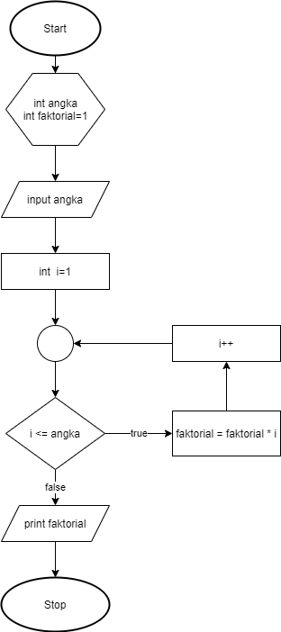
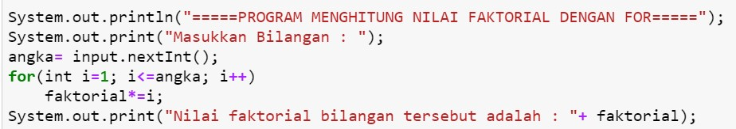
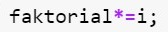
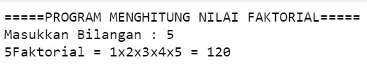
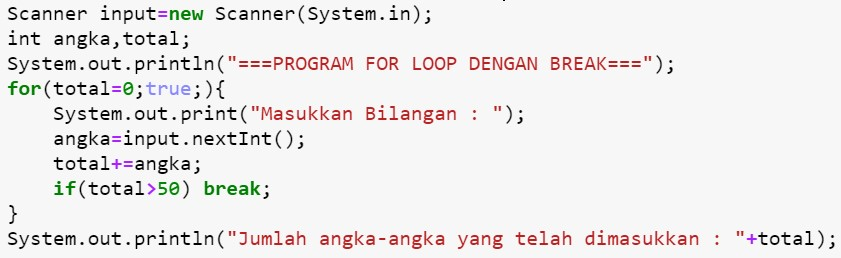
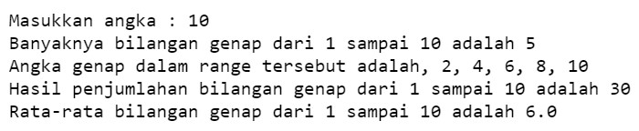
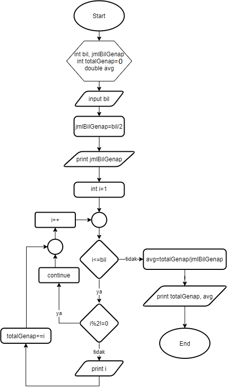

## JOBSHEET 7

## PERULANGAN 1
## Perbaikan
#### Nama   : Rama Wijaya
#### Kelas  : 1A
#### NIM    : 2131710107

### Tujuan

Mahasiswa mampu menyelesaikan permasalahan/studi kasus menggunakan sintaks perulangan 1 dan mengimplemantasikannya dalam bahasa pemrogaman java.

### Alat dan Bahan
+ PC/laptop
+ Browser(chrome, firefox, safari)
+ Koneksi internet

### Praktikum

#### Percobaan 1 : Penggunaan for, while dan do-while

#### Waktu percobaan : 40 menit

1. Perhatikan flowchart perulangan for dibawah ini!

    <p align="left">
    
    </p>
    

> Flowchart diatas digunakan untuk menghitung nilai faktorial, selanjutnya kita akan membuat programnya berdasarkan
> flowchart di atas!

2. Tambahkan library Scanner, deklarasi Scanner, dan buat variabel angka untuk menampung data yang diinput melalui keyboard


```Java
// Ketik kode program di bawah sini
import java.util.Scanner;
Scanner input = new Scanner(System.in);
```

Kode program di atas berfungsi untuk deklarasi scanner.


```Java
3. Buatlah deklarasi dan inisialisasi variabel faktorial sesuai dengan flowchart diatas
```


```Java
// Ketik kode program di bawah sini
int angka, faktorial = 1;
```

Kode program di atas untuk deklarasi dan inisialisasi variabel dengan tipe data int sesuai dengan flowchart yang disajikan.

4. Tambahkan struktur perulangan untuk menghitung hasil faktorial sebuah nilai yang diinputkan menggunakan for
    
    <p align="left">
    
    </p>


```Java
// Ketik kode program di atas di bawah sini
System.out.println("=====PROGRAM MENGHITUNG NILAI FAKTORIAL DENGAN FOR=====");
System.out.print("Masukkan Bilangan : ");
angka= input.nextInt();
for(int i=1; i<=angka; i++)
    faktorial*=i;
System.out.print("Nilai faktorial bilangan tersebut adalah : "+ faktorial);
```

    =====PROGRAM MENGHITUNG NILAI FAKTORIAL DENGAN FOR=====
    Masukkan Bilangan : 5
    Nilai faktorial bilangan tersebut adalah : 120

Kode program di atas menggunakan tipe data int untuk variabel faktorial dan angka. Kode program di atas menggunakan perulangan for yang dimana sudah diketahui pasti jumlah perulangannya, dengan i = 1 sebagai inisialisasi, i <= angka sebagai kondisi, dan i++ sebagai increment. Proses menghitung faktorial yaitu faktorial *=1. Selanjutnya akan menampilkan hasil faktorial.

5. Ubah nilai variabel faktorial seperti semula. Kemudian gunakan struktur perulangan while untuk menghitung hasil faktorial sebuah nilai yang diinputkan
    
    <p align="left">
    
    </p>


```Java
// Ketik kode program di atas di bawah sini
faktorial=1;
System.out.println("=====PROGRAM MENGHITUNG NILAI FAKTORIAL DENGAN WHILE=====");
System.out.print("Masukkan Bilangan : ");
angka= input.nextInt();
int i=1;
while(i<=angka){
    faktorial*=i;
    i++;
}
System.out.print("Nilai faktorial bilangan terebut adalah : "+ faktorial);
```

    =====PROGRAM MENGHITUNG NILAI FAKTORIAL DENGAN WHILE=====
    Masukkan Bilangan : 3
    Nilai faktorial bilangan terebut adalah : 6

Kode program di atas menggunakan tipe data int untuk variabel faktorial dan angka. Kode program di atas menggunakan perulangan while 
6. Kembalikan lagi nilai variabel faktorial seperti semula. Gunakan struktur perulangan do-while untuk menghitung hasil faktorial sebuah nilai yang diinputkan
    
    <p align="left">
    
    </p>


```Java
// Ketik kode program di atas di bawah sini
faktorial=1;
System.out.println("=====PROGRAM MENGHITUNG NILAI FAKTORIAL DENGAN DO-WHILE=====");
System.out.print("Masukkan Bilangan : ");
angka= input.nextInt();
int i=1;
do{
    faktorial*=i;
    i++;
}
while(i<=angka);
System.out.print("Nilai faktorial bilangan tersebut adalah : "+ faktorial);
```

    =====PROGRAM MENGHITUNG NILAI FAKTORIAL DENGAN DO-WHILE=====
    Masukkan Bilangan : 4
    Nilai faktorial bilangan tersebut adalah : 24

Kode program di atas menggunakan tipe data int untuk variabel faktorial dan angka. Kode program di atas menggunakan perulangan do while 

##### Pertanyaan
1. Pada program diatas, apakah kegunaan baris berikut?
<p align="left">
    
    </p>

// Ketik jawaban disini

Kegunaan perintah faktorial*=i; untuk menampung hasil perkalian dari i. Yang dimana nilai faktorial akan berubah setiap kali perulangan dilakukan oleh program dan nilai i akan selalu meningkat sesuai dengan perintah increment. 

2. Modifikasi program diatas dibagian struktur pemilihannya sehingga hasilnya menjadi seperti di bawah ini:
<p align="left">
    
    </p>


```Java
// Ketik kode program di atas di bawah sini
import java.util.Scanner;

Scanner input = new Scanner(System.in);

        int faktorial = 1, angka;
        System.out.println("=====PROGRAM MENGHITUNG NILAI FAKTORIAL=====");
        System.out.print("Masukkan Bilangan : ");
        angka = input.nextInt();
        System.out.print(angka + "Faktorial = ");

        for (int i = 1; i <= angka; i++) {
            faktorial *= i;
            if (i < angka) {
                System.out.print(i + "x");
            } else {
                System.out.print(i);
            }
        }
        System.out.println(" = " + faktorial);
```

    =====PROGRAM MENGHITUNG NILAI FAKTORIAL=====
    Masukkan Bilangan : 5
    5Faktorial = 1x2x3x4x5 = 120


Kode program di atas menggunakan tipe data int untuk variabel faktorial dan angka. Kode program di atas menggunakan perulangan for 

#### Percobaan 2 : Keluar dari perulangan menggunakan break

#### Waktu percobaan : 40 menit

1. Buatlah perulangan dengan menggunakan for yang memanfaatkan keyword break
<p align="left">
    
    </p>


```Java
// Ketik kode program di atas di bawah sini
Scanner input=new Scanner(System.in);
int angka, total;
System.out.println("===PROGRAM FOR LOOP DENGAN BREAK===");
for(total=0;true;){
    System.out.print("Masukkan Bilangan : ");
    angka=input.nextInt();
    total+=angka;
    if(total>50) break;
}
System.out.println("Jumlah angka-angka yang telah dimasukkan : "+total);
```

    ===PROGRAM FOR LOOP DENGAN BREAK===
    Masukkan Bilangan : 51
    Jumlah angka-angka yang telah dimasukkan : 51


Pada program di atas menggunakan tipe data int dengan variabel angka dan total serta menggunakan perulangan for dan pemilihan if, kode program di atas user diminta untuk menginputkan angka berupa bilangan bulat secara terus menerus hingga total keseluruhan yang diinputkan berjumlah 50

2. Buat perulangan yang sama dengan struktur perulangan while
<p align="left">
    
    </p>


```Java
// Ketik kode program di atas di bawah sini
Scanner input=new Scanner(System.in);
int angka, total;
System.out.println("===PROGRAM FOR WHILE LOOP DENGAN BREAK===");
total=0;
while(true){
    System.out.print("Masukkan Bilangan : ");
    angka=input.nextInt();
    total+=angka;
    if(total>50) break;
}
System.out.println("Jumlah angka-angka yang telah dimasukkan : "+total)
```

    ===PROGRAM FOR WHILE LOOP DENGAN BREAK===
    Masukkan Bilangan : 20
    Masukkan Bilangan : 15
    Masukkan Bilangan : 30
    Jumlah angka-angka yang telah dimasukkan : 65


Pada program di atas menggunakan tipe data int dengan variabel angka dan total serta menggunakan perulangan while dan pemilihan if, kode program di atas user diminta untuk menginputkan angka berupa bilangan bulat secara terus menerus hingga total keseluruhan yang diinputkan berjumlah 50, jika pada inputan pertama total>50 maka program akan selesai.

3. Tuliskan perulangan diatas dalam struktur do-while
    <p align="left">
    
    </p>


```Java
// Ketik kode program di atas di bawah sini

int angka,total;
System.out.println("===PROGRAM DO-WHILE LOOP DENGAN BREAK===");
total=0;
do
{
    System.out.print("Masukkan Bilangan : ");
    angka=input.nextInt();
    total+=angka;
    if(total>50) break;
}
while(true);
System.out.println("Jumlah angka-angka yang telah dimasukkan : "+total);
```

    ===PROGRAM DO-WHILE LOOP DENGAN BREAK===
    Masukkan Bilangan : 53
    Jumlah angka-angka yang telah dimasukkan : 53


Pada program di atas menggunakan tipe data int dengan variabel angka dan total serta menggunakan perulangan do while dan pemilihan if, kode program di atas user diminta untuk menginputkan angka berupa bilangan bulat secara terus menerus hingga total keseluruhan yang diinputkan berjumlah 50

##### Pertanyaan
1. Jelaskan fungsi kode program yang telah dibuat pada percobaan diatas!

// Ketik jawaban disini

Pada program diatas user diminta untuk menginputkan integer atau bilangan bulat secara terus menerus hingga total bilangan yang diinputkan berjumlah >50 jika bilangan pertama yang diinputkan lebih dari 50 maka akan langsung terdapat output jumlah angka yang dimasukkan atau program akan selesai jika total kurang dari 50 maka program akan terus meminta input.

2. Jelaskan fungsi kode berikut!
    <p align="left">
    
    </p>


// Ketik jawaban disini

Fungsi kode for(total=0;true;){ yaitu untuk membuat perulangan for dengan inisialisasi total=0 dan kondisi pengecekan bernilai true dan dapat dilanjutkan ke perintah selanjutnya.

#### Percobaan 3 : Keluar dari step perulangan menggunakan continue

#### Waktu percobaan : 40 menit

1. Buat program looping menggunakan struktur perulangan for seperti di bawah ini: 
<p align="left">
    
    </p>


```Java
// Ketik kode program di atas di bawah sini
Scanner input=new Scanner(System.in);
int angka, total, count;
double avg;
count=0;
System.out.println("===PROGRAM FOR LOOP DENGAN CONTINUE===");
for(int i=0;i<5;i++){
    System.out.print("Masukkan Bilangan : ");
    angka=input.nextInt();
    if(angka>=50) continue;
    total+=angka;
    count++;
}
System.out.println("Jumlah angka-angka yang kurang dari 50: "+total);
avg=(double)total/count;
System.out.println("Rata-rata angka yang kurang dari 50: "+avg)
```

    ===PROGRAM FOR LOOP DENGAN CONTINUE===
    Masukkan Bilangan : 20
    Masukkan Bilangan : 10
    Masukkan Bilangan : 20
    Masukkan Bilangan : 40
    Masukkan Bilangan : 60
    Jumlah angka-angka yang kurang dari 50: 90
    Rata-rata angka yang kurang dari 50: 22.5


```Java
5. Jalankan program. Amati apa yang terjadi!
```

Pada kode program di atas menggunakan tipe data int untuk variabel angka, total, dan count dan menggunakan tipe data double untuk variabel avg. Di dalam kode program di atas menggunakan perulangan for dengan 3 ekspresi 

##### Pertanyaan
1. Jelaskan Perbedaan dari percobaan 2 dan percobaan 3

// Ketik jawaban disini

Pada percobaan 2 menggunakan break dimana digunakan untuk menghentikan paksa proses perulangan yang berlangsung. Sedangkan pada percobaan 3 menggunakan continue yang digunakan untuk mengabaikan lalu melanjutkan suatu pernyataan pada perulangan selanjutnya.

2. Jelaskan apa fungsi perintah kode program dibawah ini?
<p align="left">
    
    </p>

// Ketik jawaban disini

Fungsi kodenya adalah jika angka yang diinput lebih dari sama dengan 50 maka lanjut ke perulangan selanjutnya dan mengabaikan statement yang ada dibawahnya. 

### Tugas

#### Waktu pengerjaan Tugas: 140 menit

1. Buatlah program yang meminta masukan user sebuah bilangan bulat N (N > 0). Program kemudian menampilkan penjumlahan N bilangan genap positif pertama (bilangan genap ≥ 0).
Contoh: 
    •	Jika user memasukkan N = 10, program akan menghitung banyaknya jumlah bilangan positive di dalam range bilangan 1-10   kemudian menampilkan penjumlahan bilangan positive bilangan bilangan diantara 1-10 yaitu : 
        0 + 2 + 4 + 6 + 10 = 30. 
        Setelah itu program akan menampilkan rata-rata dari bilangan positive yang telah dijumlahkan tadi.
    •	Contoh output program dan flowchart
<br/><br/>
  

<br/>


```Java
// Ketik kode program disini
import java.util.Scanner;
Scanner sc = new Scanner(System.in);
int bil, jmlBilGenap, totalGenap;
double avg;

System.out.print("Masukkan angka : ");
bil = sc.nextInt();

if(bil<=0){
    System.out.println("Angka yang anda input bukan bilangan positif!");
}
    else{

jmlBilGenap=bil/2;

    System.out.println("Banyaknya bilangan genap dari 1 sampai "+bil+" adalah "+jmlBilGenap);
    System.out.print("Angka genap dalam range tersebut adalah");

for(int i=1;i<=bil;i++){
    if(i%2!=0) continue;
    System.out.print(", "+i);
    totalGenap+=i;
    avg=totalGenap/jmlBilGenap;
}
    System.out.println("\nHasil penjumlahan bilangan genap dari 1 sampai "+bil+" adalah " +totalGenap);
    System.out.println("Rata-rata bilangan genap dari 1 sampai "+bil+" adalah "+avg);
    }
```

    Masukkan angka : 10
    Banyaknya bilangan genap dari 1 sampai 10 adalah 5
    Angka genap dalam range tersebut adalah, 2, 4, 6, 8, 10
    Hasil penjumlahan bilangan genap dari 1 sampai 10 adalah 30
    Rata-rata bilangan genap dari 1 sampai 10 adalah 6.0


 Pemilihan bertujuan untuk memilah apakah input yang dimasukkan user lebih dari 0 atau kurang dari 0.  Di dalam perulangan for menggunakan 3 ekspresi yaitu i=1 sebagai inisialisasi, i<=bil sebagai kondisional, dan i++ sebagai increment. Di dalam program looping terdapat pemilihan, pemilihan ini berisikan tentang apakah variabel i dimodulus 2 bernilai 0. Jika hasil modulus benar maka akan lanjut ke perintah selanjutnya yaitu output. Kemudian i akan dijumlah dengan totalGenap. Ketika program sudah looping hingga batas angka 10 maka akan menghitung avg atau rata-rata. Kemudian terdapat output hasil penjumlahan dan rata-rata bilangan genap dari 1 sampai 10.

2. Buatlah program untuk menampilkan angka 1 hingga angka masukan pengguna secara berurutan dan melompati angka kelipatan 5. Seperti tampilan di bawah ini
<p align="left">

</p>


```Java
// Ketik kode program disini
import java.util.Scanner;
Scanner input=new Scanner(System.in);
int angka, i;

System.out.print("Masukkan Angka : ");
angka=input.nextInt();

for(i=1; i<=angka; i++){
    if(i%5==0){
        i=i;
    } else{
        System.out.println(i);
    }
}
```

    Masukkan Angka : 16
    1
    2
    3
    4
    6
    7
    8
    9
    11
    12
    13
    14
    16


Pada program ini saya menggunakan tipe data int dengan variabel angka dan i. Pada program ini saya menggunakan inputan sampai angka berapa yang akan dilakukan looping. Pada looping for saya masukkan pemilihan if, hal ini bertujuan agar terdapat sebuah kondisi yang dapat dilaksanakan. Pada program ini menggunakan 3 ekspresi. If  berisikan jika variabel i dimodulus 5 bernilai 0 maka akan dijalankan.

3. Buatlah sebuah program yang menampilkan deret bilangan fibonacci sebagai berikut. Dimana bilangan yang terletak di sebelah kanan adalah hasil penjumlahan dari 2 bilangan sebelumnya
 <p align="left">
    
    </p>


```Java
// Ketik kode program disini
import java.util.Scanner;
Scanner show = new Scanner(System.in);

System.out.println("\t\t Fibonacci series");
System.out.print("Masukkan jumlah deret fibonacci : ");
int n = show.nextInt();
long fib[] = new long[n];

fib[0] = 0;
fib[1] = 1;

    for(int i = 2; i < n; i++) {
    fib[i] = fib[i-1] + fib[i-2];
    System.out.println("Sum of: "+ fib[i-2] +" + "+fib[i-1]+" = "+fib[i]);
}
    for(int i = 0; i < n; i++){
        System.out.print(fib[i] + " ");
    }
```

    		 Fibonacci series
    Masukkan jumlah deret fibonacci : 12
    Sum of: 0 + 1 = 1
    Sum of: 1 + 1 = 2
    Sum of: 1 + 2 = 3
    Sum of: 2 + 3 = 5
    Sum of: 3 + 5 = 8
    Sum of: 5 + 8 = 13
    Sum of: 8 + 13 = 21
    Sum of: 13 + 21 = 34
    Sum of: 21 + 34 = 55
    Sum of: 34 + 55 = 89
    0 1 1 2 3 5 8 13 21 34 55 89 

Menggunakan variabel fib sebagai array.  inputan untuk menentukan berapa panjang deret fibonacci yang akan dibuat. Terdapat dua perulangan dalam program ini dimana perulangan pertama adalah untuk menampilkan proses perhitungan untuk mendapatkan deret fibonacci tersebut, perulangan kedua digunakan untuk melakukan perulangan menampilkan deret fibonaccinya.