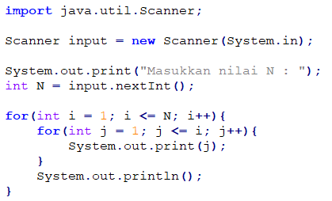
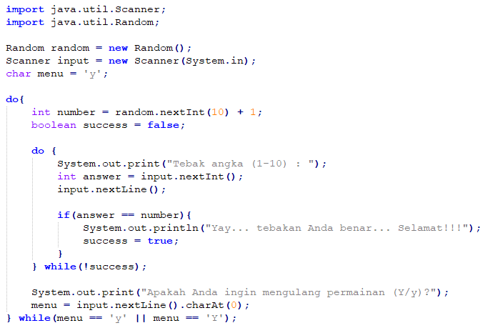
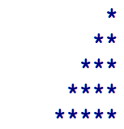

<dl>
  <dt>NIM :</dt>
  <dd>2131710022</dd>

  <dt>Nama :</dt>
  <dd>Indira Irawati Putri</dd>
    
  <dt>Kelas :</dt>
  <dd>1A-MI</dd>
</dl>


___


# JOBSHEET 09 - Perulangan 2

## Tujuan
+ Mahasiswa memahami konsep perulangan bersarang (_nested loop_)
+ Mahasiswa dapat menjelaskan format penulisan perulangan bersarang (_nested loop_)
+ Mahasiswa dapat mengimplementasikan _flowchart_ perulangan bersarang menggunakan bahasa pemrograman Java

## Alat dan Bahan
+ PC/laptop
+ Browser(chrome, firefox, safari)
+ Koneksi internet
+ Anaconda3 + Java kernel (opsional)

## Praktikum
### Percobaan 1: Bintang Persegi
1. Perhatikan Flowchart di bawah ini

> flowchart di atas digunakan untuk menggambar sebuah persegi dengan simbol * (bintang)
2. Pada percobaan ke-1 akan dilakukan percobaan tentang _nested loop_. Kasus yang akan diselesaikan adalah untuk membuat tampilan persegi * , dengan panjang sisi sebanyak N. Misalkan N dimasukan **5**, maka hasilnya adalah

3. Karena program membutuhkan input dari keyboard, maka perlu import class Scanner
4. Ketikan kode program di bawah ini


```Java
// Tulis Kode program Percobaan 1 Langkah 4 di atas
import java.util.Scanner;

int N;
Scanner sc=new Scanner(System.in);
System.out.print("Masukkan nilai N:");
N=sc.nextInt();

for(int i=0;i<=N;i++){
    System.out.print("*");
}
```

    Masukkan nilai N:5
    ******

5.	Perhatikan sintaks perulangan yang digunakan untuk mencetak * sebanyak N kali ke arah samping. Di tahap 4 di atas kode _looping **for**_ kita jadikan sebagai _**inner loop**_. 
6.	Kita looping lagi _inner loop_ sebanyak N kali untuk menghasilkan _output_ seperti tahap 2. Maka perlu ditambahkan perulangan luar (_outer loop_).


```Java
// Tulis Kode program Percobaan 1 Langkah 6 (gabungkan dengan inner loop pada langkah 4)
// Tulis Kode program Percobaan 1 Langkah 6 (gabungkan dengan inner loop pada langkah 4)
for(int outer=1;outer<=N;outer++){
    //Inner Loop
}
```

#### Pertanyaan 
1. Apakah dengan menggabungkan _inner loop_ dan _outer loop_ seperti langkah 5 di atas sudah menghasilkan _output_ seperti gambar pada langkah 1?
2. Jika belum, silahkan modifikasi kode program sehingga menghasilkan output yang sesuai dengan gambar pada langkah 2?

#### Jawaban
1. Belum
2. ...


```Java
// Tulis Kode program Percobaan 1 yang benar menurut kalian
for(int iOuter = 1; iOuter <= N; iOuter++){
for(int i = 1; i <= N; i++){
    System.out.print("*");
}
System.out.println();
}
```

    *****
    *****
    *****
    *****
    *****


***
### Percobaan 2: Bintang Segitiga
1.	Pada percobaan ke-2 akan dilakukan percobaan segitiga * sama siku dengan tinggi sebesar N. Misalkan N dimasukan **5**, maka hasilnya seperti gambar berikut

2. Karena program membutuhkan input dari keyboard, maka perlu import class Scanner
3. Ketikan kode program di bawah ini


```Java
// Tulis Kode program Percobaan 2 Langkah 3 di atas
Scanner sc=new Scanner(System.in);
System.out.print("Masukkan nilai N=");
int N=sc.nextInt();
int i=0;
while(i<=N){
    int j=0;
    while(j<i){
        System.out.print("*");
        j++;
    }
    i++;
}
```

    Masukkan nilai N=5
    ***************

Amati kode program yang telah kalian tulis di atas.

#### Pertanyaan
1. Perhatikan, apakah output yang dihasilkan dengan nilai N = 5 sesuai dengan  tampilan seperti pada tahap 1 (Percobaan 2)?
2. Jika tidak sesuai, bagian mana saja yang harus diperbaiki/ditambahkan? Jelaskan setiap bagian yang perlu diperbaiki/ditambahkan. 

#### Jawaban
1. Tidak sesuai
2. ...


```Java
// Tulis Kode program Percobaan 2 yang benar menurut kalian
Scanner data = new Scanner(System.in);
System.out.print("Masukkan nilai N : ");
int nilai = data.nextInt();
int j,i;
for (i=1;i<=nilai ;i++ )
{
    for (j=1;j<=i ;j++ )
    {
        System.out.print("*");
    }
    System.out.println();
  }
```

    Masukkan nilai N : 5
    *
    **
    ***
    ****
    *****


***
### Percobaan 3: Segitiga Angka
1.	Pada percobaan ke-3 akan dilakukan percobaan segitiga angka sama siku dengan tinggi sebesar N. Misalkan N dimasukan **5**, maka hasilnya seperti berikut

2. Karena program membutuhkan input dari keyboard, maka perlu import class Scanner
3. Ketikan kode program di bawah ini



```Java
// Tulis Kode program Percobaan 3 Langkah 3 di atas, disini
import java.util.Scanner;

Scanner input=new Scanner(System.in);
System.out.print("Masukkan nilai N:");
int N=input.nextInt();

for(int i=1;i<=N;i++){
    for(int j=1;j<=N;j++){
        System.out.print("*");
    }
    System.out.println();
}
```

    Masukkan nilai N:5
    *****
    *****
    *****
    *****
    *****


#### Pertanyaan 
1. Apakah kode program di atas menghasilkan _output_ yang diharapkan?
2. Jika belum, kode program mana yang harus modifikasi? Jelaskan

#### Jawaban
1. Belum
2. ...


```Java
// Tulis Kode program Percobaan 3 yang benar menurut kalian
Scanner input = new Scanner(System.in);
System.out.print("Masukkan nilai N : ");
int N= input.nextInt();                 
for(int i=1; i<=N;i++)                
{
    for(int j=1; j<=i; j++)           
    {
        System.out.print(i*1+"");
    }
    System.out.print("\n");           
}
```

    Masukkan nilai N : 5
    1
    22
    333
    4444
    55555


***
### Percobaan 4: Tebak Angka
1. Pada Percobaan 4 ini, kita akan belajar membuat kode untuk menebak angka menggunakan _nested loop_.
2. Pada percobaan ini kita menggunakan library Scanner untuk menangkap input dari keyboard dan Random untuk meng-generate angka secara acak
3. Ketik dan pahami kode program di bawah ini



```Java
// Tulis Kode program Percobaan 4 Langkah 3 di atas, disini

import java.util.Scanner;
import java.util.Random;

Random random=new Random();
Scanner input=new Scanner(System.in);
char menu='y';

do{
    int number=random.nextInt(10)+1;
    boolean success=false;
    
    do{
        System.out.print("Tebak angka (1-10):");
        int answer=input.nextInt();
        input.nextLine();
        
        if(answer==number){
            System.out.println("Yay... tebakan Anda benar... Selamat!!!");
            success=true;         
        }
    }while(!success);
    
    System.out.print("Apakah Anda ingin mengulang permainan (Y/y)?");
    menu=input.nextLine().charAt(0);
}while(menu=='y'||menu=='Y');

```

    Tebak angka (1-10):1
    Tebak angka (1-10):2
    Tebak angka (1-10):3
    Tebak angka (1-10):4
    Tebak angka (1-10):5
    Tebak angka (1-10):6
    Yay... tebakan Anda benar... Selamat!!!
    Apakah Anda ingin mengulang permainan (Y/y)?Y
    Tebak angka (1-10):1
    Tebak angka (1-10):2
    Yay... tebakan Anda benar... Selamat!!!
    Apakah Anda ingin mengulang permainan (Y/y)?y
    Tebak angka (1-10):1
    Tebak angka (1-10):2
    Tebak angka (1-10):3
    Tebak angka (1-10):4
    Tebak angka (1-10):5
    Tebak angka (1-10):6
    Tebak angka (1-10):7
    Yay... tebakan Anda benar... Selamat!!!
    Apakah Anda ingin mengulang permainan (Y/y)?No


### Pertanyaan
1. Jelaskan alur program di atas!
2. Apa yang harus dilakukan untuk tidak melanjutkan (tidak mengulangi) permainan tersebut? 
3. Modifikasi program di atas, sehingga bisa menampilkan informasi mengenai : 
    1. input nilai tebakan yang dimasukan oleh user apakah lebih kecil atau lebih besar dari nilai random!
    2. hentikan _nested loop_ jika pengguna gagal menebak angka sampai 10x tebakan, dan beri pesan "Maaf Anda gagal menebak angka sebanyak 10x"

#### Jawaban
1. Program akan melakukan Looping hingga tebakan anda benar, ketika jawaban anda sudah benar program akan melakukan statement
dan memberikan opsi Apakah Anda ingin mengulang permainan (Y/y)?
2. Misalkan ketika ada pertanyaan Apakah Anda ingin mengulang permainan (Y/y)? jawab saja No/selain Y/y


```Java
/* Jawaban untuk Percobaan 4 Pertnyaan 3.A disini */
int random, tebak, jumlah;
        random = (int) (Math.random() * 100);
        System.out.println("Tebaklah Angka Antara 1-100");
        Scanner masukan = new Scanner(System.in);
        jumlah = 0;
 
        //Proses
        do {
            jumlah++;
            System.out.print("Masukkan Tebakan Anda : ");
            tebak = masukan.nextInt();
 
            //Output
            if (tebak > random) {
                System.out.println("Tebakan Terlalu Besar");
            } else if (tebak < random) {
                System.out.println("Tebakan Terlalu Kecil");
            } else {
                System.out.print("Tebakan Benar! Setelah " + jumlah + " Kali Menebak");
            }
        } while (tebak != random);
        
```

    Tebaklah Angka Antara 1-100
    Masukkan Tebakan Anda : 40
    Tebakan Terlalu Kecil
    Masukkan Tebakan Anda : 50
    Tebakan Terlalu Kecil
    Masukkan Tebakan Anda : 60
    Tebakan Terlalu Kecil
    Masukkan Tebakan Anda : 70
    Tebakan Terlalu Kecil
    Masukkan Tebakan Anda : 80
    Tebakan Terlalu Besar
    Masukkan Tebakan Anda : 74
    Tebakan Benar! Setelah 6 Kali Menebak


```Java
/* Jawaban untuk Percobaan 4 Pertnyaan 3.B disini */
int a = (int)(Math.random() *10);// acak angka dari 0-10
int batas = 9;
System.out.println("PERMAINAN TEBAK ANGKA JAVA :");
System.out.println("Tebaklah angka 1-10 dan kamu hanya memiliki 10 kesempatan");
 
do{
System.out.println("    MASUKKAN ANGKA YANG ANDA TEBAK!");
Scanner jawab = new Scanner (System.in);
int b = jawab.nextInt();

if (batas > 0 ){
if ( b == a ){
    System.out.println("Selamat, angka yang anda masukkan BENAR!");
    break;}
else if ( b < a ){
    System.out.println("Maaf, angka yang anda masukkan terlalu KECIL.");}
else if ( b > a ){
    System.out.println("Maaf, angka yang anda masukkan terlalu BESAR.");}

    System.out.println("    Anda Memiliki " + batas + " Kesempatan Lagi");
    System.out.println("---------------------------------------------------");
    batas--;}
else{
    System.out.println("---------------------------------------------------");
    System.out.println("Maaf Anda gagal menebak angka sebanyak 10x");
    System.out.println("ANGKA YANG DIMAKSUD ADALAH " + a);
    System.out.println("---------------------------------------------------");
    break;
    }
   }
   
   
   
   
while ( batas >=0 );
```

    PERMAINAN TEBAK ANGKA JAVA :
    Tebaklah angka 1-10 dan kamu hanya memiliki 10 kesempatan
        MASUKKAN ANGKA YANG ANDA TEBAK!
    1
    Maaf, angka yang anda masukkan terlalu KECIL.
        Anda Memiliki 9 Kesempatan Lagi
    ---------------------------------------------------
        MASUKKAN ANGKA YANG ANDA TEBAK!
    2
    Maaf, angka yang anda masukkan terlalu KECIL.
        Anda Memiliki 8 Kesempatan Lagi
    ---------------------------------------------------
        MASUKKAN ANGKA YANG ANDA TEBAK!
    3
    Maaf, angka yang anda masukkan terlalu KECIL.
        Anda Memiliki 7 Kesempatan Lagi
    ---------------------------------------------------
        MASUKKAN ANGKA YANG ANDA TEBAK!
    4
    Maaf, angka yang anda masukkan terlalu KECIL.
        Anda Memiliki 6 Kesempatan Lagi
    ---------------------------------------------------
        MASUKKAN ANGKA YANG ANDA TEBAK!
    2
    Maaf, angka yang anda masukkan terlalu KECIL.
        Anda Memiliki 5 Kesempatan Lagi
    ---------------------------------------------------
        MASUKKAN ANGKA YANG ANDA TEBAK!
    1
    Maaf, angka yang anda masukkan terlalu KECIL.
        Anda Memiliki 4 Kesempatan Lagi
    ---------------------------------------------------
        MASUKKAN ANGKA YANG ANDA TEBAK!
    2
    Maaf, angka yang anda masukkan terlalu KECIL.
        Anda Memiliki 3 Kesempatan Lagi
    ---------------------------------------------------
        MASUKKAN ANGKA YANG ANDA TEBAK!
    3
    Maaf, angka yang anda masukkan terlalu KECIL.
        Anda Memiliki 2 Kesempatan Lagi
    ---------------------------------------------------
        MASUKKAN ANGKA YANG ANDA TEBAK!
    1
    Maaf, angka yang anda masukkan terlalu KECIL.
        Anda Memiliki 1 Kesempatan Lagi
    ---------------------------------------------------
        MASUKKAN ANGKA YANG ANDA TEBAK!
    2
    ---------------------------------------------------
    Maaf Anda gagal menebak angka sebanyak 10x
    ANGKA YANG DIMAKSUD ADALAH 7
    ---------------------------------------------------


***
## Tugas
### Soal 1
Buatlah program yang **sesuai** dengan alur _flowchart_ di bawah ini


Apabila kode program sesuai _flowchart_, maka untuk nilai N = 5 akan menghasilkan output seperti gambar berikut



```Java
/* Jawaban Soal 1 disini */
import java.util.Scanner;

Scanner input = new Scanner(System.in);
System.out.print("Masukan tinggi: ");
int i = input.nextInt(); 
for (int b = 1; b <= i; b++){
    for (int c = 4; c >= b; c--) {
        System.out.print(' ');
    }
    for (int d = 1; d <= b; d++){
        System.out.print('*');
    }
    System.out.println();
}
```

    Masukan tinggi: 5
        *
       **
      ***
     ****
    *****


***
### Soal 2
Buatlah program untuk mencetak tampilan persegi angka seperti di bawah ini berdasarkan input dari _keyboard_ N (nilai N minimal 3). Contoh N = 3, dan N = 5


```Java
/* Jawaban Soal 2 disini */
import java.util.Scanner;

Scanner input = new Scanner(System.in);
System.out.print("Masukan tinggi: ");
int i = input.nextInt(); 
    
for(int i=1; i<=3; i++){
    for(int j=0; j<=2; j++)
    {
        if (i==1||i==3||j==0||j==2)
        {
            System.out.print("3");
        }
        else
        {
            System.out.print(" ");
        }
    }
    System.out.println("");
}


```

    Masukan tinggi: 3
    333
    3 3
    333


***
### Soal 3
Buatlah program untuk mencetak tampilan piramida * seperti gambar di bawah ini, tinggi piramida berdasarkan input dari _keyboard_ N (nilai N minimal 3). Contoh N = 3, dan N = 5


```Java
/* Jawaban Soal 3 disini */
import java.util.Scanner;

Scanner input = new Scanner(System.in);
System.out.print("Masukan tinggi: ");
int tinggi = input.nextInt();
for(int t=1; t<=tinggi; t++){
    for(int s=t; s<=tinggi; s++){
        System.out.print(" ");
    }
    for(int b=0; b<=(t*2)-2; b++){
        System.out.print("*");
    } 
    System.out.println(); 
}
```

    Masukan tinggi: 3
       *
      ***
     *****

