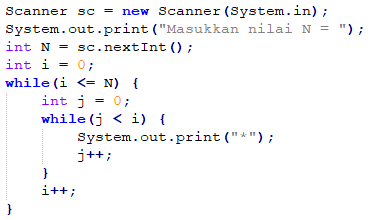

<dl>
  <dt>NIM :</dt>
  <dd>2131710120</dd>

  <dt>Nama :</dt>
  <dd>Bagus Nurcahyo</dd>
    
  <dt>Kelas :</dt>
  <dd>1A D3 MI</dd>
</dl>


___


# JOBSHEET 09 - Perulangan 2

## Tujuan
+ Mahasiswa memahami konsep perulangan bersarang (_nested loop_)
+ Mahasiswa dapat menjelaskan format penulisan perulangan bersarang (_nested loop_)
+ Mahasiswa dapat mengimplementasikan _flowchart_ perulangan bersarang menggunakan bahasa pemrograman Java

## Alat dan Bahan
+ PC/laptop
+ Browser(chrome, firefox, safari)
+ Koneksi internet
+ Anaconda3 + Java kernel (opsional)

## Praktikum
### Percobaan 1: Bintang Persegi
1. Perhatikan Flowchart di bawah ini

> flowchart di atas digunakan untuk menggambar sebuah persegi dengan simbol * (bintang)
2. Pada percobaan ke-1 akan dilakukan percobaan tentang _nested loop_. Kasus yang akan diselesaikan adalah untuk membuat tampilan persegi * , dengan panjang sisi sebanyak N. Misalkan N dimasukan **5**, maka hasilnya adalah

3. Karena program membutuhkan input dari keyboard, maka perlu import class Scanner
4. Ketikan kode program di bawah ini


```Java
// Tulis Kode program Percobaan 1 Langkah 4 di atas
import java.util.Scanner;
int N;
Scanner sc = new Scanner(System.in);
System.out.print("Masukkan nilai N: ");
N = sc.nextInt();
```


    Masukkan nilai N: 5


5.	Perhatikan sintaks perulangan yang digunakan untuk mencetak * sebanyak N kali ke arah samping. Di tahap 4 di atas kode _looping **for**_ kita jadikan sebagai _**inner loop**_. 
6.	Kita looping lagi _inner loop_ sebanyak N kali untuk menghasilkan _output_ seperti tahap 2. Maka perlu ditambahkan perulangan luar (_outer loop_).


```Java
// Tulis Kode program Percobaan 1 Langkah 6 (gabungkan dengan inner loop pada langkah 4)
for(int i=0; i<=N; i++){
    for(int o=1; o<=N; o++){
        System.out.print("*");
    }
}

```


    ******************************


#### Pertanyaan 
1. Apakah dengan menggabungkan _inner loop_ dan _outer loop_ seperti langkah 5 di atas sudah menghasilkan _output_ seperti gambar pada langkah 1?
2. Jika belum, silahkan modifikasi kode program sehingga menghasilkan output yang sesuai dengan gambar pada langkah 2?

#### Jawaban
1. Belum
2. 


```Java
// Tulis Kode program Percobaan 1 yang benar menurut kalian
import java.util.Scanner;
int N;
Scanner sc = new Scanner(System.in);
System.out.print("Masukkan nilai N: ");
N = sc.nextInt();
for(int i=0; i<=N; i++){
    for(int o=1; o<=N; o++){
        System.out.print("*");
    }
    System.out.println();
}

```

    *****
    *****
    *****
    *****
    *****


***
### Percobaan 2: Bintang Segitiga
1.	Pada percobaan ke-2 akan dilakukan percobaan segitiga * sama siku dengan tinggi sebesar N. Misalkan N dimasukan **5**, maka hasilnya seperti gambar berikut

2. Karena program membutuhkan input dari keyboard, maka perlu import class Scanner
3. Ketikan kode program di bawah ini



```Java
// Tulis Kode program Percobaan 2 Langkah 3 di atas
Scanner sc = new Scanner(System.in);
System.out.print("Masukkan nilai N ");
int N = sc.nextInt();
int i=0;
while(i<=N){
    int j=0;
    while(j<i){
        System.out.print("*");
        j++;
    }
    i++;
}
```

    *********************


Amati kode program yang telah kalian tulis di atas.

#### Pertanyaan
1. Perhatikan, apakah output yang dihasilkan dengan nilai N = 5 sesuai dengan  tampilan seperti pada tahap 1 (Percobaan 2)?
2. Jika tidak sesuai, bagian mana saja yang harus diperbaiki/ditambahkan? Jelaskan setiap bagian yang perlu diperbaiki/ditambahkan. 

#### Jawaban
1. Tidak
2. dibawah "i++" ditambahkan "System.out.println();" agar sesuai dengan ketentuan


```Java
// Tulis Kode program Percobaan 2 yang benar menurut kalian
Scanner sc = new Scanner(System.in);
System.out.print("Masukkan nilai N ");
int N = sc.nextInt();
int i=0;
while(i<=N){
    int j=0;
    while(j<i){
        System.out.print("*");
        j++;
    }
    i++;
    System.out.println();
}
```

    Masukkan nilai N 6

    *
    **
    ***
    ****
    ***** 
    ******


***
### Percobaan 3: Segitiga Angka
1.	Pada percobaan ke-3 akan dilakukan percobaan segitiga angka sama siku dengan tinggi sebesar N. Misalkan N dimasukan **5**, maka hasilnya seperti berikut

2. Karena program membutuhkan input dari keyboard, maka perlu import class Scanner
3. Ketikan kode program di bawah ini


```Java
// Tulis Kode program Percobaan 3 Langkah 3 di atas, disini
import java.util.Scanner;
Scanner input = new Scanner(System.in);
System.out.print("Masukkan nilai N: ");
int N = input.nextInt();
for(int i=1; i<=N; i++){
    for(int j=1; j<=i; j++){
        System.out.print(j);
    }
    System.out.println();
}
```

    Masukkan nilai N: 5
    1
    12
    123
    1234
    12345


#### Pertanyaan 
1. Apakah kode program di atas menghasilkan _output_ yang diharapkan?
2. Jika belum, kode program mana yang harus modifikasi? Jelaskan

#### Jawaban
1. Belum
2. Pada "System.out.print(j);" j nya diganti dengan i


```Java
// Tulis Kode program Percobaan 3 yang benar menurut kalian
import java.util.Scanner;
Scanner input = new Scanner(System.in);
System.out.print("Masukkan nilai N: ");
int N = input.nextInt();
for(int i=1; i<=N; i++){
    for(int j=1; j<=i; j++){
        System.out.print(i);
    }
    System.out.println();
}
```

    Masukkan nilai N: 5
    1
    22
    333
    4444
    55555


***
### Percobaan 4: Tebak Angka
1. Pada Percobaan 4 ini, kita akan belajar membuat kode untuk menebak angka menggunakan _nested loop_.
2. Pada percobaan ini kita menggunakan library Scanner untuk menangkap input dari keyboard dan Random untuk meng-generate angka secara acak
3. Ketik dan pahami kode program di bawah ini


```Java
// Tulis Kode program Percobaan 4 Langkah 3 di atas, disini
import java.util.Scanner;
import java.util.Random;
Random random = new Random();
Scanner input = new Scanner(System.in);
char menu = 'y';
do{
    int number = random.nextInt(10) + 1;
    boolean success = false;
    do{
        System.out.print("Tebak angka(1-10) + 1");
        int answer=input.nextInt();
        input.nextLine();
        if(answer == number){
            System.out.println("Selamat anda benar");
            success = true;
        }
    }while(!success);
    System.out.print("Apakah anda ingin mengulang permaninan?" );
    menu = input.nextLine().charAt(0);
}while (menu == 'y' || menu == 'Y');
```

    Tebak angka(1-10) 4
    Tebak angka(1-10) 5
    Tebak angka(1-10) 6
    Tebak angka(1-10) 3
    Tebak angka(1-10) 7
    Selamat anda benar
    Apakah anda ingin mengulang permaninan?1


```Java
# Pertanyaan
1. Jelaskan alur program di atas!
2. Apa yang harus dilakukan untuk tidak melanjutkan (tidak mengulangi) permainan tersebut? 
3. Modifikasi program di atas, sehingga bisa menampilkan informasi mengenai : 
    1. input nilai tebakan yang dimasukan oleh user apakah lebih kecil atau lebih besar dari nilai random!
    2. hentikan _nested loop_ jika pengguna gagal menebak angka sampai 10x tebakan, dan beri pesan "Maaf Anda gagal menebak angka sebanyak 10x"

#### Jawaban
1. 
   import java.util.Scanner;                                             = Membuat library scanner
   import java.util.Random;                                              = Membuat library acak
   Random mix = new Random();                                            = Membuat library scanner 
   Scanner in = new Scanner(System.in);                                  = Membuat inputan
   char menu = 'y';                                                      = Membuat variabel char;

   do{                                                                   = Membuat outer loop
    int angka = mix.nextInt(10) + 1;
    boolean success=false;
     do{                                                                 = Membuat inner loop
        System.out.print("Tebak angka (1-10): ");                        = Membuat inputan menggunakan integer
        int jawab = in.nextInt();                                        = Meminta inputan dari keyboard
        in.nextLine();
        if(jawab == angka){                                              = Jika inputan sama dengan angka maka akan di print "S
            System.out.println("Selamat anda benar");                      elamat anda benar"
            success=true;
        }
     }while(!success);
    System.out.print("Apakah anda ingin mengulang permainan(y/Y)? ");    = Jika menginput y atay Y maka permainan akan diulang
        menu = in.nextLine().charAt(0);
   }while(menu == 'y' || menu == 'Y');


2. Dengan menginputkan sebuah huruf maka program akan berhenti 

```


```Java
/* Jawaban untuk Percobaan 4 Pertnyaan 3.A disini */
import java.util.Scanner;
import java.util.Random;
Random random = new Random();
Scanner input = new Scanner(System.in);
char menu = 'y';
do{
    int number = random.nextInt(10) + 1;
    boolean success = false;
    do{
        System.out.print("Tebak angka(1-10) ");
        int answer=input.nextInt();
        input.nextLine();
        if(answer == number){
            System.out.println("Selamat anda benar");
            success = true;
        }
        if(answer<number){
            System.out.println("Lebih kecil dari nilai random");
        }else if(answer>number){
            System.out.println("Lebih besar dari nilai random");
        }
    }while(!success);
    System.out.print("Apakah anda ingin mengulang permaninan?" );
    menu = input.nextLine().charAt(0);
}while (menu == 'y' || menu == 'Y');
```


    Tebak angka(1-10) 5
    Lebih besar dari nilai random
    Tebak angka(1-10) 7
    Lebih besar dari nilai random
    Tebak angka(1-10) 9
    Lebih besar dari nilai random
    Tebak angka(1-10) 8
    Lebih besar dari nilai random
    Tebak angka(1-10) 7
    Lebih besar dari nilai random
    Tebak angka(1-10) 6
    Lebih besar dari nilai random
    Tebak angka(1-10) 5
    Lebih besar dari nilai random
    Tebak angka(1-10) 4
    Selamat anda benar
    Apakah anda ingin mengulang permaninan?a


```Java
/* Jawaban untuk Percobaan 4 Pertnyaan 3.B disini */
int a = (int)(Math.random() *10);// acak angka dari 0-10
int batas = 9;
 
do{
System.out.print("Masukkan angka: ");
Scanner jawab = new Scanner (System.in);
int b = jawab.nextInt();

if (batas > 0 ){
if ( b == a ){
    System.out.println("Selamat, angka yang anda masukkan BENAR!");
    break;}
else if ( b < a ){
    System.out.println("Maaf, angka yang anda masukkan terlalu KECIL.");}
else if ( b > a ){
    System.out.println("Maaf, angka yang anda masukkan terlalu BESAR.");}

    System.out.println("    Anda Memiliki " + batas + " Kesempatan Lagi");
    System.out.println("---------------------------------------------------");
    batas--;}
else{
    System.out.println("---------------------------------------------------");
    System.out.println("Maaf Anda gagal menebak angka sebanyak 10x");
    System.out.println("ANGKA YANG DIMAKSUD ADALAH " + a);
    System.out.println("---------------------------------------------------");
    break;
    }
   }
while ( batas >=0 );
```


    Masukkan angka: 1
    Maaf, angka yang anda masukkan terlalu KECIL.
        Anda Memiliki 9 Kesempatan Lagi
    ---------------------------------------------------
    Masukkan angka: 1
    Maaf, angka yang anda masukkan terlalu KECIL.      
        Anda Memiliki 8 Kesempatan Lagi
    ---------------------------------------------------
    Masukkan angka: 1
    Maaf, angka yang anda masukkan terlalu KECIL.      
        Anda Memiliki 7 Kesempatan Lagi
    ---------------------------------------------------
    Masukkan angka: 1
    Maaf, angka yang anda masukkan terlalu KECIL.      
        Anda Memiliki 6 Kesempatan Lagi
    ---------------------------------------------------
    Masukkan angka: 1
    Maaf, angka yang anda masukkan terlalu KECIL.      
        Anda Memiliki 5 Kesempatan Lagi
    ---------------------------------------------------
    Masukkan angka: 1
    Maaf, angka yang anda masukkan terlalu KECIL.
        Anda Memiliki 4 Kesempatan Lagi
    ---------------------------------------------------
    Masukkan angka: 1
    Maaf, angka yang anda masukkan terlalu KECIL.
        Anda Memiliki 3 Kesempatan Lagi
    ---------------------------------------------------
    Masukkan angka: 1
    Maaf, angka yang anda masukkan terlalu KECIL.
        Anda Memiliki 2 Kesempatan Lagi
    ---------------------------------------------------
    Masukkan angka: 1
    Maaf, angka yang anda masukkan terlalu KECIL.
        Anda Memiliki 1 Kesempatan Lagi
    ---------------------------------------------------
    Masukkan angka: 1
    ---------------------------------------------------
    Maaf Anda gagal menebak angka sebanyak 10x
    ANGKA YANG DIMAKSUD ADALAH 9
    ---------------------------------------------------


***
## Tugas
### Soal 1
Buatlah program yang **sesuai** dengan alur _flowchart_ di bawah ini


Apabila kode program sesuai _flowchart_, maka untuk nilai N = 5 akan menghasilkan output seperti gambar berikut


```Java
/* Jawaban Soal 1 disini */
int a = 5;
    for (int b = 1; b <= a; b++){
        for (int c = 4; c >= b; c--) {
            System.out.print(' ');
        }
        for (int d = 1; d <= b; d++){
            System.out.print('*');
        }
        System.out.println();
    }
```
        *
       **
      ***
     ****
    *****


***
### Soal 2
Buatlah program untuk mencetak tampilan persegi angka seperti di bawah ini berdasarkan input dari _keyboard_ N (nilai N minimal 3). Contoh N = 3, dan N = 5


```Java
/* Jawaban Soal 2 disini */
System.out.print("Masukkan N ");
int n=input.nextInt();
for(int i=0; i<n; i++){
    System.out.print(n);
}
System.out.println();

for(int i=0; i<n-2; i++){
    System.out.print(n);
    for(int j=0; j<n-2; j++){
        System.out.print(" ");
    }
    System.out.println(n);
}

for(int i=0; i<n; i++){
    System.out.print(n);
}
System.out.println();

```


    Masukkan N 5
    55555
    5   5
    5   5
    5   5
    55555


***
### Soal 3
Buatlah program untuk mencetak tampilan piramida * seperti gambar di bawah ini, tinggi piramida berdasarkan input dari _keyboard_ N (nilai N minimal 3). Contoh N = 3, dan N = 5


```Java
/* Jawaban Soal 3 disini */
Scanner input = new Scanner(System.in);
System.out.print("Masukan Input: ");
int tinggi = input.nextInt(); //Mendapatkan Input Dari User
    for(int t=1; t<=tinggi; t++){
        for(int s=t; s<=tinggi; s++){
            System.out.print(" ");
        }
        for(int b=0; b<=(t*2)-2; b++){
            System.out.print("*");
        }
        System.out.println(); //Membuat Baris Baru
    }
```

    Masukan Input: 5
         *    
        ***   
       *****  
      ******* 
     *********


