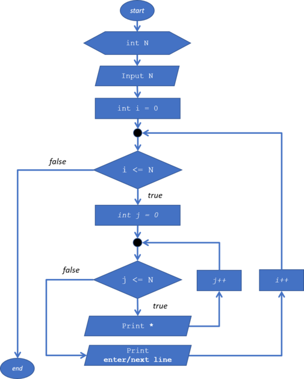
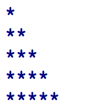
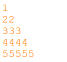
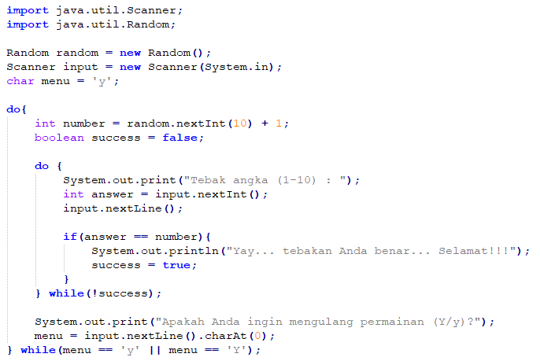
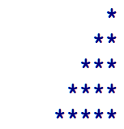

<dl>
  <dt>NIM :</dt>
  <dd>2131710136</dd>

  <dt>Nama :</dt>
  <dd>Galur Arasy Lumintang</dd>
    
  <dt>Kelas :</dt>
  <dd>1A</dd>
</dl>


___


# JOBSHEET 09 - Perulangan 2

## Tujuan
+ Mahasiswa memahami konsep perulangan bersarang (_nested loop_)
+ Mahasiswa dapat menjelaskan format penulisan perulangan bersarang (_nested loop_)
+ Mahasiswa dapat mengimplementasikan _flowchart_ perulangan bersarang menggunakan bahasa pemrograman Java

## Alat dan Bahan
+ PC/laptop
+ Browser(chrome, firefox, safari)
+ Koneksi internet
+ Anaconda3 + Java kernel (opsional)

## Praktikum
### Percobaan 1: Bintang Persegi
1. Perhatikan Flowchart di bawah ini

> flowchart di atas digunakan untuk menggambar sebuah persegi dengan simbol * (bintang)
2. Pada percobaan ke-1 akan dilakukan percobaan tentang _nested loop_. Kasus yang akan diselesaikan adalah untuk membuat tampilan persegi * , dengan panjang sisi sebanyak N. Misalkan N dimasukan **5**, maka hasilnya adalah

3. Karena program membutuhkan input dari keyboard, maka perlu import class Scanner
4. Ketikan kode program di bawah ini


```Java
// Tulis Kode program Percobaan 1 Langkah 4 di atas
import java.util.Scanner; // Import library Scanner

int N, i = 0; // deklarasi variabel
Scanner in = new Scanner(System.in); // deklarasi input scanner
System.out.print("Masukkan nilai N : ");
N = in.nextInt(); // input akan menjadi variabel N
for(int i =0; i <= N; i++) System.out.print("*"); // Perulangan secara 1 baris */
```

    Masukkan nilai N : 4
    *****

5.	Perhatikan sintaks perulangan yang digunakan untuk mencetak * sebanyak N kali ke arah samping. Di tahap 4 di atas kode _looping **for**_ kita jadikan sebagai _**inner loop**_. 
6.	Kita looping lagi _inner loop_ sebanyak N kali untuk menghasilkan _output_ seperti tahap 2. Maka perlu ditambahkan perulangan luar (_outer loop_).


```Java
// Tulis Kode program Percobaan 1 Langkah 6 (gabungkan dengan inner loop pada langkah 4)
for(int outer=1; outer <= N; outer++) {
    for(int i=1; i <= N; i++) {
        System.out.print("*");
    };
}
```

    ****************

#### Pertanyaan 
1. Apakah dengan menggabungkan _inner loop_ dan _outer loop_ seperti langkah 5 di atas sudah menghasilkan _output_ seperti gambar pada langkah 1?
2. Jika belum, silahkan modifikasi kode program sehingga menghasilkan output yang sesuai dengan gambar pada langkah 2?

#### Jawaban
1. tidak
2. kode program dibawah


```Java
for(int outer=1; outer <= N; outer++) {
    for(int i=1; i <= N; i++) {
        System.out.print("*");
    };
    System.out.println(); // Menambahkan baris baru ketika selesai menjalankan program inner loop
}
```

    ****
    ****
    ****
    ****
    

***
### Percobaan 2: Bintang Segitiga
1.	Pada percobaan ke-2 akan dilakukan percobaan segitiga * sama siku dengan tinggi sebesar N. Misalkan N dimasukan **5**, maka hasilnya seperti gambar berikut

2. Karena program membutuhkan input dari keyboard, maka perlu import class Scanner
3. Ketikan kode program di bawah ini


```Java
// Tulis Kode program Percobaan 2 Langkah 3 di atas
Scanner sc = new Scanner(System.in);
System.out.print("Masukkan nilai N = ");
int N = sc.nextInt(); // Assignment disertai dengan input dari user
int i = 0;
while(i <= N) { // Nested loop dengan while
    int j = 0;
    while(j < i) {
        System.out.print("*");
        j++;
    }
    i++;
}
```

    Masukkan nilai N = 4
    **********

Amati kode program yang telah kalian tulis di atas.

#### Pertanyaan
1. Perhatikan, apakah output yang dihasilkan dengan nilai N = 5 sesuai dengan  tampilan seperti pada tahap 1 (Percobaan 2)?
2. Jika tidak sesuai, bagian mana saja yang harus diperbaiki/ditambahkan? Jelaskan setiap bagian yang perlu diperbaiki/ditambahkan. 

#### Jawaban
1. tidak
2. perlu ditambahkan ```System.out.println();``` setelah perulangan inner 


```Java
// Tulis Kode program Percobaan 2 yang benar menurut kalian
Scanner sc = new Scanner(System.in);
System.out.print("Masukkan nilai N = ");
int N = sc.nextInt();
int i = 0;
while(i <= N) {
    int j = 0;
    while(j < i) {
        System.out.print("*");
        j++;
    }
    System.out.println(); // Menambahkan baris baru ketika setelah menjalankan block program inner loop
    i++;
}
```

    Masukkan nilai N = 5
    
    *
    **
    ***
    ****
    *****
    

***
### Percobaan 3: Segitiga Angka
1.	Pada percobaan ke-3 akan dilakukan percobaan segitiga angka sama siku dengan tinggi sebesar N. Misalkan N dimasukan **5**, maka hasilnya seperti berikut

2. Karena program membutuhkan input dari keyboard, maka perlu import class Scanner
3. Ketikan kode program di bawah ini


```Java
// Tulis Kode program Percobaan 3 Langkah 3 di atas, disini
import java.util.Scanner;

Scanner in = new Scanner(System.in); // Deklarasi scanner

System.out.print("Masukkan nilai N : ");
int N = in.nextInt(); // Assignment disertai input dari user

for(int i = 1; i <= N; i++) { // Perulangan dengan for
    for(int j = 1; j <= i; j++) {
        System.out.print(j);
    }
    System.out.println();
}
```

    Masukkan nilai N : 5
    1
    12
    123
    1234
    12345
    

#### Pertanyaan 
1. Apakah kode program di atas menghasilkan _output_ yang diharapkan?
2. Jika belum, kode program mana yang harus modifikasi? Jelaskan

#### Jawaban
1. belum
2. pada output inner loop yang dikeluarkan harusnya variabel `i`


```Java
// Tulis Kode program Percobaan 3 yang benar menurut kalian
import java.util.Scanner;

Scanner in = new Scanner(System.in);

System.out.print("Masukkan nilai N : ");
int N = in.nextInt();

for(int i = 1; i <= N; i++) {
    for(int j = 1; j <= i; j++) System.out.print(i);
    System.out.println();
}
```

    Masukkan nilai N : 5
    1
    22
    333
    4444
    55555
    

***
### Percobaan 4: Tebak Angka
1. Pada Percobaan 4 ini, kita akan belajar membuat kode untuk menebak angka menggunakan _nested loop_.
2. Pada percobaan ini kita menggunakan library Scanner untuk menangkap input dari keyboard dan Random untuk meng-generate angka secara acak
3. Ketik dan pahami kode program di bawah ini



```Java
// Tulis Kode program Percobaan 4 Langkah 3 di atas, disini
import java.util.Scanner;
import java.util.Random; // import library random agar fungsi random bisa dijalankan

Random random = new Random(); // assignment fungsi random
Scanner in = new Scanner(System.in);
char menu ='y'; // inisialisasi variabel menu agar dapat diubah nantinya

do {
    int number = random.nextInt(10) + 1;//angka random akan menjadi 0-9(akan menjadi 0-10 setelah ditambahkan 1)
    boolean success = false; // menjadi parameter batas perulangan
    do {
        System.out.print("Tebak angka (1-10) : ");
        int answer = in.nextInt();
        in.nextLine(); // untuk menghandle bug agar perintah dibawah tidak di skip
        if(answer == number) {
            System.out.println("Yay... tebakan Anda benar... Selamat!!!");
            success = true;
        } 
    } while(!success);
    System.out.print("Apakah Anda ingin mengulang permainan (Y/y)?");
    menu = in.nextLine().charAt(0); // mengambil data input pada karakter pertama
} while(menu == 'y' || menu == 'Y');
```

    Tebak angka (1-10) : 4
    Salah
    Tebak angka (1-10) : 2
    Salah
    Tebak angka (1-10) : 1
    Salah
    Tebak angka (1-10) : 3
    Salah
    Tebak angka (1-10) : 5
    Salah
    Tebak angka (1-10) : 6
    Salah
    Tebak angka (1-10) : 7
    Yay... tebakan Anda benar... Selamat!!!
    Apakah Anda ingin mengulang permainan (Y/y)?n
    

#### Pertanyaan
1. Jelaskan alur program di atas!
2. Apa yang harus dilakukan untuk tidak melanjutkan (tidak mengulangi) permainan tersebut? 
3. Modifikasi program di atas, sehingga bisa menampilkan informasi mengenai : 
    1. input nilai tebakan yang dimasukan oleh user apakah lebih kecil atau lebih besar dari nilai random!
    2. hentikan _nested loop_ jika pengguna gagal menebak angka sampai 10x tebakan, dan beri pesan "Maaf Anda gagal menebak angka sebanyak 10x"

#### Jawaban
1. suatu perulangan akan terus dijalankan apabila user menebak angka yang salah
   apabila user menebak angka yang benar, maka akan ditampilkan pertanyaan ingin mengulang atau tidak?
   jika user mengetik y atau Y maka program tebak angka akan terus berjalan, jika tidak maka program akan berhenti 
2. maka, ketika user berhasil menebak angka, user tidak menginputkan nilai y maupun Y


```Java
/* Jawaban untuk Percobaan 4 Pertnyaan 3.A disini */
import java.util.Scanner;
import java.util.Random; // import library random agar fungsi random bisa dijalankan

Random random = new Random(); // assignment fungsi random
Scanner in = new Scanner(System.in);
char menu ='y'; // inisialisasi variabel menu agar dapat diubah nantinya

do {
    int number = random.nextInt(10) + 1;//angka random akan menjadi 0-9(akan menjadi 0-10 setelah ditambahkan 1)
    boolean success = false; // menjadi parameter batas perulangan
    do {
        System.out.print("Tebak angka (1-10) : ");
        int answer = in.nextInt();
        in.nextLine(); // untuk menghandle bug agar perintah dibawah tidak di skip
        if(answer == number) {
            System.out.println("Yay... tebakan Anda benar... Selamat!!!");
            success = true;
        } else {
            if(number > answer) System.out.println("Jawaban yang benar lebih dari jawaban anda");
            else System.out.println("Jawaban yang benar kurang dari jawaban anda");
        }
    } while(!success);
    System.out.print("Apakah Anda ingin mengulang permainan (Y/y)?");
    menu = in.nextLine().charAt(0); // mengambil data input pada karakter pertama
} while(menu == 'y' || menu == 'Y');
```

    Tebak angka (1-10) : 10
    Jawaban yang benar kurang dari jawaban anda
    Tebak angka (1-10) : 9
    Jawaban yang benar kurang dari jawaban anda
    Tebak angka (1-10) : 8
    Jawaban yang benar kurang dari jawaban anda
    Tebak angka (1-10) : 7
    Yay... tebakan Anda benar... Selamat!!!
    Apakah Anda ingin mengulang permainan (Y/y)?n
    


```Java
/* Jawaban untuk Percobaan 4 Pertnyaan 3.B disini */
import java.util.Scanner;
import java.util.Random;// import library random agar fungsi random bisa dijalankan

Random random = new Random();// assignment fungsi random
Scanner in = new Scanner(System.in);
char menu = 'y';// inisialisasi variabel menu agar dapat diubah nantinya
int totalJawabanSalah = 0;
do {
    int number = random.nextInt(10) + 1;//angka random akan menjadi 0-9(akan menjadi 0-10 setelah ditambahkan 1)
    boolean success = false;// menjadi parameter batas perulangan
    do {
        
        System.out.println("---------------------------------------------------------");
        System.out.print("Tebak angka (1-10) : ");
        int answer = in.nextInt();
        in.nextLine();// untuk menghandle bug agar perintah dibawah tidak di skip
        if(totalJawabanSalah == 10) {
            System.out.println("Maaf Anda gagal menebak angka sebanyak 10x");
            System.out.println("Jawaban yang benar adalah: " + number);
            success = true;
        }
        else if(answer == number) {
            System.out.println("Yay... tebakan Anda benar... Selamat!!!");
            success = true;
        } else {
            totalJawabanSalah++; // jika tebakan salah maka menambahkan 1 value pada variabel totalJawabanSalah
            System.out.println("Kesempatan anda: " + (10 - totalJawabanSalah)); // output kesempatan yang ada
            if(number > answer) System.out.println("Jawaban yang benar lebih dari jawaban anda");
            else System.out.println("Jawaban yang benar kurang dari jawaban anda");
        }
    } while(!success);
    System.out.print("Apakah Anda ingin mengulang permainan (Y/y)?");
    menu = in.nextLine().charAt(0);// mengambil data input pada karakter pertama
} while(menu == 'y' || menu == 'Y');
```

    ---------------------------------------------------------
    Tebak angka (1-10) : 10
    Kesempatan anda: 9
    Jawaban yang benar kurang dari jawaban anda
    ---------------------------------------------------------
    Tebak angka (1-10) : 5
    Kesempatan anda: 8
    Jawaban yang benar kurang dari jawaban anda
    ---------------------------------------------------------
    Tebak angka (1-10) : 5
    Kesempatan anda: 7
    Jawaban yang benar kurang dari jawaban anda
    ---------------------------------------------------------
    Tebak angka (1-10) : 3
    Yay... tebakan Anda benar... Selamat!!!
    Apakah Anda ingin mengulang permainan (Y/y)?n
    

***
## Tugas
### Soal 1
Buatlah program yang **sesuai** dengan alur _flowchart_ di bawah ini


Apabila kode program sesuai _flowchart_, maka untuk nilai N = 5 akan menghasilkan output seperti gambar berikut



```Java
/* Jawaban Soal 1 disini */
import java.util.Scanner; // import library scanner

Scanner in = new Scanner(System.in);
System.out.print("Masukkan angka: ");
int N = in.nextInt();
int i = 1;

for(;i <= N;i++) {
    int j = N;
    for(;j >= 1;j--) System.out.print(i < j ? " " : "*"); // perkondisian menggunakan ternary operator
    System.out.println();
}
```

    Masukkan angka: 10
             *
            **
           ***
          ****
         *****
        ******
       *******
      ********
     *********
    **********
    

***
### Soal 2
Buatlah program untuk mencetak tampilan persegi angka seperti di bawah ini berdasarkan input dari _keyboard_ N (nilai N minimal 3). Contoh N = 3, dan N = 5


```Java
/* Jawaban Soal 2 disini */
import java.util.Scanner;
Scanner in = new Scanner(System.in);

System.out.print("Masukkan Bilangan: ");
int kolom = in.nextInt();
int baris = kolom;
for (int a = 1; a <= kolom; a++) {
    for (int b = 1; b <= baris; b++) {
        if (a == 1 || a == kolom || b == 1 || b == baris) System.out.print(baris); // pengecekan index pertama kolom awal dan akhir dan baris awal dan akhir
    else System.out.print(" "); // output value kosong apabila tidak memenuhi perkondisian diatas
    }
    System.out.println(); // output baris baru ketika program diatas telah dilakukan
}
```

    Masukkan Bilangan: 5
    55555
    5   5
    5   5
    5   5
    55555
    

***
### Soal 3
Buatlah program untuk mencetak tampilan piramida * seperti gambar di bawah ini, tinggi piramida berdasarkan input dari _keyboard_ N (nilai N minimal 3). Contoh N = 3, dan N = 5


```Java
/* Jawaban Soal 3 disini */
import java.util.Scanner;

Scanner in = new Scanner(System.in);
System.out.print("Masukkan jumlah tinggi: ");
int tinggi = in.nextInt(); // assignment variabel tinggi dengan sesuai dengan input angka
int k = 0;

for (int i = 1; i <= tinggi; ++i, k = 0) {
  for (int jarak = 1; jarak <= tinggi - i; ++jarak) System.out.print("  ");

  while (k != 2 * i - 1) {
    System.out.print("* ");
    ++k;
  }

  System.out.println();
}
```

    Masukkan jumlah tinggi: 5
            * 
          * * * 
        * * * * * 
      * * * * * * * 
    * * * * * * * * * 
    
