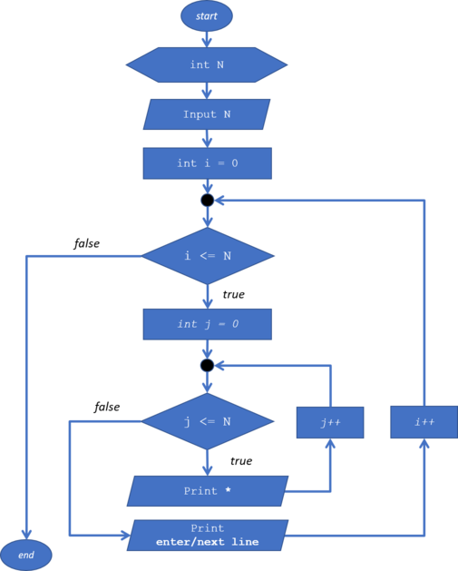

<dl>
  <dt>NIM : 2131710140</dt>

  <dt>Nama : Muhammad Helmi Permana Agung</dt>
    
  <dt>Kelas : MI-1A</dt>
</dl>


___


# JOBSHEET 09 - Perulangan 2

## Tujuan
+ Mahasiswa memahami konsep perulangan bersarang (_nested loop_)
+ Mahasiswa dapat menjelaskan format penulisan perulangan bersarang (_nested loop_)
+ Mahasiswa dapat mengimplementasikan _flowchart_ perulangan bersarang menggunakan bahasa pemrograman Java

## Alat dan Bahan
+ PC/laptop
+ Browser(chrome, firefox, safari)
+ Koneksi internet
+ Anaconda3 + Java kernel (opsional)

## Praktikum
### Percobaan 1: Bintang Persegi
1. Perhatikan Flowchart di bawah ini

> flowchart di atas digunakan untuk menggambar sebuah persegi dengan simbol * (bintang)
2. Pada percobaan ke-1 akan dilakukan percobaan tentang _nested loop_. Kasus yang akan diselesaikan adalah untuk membuat tampilan persegi * , dengan panjang sisi sebanyak N. Misalkan N dimasukan **5**, maka hasilnya adalah

3. Karena program membutuhkan input dari keyboard, maka perlu import class Scanner
4. Ketikan kode program di bawah ini


```Java
// Tulis Kode program Percobaan 1 Langkah 4 di atas
import java.util.Scanner;

int N;
Scanner sc = new Scanner(System.in);
System.out.print("Masukkan nilai N :");
N = sc.nextInt();

for(int i=0; i<=N; i++){
    System.out.print("*");
}
```

    Masukkan nilai N :4
    *****

5.	Perhatikan sintaks perulangan yang digunakan untuk mencetak * sebanyak N kali ke arah samping. Di tahap 4 di atas kode _looping **for**_ kita jadikan sebagai _**inner loop**_. 
6.	Kita looping lagi _inner loop_ sebanyak N kali untuk menghasilkan _output_ seperti tahap 2. Maka perlu ditambahkan perulangan luar (_outer loop_).


```Java
// Tulis Kode program Percobaan 1 Langkah 6 (gabungkan dengan inner loop pada langkah 4)
import java.util.Scanner;

int N;
Scanner sc = new Scanner(System.in);
System.out.print("Masukkan nilai N :");
N = sc.nextInt();

for(int i=0; i<N; i++){
    System.out.print("*");
    for(int outer=1; outer<=N; outer++){
        // inner loop
    }
}
```

    Masukkan nilai N :4
    ****

#### Pertanyaan 
1. Apakah dengan menggabungkan _inner loop_ dan _outer loop_ seperti langkah 5 di atas sudah menghasilkan _output_ seperti gambar pada langkah 1?
2. Jika belum, silahkan modifikasi kode program sehingga menghasilkan output yang sesuai dengan gambar pada langkah 2?

#### Jawaban
1. belum, karena outer loop dan inner loop masih belum sesuai
2. sudah dimodifikasi


```Java
// Tulis Kode program Percobaan 1 yang benar menurut kalian
import java.util.Scanner;

int N;
Scanner sc = new Scanner(System.in);
System.out.print("Masukkan nilai N :");
N = sc.nextInt();

for(int i=0; i<N; i++){
    for(int outer=1; outer<=N;outer++){
        System.out.print("*");
    } //inner lv 1
    System.out.println();
}//outer
```

    Masukkan nilai N :4
    ****
    ****
    ****
    ****


***
### Percobaan 2: Bintang Segitiga
1.	Pada percobaan ke-2 akan dilakukan percobaan segitiga * sama siku dengan tinggi sebesar N. Misalkan N dimasukan **5**, maka hasilnya seperti gambar berikut

2. Karena program membutuhkan input dari keyboard, maka perlu import class Scanner
3. Ketikan kode program di bawah ini


```Java
// Tulis Kode program Percobaan 2 Langkah 3 di atas
Scanner sc = new Scanner(System.in);
System.out.print("Masukkan nilai N = ");
int N = sc.nextInt();
int i = 0;
while(i<=N){
    int j=0;
    while(j<i){
        System.out.print("*");
        j++;
    }
    i++;
}
```

    Masukkan nilai N = 4
    **********

Amati kode program yang telah kalian tulis di atas.

#### Pertanyaan
1. Perhatikan, apakah output yang dihasilkan dengan nilai N = 5 sesuai dengan  tampilan seperti pada tahap 1 (Percobaan 2)?
2. Jika tidak sesuai, bagian mana saja yang harus diperbaiki/ditambahkan? Jelaskan setiap bagian yang perlu diperbaiki/ditambahkan. 

#### Jawaban
1. Tidak sesuai
2. Menambahkan bagian untuk new line


```Java
// Tulis Kode program Percobaan 2 Langkah 3 di atas
Scanner sc = new Scanner(System.in);
System.out.print("Masukkan nilai N = ");
int N = sc.nextInt();
int i = 0;
while(i<=N){
    int j=0;
    while(j<i){
        System.out.print("*");
        j++;
    }
    System.out.println();
    i++;
}
```

    Masukkan nilai N = 4
    
    *
    **
    ***
    ****


***
### Percobaan 3: Segitiga Angka
1.	Pada percobaan ke-3 akan dilakukan percobaan segitiga angka sama siku dengan tinggi sebesar N. Misalkan N dimasukan **5**, maka hasilnya seperti berikut

2. Karena program membutuhkan input dari keyboard, maka perlu import class Scanner
3. Ketikan kode program di bawah ini


```Java
// Tulis Kode program Percobaan 3 Langkah 3 di atas, disini
import java.util.Scanner;
Scanner input = new Scanner(System.in);
System.out.print("Masukkan nilai N : ");
int N = input.nextInt();
for(int i=1; i<=N; i++);{
    for(int j=1; j<=i; j++){
        System.out.print(j);
    }
    System.out.println();
}
```

    Masukkan nilai N : 5
    12345


#### Pertanyaan 
1. Apakah kode program di atas menghasilkan _output_ yang diharapkan?
2. Jika belum, kode program mana yang harus modifikasi? Jelaskan

#### Jawaban
1. Tidak
2. Pemberian variabel yang didalam for() tidak terdeteksi di nested loop level selanjutnya, oleh karenanya pemberian variabel yang digunakan di lebih dari 1 level di nested loop, sebaiknya dideklarasikan sebelum loop jika menggunakan for, atau bisa dengan while untuk deklarasi variabel didalam loop. Lalu juga output nya diganti menjadi barisnya bukan kolomnya.


```Java
import java.util.Scanner;
Scanner input = new Scanner(System.in);
System.out.print("Masukkan nilai N = ");
int N = input.nextInt();
int i = 1;
while(i<=N){
    int j=1;
    while(j<=i){
        System.out.print(i);
        j++;
    }
    System.out.println();
    i++;
}
```

    Masukkan nilai N = 5
    1
    22
    333
    4444
    55555


***
### Percobaan 4: Tebak Angka
1. Pada Percobaan 4 ini, kita akan belajar membuat kode untuk menebak angka menggunakan _nested loop_.
2. Pada percobaan ini kita menggunakan library Scanner untuk menangkap input dari keyboard dan Random untuk meng-generate angka secara acak
3. Ketik dan pahami kode program di bawah ini


```Java
// Tulis Kode program Percobaan 4 Langkah 3 di atas, disini
import java.util.Scanner;
import java.util.Random;

Random random = new Random();
Scanner input = new Scanner(System.in);
char menu = 'y';

do{
    int number = random.nextInt(10) + 1;
    boolean success = false;
    
    do {
        System.out.print("Tebak angka 1 - 10 : ");
        int answer = input.nextInt();
        input.nextLine();
        
        if(answer == number) {
            System.out.println("Yey tebakan Anda benar, Selamat!!");
            success = true;
        }
    }while(!success);
    
    System.out.print("Apakah anda ingin mengulang permainan? (Y/y)?");
    menu = input.nextLine().charAt(0);
} while(menu == 'y' || menu == 'Y');
```

    Tebak angka 1 - 10 : 4
    Tebak angka 1 - 10 : 5
    Tebak angka 1 - 10 : 6
    Tebak angka 1 - 10 : 7
    Tebak angka 1 - 10 : 8
    Tebak angka 1 - 10 : 9
    Tebak angka 1 - 10 : 1
    Yey tebakan Anda benar, Selamat!!
    Apakah anda ingin mengulang permainan? (Y/y)?t


#### Pertanyaan
1. Jelaskan alur program di atas!
2. Apa yang harus dilakukan untuk tidak melanjutkan (tidak mengulangi) permainan tersebut? 
3. Modifikasi program di atas, sehingga bisa menampilkan informasi mengenai : 
    1. input nilai tebakan yang dimasukan oleh user apakah lebih kecil atau lebih besar dari nilai random!
    2. hentikan _nested loop_ jika pengguna gagal menebak angka sampai 10x tebakan, dan beri pesan "Maaf Anda gagal menebak angka sebanyak 10x"

#### Jawaban
1. program tersebut merandom sebuah angka, antara 0-9 kemudian ditambah 1, lalu pengguna menebak hasilnya, jika salah akan terus mengulang, jika benar akan diberi pertanyaan apakah ingin bermain kembali atau tidak
2. ketika memenangkan permainan, user cukup menginput selain huruf Y/y


```Java
/* Jawaban untuk Percobaan 4 Pertnyaan 3.A disini */
import java.util.Scanner;
import java.util.Random;

Random random = new Random();
Scanner input = new Scanner(System.in);
char menu = 'y';

do{
    int number = random.nextInt(10) + 1;
    boolean success = false;
    
    do {
        System.out.print("Tebak angka 1 - 10 : ");
        int answer = input.nextInt();
        input.nextLine();
        
        if(answer == number) {
            System.out.println("Yey tebakan Anda benar, Selamat!!");
            success = true;
        }
        else if(answer > number){
            System.out.println("Input yang anda masukkan lebih besar dari angka random");
        }
        else if(answer < number){
            System.out.println("Input yang anda masukkan lebih kecil dari angka random");
        }
    }while(!success);
    
    System.out.print("Apakah anda ingin mengulang permainan? (Y/y)?");
    menu = input.nextLine().charAt(0);
} while(menu == 'y' || menu == 'Y');
```

    Tebak angka 1 - 10 : 4
    Input yang anda masukkan lebih besar dari angka random
    Tebak angka 1 - 10 : 2
    Yey tebakan Anda benar, Selamat!!
    Apakah anda ingin mengulang permainan? (Y/y)?t


```Java
/* Jawaban untuk Percobaan 4 Pertnyaan 3.B disini */
import java.util.Scanner;
import java.util.Random;

Random random = new Random();
Scanner input = new Scanner(System.in);
char menu = 'y';
int i = 0;
do{
    int number = random.nextInt(10) + 1;
    boolean success = false;
    
    do {
        System.out.print("Tebak angka 1 - 10 : ");
        int answer = input.nextInt();
        input.nextLine();
        i++;
        if(answer == number) {
            System.out.println("Yey tebakan Anda benar, Selamat!!");
            success = true;
        }
        else if(i==10){
            System.out.println("Maaf anda gagal menebak angka sebanyak 10x");
            break;
        }
    }while(!success);
    
    System.out.print("Apakah anda ingin mengulang permainan? (Y/y)?");
    menu = input.nextLine().charAt(0);
} while(menu == 'y' || menu == 'Y');
```

    Tebak angka 1 - 10 : 4
    Yey tebakan Anda benar, Selamat!!
    Apakah anda ingin mengulang permainan? (Y/y)?y
    Tebak angka 1 - 10 : 5
    Tebak angka 1 - 10 : 5
    Tebak angka 1 - 10 : 
    5
    Tebak angka 1 - 10 : 5
    Tebak angka 1 - 10 : 5
    Tebak angka 1 - 10 : 5
    Tebak angka 1 - 10 : 5
    Tebak angka 1 - 10 : 5
    Tebak angka 1 - 10 : 5
    Maaf anda gagal menebak angka sebanyak 10x
    Apakah anda ingin mengulang permainan? (Y/y)?5


***
## Tugas
### Soal 1
Buatlah program yang **sesuai** dengan alur _flowchart_ di bawah ini


Apabila kode program sesuai _flowchart_, maka untuk nilai N = 5 akan menghasilkan output seperti gambar berikut


```Java
/* Jawaban Soal 1 disini */
import java.util.Scanner;
System.out.print("Masukkan nilai N = ");
int N = input.nextInt();
for(int i=1;i<=N;i++){
    for(int j=N; j>i;j--){
    System.out.print(" ");
    
    }
    for(int k=1; k<=i; k++){
    System.out.print("*");
    }
    System.out.println("");
}
```

    Masukkan nilai N = 4
       *
      **
     ***
    ****


***
### Soal 2
Buatlah program untuk mencetak tampilan persegi angka seperti di bawah ini berdasarkan input dari _keyboard_ N (nilai N minimal 3). Contoh N = 3, dan N = 5


```Java
/* Jawaban Soal 2 disini */
import java.util.Scanner;
Scanner input = new Scanner(System.in);
System.out.print("Masukkan nilai N = ");
int N = input.nextInt();
for(int i=1;i<=N;i++){
    for(int j=1; j<=N;j++){
    if(i == 1 || i == N || j==1 || j == N){
        System.out.print(N);
    } else if(i != 1 || i != N || j!= 1 || j != N)
        System.out.print(" ");
    }
    
    System.out.println("");
}

```

    Masukkan nilai N = 5
    55555
    5   5
    5   5
    5   5
    55555


***
### Soal 3
Buatlah program untuk mencetak tampilan piramida * seperti gambar di bawah ini, tinggi piramida berdasarkan input dari _keyboard_ N (nilai N minimal 3). Contoh N = 3, dan N = 5


```Java
/* Jawaban Soal 3 disini */
import java.util.Scanner;
Scanner input = new Scanner(System.in);
System.out.print("Masukkan nilai N : ");
int N = input.nextInt();

for(int i = 1; i <= N; i++){
    for(int j = 1; j <= N-i; j++){
        System.out.print(" ");
    }
    for(int k = 0; k != 2 * i - 1; k++){
        System.out.print("*");
    }
    System.out.println();
}
```

    Masukkan nilai N : 5
        *
       ***
      *****
     *******
    *********


```Java

```
