# JOBSHEET 10 - Array 1

## Tujuan
+ Mahasiswa mampu memahami pembuatan Array 1 dimensi dan pengaksesan elemenya di Java. 
+ Mahasiswa mampu membuat program dengan menggunakan konsep array satu dimensi.


## Alat dan Bahan
+ PC/laptop
+ Browser(chrome, firefox, safari)
+ Koneksi internet
+ Anaconda3 + Java kernel (opsional)

## Praktikum
### Percobaan 1: Mengisi Elemen Array
1. Pada percobaan ke-1 akan dilakukan percobaan untuk mengisi elemen array. Buat array bertipe integer dengan nama bil dengan kapasitas 4 elemen.


```Java
// Tulis Kode program Percobaan 1 Langkah 2 di atas
int[] bil=new int [4];
```

2. Isi masing-masing elemen array bil tadi dengan angka 5, 12, 7, 20.


```Java
// Tulis Kode program Percobaan 1 Langkah 3 di atas
bil[0] = 5;
bil[1] = 12;
bil[2] = 7;
bil[3] = 20;
```


    20


3. Tampilkan ke layar semua isi elemennya:


```Java
// Tulis Kode program Percobaan 1 Langkah 4
System.out.println(bil[0]);
System.out.println(bil[1]);
System.out.println(bil[2]);
System.out.println(bil[3]);
```

    5
    12
    7
    20


#### Pertanyaan 
1. Dari percobaan 1 berapakah indeks array terbesar dan terkecil?

// Tulis Jawaban no 1 disini

Indeks terbesar adalah indeks 3 dan yang terkecil indeks 0

2. Jika Isi masing-masing elemen array bil diubah dengan angka 5.0, 12867, 7.5, 2000000. Apa yang terjadi? Mengapa bisa demikian?


```Java
// Tulis Jawaban no 2 yang disini
bil[0] = 5.0;
bil[1] = 12867;
bil[2] = 7.0;
bil[3] = 2000000;

System.out.println(bil[0]);
System.out.println(bil[1]);
System.out.println(bil[2]);
System.out.println(bil[3]);

//MAKA AKAN EROR KARENA TYPE DATA ARRAY ADALAH INTEGER YANG HANYA BISA DIISI BILANGAN BULAT
```


    |   bil[0] = 5.0;

    incompatible types: possible lossy conversion from double to int

    


3. Ubah statement pada langkah No 3 menjadi seperti berikut
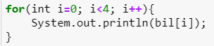
Apa keluaran dari program? Mengapa bisa demikian?


```Java
// Tulis Jawaban no 3 yang disini
bil[0] = 5;
bil[1] = 12;
bil[2] = 7;
bil[3] = 20;

for(int i=0; i<4; i++){
    System.out.println(bil[i]);
}

//JAWABAN : KARENA PROGRAM DIATAS ADALAH JENIS PERULANGAN FOR INJT AGAR BISA MENCETAK NILAI ARRAY SECARA KESELURUHAN
```

    5
    12
    7
    20


### Percobaan 2: Meminta Inputan Pengguna untuk Mengisi Elemen Array
1. Pada percobaan ke-2 akan dilakukan percobaan yang meminta inputan pengguna untuk mengisi elemen array seperti pada flowchart berikut


2. Import dan deklarasikan Scanner untuk keperluan input. 
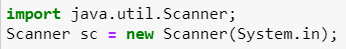


```Java
// Tulis Kode program Percobaan 2 Langkah 2 di atas
import java.util.Scanner;
Scanner in = new Scanner(System.in);
```

3. Buat array bertipe integer dengan nama nilaiUAS, dengan kapasitas 6 elemen.
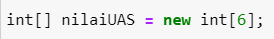


```Java
// Tulis Kode program Percobaan 2 Langkah 3 di atas
int[] nilaiUAS = new int[6];
```

4. Menggunakan perulangan, buat input untuk mengisi elemen dari array nilaiUAS.
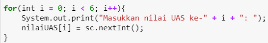


```Java
// Tulis Kode program Percobaan 2 Langkah 4 di atas
for(int i=0; i<6; i++){
    System.out.print("Masukan nilai UAS ke - " + i + ": ");
    nilaiUAS[i] = in.nextInt();
}
```

    Masukan nilai UAS ke - 0: 80
    Masukan nilai UAS ke - 1: 83
    Masukan nilai UAS ke - 2: 86
    Masukan nilai UAS ke - 3: 90
    Masukan nilai UAS ke - 4: 92
    Masukan nilai UAS ke - 5: 94


5. Menggunakan perulangan, tampilkan semua isi elemen dari array nilaiUAS.
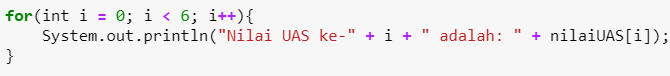


```Java
// Tulis Kode program Percobaan 2 Langkah 5 di atas
for(int i=0; i<6; i++){
    System.out.println("Nilai UAS ke - " + i + " adalah : " + nilaiUAS[i]);
}
```

    Nilai UAS ke - 0 adalah : 80
    Nilai UAS ke - 1 adalah : 83
    Nilai UAS ke - 2 adalah : 86
    Nilai UAS ke - 3 adalah : 90
    Nilai UAS ke - 4 adalah : 92
    Nilai UAS ke - 5 adalah : 94


#### Pertanyaan
1. Ubah statement pada langkah No 4 menjadi seperti berikut ini :

Jalankan program, apakah terjadi perubahan? Mengapa demikian?


```Java
// Tulis Jawaban nomor 1 disini
for(int i = 0; i < nilaiUAS.length; i++){
    System.out.print("Masukan nilai UAS ke - " + i + ": ");
    nilaiUAS[i] = in.nextInt();
}
```

    Masukan nilai UAS ke - 0: 84
    Masukan nilai UAS ke - 1: 86
    Masukan nilai UAS ke - 2: 88
    Masukan nilai UAS ke - 3: 90
    Masukan nilai UAS ke - 4: 94
    Masukan nilai UAS ke - 5: 96


2. Apa kegunaan dari `nilaiUAS.length`? 

// Tulis Jawaban nomor 2 disini

Penggunaan `.length` pada `nilaiUAS.length` berfungsi sebagai nilai index atau panjang dari array yang sudah diinisialisasikan diawal.

3. Ubah statement pada langkah No 5 menjadi seperti berikut ini sehingga program hanya menampilkan status mahasiswa yang lulus saja:
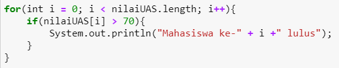
Jalankan program dan Jelaskan alur program!


```Java
// Tulis Jawaban nomor 3 disini
for(int i = 0; i < nilaiUAS.length; i++){
    System.out.print("Masukan nilai UAS ke - " + i + ": ");
    nilaiUAS[i] = in.nextInt();
}

System.out.println("DAFTAR NILAI LULUS");

for(int i = 0; i < nilaiUAS.length; i++){
    if(nilaiUAS[i] > 70){
        System.out.println("Masukan nilai UAS ke - " + i + " LULUS ");        
    }
}
```

    Masukan nilai UAS ke - 0: 60
    Masukan nilai UAS ke - 1: 70
    Masukan nilai UAS ke - 2: 80
    Masukan nilai UAS ke - 3: 90
    Masukan nilai UAS ke - 4: 100
    Masukan nilai UAS ke - 5: 98
    DAFTAR NILAI LULUS
    Masukan nilai UAS ke - 2 LULUS 
    Masukan nilai UAS ke - 3 LULUS 
    Masukan nilai UAS ke - 4 LULUS 
    Masukan nilai UAS ke - 5 LULUS 


### Percobaan 3: Melakukan Operasi Aritmatika terhadap Elemen Array
Pada praktikum ini, akan dilakukan percobaan untuk menjumlahkan Array. Program akan menerima input sebanyak 10 nilai mahasiswa. Kemudian program akan menampilkan nilai rata-rata nilai dari 10 Mahasiswa. Seperti flowchart berikut
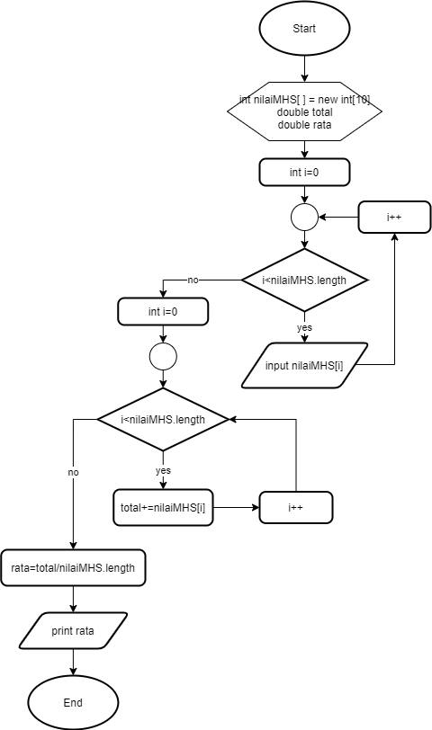

1.Import dan deklarasikan Scanner untuk keperluan input. 


```Java
// Tulis Kode program Percobaan 3 Langkah 1 di atas, disini
import java.util.Scanner;
Scanner scan = new Scanner(System.in);
```

2. Buat array nilaiMHS bertipe integer dengan kapasitas 10. Kemudian deklarasikan variable total dan rata seperti gambar berikut ini
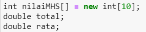


```Java
// Tulis Kode program Percobaan 3 Langkah 2 di atas, disini
int nilaiMHS[] = new int[10];
double total;
double rata;
```

3. Menggunakan perulangan, buat input untuk mengisi array nilaiMHS
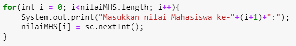


```Java
// Tulis Kode program Percobaan 3 Langkah 3 di atas, disini
for (int i = 0; i < nilaiMHS.length; i++){
    System.out.print("Masukan nilai Mahasiswa ke - " + (i+1) + ":");
    nilaiMHS[i] = scan.nextInt();
}
```

    Masukan nilai Mahasiswa ke - 1:70
    Masukan nilai Mahasiswa ke - 2:90
    Masukan nilai Mahasiswa ke - 3:86
    Masukan nilai Mahasiswa ke - 4:99
    Masukan nilai Mahasiswa ke - 5:82
    Masukan nilai Mahasiswa ke - 6:100
    Masukan nilai Mahasiswa ke - 7:75
    Masukan nilai Mahasiswa ke - 8:88
    Masukan nilai Mahasiswa ke - 9:99
    Masukan nilai Mahasiswa ke - 10:79


4. Menggunakan perulangan untuk menghitung jumlah keseluruhan nilai.
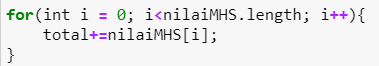


```Java
// Tulis Kode program Percobaan 3 Langkah 4 di atas, disini
for(int i = 0; i < nilaiMHS.length; i++){
    total += nilaiMHS[i];
}
```

5. Kemudian hitung nilai rata-rata dengan cara nilai total dibagi jumlah elemen dari array nilaiMHS\
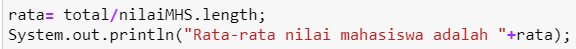


```Java
// Tulis Kode program Percobaan 3 Langkah 3 di atas, disini
rata = total/nilaiMHS.length;
System.out.println("Rata-rata nilai mahasiswa adalah "+rata);
```

    Rata-rata nilai mahasiswa adalah 86.8


#### Pertanyaan 
1. Pada Percobaan 3 langkah ke-5. Mengapa perhitungan rata berada diluar perulangan?

// Tulis jawaban no 1 disini


Karena perulangan hanya digunakan untuk melakukan pengisian nilai array sejumlah length yang sudah ditentukan diawal dan berhitungan dilakukan setelah array terisi semuanya.

2. Modifikasi program pada percobaan 3 sehingga bisa mengeluarkan output  seperti gambar berikut ini!
syarat lulus nilai >70


```Java
// Tulis jawaban no 2 disini
int nilaiMHS[] = new int[10];
double total;
double rata1, rata2;
double total1 = 0;
double total2 = 0;
int a = 0;
int b = 0;

for(int i = 0; i < nilaiMHS.length; i++){
    System.out.print("Masukan nilai Mahasiswa ke - " + (i+1) + ":");
    nilaiMHS[i] = scan.nextInt();
}

for(int i = 0; i < nilaiMHS.length; i++){
    if( nilaiMHS[i] > 70){
        total1 += nilaiMHS[i];
        a++;
        rata1 = total1/a;
    }

    else {
        total2 += nilaiMHS[i];
        b++;
        rata2 = total2/b;
    }
}

//rata1 = total1/a;
System.out.println("Rata-rata nilai mahasiswa yang LULUS adalah : "+rata1); 
//rata2 = total2/b;
System.out.println("Rata-rata nilai mahasiswa yang TIDAK LULUS adalah : "+rata2); 
```

    Masukan nilai Mahasiswa ke - 1:90
    Masukan nilai Mahasiswa ke - 2:80
    Masukan nilai Mahasiswa ke - 3:100
    Masukan nilai Mahasiswa ke - 4:70
    Masukan nilai Mahasiswa ke - 5:60
    Masukan nilai Mahasiswa ke - 6:40
    Masukan nilai Mahasiswa ke - 7:50
    Masukan nilai Mahasiswa ke - 8:20
    Masukan nilai Mahasiswa ke - 9:10
    Masukan nilai Mahasiswa ke - 10:30
    Rata-rata nilai mahasiswa yang LULUS adalah : 90.0
    Rata-rata nilai mahasiswa yang TIDAK LULUS adalah : 40.0


### Percobaan 4: Pencarian menggunakan Array
Pada praktikum ini, akan dilakukan percobaan untuk mencari lokasi/indeks sebuah angka dalam array. Sesuai dengan flowchart di bawah ini:
 

1. Buat array arr[] bertipe integer dengan kapasitas 6 dan isi dengan nilai 6, 4, 1, 9, 7, 3, 2 dan 8. Kemudian deklarasikan variabel integer `key` untuk kata kunci pencarian dan variabel `hasil` untuk hasil indeks pencarian. Deklarasi dan inisialisasi seperti gambar berikut ini


```Java
// Tulis Kode program Percobaan 4 Langkah 1 di atas, disini
int[] arr = {6, 4, 1, 9, 7, 3, 2, 8};
int key = 3;
int hasil = -1;
```

2. Menggunakan perulangan, lakukan pencarian untuk mendapatkan nilai array yang sesuai dengan key. Bila ada yang sesuai, simpan indeksnya sebagai hasil pencarian
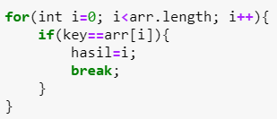


```Java
// Tulis Kode program Percobaan 4 Langkah 2 di atas, disini
for(int i = 0; i < arr.length; i++){
        if(key==arr[i]){
            hasil=i;
            break;
        }
}
```

3. Tampilkan hasil pencarian dengan kode berikut.


```Java
// Tulis Kode program Percobaan 4 Langkah 3 di atas, disini
System.out.println("Key ada di array ke - " + hasil);
```

    Key ada di array ke - 5


#### Pertanyaan 
1. Pada Percobaan 4 langkah ke-2. Apa kegunaan dari statement `break`?

// Tulis jawaban no 1 disini


Kegunaan dari statement `break` yaitu untuk keluar dari loop setelah "key" berhasil ditemukan.

2. Modifikasi program pada percobaan 4 sehingga key yang dicari adalah angka 5. Kemudian jalankan program, amati hasilnya! Jelaskan penyebab dari hasil tersebut! 


```Java
// Tulis jawaban no 2 disini
int[] arr = {6, 4, 1, 9, 7, 3, 2, 8};
int key = 3;
int hasil = -1;

for(int i=0; i<arr.length; i++){
    if(key==arr[i]){
        hasil=i;
        break;
    }
}
System.out.println("Key ada di array ke - " + hasil);
```

    Key ada di array ke - 5


### Percobaan 5: Pengurutan bilangan menggunakan Array
Pada praktikum ini, akan dilakukan percobaan untuk mengurutkan angka dalam array. Sesuai dengan flowchart di bawah ini:
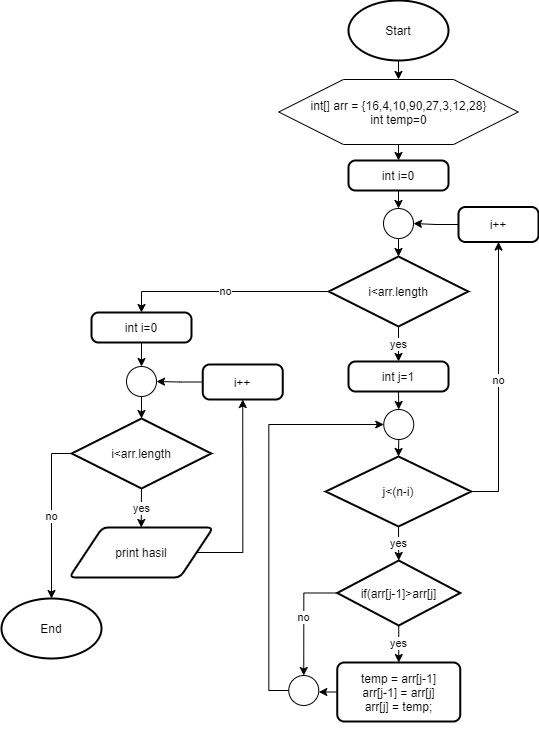
1.Buat array arr[] bertipe integer dengan kapasitas 8 dan isi dengan nilai 16, 4, 10, 90, 27, 3, 12 dan 28. Kemudian deklarasikan variabel integer `temp` untuk media penukaran nilai pada variabel. Deklarasi dan inisialisasi seperti gambar berikut ini


```Java
// Tulis Kode program Percobaan 5 Langkah 1 disini
int[] arr = {16, 4, 10, 90, 27, 3, 12, 28};
int temp = 0;
```

2. Menggunakan perulangan, lakukan pengurutan bilangan dengan menukar posisi indeks tersebut dengan indeks berikutnya. Perulangan dilakukan untuk menukar posisi berulang kali. 


```Java
// Tulis Kode program Percobaan 5 Langkah 2 di atas, disini
for(int i = 0; i < arr.length; i++){
    for(int j = 1; j < (arr.length-i); j++){
        if(arr[j-1] > arr[j]){
            temp = arr[j-1];
            arr[j-1] = arr[j];
            arr[j] = temp;
        }
    }
}
```

3. Tampilkan hasil pengurutan dengan menggunakan perulangan


```Java
// Tulis Kode program Percobaan 5 Langkah 3 di atas, disini
System.out.println("Hasil pengurutan: ");
for(int i = 0; i < arr.length; i++)
    System.out.println(arr[i]);
```

    Hasil pengurutan: 
    3
    4
    10
    12
    16
    27
    28
    90


## Tugas
### Soal 1
Buatlah program yang **sesuai** dengan alur _flowchart_ di bawah ini


Flowchart diatas menggambarkan alur program yang membaca 10 masukan pengguna berupa integer dan menyimpannya. Kemudian angka ganjil dan genap disimpan kembali ke dalam variabel lain yang terpisah


```Java
/* Jawaban Soal 1 disini */
import java.util.Scanner;
Scanner scan = new Scanner(System.in);

int[] checkNum = new int[10];
int[] evenNum = new int[0];
int[] oldNum = new int[0];
int cEven, cOdd = 0;

for(int i = 0; i < checkNum.length; i++){
    System.out.print("Masukan bilangan ke - " + (i+1) + ":");
    checkNum[i] = scan.nextInt();
}

    System.out.print("Bilangan Genap :");
    for(int j=0; j<checkNum.length; j++){ //mengambil data array dengan perulangan for
        if(checkNum[j]% 2 ==0){ //jika data array bilangan habis dibagi 2 = 0
            System.out.print(checkNum[j] + " ");
            //evenNum[cEven] = checkNum[i];
            //cEven++;
        }
    }
    System.out.print("Bilangan ganjil :");
    for(int i=0; i<checkNum.length; i++){ //mengambil data array dengan perulangan for
        if(checkNum[i] % 2!=0){ //jika data array bilangan tidak habis dibagi 2 = 0
            System.out.print(checkNum[i] +" ");   
        }
    }
```

    Masukan bilangan ke - 1:1
    Masukan bilangan ke - 2:2
    Masukan bilangan ke - 3:3
    Masukan bilangan ke - 4:4
    Masukan bilangan ke - 5:5
    Masukan bilangan ke - 6:6
    Masukan bilangan ke - 7:7
    Masukan bilangan ke - 8:8
    Masukan bilangan ke - 9:9
    Masukan bilangan ke - 10:10
    Bilangan Genap :2 4 6 8 10 Bilangan ganjil :1 3 5 7 9 

### Soal 2
Buatlah program yang terdapat array dengan jumlah elemen 5, buatlah input untuk mengisi elemen array tersebut, kemudian tampilkan isi array tersebut dengan urutan terbalik. Seperti ilustrasi gambar dibawah ini.
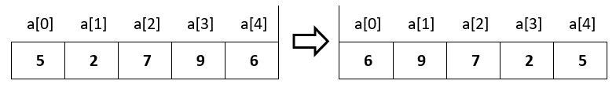


```Java
/* Jawaban Soal 2 disini */
Scanner input = new Scanner(System.in);
int angka[] = new int[5];

for(int i = 0; i<angka.length;i++){
System.out.print("a["+ i + "] : ");
angka[i] = input.nextInt();
}

for(int i = angka.length -1; i>=0; i--){
    System.out.print(" a : " + angka[i]);
}

```

    a[0] : 5
    a[1] : 2
    a[2] : 7
    a[3] : 9
    a[4] : 6
     a : 6 a : 9 a : 7 a : 2 a : 5

### Soal 3
Buatlah program yang menerima input jumlah elemen array, inputkan isi arraynya, kemudian tampilkan bilangan terbesar dari isi elemen arraynya. Contoh hasil program:
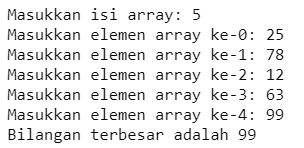


```Java
/* Jawaban Soal 3 disini */
int isi, i;
Scanner scan = new Scanner(System.in);
System.out.print("Masukkan isi array : ");
isi = scan.nextInt();
int[] array = new int[isi];
    
for(i = 0; i < isi; i++) {
      System.out.print("Masukkan elemen array ke-"+ (i) +": " );
      array[i] = scan.nextInt();
    }
int max;
max = array[0];
    for(i = 0; i < isi; i++) {
      if (array[i] > max){
        max = array[i];
      }
    }
System.out.println("Nilai terbesar / makasimum adalah "+max);
```

    Masukkan isi array : 5
    Masukkan elemen array ke-0: 25
    Masukkan elemen array ke-1: 78
    Masukkan elemen array ke-2: 12
    Masukkan elemen array ke-3: 63
    Masukkan elemen array ke-4: 99
    Nilai terbesar / makasimum adalah 99


```Java

```
