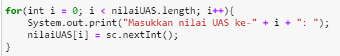

# JOBSHEET 10 - Array 1

## Tujuan
+ Mahasiswa mampu memahami pembuatan Array 1 dimensi dan pengaksesan elemenya di Java. 
+ Mahasiswa mampu membuat program dengan menggunakan konsep array satu dimensi.


## Alat dan Bahan
+ PC/laptop
+ Browser(chrome, firefox, safari)
+ Koneksi internet
+ Anaconda3 + Java kernel (opsional)

## Praktikum
### Percobaan 1: Mengisi Elemen Array
1. Pada percobaan ke-1 akan dilakukan percobaan untuk mengisi elemen array. Buat array bertipe integer dengan nama bil dengan kapasitas 4 elemen.


```Java
// Tulis Kode program Percobaan 1 Langkah 2 di atas
int [] bil = new int[4]; //membuat array dengan tipe interger bernama bil dan isinya 4 elemen
```

2. Isi masing-masing elemen array bil tadi dengan angka 5, 12, 7, 20.


```Java
// Tulis Kode program Percobaan 1 Langkah 3 di atas
bil[0] = 5; 
bil[1] = 12;
bil[2] = 7;
bil[3] = 20;
//mengisi array, indeks 0 berisi 5, indeks 1 berisi 12, dst
```


    20


3. Tampilkan ke layar semua isi elemennya:


```Java
// Tulis Kode program Percobaan 1 Langkah 4
System.out.println(bil[0]);
System.out.println(bil[1]);
System.out.println(bil[2]);
System.out.println(bil[3]);
//mencetak elemen array dari indeks 0 sampai indeks 3
```

    5
    12
    7
    20


#### Pertanyaan 
1. Dari percobaan 1 berapakah indeks array terbesar dan terkecil?

// Tulis Jawaban no 1 disini
- indeks terbesar yaitu 3 dengan elemen 20
- indeks terkecil yaitu 0 dengan elemen 5

2. Jika Isi masing-masing elemen array bil diubah dengan angka 5.0, 12867, 7.5, 2000000. Apa yang terjadi? Mengapa bisa demikian?

// Tulis Jawaban no 2 yang disini
- Error, karena angka-angka tersebut bukan termasuk data tipe interger

3. Ubah statement pada langkah No 3 menjadi seperti berikut

Apa keluaran dari program? Mengapa bisa demikian?

// Tulis Jawaban no 3 yang disini
- output dari program tersebut adalah angka-angka di dalam array karena terdapat sintaks perulangan dengan statement println elemen-elemen array

### Percobaan 2: Meminta Inputan Pengguna untuk Mengisi Elemen Array
1. Pada percobaan ke-2 akan dilakukan percobaan yang meminta inputan pengguna untuk mengisi elemen array seperti pada flowchart berikut


```Java
// Tulis Kode program Percobaan 2 Langkah 1 di atas

```

2. Import dan deklarasikan Scanner untuk keperluan input. 


```Java
// Tulis Kode program Percobaan 2 Langkah 1 di atas
import java.util.Scanner;
Scanner sc = new Scanner(System.in);
```

3. Buat array bertipe integer dengan nama nilaiUAS, dengan kapasitas 6 elemen.


```Java
// Tulis Kode program Percobaan 2 Langkah 3 di atas
int[] nilaiUAS = new int[6]; //membuat array bertipe interger dengan nama variabel nilaiUAS 
```

4. Menggunakan perulangan, buat input untuk mengisi elemen dari array nilaiUAS.


```Java
// Tulis Kode program Percobaan 2 Langkah 4 di atas
for(int i=0; i<6; i++){
    System.out.print("Masukkan nilai UAS ke-" + i + ": ");
    nilaiUAS[i] = sc.nextInt();
}
//mengulang tulisan "Masukkan nilai UAS ke- : " selama 6 kali dan setiap inputan dimasukkan ke variabel array nilaiUAS
```

    Masukkan nilai UAS ke-0: 90
    Masukkan nilai UAS ke-1: 90
    Masukkan nilai UAS ke-2: 85
    Masukkan nilai UAS ke-3: 90
    Masukkan nilai UAS ke-4: 80
    Masukkan nilai UAS ke-5: 95


5. Menggunakan perulangan, tampilkan semua isi elemen dari array nilaiUAS.


```Java
// Tulis Kode program Percobaan 2 Langkah 5 di atas
for(int i=0; i<6; i++){
    System.out.println("Nilai UAS ke-" + i + " adalah: " + nilaiUAS[i]);
}
//mengulang tulisan "Nilai UAS ke- : "
```

#### Pertanyaan
1. Ubah statement pada langkah No 4 menjadi seperti berikut ini :

Jalankan program, apakah terjadi perubahan? Mengapa demikian?


// Tulis Jawaban nomor 1 disini
- Tidak terjadi perubahan karena nilaiUAS.length atau panjang array nilaiUAS yaitu 6 yang artinya i<nilaiUAS.length bernilai sama dengan i<6

2. Apa kegunaan dari `nilaiUAS.length`? 

// Tulis Jawaban nomor 2 disini
- untuk mendefinisikan panjang array nilaiUAS

3. Ubah statement pada langkah No 5 menjadi seperti berikut ini sehingga program hanya menampilkan status mahasiswa yang lulus saja:

Jalankan program dan Jelaskan alur program!


```Java
// Tulis Jawaban nomor 3 disini
for(int i = 0; i < nilaiUAS.length; i++){ //dilakukan perulangan dengan i=0, perulangan akan terus berlangsung selama i kurang dari panjang array nilaiUAS, perulangan bertambah satu satu
    if(nilaiUAS[i] > 70){ //jika inputan yang diisikan ke array nilaiUAS bernilai lebih dari 70 maka menjalankan perintah di bawah ini
        System.out.println("Mahasiswa ke-" + i + " lulus");
    }
}
```

    Mahasiswa ke-0 lulus
    Mahasiswa ke-1 lulus
    Mahasiswa ke-2 lulus
    Mahasiswa ke-3 lulus
    Mahasiswa ke-4 lulus
    Mahasiswa ke-5 lulus


### Percobaan 3: Melakukan Operasi Aritmatika terhadap Elemen Array
Pada praktikum ini, akan dilakukan percobaan untuk menjumlahkan Array. Program akan menerima input sebanyak 10 nilai mahasiswa. Kemudian program akan menampilkan nilai rata-rata nilai dari 10 Mahasiswa. Seperti flowchart berikut


1.Import dan deklarasikan Scanner untuk keperluan input. 


```Java
// Tulis Kode program Percobaan 3 Langkah 1 di atas, disini
import java.util.Scanner;
Scanner sc = new Scanner(System.in);
```

2. Buat array nilaiMHS bertipe integer dengan kapasitas 10. Kemudian deklarasikan variable total dan rata seperti gambar berikut ini


```Java
// Tulis Kode program Percobaan 3 Langkah 2 di atas, disini
int nilaiMHS[] = new int[10]; //membuat array bertipe interger dengan nama nilaiMHS berisikan 10 elemen
double total; //membuat variabel total bertipe double
double rata; //membuat variabel rata bertipe double
```

3. Menggunakan perulangan, buat input untuk mengisi array nilaiMHS


```Java
// Tulis Kode program Percobaan 3 Langkah 3 di atas, disini
for(int i=0; i<nilaiMHS.length; i++){ //perulangan diawali dengan i=0, akan terus looping selama i kurang dari panjang array nilaiMHS yaitu 10, perulangan bertambah satu satu
    System.out.print("Masukkan nilai Mahasiswa ke-"+(i+1)+":"); //tulisan di samping akan diulang sebanyak 10 kali. Karena i=0, untuk menampilkan tulisan "mahasiswa ke-" dimulai dari 1 maka i+1
    nilaiMHS[i] = sc.nextInt(); //inputan di atas akan dimasukkan ke dalam array nilaiMHS
}
```

    Masukkan nilai Mahasiswa ke-1:55
    Masukkan nilai Mahasiswa ke-2:90
    Masukkan nilai Mahasiswa ke-3:85
    Masukkan nilai Mahasiswa ke-4:65
    Masukkan nilai Mahasiswa ke-5:95
    Masukkan nilai Mahasiswa ke-6:45
    Masukkan nilai Mahasiswa ke-7:90
    Masukkan nilai Mahasiswa ke-8:100
    Masukkan nilai Mahasiswa ke-9:85
    Masukkan nilai Mahasiswa ke-10:80


4. Menggunakan perulangan untuk menghitung jumlah keseluruhan nilai.


```Java
// Tulis Kode program Percobaan 3 Langkah 4 di atas, disini
for(int i = 0; i<nilaiMHS.length; i++){ 
    total+=nilaiMHS[i]; //menghitung jumlah seluruh inputan nilaiMHS sebanyak 10 kali dengan perulangan dan hasilnya dimasukkan ke dalam variabel total
}
```

5. Kemudian hitung nilai rata-rata dengan cara nilai total dibagi jumlah elemen dari array nilaiMHS\


```Java
// Tulis Kode program Percobaan 3 Langkah 3 di atas, disini
rata = total/nilaiMHS.length; //menghitung rata-rata dalam variabel rata dengan rumus total yang sudah dihitung di perulangan sebelumnya dibagi dengan panjang array nilaiMHS yaitu 10
System.out.println("Rata-rata nilai mahasiswa adalah "+rata); //mencetak tulisan "Rata-rata nilai mahasiswa adalah" disertai nilai yang ada dalam variabel rata
```

    Rata-rata nilai mahasiswa adalah 79.0


#### Pertanyaan 
1. Pada Percobaan 3 langkah ke-5. Mengapa perhitungan rata berada diluar perulangan?

// Tulis jawaban no 1 disini
- karena rata-rata hanya akan dihitung satu kali setelah semua nilai mahasiswa telah diinput

2. Modifikasi program pada percobaan 3 sehingga bisa mengeluarkan output  seperti gambar berikut ini!
syarat lulus nilai >70


```Java
// Tulis jawaban no 2 disini
import java.util.Scanner;
Scanner sc = new Scanner(System.in);

int nilaiMHS[] = new int[10]; 
double total1, total2, rata1, rata2;
int lulus, tdklulus;

for(int i=0; i<nilaiMHS.length; i++){ //perulangan dimulai dari i=0, akan terus looping selama i kurang dari panjang array nilaiMHS yaitu 10
    System.out.print("Masukkan nilai Mahasiswa ke-"+(i+1)+":"); //tulisan di samping akan diulang sebanyak 10 kali. Karena i=0, untuk menampilkan tulisan "mahasiswa ke-" dimulai dari 1 maka i+1
    nilaiMHS[i] = sc.nextInt(); //inputan di atas akan dimasukkan ke dalam array nilaiMHS
    if(nilaiMHS[i] > 70){ //jika inputan nilaiMHS bernilai lebih dari 70 maka menjalankan statement di bawah ini
        total1+=nilaiMHS[i]; //menghitung total inputan nilaiMHS dan dimasukkan ke dalam variabel total1
        lulus++; //menghitung jumlah mahasiswa yang inputan nilainya lebih dari 70 dan dimasukkan ke dalam variabel lulus
    } else { //jika inputan nilaiMHS bernilai kurang dari 70 maka menjalankan statement di bawah ini
        total2+=nilaiMHS[i]; //menghitung total inputan nilaiMHS dan dimasukkan ke dalam variabel total2
        tdklulus++; //menghitung jumlah mahasiswa yang inputan nilainya kurang dari 70 dan dimasukkan ke dalam variabel tdklulus
    }
} 

rata1 = total1/lulus; //menghitung rata-rata nilai mahasiswa yang lulus dalam variabel rata1 dengan membagi nilai yang ada dalam variabel total1 dengan nilai dalam variabel lulus
rata2 = total2/tdklulus; //menghitung rata-rata nilai mahasiswa yang tidak lulus dalam variabel rata2 dengan membagi nilai yang ada dalam variabel total2 dengan nilai dalam variabel tdklulus
System.out.println("Rata-rata nilai mahasiswa yang lulus adalah "+rata1); //menampilkan tulisan dalam tanda kutip disertai nilai yang ada dalam variabel rata1
System.out.println("Rata-rata nilai mahasiswa yang tidak lulus adalah "+rata2); //menampilkan tulisan dalam tanda kutip disertai nilai yang ada dalam variabel rata2
```

    Masukkan nilai Mahasiswa ke-1:45
    Masukkan nilai Mahasiswa ke-2:90
    Masukkan nilai Mahasiswa ke-3:50
    Masukkan nilai Mahasiswa ke-4:85
    Masukkan nilai Mahasiswa ke-5:65
    Masukkan nilai Mahasiswa ke-6:35
    Masukkan nilai Mahasiswa ke-7:100
    Masukkan nilai Mahasiswa ke-8:50
    Masukkan nilai Mahasiswa ke-9:75
    Masukkan nilai Mahasiswa ke-10:95
    Rata-rata nilai mahasiswa yang lulus adalah 89.0
    Rata-rata nilai mahasiswa yang tidak lulus adalah 49.0


### Percobaan 4: Pencarian menggunakan Array
Pada praktikum ini, akan dilakukan percobaan untuk mencari lokasi/indeks sebuah angka dalam array. Sesuai dengan flowchart di bawah ini:
 

1. Buat array arr[] bertipe integer dengan kapasitas 6 dan isi dengan nilai 6, 4, 1, 9, 7, 3, 2 dan 8. Kemudian deklarasikan variabel integer `key` untuk kata kunci pencarian dan variabel `hasil` untuk hasil indeks pencarian. Deklarasi dan inisialisasi seperti gambar berikut ini


```Java
// Tulis Kode program Percobaan 4 Langkah 1 di atas, disini
int[] arr = {6,4,1,9,7,3,2,8}; //membuat array bertipe interger dengan nama arr dan berelemen 6,4,1,7,3,2,8
int key = 3; //membuat variabel bertipe interger dengan nama key bernilai 3
int hasil = -1; //membuat variabel bertipe interger dengan nama hasil bernilai -1
```

2. Menggunakan perulangan, lakukan pencarian untuk mendapatkan nilai array yang sesuai dengan key. Bila ada yang sesuai, simpan indeksnya sebagai hasil pencarian


```Java
// Tulis Kode program Percobaan 4 Langkah 2 di atas, disini
for(int i=0; i<arr.length; i++){ //perulangan diawali dengan i=0, akan terus looping selama i kurang dari panjang array arr, perulangan bertambah satu satu
    if(key==arr[i]){ //jika variabel key (yaitu 3) bernilai sama dengan elemen array dalam indeks tertentu maka menjalankan statement di bawah ini
        hasil=i; //variabel hasil berisi indeks yang memuat elemen 3
        break; //keluar dari looping jika syarat if di atas sudah terpenuhi
    }
}
```

3. Tampilkan hasil pencarian dengan kode berikut.


```Java
// Tulis Kode program Percobaan 4 Langkah 3 di atas, disini
System.out.println("Key ada di array ke-"+hasil); //mencetak tulisan dalam tanda kutip dengan nilai yang ada dalam variabel hasil
```

    Key ada di array ke-5


#### Pertanyaan 
1. Pada Percobaan 4 langkah ke-2. Apa kegunaan dari statement `break`?

// Tulis jawaban no 1 disini
- untuk keluar dari loop setelah key berhasil ditemukan

2. Modifikasi program pada percobaan 4 sehingga key yang dicari adalah angka 5. Kemudian jalankan program, amati hasilnya! Jelaskan penyebab dari hasil tersebut! 


```Java
// Tulis jawaban no 2 disini

int[] arr = {6,4,1,9,7,3,2,8};
int key = 5;
int hasil = -1;

for(int i=0; i<arr.length; i++){
    if(key==arr[i]){
        hasil=i;
        break;
    }
}

System.out.println("Key ada di array ke-"+hasil);

```

    Key ada di array ke--1


Output menampilkan "Key ada di array ke--1" karena angka 5 tidak ada dalam list array yang sudah diisi di awal.Sehingga hasil akhir yang ditampilkan adalah nilai dari variabel hasil yang sudah diberi nilai di awal yaitu -1

### Percobaan 5: Pengurutan bilangan menggunakan Array
Pada praktikum ini, akan dilakukan percobaan untuk mengurutkan angka dalam array. Sesuai dengan flowchart di bawah ini:

1.Buat array arr[] bertipe integer dengan kapasitas 8 dan isi dengan nilai 16, 4, 10, 90, 27, 3, 12 dan 28. Kemudian deklarasikan variabel integer `temp` untuk media penukaran nilai pada variabel. Deklarasi dan inisialisasi seperti gambar berikut ini


```Java
// Tulis Kode program Percobaan 5 Langkah 1 disini
int[] arr = {16,4,10,90,27,3,12,28}; //membuat array bertipe interger dengan nama arr dengan isi elemen 16,4,10,90,27,3,12,28
int temp = 0; //membuat variabel bertipe interger dengan nama temp bernilai 0 untuk media penukaran nilai pada variabel
```


```Java
// Tulis Kode program Percobaan 5 Langkah 2 di atas, disini
for(int i=0; i<arr.length; i++){ //outer loop. perulangan diawali dengan i=0, akan terus looping selama i kurang dari panjang array arr, perulangan bertambah satu satu
    for(int j=1; j < (arr.length-i); j++){ //inner loop. perulangan diawali dengan j=1, akan terus looping selama j kurang dari panjang array arr dikurangi i, perulangan bertambah satu satu
        if(arr[j-1] > arr[j]){ //jika elemen dengan indeks j-1 bernilai lebih besar dari elemen berindeks j maka menjalankan statement di bawah ini
            temp = arr[j-1]; //variabel temp diisi dengan elemen arr berindeks j-1
            arr[j-1] = arr[j]; //elemen dalam array berindeks j-1 diganti isinya dengan elemen berindeks j
            arr[j] = temp; //elemen berindeks j diisi dengan elemen yang sebelumnya dipindah ke variabel temp
        }
    }
}
```

2. Menggunakan perulangan, lakukan pengurutan bilangan dengan menukar posisi indeks tersebut dengan indeks berikutnya. Perulangan dilakukan untuk menukar posisi berulang kali. 


3. Tampilkan hasil pengurutan dengan menggunakan perulangan


```Java
// Tulis Kode program Percobaan 5 Langkah 3 di atas, disini
System.out.println("Hasil pengurutan: "); //mencetak tulisan dalam tanda kutip
for(int i=0; i<arr.length; i++) //perulangan diawali dengan i=0, akan terus looping selama i kurang dari panjang array arr, perulangan bertambah satu satu
    System.out.println(arr[i]); //mencetak elemen dalam array arr
```

    Hasil pengurutan: 
    3
    4
    10
    12
    16
    27
    28
    90


## Tugas
### Soal 1
Buatlah program yang **sesuai** dengan alur _flowchart_ di bawah ini


Flowchart diatas menggambarkan alur program yang membaca 10 masukan pengguna berupa integer dan menyimpannya. Kemudian angka ganjil dan genap disimpan kembali ke dalam variabel lain yang terpisah


```Java
/* Jawaban Soal 1 disini */
import java.util.Scanner;
Scanner sc = new Scanner(System.in);

int checkNum[] =new int[10];
int evenNum[] = new int[10];
int oddNum[] = new int[10];
int cEven, cOdd=0;

for(int i=0; i<checkNum.length; i++){
    System.out.print("Masukkan angka : ");
    checkNum[i] = sc.nextInt();
}
for(int j=0; j<checkNum.length; j++){
    if(checkNum[j] %2==0){
        evenNum[cEven] = checkNum[j];
        cEven++;
    } else {
        oddNum[cOdd] = checkNum[j];
        cOdd++;
    }
}
System.out.printf('\n'+ "Jumlah angka-angka genap ada "+cEven +" dan jumlah angka-angka ganjil ada " +cOdd);
System.out.print('\n'+ "Bilangan genap adalah ");
for(int i=0; i<cEven; i++){
    System.out.printf(" "+ evenNum[i]);
}
System.out.print('\n'+ "Bilangan ganjil adalah ");
for(int i=0; i<cOdd; i++){
    System.out.printf(" "+ oddNum[i]);
}
```

    Masukkan angka : 16
    Masukkan angka : 99
    Masukkan angka : 95
    Masukkan angka : 25
    Masukkan angka : 74
    Masukkan angka : 87
    Masukkan angka : 23
    Masukkan angka : 12
    Masukkan angka : 45
    Masukkan angka : 83
    
    Jumlah angka-angka genap ada 3 dan jumlah angka-angka ganjil ada 7
    Bilangan genap adalah  16 74 12
    Bilangan ganjil adalah  99 95 25 87 23 45 83

### Soal 2
Buatlah program yang terdapat array dengan jumlah elemen 5, buatlah input untuk mengisi elemen array tersebut, kemudian tampilkan isi array tersebut dengan urutan terbalik. Seperti ilustrasi gambar dibawah ini.


```Java
/* Jawaban Soal 2 disini */
import java.util.Scanner;
Scanner sc = new Scanner(System.in);

int[] arr;
arr = new int[5];

for(int i=0; i<arr.length; i++){
    System.out.print("Masukkan angka: ");
    arr[i] = sc.nextInt();
}

System.out.print("Hasil pengurutan terbalik adalah: ");
for(int i = arr.length-1; i>=0; i--){
    System.out.print(arr[i]+", ");
}
```

    Masukkan angka: 5
    Masukkan angka: 2
    Masukkan angka: 7
    Masukkan angka: 9
    Masukkan angka: 6
    Hasil pengurutan terbalik adalah: 6, 9, 7, 2, 5, 

### Soal 3
Buatlah program yang menerima input jumlah elemen array, inputkan isi arraynya, kemudian tampilkan bilangan terbesar dari isi elemen arraynya. Contoh hasil program:


```Java
/* Jawaban Soal 3 disini */
import java.util.Scanner;
Scanner sc = new Scanner(System.in);
int max = 0;
System.out.print("Masukkan isi array: ");
int n = sc.nextInt();
int[] nilaiMHS = new int[n];
 int total = 0;
for(int i=0; i<nilaiMHS.length; i++){
         System.out.print("Masukkan elemen array ke-"+i+": ");
         nilaiMHS[i]=sc.nextInt();
     }
for(int i=0; i<nilaiMHS.length; i++){
         if (nilaiMHS[i] > max) {
          max = nilaiMHS[i];
     }
}
System.out.println("Bilangan terbesar adalah " + max);
```

    Masukkan isi array: 5
    Masukkan elemen array ke-0: 2
    Masukkan elemen array ke-1: 4
    Masukkan elemen array ke-2: 9
    Masukkan elemen array ke-3: 1
    Masukkan elemen array ke-4: 5
    Bilangan terbesar adalah 9

