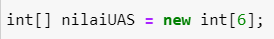

# JOBSHEET 10 - Array 1

## Tujuan
+ Mahasiswa mampu memahami pembuatan Array 1 dimensi dan pengaksesan elemenya di Java. 
+ Mahasiswa mampu membuat program dengan menggunakan konsep array satu dimensi.


## Alat dan Bahan
+ PC/laptop
+ Browser(chrome, firefox, safari)
+ Koneksi internet
+ Anaconda3 + Java kernel (opsional)

## Praktikum
### Percobaan 1: Mengisi Elemen Array
1. Pada percobaan ke-1 akan dilakukan percobaan untuk mengisi elemen array. Buat array bertipe integer dengan nama bil dengan kapasitas 4 elemen.


```Java
// Tulis Kode program Percobaan 1 Langkah 2 di atas
int[] bil = new int[4];
```

2. Isi masing-masing elemen array bil tadi dengan angka 5, 12, 7, 20.


```Java
// Tulis Kode program Percobaan 1 Langkah 3 di atas
bil[0] = 5;
bil[1] = 12;
bil[2] = 7;
bil[3] = 20;
```


    20


3. Tampilkan ke layar semua isi elemennya:


```Java
// Tulis Kode program Percobaan 1 Langkah 4
System.out.println(bil[0]);
System.out.println(bil[1]);
System.out.println(bil[2]);
System.out.println(bil[3]);
```

    5
    12
    7
    20


#### Pertanyaan 
1. Dari percobaan 1 berapakah indeks array terbesar dan terkecil?


```Java
// Tulis Jawaban no 1 disini
// Terbesar= indeks ke 3
// Terkecil= indeks ke 1
```

2. Jika Isi masing-masing elemen array bil diubah dengan angka 5.0, 12867, 7.5, 2000000. Apa yang terjadi? Mengapa bisa demikian?


```Java
// Tulis Jawaban no 2 yang disini
// Error karena bilangan tersebut tidak termasuk tipe data integer
```

3. Ubah statement pada langkah No 3 menjadi seperti berikut

Apa keluaran dari program? Mengapa bisa demikian?


```Java
// Tulis Jawaban no 3 yang disini
for(int i=0; i<4; i++){
    System.out.println(bil[i]);
}
```

    5
    12
    7
    20


```Java
// output sama karena i dimulai dari 0,1,2,3
```

### Percobaan 2: Meminta Inputan Pengguna untuk Mengisi Elemen Array
1. Pada percobaan ke-2 akan dilakukan percobaan yang meminta inputan pengguna untuk mengisi elemen array seperti pada flowchart berikut


2. Import dan deklarasikan Scanner untuk keperluan input. 


```Java
// Tulis Kode program Percobaan 2 Langkah 1 di atas
import java.util.Scanner;
Scanner sc = new Scanner(System.in);
```

3. Buat array bertipe integer dengan nama nilaiUAS, dengan kapasitas 6 elemen.



```Java
// Tulis Kode program Percobaan 2 Langkah 3 di atas
int nilaiUAS[] = new int[6];
```

4. Menggunakan perulangan, buat input untuk mengisi elemen dari array nilaiUAS.


```Java
// Tulis Kode program Percobaan 2 Langkah 4 di atas
for(int i = 0;i < 6; i++){
    System.out.printf("Masukkan Nilai UAS ke-%d: ",i);
    nilaiUAS[i] = sc.nextInt();
}
```

    Masukkan Nilai UAS ke-0: 88
    Masukkan Nilai UAS ke-1: 99
    Masukkan Nilai UAS ke-2: 99
    Masukkan Nilai UAS ke-3: 99
    Masukkan Nilai UAS ke-4: 99
    Masukkan Nilai UAS ke-5: 99


5. Menggunakan perulangan, tampilkan semua isi elemen dari array nilaiUAS.


```Java
// Tulis Kode program Percobaan 2 Langkah 5 di atas
for(int i = 0; i < 6; i++){
    System.out.printf("Nilai UAS ke-%d adalah: %d\n",i,nilaiUAS[i]);
}
```

    Nilai UAS ke-0 adalah: 88
    Nilai UAS ke-1 adalah: 99
    Nilai UAS ke-2 adalah: 99
    Nilai UAS ke-3 adalah: 99
    Nilai UAS ke-4 adalah: 99
    Nilai UAS ke-5 adalah: 99


#### Pertanyaan
1. Ubah statement pada langkah No 4 menjadi seperti berikut ini :

Jalankan program, apakah terjadi perubahan? Mengapa demikian?


```Java
// Tulis Jawaban nomor 1 disini
for(int i = 0;i < nilaiUAS.length; i++){
    System.out.printf("Masukkan Nilai UAS ke-%d: ",i);
    nilaiUAS[i] = sc.nextInt();
}
```

    Masukkan Nilai UAS ke-0: 60
    Masukkan Nilai UAS ke-1: 65
    Masukkan Nilai UAS ke-2: 70
    Masukkan Nilai UAS ke-3: 88
    Masukkan Nilai UAS ke-4: 88
    Masukkan Nilai UAS ke-5: 88


2. Apa kegunaan dari `nilaiUAS.length`? 


```Java
// Tulis Jawaban nomor 2 disini
// Untuk mengganti kondisi batas loop dengan panjang array
```

3. Ubah statement pada langkah No 5 menjadi seperti berikut ini sehingga program hanya menampilkan status mahasiswa yang lulus saja:

Jalankan program dan Jelaskan alur program!


```Java
// Tulis Jawaban nomor 3 disini
for(int i = 0; i < nilaiUAS.length; i++){
    if(nilaiUAS[i] > 70){
        System.out.printf("Mahasiswa ke-%d lulus\n",i);
    }
}
```

    Mahasiswa ke-3 lulus
    Mahasiswa ke-4 lulus
    Mahasiswa ke-5 lulus


```Java
/*
Program menampilkan mahasiswa yang nilainya melebihi 70 akan lulus
*/
```

### Percobaan 3: Melakukan Operasi Aritmatika terhadap Elemen Array
Pada praktikum ini, akan dilakukan percobaan untuk menjumlahkan Array. Program akan menerima input sebanyak 10 nilai mahasiswa. Kemudian program akan menampilkan nilai rata-rata nilai dari 10 Mahasiswa. Seperti flowchart berikut


1.Import dan deklarasikan Scanner untuk keperluan input. 


```Java
// Tulis Kode program Percobaan 3 Langkah 1 di atas, disini
import java.util.Scanner;
Scanner sc = new Scanner(System.in);
```

2. Buat array nilaiMHS bertipe integer dengan kapasitas 10. Kemudian deklarasikan variable total dan rata seperti gambar berikut ini


```Java
// Tulis Kode program Percobaan 3 Langkah 2 di atas, disini
int nilaiMHS[] = new int[10];
double total;
double rata;
```

3. Menggunakan perulangan, buat input untuk mengisi array nilaiMHS


```Java
// Tulis Kode program Percobaan 3 Langkah 3 di atas, disini
for(int i = 0;i < nilaiMHS.length; i++){
    System.out.printf("Masukkan Nilai Mahasiswa ke-%2d: ",(i+1));
    nilaiMHS[i] = sc.nextInt();
}
```

    Masukkan Nilai Mahasiswa ke- 1: 80
    Masukkan Nilai Mahasiswa ke- 2: 88
    Masukkan Nilai Mahasiswa ke- 3: 88
    Masukkan Nilai Mahasiswa ke- 4: 88
    Masukkan Nilai Mahasiswa ke- 5: 88
    Masukkan Nilai Mahasiswa ke- 6: 88
    Masukkan Nilai Mahasiswa ke- 7: 70
    Masukkan Nilai Mahasiswa ke- 8: 60
    Masukkan Nilai Mahasiswa ke- 9: 60
    Masukkan Nilai Mahasiswa ke-10: 66


4. Menggunakan perulangan untuk menghitung jumlah keseluruhan nilai.


```Java
// Tulis Kode program Percobaan 3 Langkah 4 di atas, disini
for(int i = 0;i < nilaiMHS.length; i++){
    total += nilaiMHS[i];
}
```

5. Kemudian hitung nilai rata-rata dengan cara nilai total dibagi jumlah elemen dari array nilaiMHS\


```Java
// Tulis Kode program Percobaan 3 Langkah 3 di atas, disini
rata = total / nilaiMHS.length;
System.out.printf("Rata-rata nilai mahasiswa adalah %.2f\n",rata);
```

    Rata-rata nilai mahasiswa adalah 77.60


    java.io.PrintStream@64d664a


#### Pertanyaan 
1. Pada Percobaan 3 langkah ke-5. Mengapa perhitungan rata berada diluar perulangan?


```Java
// Tulis jawaban no 1 disini
// Agar dapat menghitung data yang dibutuhkan setelah loop untuk menghitung rata2 
```

2. Modifikasi program pada percobaan 3 sehingga bisa mengeluarkan output  seperti gambar berikut ini!
syarat lulus nilai >70


```Java
// Tulis jawaban no 2 disini
double totalLulus, totalGagal, rataLulus, rataGagal;
int nilaiMHS[] = new int[10];
int lulus = 0, gagal = 0;

for(int i = 0;i < nilaiMHS.length; i++){
    System.out.printf("Masukkan Nilai Mahasiswa ke-%2d: ",(i+1));
    nilaiMHS[i] = sc.nextInt();
}
for(int i = 0;i < nilaiMHS.length; i++){
    if(nilaiMHS[i] > 70){
        totalLulus += nilaiMHS[i];
        lulus++;
    } else{
        totalGagal += nilaiMHS[i];
        gagal++;
    }
}
rataLulus = totalLulus / lulus;
rataGagal = totalGagal / gagal;
System.out.printf("Rata-rata nilai mahasiswa yang lulus adalah %.2f\n",rataLulus);
System.out.printf("Rata-rata nilai mahasiswa yang gagal adalah %.2f\n",rataGagal);
```

    Masukkan Nilai Mahasiswa ke- 1: 90
    Masukkan Nilai Mahasiswa ke- 2: 95
    Masukkan Nilai Mahasiswa ke- 3: 80
    Masukkan Nilai Mahasiswa ke- 4: 85
    Masukkan Nilai Mahasiswa ke- 5: 70
    Masukkan Nilai Mahasiswa ke- 6: 75
    Masukkan Nilai Mahasiswa ke- 7: 60
    Masukkan Nilai Mahasiswa ke- 8: 65
    Masukkan Nilai Mahasiswa ke- 9: 50
    Masukkan Nilai Mahasiswa ke-10: 55
    Rata-rata nilai mahasiswa yang lulus adalah 85.00
    Rata-rata nilai mahasiswa yang gagal adalah 60.00


    java.io.PrintStream@6f92d0cb

```Java
/*
variabel "lulus" dan "gagal" untuk menentukan jumlah setiap mahasiswa yang lulus dan gagal.
Yang digunakan untuk menghitung rata2 
yaitu total dibagi jumlah keseluruhan mahasiswa lulus atau gagal
*/


### Percobaan 4: Pencarian menggunakan Array
Pada praktikum ini, akan dilakukan percobaan untuk mencari lokasi/indeks sebuah angka dalam array. Sesuai dengan flowchart di bawah ini:
 

1. Buat array arr[] bertipe integer dengan kapasitas 6 dan isi dengan nilai 6, 4, 1, 9, 7, 3, 2 dan 8. Kemudian deklarasikan variabel integer `key` untuk kata kunci pencarian dan variabel `hasil` untuk hasil indeks pencarian. Deklarasi dan inisialisasi seperti gambar berikut ini


```Java
// Tulis Kode program Percobaan 4 Langkah 1 di atas, disini
int[] arr = {6,4,1,9,7,3,2,8};
int key = 3;
int hasil = -1;
```

2. Menggunakan perulangan, lakukan pencarian untuk mendapatkan nilai array yang sesuai dengan key. Bila ada yang sesuai, simpan indeksnya sebagai hasil pencarian


```Java
// Tulis Kode program Percobaan 4 Langkah 2 di atas, disini
for(int i = 0; i < arr.length; i++){
    if(key == arr[i]){
        hasil = i;
        break;
    }
}
```

3. Tampilkan hasil pencarian dengan kode berikut.


```Java
// Tulis Kode program Percobaan 4 Langkah 3 di atas, disini
System.out.println("Key ada di array ke-"+hasil);
```

    Key ada di array ke-5


#### Pertanyaan 
1. Pada Percobaan 4 langkah ke-2. Apa kegunaan dari statement `break`?


```Java
// Tulis jawaban no 1 disini
// Menghentikan loop
```

2. Modifikasi program pada percobaan 4 sehingga key yang dicari adalah angka 5. Kemudian jalankan program, amati hasilnya! Jelaskan penyebab dari hasil tersebut! 


```Java
// Tulis jawaban no 2 disini
int[] arr = {6,4,1,9,7,3,2,8};
int key = 5;
int hasil = -1;

for(int i = 0; i < arr.length; i++){
    if(key == arr[i]){
        hasil = i;
        break;
    }
}
System.out.println("Key ada di array ke-"+hasil);
```

    Key ada di array ke--1


```Java
/*
Hasil ada di array ke "-1" karena tidak ada data yang berisikan angka 5 disana. 
Output menjadi nilai dari variabel hasil diawal.
*/
```

### Percobaan 5: Pengurutan bilangan menggunakan Array
Pada praktikum ini, akan dilakukan percobaan untuk mengurutkan angka dalam array. Sesuai dengan flowchart di bawah ini:

1.Buat array arr[] bertipe integer dengan kapasitas 8 dan isi dengan nilai 16, 4, 10, 90, 27, 3, 12 dan 28. Kemudian deklarasikan variabel integer `temp` untuk media penukaran nilai pada variabel. Deklarasi dan inisialisasi seperti gambar berikut ini


```Java
// Tulis Kode program Percobaan 5 Langkah 1 disini
int[] arr = {16, 4, 10, 90, 27, 3, 12, 28};
int temp = 0;
```

2. Menggunakan perulangan, lakukan pengurutan bilangan dengan menukar posisi indeks tersebut dengan indeks berikutnya. Perulangan dilakukan untuk menukar posisi berulang kali. 


```Java
// Tulis Kode program Percobaan 5 Langkah 2 di atas, disini
for(int i = 0; i < arr.length; i++){
    for(int j = 1; j < (arr.length - i); j++){
        if(arr[j-1] > arr[j]){
            temp = arr[j-1];
            arr[j-1] = arr[j];
            arr[j] = temp;
        }
    }
}
```

3. Tampilkan hasil pengurutan dengan menggunakan perulangan


```Java
// Tulis Kode program Percobaan 5 Langkah 3 di atas, disini
System.out.println("Hasil pengurutan: ");
for(int i = 0; i < arr.length; i++)
    System.out.println(arr[i]);
```

    Hasil pengurutan: 
    3
    4
    10
    12
    16
    27
    28
    90


## Tugas
### Soal 1
Buatlah program yang **sesuai** dengan alur _flowchart_ di bawah ini


Flowchart diatas menggambarkan alur program yang membaca 10 masukan pengguna berupa integer dan menyimpannya. Kemudian angka ganjil dan genap disimpan kembali ke dalam variabel lain yang terpisah


```Java
/* Jawaban Soal 1 disini */
int checkNum[] = new int[10];
int evenNum[] = new int[10];
int oddNum[] = new int[10];
int cEven, cOdd = 0;

for(int i = 0; i < checkNum.length; i++){
    System.out.printf("Masukkan Number ke-%d: ",i);
    checkNum[i] = sc.nextInt();
}
for(int j = 0; j < checkNum.length; j++){
    if(checkNum[j] % 2 == 0){
        evenNum[cEven] = checkNum[j];
        cEven++;
    } else{
        oddNum[cOdd] = checkNum[j];
        cOdd++;
    }
}
System.out.printf("\nJumlah genap ada %d, dan jumlah ganjil ada %d",cEven,cOdd);
System.out.print("\nBilangan genap adalah\n");
for(int i = 0; i < cEven; i++){
    System.out.printf("- %d\n",evenNum[i]);
}
System.out.print("\nBilangan ganjil adalah\n");
for(int i = 0; i < cOdd; i++){
    System.out.printf("- %d\n",oddNum[i]);
}
```

    Masukkan Number ke-0: 12
    Masukkan Number ke-1: 32
    Masukkan Number ke-2: 44
    Masukkan Number ke-3: 11
    Masukkan Number ke-4: 101
    Masukkan Number ke-5: 200
    Masukkan Number ke-6: 211
    Masukkan Number ke-7: 200
    Masukkan Number ke-8: 311
    Masukkan Number ke-9: 321
    
    Jumlah genap ada 5, dan jumlah ganjil ada 5
    Bilangan genap adalah
    - 12
    - 32
    - 44
    - 200
    - 200
    
    Bilangan ganjil adalah
    - 11
    - 101
    - 211
    - 311
    - 321


```Java
/*
Program akan meminta pengguna untuk memasukkan angka sebanyak 10x sesuai dengan panjang array "checkNum[]".
Kemudian angka tadi dicek jika hasil bagi dengan 2 adalah 0 (genap) maka data akan disimpan. dan sebaliknya.
Setelah itu ditampilkan jumlah angka ganjil genap beserta setiap bilangannya.
*/
```

### Soal 2
Buatlah program yang terdapat array dengan jumlah elemen 5, buatlah input untuk mengisi elemen array tersebut, kemudian tampilkan isi array tersebut dengan urutan terbalik. Seperti ilustrasi gambar dibawah ini.


```Java
/* Jawaban Soal 2 disini */
int isiArray[] = new int[5];

for(int i = 0;i < isiArray.length; i++){
    System.out.printf("Masukkan elemen array ke-%d: ",i);
    isiArray[i] = sc.nextInt();
}
System.out.print("Isi array dengan urutan biasa: ");
for(int i = 0;i < isiArray.length; i++){
    System.out.print(isiArray[i]+" ");
}
System.out.print("Isi array dengan urutan terbalik: ");
for(int i = (isiArray.length-1) ;i >= 0; i--){
    System.out.print(isiArray[i]+" ");
}
```

    Masukkan elemen array ke-0: 12
    Masukkan elemen array ke-1: 32
    Masukkan elemen array ke-2: 22
    Masukkan elemen array ke-3: 21
    Masukkan elemen array ke-4: 44
    Isi array dengan urutan biasa: 12 32 22 21 44
    Isi array dengan urutan terbalik: 44 21 22 32 12 


```Java
/*
Program akan meminta pengguna untuk memasukkan angka sebanyak 5x sesuai dengan panjang array "isiArray[]".
Pertama akan ditampilkan urutan masukan pengguna,
Kemudian angka tadi akan ditampilkan secara terbalik dengan loop yang dimulai dari indeks ke 5 atau "isiArray[4]".
*/
```

### Soal 3
Buatlah program yang menerima input jumlah elemen array, inputkan isi arraynya, kemudian tampilkan bilangan terbesar dari isi elemen arraynya. Contoh hasil program:


```Java
/* Jawaban Soal 3 disini */
int isi,terbesar = 0;

System.out.print("Masukkan isi array: ");
isi = sc.nextInt();

int isiArray[] = new int[isi];

for(int i = 0;i < isiArray.length; i++){
    System.out.printf("Masukkan elemen array ke-%d: ",i);
    isiArray[i] = sc.nextInt();
}
for(int i = 0; i < isiArray.length; i++){
    if(isiArray[i] > terbesar){
        terbesar = isiArray[i];
    }
}
System.out.print("Bilangan terbesar adalah " + terbesar);
```

    Masukkan isi array: 5
    Masukkan elemen array ke-0: 33
    Masukkan elemen array ke-1: 43
    Masukkan elemen array ke-2: 21
    Masukkan elemen array ke-3: 4
    Masukkan elemen array ke-4: 44
    Bilangan terbesar adalah 44


```Java
/*
Program akan meminta pengguna untuk memasukkan banyak angka yang akan diisi.
Kemudian program akan meminta pengguna untuk memasukkan bilangan sebanyak sesuai dengan banyak angka yang diisi sebelumnya.
Setelah itu bilangan tadi akan dicek satu persatu apakah lebih besar dari variabel "terbesar". jika iya akan membuat variabel "terbesar" baru yang bernilai bilangan tadi.
*/
```
