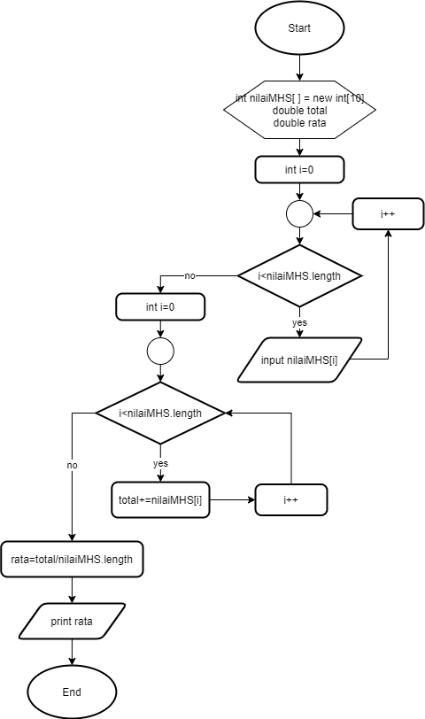

# JOBSHEET 10 - Array 1

## Tujuan
+ Mahasiswa mampu memahami pembuatan Array 1 dimensi dan pengaksesan elemenya di Java. 
+ Mahasiswa mampu membuat program dengan menggunakan konsep array satu dimensi.


## Alat dan Bahan
+ PC/laptop
+ Browser(chrome, firefox, safari)
+ Koneksi internet
+ Anaconda3 + Java kernel (opsional)

## Praktikum
### Percobaan 1: Mengisi Elemen Array
1. Pada percobaan ke-1 akan dilakukan percobaan untuk mengisi elemen array. Buat array bertipe integer dengan nama bil dengan kapasitas 4 elemen.


```Java
// Tulis Kode program Percobaan 1 Langkah 2 di atas
int [] bil = new int [4];
```

2. Isi masing-masing elemen array bil tadi dengan angka 5, 12, 7, 20.


```Java
// Tulis Kode program Percobaan 1 Langkah 3 di atas
bil [0] = 5.0;
bil [1] = 12;
bil [2] = 7.5;
bil [3] = 2000000;
```


    |   bil [0] = 5.0;

    incompatible types: possible lossy conversion from double to int

    


3. Tampilkan ke layar semua isi elemennya:


```Java
// Tulis Kode program Percobaan 1 Langkah 4
System.out.println(bil[0]);
System.out.println(bil[1]);
System.out.println(bil[2]);
System.out.println(bil[3]);
```

    50
    12
    75
    2000000


#### Pertanyaan 
1. Dari percobaan 1 berapakah indeks array terbesar dan terkecil?


```Java
// Tulis Jawaban no 1 disini
Terbesar indeks 3
Terkecil indeks 0
```

2. Jika Isi masing-masing elemen array bil diubah dengan angka 5.0, 12867, 7.5, 2000000. Apa yang terjadi? Mengapa bisa demikian?


```Java
// Tulis Jawaban no 2 yang disini
Muncul Incompatible Type. Karena data di indeks 0 dan 2 tidak terbaca karena tipe data integer tidak bisa menyimpan 
```

3. Ubah statement pada langkah No 3 menjadi seperti berikut

Apa keluaran dari program? Mengapa bisa demikian?


```Java
// Tulis Jawaban no 3 yang disini
for (int i=0; i<4; i++){
    System.out.println(bil[i]);
}
//Jawab: Program menampilkan data array. Karena ada proses perulangan dimana i=indeks dimulai dari 0, jika indeks kurang dari 4, maka akan terproses menampilkan data array, kemudian ada increment untuk menambahkan nilai indeks
```

    50
    12
    75
    2000000


### Percobaan 2: Meminta Inputan Pengguna untuk Mengisi Elemen Array
1. Pada percobaan ke-2 akan dilakukan percobaan yang meminta inputan pengguna untuk mengisi elemen array seperti pada flowchart berikut


```Java
// Tulis Kode program Percobaan 2 Langkah 1 di atas

```

2. Import dan deklarasikan Scanner untuk keperluan input. 


```Java
// Tulis Kode program Percobaan 2 Langkah 1 di atas
import java.util.Scanner;
Scanner sc = new Scanner (System.in);
```

3. Buat array bertipe integer dengan nama nilaiUAS, dengan kapasitas 6 elemen.


```Java
// Tulis Kode program Percobaan 2 Langkah 3 di atas
int [] nilaiUAS = new int [6];
```

4. Menggunakan perulangan, buat input untuk mengisi elemen dari array nilaiUAS.


```Java
// Tulis Kode program Percobaan 2 Langkah 4 di atas
for (int i = 0; i < 6; i++){
    System.out.print("Masukkan nilai UAS ke-" +i+": ");
    nilaiUAS[i] = sc.nextInt();
}

```

    Masukkan nilai UAS ke-0: 10
    Masukkan nilai UAS ke-1: 2
    Masukkan nilai UAS ke-2: 80
    Masukkan nilai UAS ke-3: 30
    Masukkan nilai UAS ke-4: 70
    Masukkan nilai UAS ke-5: 100


### 5. Menggunakan perulangan, tampilkan semua isi elemen dari array nilaiUAS.


```Java
// Tulis Kode program Percobaan 2 Langkah 5 di atas
for (int i=0; i<6; i++){
    System.out.println("Nilai UAS ke-"+ i +" adalah: " +nilaiUAS[i]);
}
```

    Nilai UAS ke-0 adalah: 10
    Nilai UAS ke-1 adalah: 2
    Nilai UAS ke-2 adalah: 80
    Nilai UAS ke-3 adalah: 30
    Nilai UAS ke-4 adalah: 70
    Nilai UAS ke-5 adalah: 100


#### Pertanyaan
1. Ubah statement pada langkah No 4 menjadi seperti berikut ini :

Jalankan program, apakah terjadi perubahan? Mengapa demikian?


```Java
// Tulis Jawaban nomor 1 disini
for (int i=0; i<nilaiUAS.length; i++){
    System.out.println("Masukkan nilai UAS ke-"+i+": ");
    nilaiUAS[i] = sc.nextInt();
}
```

    Masukkan nilai UAS ke-0: 
    100
    Masukkan nilai UAS ke-1: 
    20
    Masukkan nilai UAS ke-2: 
    80
    Masukkan nilai UAS ke-3: 
    50
    Masukkan nilai UAS ke-4: 
    100
    Masukkan nilai UAS ke-5: 
    70


2. Apa kegunaan dari `nilaiUAS.length`? 


```Java
// Tulis Jawaban nomor 2 disini
untuk mengetahui panjang array nilaiUAS
```

3. Ubah statement pada langkah No 5 menjadi seperti berikut ini sehingga program hanya menampilkan status mahasiswa yang lulus saja:

Jalankan program dan Jelaskan alur program!


```Java
// Tulis Jawaban nomor 3 disini
for (int i=0; i<nilaiUAS.length; i++){
    if (nilaiUAS[i]>70){
        System.out.println("Mahasiswa ke-"+i+"Lulus");
    }
}
```

    Mahasiswa ke-0Lulus
    Mahasiswa ke-2Lulus
    Mahasiswa ke-4Lulus


### Percobaan 3: Melakukan Operasi Aritmatika terhadap Elemen Array
Pada praktikum ini, akan dilakukan percobaan untuk menjumlahkan Array. Program akan menerima input sebanyak 10 nilai mahasiswa. Kemudian program akan menampilkan nilai rata-rata nilai dari 10 Mahasiswa. Seperti flowchart berikut


1.Import dan deklarasikan Scanner untuk keperluan input. 


```Java
// Tulis Kode program Percobaan 3 Langkah 1 di atas, disini
import java.util.Scanner;
Scanner sc = new Scanner (System.in);
```

2. Buat array nilaiMHS bertipe integer dengan kapasitas 10. Kemudian deklarasikan variable total dan rata seperti gambar berikut ini


```Java
// Tulis Kode program Percobaan 3 Langkah 2 di atas, disini
int nilaiMHS[]=new int[10];
double total;
double rata;
```

3. Menggunakan perulangan, buat input untuk mengisi array nilaiMHS


```Java
// Tulis Kode program Percobaan 3 Langkah 3 di atas, disini
for (int i=0; i<nilaiMHS.length; i++){
    System.out.print("Masukkan nilai Mahasiswa ke-"+(i+1)+": ");
    nilaiMHS[i] = sc.nextInt();
}
```

    Masukkan nilai Mahasiswa ke-1: 80
    Masukkan nilai Mahasiswa ke-2: 90
    Masukkan nilai Mahasiswa ke-3: 100
    Masukkan nilai Mahasiswa ke-4: 80
    Masukkan nilai Mahasiswa ke-5: 100
    Masukkan nilai Mahasiswa ke-6: 76
    Masukkan nilai Mahasiswa ke-7: 92
    Masukkan nilai Mahasiswa ke-8: 38
    Masukkan nilai Mahasiswa ke-9: 88
    Masukkan nilai Mahasiswa ke-10: 99


4. Menggunakan perulangan untuk menghitung jumlah keseluruhan nilai.


```Java
// Tulis Kode program Percobaan 3 Langkah 4 di atas, disini
for (int i=0; i<nilaiMHS.length; i++){
    total+=nilaiMHS[i];
}
```

5. Kemudian hitung nilai rata-rata dengan cara nilai total dibagi jumlah elemen dari array nilaiMHS\


```Java
// Tulis Kode program Percobaan 3 Langkah 3 di atas, disini
rata=total/nilaiMHS.length;
System.out.println("Rata rata nilai mahasiswa adalah "+rata);
```

    Rata rata nilai mahasiswa adalah 84.3


#### Pertanyaan 
1. Pada Percobaan 3 langkah ke-5. Mengapa perhitungan rata berada diluar perulangan?

// Tulis jawaban no 1 disini
1. Perhitungan dillakukan diluar perulangan karena memang hanya dilakukan 1 kali

2. Modifikasi program pada percobaan 3 sehingga bisa mengeluarkan output  seperti gambar berikut ini!
syarat lulus nilai >70


```Java
 // Tulis jawaban no 2 disini
double total1;
double total2;
double rata1;
double rata2;
int a=0;
int b=0;

// Untuk menginputkan nilai mahasiswa ke program
for (int i=0; i<nilaiMHS.length; i++){
    System.out.print("Masukkan nilai Mahasiswa ke-"+(i+1)+": ");
    nilaiMHS[i] = sc.nextInt();
}

// untuk mencari nilai mahasiswa yang lulus dan tidak
for (int i=0; i<nilaiMHS.length; i++){
    if (nilaiMHS[i]>70){
        total1+=nilaiMHS[i];
        a++;
    }
    else if (nilaiMHS[i]<=70){
        total2+=nilaiMHS[i];
        b++;
    }
}

rata1=total1/a;
rata2=total2/b;

System.out.println("Rata Rata nilai Mahasiswa yang lulus adalah "+rata1);
System.out.println("Rata Rata nilai Mahasiswa yang tidak lulus adalah "+rata2);
```

    Masukkan nilai Mahasiswa ke-1: 99
    Masukkan nilai Mahasiswa ke-2: 89
    Masukkan nilai Mahasiswa ke-3: 79
    Masukkan nilai Mahasiswa ke-4: 58
    Masukkan nilai Mahasiswa ke-5: 49
    Masukkan nilai Mahasiswa ke-6: 99
    Masukkan nilai Mahasiswa ke-7: 88
    Masukkan nilai Mahasiswa ke-8: 93
    Masukkan nilai Mahasiswa ke-9: 48
    Masukkan nilai Mahasiswa ke-10: 59
    Rata Rata nilai Mahasiswa yang lulus adalah 91.16666666666667
    Rata Rata nilai Mahasiswa yang tidak lulus adalah 53.5


### Percobaan 4: Pencarian menggunakan Array
Pada praktikum ini, akan dilakukan percobaan untuk mencari lokasi/indeks sebuah angka dalam array. Sesuai dengan flowchart di bawah ini:
 

1. Buat array arr[] bertipe integer dengan kapasitas 6 dan isi dengan nilai 6, 4, 1, 9, 7, 3, 2 dan 8. Kemudian deklarasikan variabel integer `key` untuk kata kunci pencarian dan variabel `hasil` untuk hasil indeks pencarian. Deklarasi dan inisialisasi seperti gambar berikut ini


```Java
// Tulis Kode program Percobaan 4 Langkah 1 di atas, disini
int [] arr = {6, 4, 1, 9, 7, 3, 2, 8};
int key = 3;
int hasil = -1;
```

2. Menggunakan perulangan, lakukan pencarian untuk mendapatkan nilai array yang sesuai dengan key. Bila ada yang sesuai, simpan indeksnya sebagai hasil pencarian


```Java
// Tulis Kode program Percobaan 4 Langkah 2 di atas, disini
for (int i=0; i<arr.length; i++){
    if(key==arr[i]){
        hasil=i;
        break;
    }
}
```

3. Tampilkan hasil pencarian dengan kode berikut.


```Java
// Tulis Kode program Percobaan 4 Langkah 3 di atas, disini
System.out.println("Key ada di array ke-"+hasil);
```

    Key ada di array ke-5


#### Pertanyaan 
1. Pada Percobaan 4 langkah ke-2. Apa kegunaan dari statement `break`?


```Java
// Tulis jawaban no 1 disini
1. untuk menghentikan perulangan
```

2. Modifikasi program pada percobaan 4 sehingga key yang dicari adalah angka 5. Kemudian jalankan program, amati hasilnya! Jelaskan penyebab dari hasil tersebut! 


```Java
// Tulis jawaban no 2 disini
int key = 5;
for (int i=0; i<arr.length; i++){
    if(key==arr[i]){
        hasil=i;
        break;
    }
}

System.out.println("Key ada di array ke"+hasil);

// Penjelasan. Karena array tidak sesuai dengan key, jadi ketika if (key==arr[i]) tidak ada yang cocok, maka akan menampilkan hasil yang dimana di -1
```

    Key ada di array ke-1


### Percobaan 5: Pengurutan bilangan menggunakan Array
Pada praktikum ini, akan dilakukan percobaan untuk mengurutkan angka dalam array. Sesuai dengan flowchart di bawah ini:

1.Buat array arr[] bertipe integer dengan kapasitas 8 dan isi dengan nilai 16, 4, 10, 90, 27, 3, 12 dan 28. Kemudian deklarasikan variabel integer `temp` untuk media penukaran nilai pada variabel. Deklarasi dan inisialisasi seperti gambar berikut ini


```Java
// Tulis Kode program Percobaan 5 Langkah 1 disini
int [] arr = {16, 4, 10, 90, 27, 3, 12, 28};
int temp = 0;
```


```Java
// Tulis Kode program Percobaan 5 Langkah 2 di atas, disini
for (int i= 0; i<arr.length; i++){
    for (int j = 1; j<(arr.length-i); j++){
        if (arr[j-1] > arr[j]){
            temp = arr[j-1];
                arr [j-1] = arr[j];
                arr [j] = temp;
        }
    }
}
```

2. Menggunakan perulangan, lakukan pengurutan bilangan dengan menukar posisi indeks tersebut dengan indeks berikutnya. Perulangan dilakukan untuk menukar posisi berulang kali. 


3. Tampilkan hasil pengurutan dengan menggunakan perulangan


```Java
// Tulis Kode program Percobaan 5 Langkah 3 di atas, disini
System.out.println("Hasil pengurutan: ");
for (int i=0; i<arr.length; i++)
    System.out.println(arr[i]);
```

    Hasil pengurutan: 
    3
    4
    10
    12
    16
    27
    28
    90


## Tugas
### Soal 1
Buatlah program yang **sesuai** dengan alur _flowchart_ di bawah ini


Flowchart diatas menggambarkan alur program yang membaca 10 masukan pengguna berupa integer dan menyimpannya. Kemudian angka ganjil dan genap disimpan kembali ke dalam variabel lain yang terpisah


```Java
import java.util.Scanner;
Scanner sc = new Scanner(System.in);

int checkNum[] = new int[10];
int oddNum[] = new int[10];
int evenNum[] = new int[10];
int cEven, cOdd = 0;

for(int i=0; i<checkNum.length; i++){
    System.out.print("Masukkan angka "+(i+1)+": ");
    checkNum[i] = sc.nextInt();
}

for(int j=0; j<checkNum.length; j++){
    if(checkNum[j]%2==0){
        evenNum[cEven] = checkNum[j];
        cEven++;
    }else{
        oddNum[cOdd] = checkNum[j];
        cOdd++;
    }
}

for(int i=0; i<cEven; i++){
    System.out.printf("Bilangan Genap :%d\n",evenNum[i]);
}
for(int i=0; i<cOdd; i++){
    System.out.printf("Bilangan Ganjil :%d\n",oddNum[i]);
}
```

    Masukkan angka 1: 1
    Masukkan angka 2: 2
    Masukkan angka 3: 3
    Masukkan angka 4: 4
    Masukkan angka 5: 5
    Masukkan angka 6: 6
    Masukkan angka 7: 7
    Masukkan angka 8: 8
    Masukkan angka 9: 9
    Masukkan angka 10: 10
    Bilangan Genap :2
    Bilangan Genap :4
    Bilangan Genap :6
    Bilangan Genap :8
    Bilangan Genap :10
    Bilangan Ganjil :1
    Bilangan Ganjil :3
    Bilangan Ganjil :5
    Bilangan Ganjil :7
    Bilangan Ganjil :9


#### PENJELASAN
Pada program diatas dimasukkan library scanner agar bisa menyimpan inputan. Pertama deklarasi array checkNum, oddNum dan evenNu dengan tipe data integer. Juga membuat variabel integer baru cEven dan cOod dengan nilai 0. Kemudian dilakukan perulangan yang tujuannya untuk memasukkan inputan angka di array chechNum sampai 10 data. Jika kondisi sudah memenuhi, maka dilakukan lagi perulangan. Ada proses pengecekan. Jika checkNum J hasil modulus 2 == 0. Maka data di checkNum akan tersimpan di array EveNum. Dan jika tidak akan tersimpan di array oddNum. Fungsi cEven dan cOdd adalah menginkrement jumlah data cEven dan cOdd. Terakhir menampilkan datanya menggunkana System.out.printf. Untuk ganjil dan genap

#### Soal 2
Buatlah program yang terdapat array dengan jumlah elemen 5, buatlah input untuk mengisi elemen array tersebut, kemudian tampilkan isi array tersebut dengan urutan terbalik. Seperti ilustrasi gambar dibawah ini.


```Java
/* Jawaban Soal 2 disini */
import java.util.Scanner;
Scanner input = new Scanner(System.in);

int a[] = new int[5];

for(int i = 0; i < a.length; i++){
    System.out.print("Masukkan angka "+ (i+1) +":");
    a[i] = input.nextInt();
}

for(int i=a.length -1; i>=0; i--){
    System.out.print("Urutan Terbalik :");
    System.out.printf("%d\n",a[i]);
   
}

```

    Masukkan angka 1:5
    Masukkan angka 2:2
    Masukkan angka 3:7
    Masukkan angka 4:9
    Masukkan angka 5:6
    Urutan Terbalik :6
    Urutan Terbalik :9
    Urutan Terbalik :7
    Urutan Terbalik :2
    Urutan Terbalik :5


### Penjelasan
Pertama mengimport kan library scanner dan Scanner input = new Scanner(System.in); agar bisa menyimpan inputan. Kemudian membuat array a dengan tipe data integer dengan panjang data 5. Setelah itu dilakukan perulangan. untuk memasukkan inputan sampai 5 kali(karena a.length). Inputan dimasukkan ke dalam array a. Yang kedua membuat perulangan lagi dengan int=a.lenght dikurang 1 kemudian dilakukan decrement. Setelah itu menampilkan hasil urutan terbalik

### Soal 3
Buatlah program yang menerima input jumlah elemen array, inputkan isi arraynya, kemudian tampilkan bilangan terbesar dari isi elemen arraynya. Contoh hasil program:


```Java
/* Jawaban Soal 3 disini */
import java.util.Scanner;
Scanner sc = new Scanner(System.in);

int nilaiArray[] = new int[10];
int index, max = 0;

System.out.print("Masukkan isi array: ");
index = sc.nextInt();

for(int i=0; i<index; i++){
    System.out.print("Masukkan elemen array ke- "+ (i+1) +":");
    nilaiArray[i] = sc.nextInt();
}

for(int i=0; i<=index; i++){
    if(nilaiArray[i] > max){
        max = nilaiArray[i];
    }
}

System.out.print("Bilangan terbesar adalah "+max)

```

    Masukkan isi array: 5
    Masukkan elemen array ke- 1:25
    Masukkan elemen array ke- 2:78
    Masukkan elemen array ke- 3:12
    Masukkan elemen array ke- 4:63
    Masukkan elemen array ke- 5:99
    Bilangan terbesar adalah 99

#### Penjelasan
Pertama mengimport kan library scanner dan Scanner input = new Scanner(System.in); agar bisa menyimpan inputan. Kemudian membuat array nilaiArray tipe integer dengan panjang data 10(berfungsi untuk menyimpan nilai array). setelah itu membuat variabel index dan max=0 ber tipe data int. Kemudian menampilkan teks"Masukkan isi array". data inputan disimpan ke dalam index. setelah itu dilakukan perulangan i=0, i harus kurang dari index. jika memenuhi maka menampilan "Masukkan elemen array ke" dikuti i+1 untuk penomoran karena deafultnya 0 agar menjadi 1. kemudian inputan akan masuk ke array nilaiArray sampai terpenuhi. Kemudian melakukan perulangan lagi untuk mencari nilai maksimal. pada sintaks if bisa dijelaskan jika array nilaiArray lebih besar dari variabel max. jika kondisi perulangan sudah terpenuhi makan akan menampilkan nilai max atau maksimal
