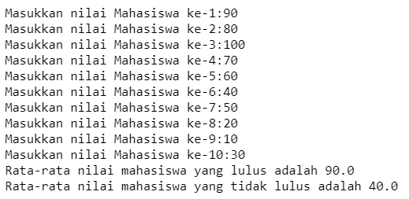

# JOBSHEET 10 - Array 1

## Tujuan

- Mahasiswa mampu memahami pembuatan Array 1 dimensi dan pengaksesan elemenya di Java.
- Mahasiswa mampu membuat program dengan menggunakan konsep array satu dimensi.

## Alat dan Bahan

- PC/laptop
- Browser(chrome, firefox, safari)
- Koneksi internet
- Anaconda3 + Java kernel (opsional)

## Praktikum

### Percobaan 1: Mengisi Elemen Array

1. Pada percobaan ke-1 akan dilakukan percobaan untuk mengisi elemen array. Buat array bertipe integer dengan nama bil dengan kapasitas 4 elemen.
   

```Java
// Tulis Kode program Percobaan 1 Langkah 2 di atas
int[] bil=new int [4];
```

> Sintaks diatas digunakan untuk mendeklarasikan Array yang berisi 4 nilai

2. Isi masing-masing elemen array bil tadi dengan angka 5, 12, 7, 20.
   

```Java
// Tulis Kode program Percobaan 1 Langkah 3 di atas
bil[0] = 5;
bil[1] = 12;
bil[2] = 7;
bil[3] = 20;
```

> Sintaks diatas digunakan untuk memasukkan data ke Array

3. Tampilkan ke layar semua isi elemennya:
   

```Java
// Tulis Kode program Percobaan 1 Langkah 4
int[] bil=new int [4];
bil[0] = 5;
bil[1] = 12;
bil[2] = 7;
bil[3] = 20;
System.out.println(bil[0]);
System.out.println(bil[1]);
System.out.println(bil[2]);
System.out.println(bil[3]);
```

    5
    12
    7
    20

> Sintaks diatas digunakan untuk mencetak data dalam array yang sudah dimasukkan

#### Pertanyaan

1. Dari percobaan 1 berapakah indeks array terbesar dan terkecil?

// Tulis Jawaban no 1 disini

> 1.  indeks terbesar adalah 4 dan yang terkecil adalah indek 0

2. Jika Isi masing-masing elemen array bil diubah dengan angka 5.0, 12867, 7.5, 2000000. Apa yang terjadi? Mengapa bisa demikian?

```Java
// Tulis Jawaban no 2 yang disini
int [] bil = new int[4];
bil[0]=5;
bil[1]=12;
bil[2]=7;
bil[3]=20;

System.out.println(bil[5.0]);
System.out.println(bil[12867]);
System.out.println(bil[7.5]);
System.out.println(bil[2000000]);
```

    |   System.out.println(bil[5.0]);

    incompatible types: possible lossy conversion from double to int

> 2.  yang terjadi error karena bil int dideklarasikan sebagai int sedangkan data yang dimasukkan bukan tipe data int

3. Ubah statement pada langkah No 3 menjadi seperti berikut
   
   Apa keluaran dari program? Mengapa bisa demikian?

```Java
// Tulis Jawaban no 3 yang disini
for(int i = 0; i<4; i++){
 System.out.println(bil[i]);
 }
```

    5
    12
    7
    20

> 3.  Bisa seperti itu karena setiap putaran i bertambah 1 dan setiap bilangan i berisi data yang berbeda

### Percobaan 2: Meminta Inputan Pengguna untuk Mengisi Elemen Array

1. Pada percobaan ke-2 akan dilakukan percobaan yang meminta inputan pengguna untuk mengisi elemen array seperti pada flowchart berikut
   

```Java
// Tulis Kode program Percobaan 2 Langkah 1 di atas

```

2. Import dan deklarasikan Scanner untuk keperluan input.
   

```Java
// Tulis Kode program Percobaan 2 Langkah 1 di atas
import java.util.Scanner;
Scanner input = new Scanner(System.in);
```

> Program diatas untuk mendeklarasikan Scanner untuk keperluan input.

3. Buat array bertipe integer dengan nama nilaiUAS, dengan kapasitas 6 elemen.
   

```Java
// Tulis Kode program Percobaan 2 Langkah 3 di atas
int nilaiUAS[] = new int[6];
```

> Program diatas untuk mendeklarasikan Array dan mendeklarasikan didalam Array ada 6 data

4. Menggunakan perulangan, buat input untuk mengisi elemen dari array nilaiUAS.
   

```Java
// Tulis Kode program Percobaan 2 Langkah 4 di atas
for(int i=0; i<6 ;i++){
    System.out.print("Masukkan nilai UAS KE-" + i +": ");
    nilaiUAS[i]=input.nextInt();
}
```

    Masukkan nilai UAS KE-0: 99
    Masukkan nilai UAS KE-1: 98
    Masukkan nilai UAS KE-2: 96
    Masukkan nilai UAS KE-3: 89
    Masukkan nilai UAS KE-4: 88
    Masukkan nilai UAS KE-5: 99

> Program diatas untuk memasukkan data ke dalam Array

5. Menggunakan perulangan, tampilkan semua isi elemen dari array nilaiUAS.
   

```Java
// Tulis Kode program Percobaan 2 Langkah 5 di atas
for(int i=0; i<6 ;i++){
    System.out.println("Nilai UAS ke-" + i + " adalah " + nilaiUAS[i]);
}
```

    Nilai UAS ke-0 adalah 99
    Nilai UAS ke-1 adalah 98
    Nilai UAS ke-2 adalah 96
    Nilai UAS ke-3 adalah 89
    Nilai UAS ke-4 adalah 88
    Nilai UAS ke-5 adalah 99

> Program diatas memnpunyai fungsi untuk mencetak data Array menggunakan perulangan for

#### Pertanyaan

1. Ubah statement pada langkah No 4 menjadi seperti berikut ini :
   
   Jalankan program, apakah terjadi perubahan? Mengapa demikian?

```Java
// Tulis Jawaban nomor 1 disini
Scanner input = new Scanner(System.in);
int nilaiUAS[] = new int[6];

for(int i=0; i<nilaiUAS.length; i++){
    System.out.print("Masukkan nilai UAS KE-" + i +": ");
    nilaiUAS[i]=input.nextInt();
}
```

    Masukkan nilai UAS KE-0: 90
    Masukkan nilai UAS KE-1: 98
    Masukkan nilai UAS KE-2: 99
    Masukkan nilai UAS KE-3: 87
    Masukkan nilai UAS KE-4: 89
    Masukkan nilai UAS KE-5: 90

> Program diatas mempunyai hasil yang sama dengan sebelmnya karena sintaks nilaiUAS.lenght mempunyai arti panjang dari varibel Array yang telah dideklarasikan

2. Apa kegunaan dari `nilaiUAS.length`?

// Tulis Jawaban nomor 2 disini

> 2. nilaiUAS.length sama dengan panjang dari array atau banyak array yang dideklarasikan sebelumnya

3. Ubah statement pada langkah No 5 menjadi seperti berikut ini sehingga program hanya menampilkan status mahasiswa yang lulus saja:
   
   Jalankan program dan Jelaskan alur program!

```Java
// Tulis Jawaban nomor 3 disini
Scanner input = new Scanner(System.in);
int nilaiUAS[] = new int[6];

for(int i=0; i<nilaiUAS.length; i++){
    System.out.print("Masukkan nilai UAS KE-" + i +": ");
    nilaiUAS[i]=input.nextInt();
}
for(int i=0; i<nilaiUAS.length; i++){
    if(nilaiUAS[i] > 70){
        System.out.println("Mahasiswa ke-" + i + " Lulus! ");
    }
    else {
        System.out.println("Mahasiswa ke-" + i + " Belum Lulus! ");
    }
}
```

    Masukkan nilai UAS KE-0: 90
    Masukkan nilai UAS KE-1: 80
    Masukkan nilai UAS KE-2: 90
    Masukkan nilai UAS KE-3: 70
    Masukkan nilai UAS KE-4: 60
    Masukkan nilai UAS KE-5: 70
    Mahasiswa ke-0 Lulus!
    Mahasiswa ke-1 Lulus!
    Mahasiswa ke-2 Lulus!
    Mahasiswa ke-3 Belum Lulus!
    Mahasiswa ke-4 Belum Lulus!
    Mahasiswa ke-5 Belum Lulus!

### Percobaan 3: Melakukan Operasi Aritmatika terhadap Elemen Array

Pada praktikum ini, akan dilakukan percobaan untuk menjumlahkan Array. Program akan menerima input sebanyak 10 nilai mahasiswa. Kemudian program akan menampilkan nilai rata-rata nilai dari 10 Mahasiswa. Seperti flowchart berikut


1.Import dan deklarasikan Scanner untuk keperluan input.


```Java
// Tulis Kode program Percobaan 3 Langkah 1 di atas, disini
import java.util.Scanner;
Scanner input = new Scanner(System.in);
```

2. Buat array nilaiMHS bertipe integer dengan kapasitas 10. Kemudian deklarasikan variable total dan rata seperti gambar berikut ini
   

```Java
// Tulis Kode program Percobaan 3 Langkah 2 di atas, disini
Scanner input = new Scanner(System.in);
int[] nilaiMHS = new int[10];
double total;
double rata;
```

3. Menggunakan perulangan, buat input untuk mengisi array nilaiMHS
   

```Java
// Tulis Kode program Percobaan 3 Langkah 3 di atas, disini
for(int i=0; i<nilaiMHS.length; i++){
    System.out.print("Masukkan nilai mahasiswa ke-" +(i+1)+" : ");
    nilaiMHS[i]=input.nextInt();
}
```

    Masukkan nilai mahasiswa ke-1 : 90
    Masukkan nilai mahasiswa ke-2 : 98
    Masukkan nilai mahasiswa ke-3 : 97
    Masukkan nilai mahasiswa ke-4 : 96
    Masukkan nilai mahasiswa ke-5 : 99
    Masukkan nilai mahasiswa ke-6 : 95
    Masukkan nilai mahasiswa ke-7 : 96
    Masukkan nilai mahasiswa ke-8 : 97
    Masukkan nilai mahasiswa ke-9 : 90
    Masukkan nilai mahasiswa ke-10 : 97

> Program diatas untuk memasukkan data ke dalam Array

4. Menggunakan perulangan untuk menghitung jumlah keseluruhan nilai.
   

```Java
// Tulis Kode program Percobaan 3 Langkah 4 di atas, disini
for(int i=0; i<nilaiMHS.length; i++){
  total+=nilaiMHS[i];
}
```

> Program diatas untuk menghitung total dari nilai mahasiswa menggunakan perulangan for

5. Kemudian hitung nilai rata-rata dengan cara nilai total dibagi jumlah elemen dari array nilaiMHS\
   

```Java
// Tulis Kode program Percobaan 3 Langkah 3 di atas, disini
rata = total/nilaiMHS.length;
System.out.println("nilai rata-rata kelas = " + rata);
```

    nilai rata-rata kelas = 95.5

> Program diatas digunkan untuk menghitung dan mencetak rata rata nilai mahasiswa yang telah di input user

#### Pertanyaan

1. Pada Percobaan 3 langkah ke-5. Mengapa perhitungan rata berada diluar perulangan?

// Tulis jawaban no 1 disini

> Rata-rata berada diluar perulangan karena rata rata merupakan hasil dari total seluruh nilai mahasiswa dibagi banyak mahasiswa jadi karena yang dibagi total maka menunggu dulu perulangan penjumlahan nilai mahasiswa sampai selesai setelah itu baru dihitung rata-rata

2. Modifikasi program pada percobaan 3 sehingga bisa mengeluarkan output seperti gambar berikut ini!
   syarat lulus nilai >70
   

```Java
// Tulis jawaban no 2 disini
Scanner input = new Scanner(System.in);
int byk, total1 = 0,total2 = 0, a = 0, b = 0;
double rata1, rata2;

int nilaiMHS[] = new int[10];
for(int i=0; i<nilaiMHS.length; i++){
    System.out.print("Masukkan nilai mahasiswa ke-" +(i+1)+" : ");
    nilaiMHS[i]=input.nextInt();
}
for(int i=0; i<nilaiMHS.length; i++){
    if(nilaiMHS[i] > 70){
    total1+=nilaiMHS[i];
    a++;
    }
}
for(int j=1; j<nilaiMHS.length; j++){
    if(nilaiMHS[j] <= 70){
     total2+=nilaiMHS[j];
    b++;
    }
}
rata1 = total1/a;
rata2 = total2/b;
System.out.println("Rata-rata nilai mahasiswa yang lulus adalah " + rata1);
System.out.println("Rata-rata nilai mahasiswa yang belum lulus adalah " + rata2);
```

    Masukkan nilai mahasiswa ke-1 : 90
    Masukkan nilai mahasiswa ke-2 : 80
    Masukkan nilai mahasiswa ke-3 : 100
    Masukkan nilai mahasiswa ke-4 : 70
    Masukkan nilai mahasiswa ke-5 : 60
    Masukkan nilai mahasiswa ke-6 : 40
    Masukkan nilai mahasiswa ke-7 : 50
    Masukkan nilai mahasiswa ke-8 : 20
    Masukkan nilai mahasiswa ke-9 : 10
    Masukkan nilai mahasiswa ke-10 : 30
    Rata-rata nilai mahasiswa yang lulus adalah 90.0
    Rata-rata nilai mahasiswa yang belum lulus adalah 40.0

Percobaan 4: Pencarian menggunakan Array
Pada praktikum ini, akan dilakukan percobaan untuk mencari lokasi/indeks sebuah angka dalam array. Sesuai dengan flowchart di bawah ini:


1. Buat array arr[] bertipe integer dengan kapasitas 6 dan isi dengan nilai 6, 4, 1, 9, 7, 3, 2 dan 8. Kemudian deklarasikan variabel integer `key` untuk kata kunci pencarian dan variabel `hasil` untuk hasil indeks pencarian. Deklarasi dan inisialisasi seperti gambar berikut ini
   

```Java
// Tulis Kode program Percobaan 4 Langkah 1 di atas, disini
int[] arr = {6,4,1,9,7,3,2,8};
int key = 3;
int hasil = -1;
```

> Program diatas digunakan untuk mendeklarasikan bahwa ada 6 data di array dan kunci atau angka yang dicari 3 dan hasil sama dengan -1

2. Menggunakan perulangan, lakukan pencarian untuk mendapatkan nilai array yang sesuai dengan key. Bila ada yang sesuai, simpan indeksnya sebagai hasil pencarian
   

```Java
// Tulis Kode program Percobaan 4 Langkah 2 di atas, disini
for(int i=0; i<arr.length; i++){
    if(key==arr[i]){
        hasil=i;
        break;
    }
}
```

> Program diatas digunakan untuk mencari angka 3 atau key nya dengan menggunakan key dan menggunakan pemilihan if lse jika i sama denagan key maka akan kluar dari perulangan

3. Tampilkan hasil pencarian dengan kode berikut.
   

```Java
// Tulis Kode program Percobaan 4 Langkah 3 di atas, disini
System.out.println("key ada di array ke-"+hasil);
```

    key ada di array ke-5

> Program diatas digunakan untuk mencetak letak dari angka yang dicari

#### Pertanyaan

1. Pada Percobaan 4 langkah ke-2. Apa kegunaan dari statement `break`?

// Tulis jawaban no 1 disini

> Kegunaan Break adalah untuk keluar dari perulangan atau looping

2. Modifikasi program pada percobaan 4 sehingga key yang dicari adalah angka 5. Kemudian jalankan program, amati hasilnya! Jelaskan penyebab dari hasil tersebut!

```Java
// Tulis jawaban no 2 disini
int[] arr = {6,4,1,9,7,3,2,8};
int key = 5;
int hasil = -1;
for(int i=0; i<arr.length; i++){
    if(key==arr[i]){
        hasil=i;
        break;
    }
}
System.out.println("key ada di array ke-"+hasil);
```

    key ada di array ke--1

> Program Meenghasilkan -1 karena data angka lima tidak ada di dalam array jadi komputer mencetak -1 karena sebelumnya dideklarasikan bahwa hasil sama dengan -1

```Java


int[] arr = {16, 4, 10, 90, 27, 3, 12, 28};
int temp = 0;

for(int i = 0; i < arr.length; i++){
    for(int j = 1; j < (arr.length-i); j++){
        if(arr[j-1] > arr[j]){
            temp = arr[j-1];
            arr[j-1] = arr[j];
            arr[j] = temp;
        }
    }
}

System.out.println("Hasil pengurutan: ");
for(int i = 0; i < arr.length; i++)
    System.out.println(arr[i]);

```

    Hasil pengurutan:
    3
    4
    10
    12
    16
    27
    28
    90

### Percobaan 5: Pengurutan bilangan menggunakan Array

Pada praktikum ini, akan dilakukan percobaan untuk mengurutkan angka dalam array. Sesuai dengan flowchart di bawah ini:

1.Buat array arr[] bertipe integer dengan kapasitas 8 dan isi dengan nilai 16, 4, 10, 90, 27, 3, 12 dan 28. Kemudian deklarasikan variabel integer `temp` untuk media penukaran nilai pada variabel. Deklarasi dan inisialisasi seperti gambar berikut ini


```Java
// Tulis Kode program Percobaan 5 Langkah 1 disini
int[] arr = {16, 4, 10, 90, 27, 3, 12, 28};
int temp = 0;
```

2. Menggunakan perulangan, lakukan pengurutan bilangan dengan menukar posisi indeks tersebut dengan indeks berikutnya. Perulangan dilakukan untuk menukar posisi berulang kali.
   

```Java
// Tulis Kode program Percobaan 5 Langkah 2 di atas, disini
int[] arr = {16, 4, 10, 90, 27, 3, 12, 28};
int temp = 0;
for(int i = 0; i < arr.length; i++){
    for(int j =1; j< (arr.length-1); j++){
    if(arr[j-1] > arr[j]){
        temp = arr[j-1];
        arr[j-1] = arr[j];
        arr[j] = temp;
        }
    }
}
```

3. Tampilkan hasil pengurutan dengan menggunakan perulangan
   

```Java
// Tulis Kode program Percobaan 5 Langkah 3 di atas, disini
System.out.println("Hasil Pengrutan: ");
for(int i = 0; i < arr.length; i++){
    System.out.println(arr[i]);
}
```

    Hasil Pengrutan:
    3
    4
    10
    12
    16
    27
    90
    28

## Tugas

### Soal 1

Buatlah program yang **sesuai** dengan alur _flowchart_ di bawah ini


Flowchart diatas menggambarkan alur program yang membaca 10 masukan pengguna berupa integer dan menyimpannya. Kemudian angka ganjil dan genap disimpan kembali ke dalam variabel lain yang terpisah

```Java
/* Jawaban Soal 1 disini */
import java.util.Scanner;
Scanner input = new Scanner(System.in);

int checkNum[] = new int[10];
int oddNum[] = new int[10];
int evenNum[] = new int[10];
int cEven, cOdd = 0;

for(int i=0; i<checkNum.length; i++){
    System.out.print("Masukkan angka  : ");
    checkNum[i] = input.nextInt();
}

for(int j=0; j<checkNum.length; j++){
    if(checkNum[j]%2==0){
        evenNum[cEven] = checkNum[j];
        cEven++;
    }else{
        oddNum[cOdd] = checkNum[j];
        cOdd++;
    }
}
for(int i=0; i<cOdd; i++){
    System.out.printf("Bilangan Ganjil : %d\n",oddNum[i]);}
for(int i=0; i<cEven; i++){
    System.out.printf("Bilangan Genap  : %d\n",evenNum[i]);
}
```

    Masukkan angka  : 1
    Masukkan angka  : 2
    Masukkan angka  : 3
    Masukkan angka  : 4
    Masukkan angka  : 5
    Masukkan angka  : 6
    Masukkan angka  : 7
    Masukkan angka  : 8
    Masukkan angka  : 9
    Masukkan angka  : 10
    Bilangan Ganjil : 1
    Bilangan Ganjil : 3
    Bilangan Ganjil : 5
    Bilangan Ganjil : 7
    Bilangan Ganjil : 9
    Bilangan Genap  : 2
    Bilangan Genap  : 4
    Bilangan Genap  : 6
    Bilangan Genap  : 8
    Bilangan Genap  : 10

> Program diatas memmpunyai fungsi untuk membedakan dan mencetak mana data angka yang ganjil mana yang genap dengan menggunakan perulagan dan if else

### Soal 2

Buatlah program yang terdapat array dengan jumlah elemen 5, buatlah input untuk mengisi elemen array tersebut, kemudian tampilkan isi array tersebut dengan urutan terbalik. Seperti ilustrasi gambar dibawah ini.


```Java
/* Jawaban Soal 2 disini */
import java.util.Scanner;
Scanner input = new Scanner(System.in);
int byk;
System.out.print("Masukkan isi Array  : ");
byk = input.nextInt();

int dataArray[] = new int[byk];

for(int i=0; i<dataArray.length; i++){
    System.out.print("Masukkan angka  : ");
    dataArray[i] = input.nextInt();
}
for(int j=dataArray.length - 1; j>=0 ; j--){
    System.out.printf("Ouput  : %d\n",dataArray[j]);
}
```

    Masukkan isi Array  : 5
    Masukkan angka  : 5
    Masukkan angka  : 2
    Masukkan angka  : 7
    Masukkan angka  : 9
    Masukkan angka  : 6
    Ouput  : 6
    Ouput  : 9
    Ouput  : 7
    Ouput  : 2
    Ouput  : 5

> Program diatas mempunyai fungsi untuk mencetak data Array dengan urutan terbalik.

### Soal 3

Buatlah program yang menerima input jumlah elemen array, inputkan isi arraynya, kemudian tampilkan bilangan terbesar dari isi elemen arraynya. Contoh hasil program:


```Java
/* Jawaban Soal 3 disini */
import java.util.Scanner;
Scanner input = new Scanner(System.in);
int byk,terbesar=0;
System.out.print("Masukkan isi Array  : ");
byk = input.nextInt();

int dataArray[] = new int[byk];
for(int i=0; i<dataArray.length; i++){
    System.out.printf("Masukkan elemen array ke-%d  : ",i);
    dataArray[i] = input.nextInt();
}
for(int j=0; j<dataArray.length; j++){
    if(dataArray[j]>terbesar){
        terbesar = dataArray[j];
    }
}
System.out.print("Angka yang terbesar adalah  : " + terbesar );
```

    Masukkan isi Array  : 5
    Masukkan elemen array ke-0  : 99
    Masukkan elemen array ke-1  : 67
    Masukkan elemen array ke-2  : 56
    Masukkan elemen array ke-3  : 100
    Masukkan elemen array ke-4  : 76
    Angka yang terbesar adalah  : 100

> Program diatas mempunyai fungsi untuk mencetak angka yang paling terbesar dari angka yang dimasukkan user ke dalam Array dengan menggunakan perulangan.
