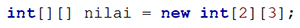
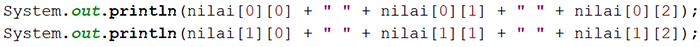
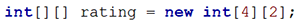
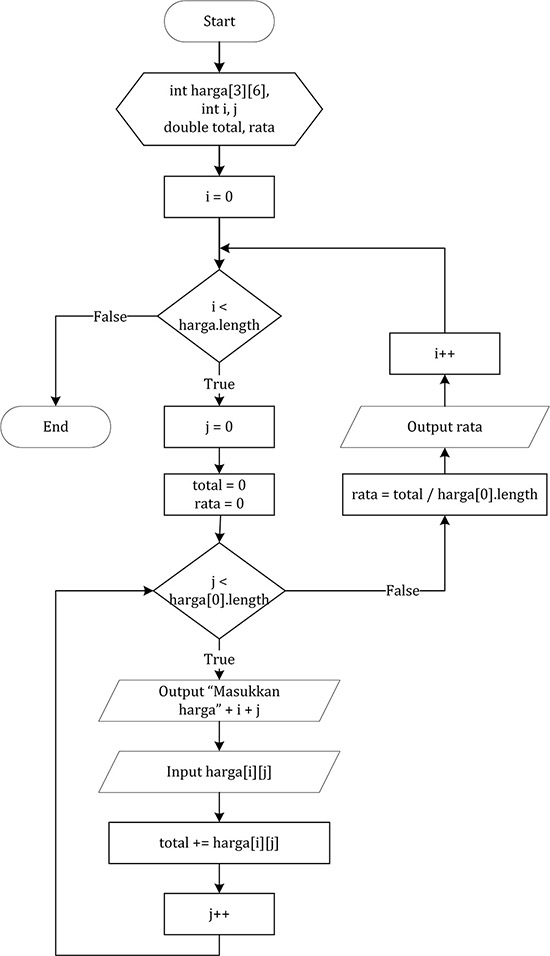

# JOBSHEET 11. ARRAY 2

## Tujuan
* Mahasiswa mampu memahami pembuatan array dua dimensi
* Mahasiswa mampu menyelesaikan studi kasus dengan memanfaatkan array dua dimensi

## Alat dan Bahan
* PC/Laptop
* Browser
* Koneksi internet
* Anaconda3 + Java kernel (opsional)

## Praktikum

### Percobaan 1: Deklarasi, Inisialisasi, dan Menampilkan Array 2 Dimensi
Pada Percobaan 1, kode program yang dibuat digunakan untuk menyimpan nilai praktikum dari 2 orang mahasiswa pada 3 mata kuliah yang berbeda.
1.	Buat array bertipe **integer** dengan nama **nilai** dengan kapasitas baris 2 elemen (menyatakan jumlah mahasiswa) dan kolom 3 elemen (menyatakan jumlah mata kuliah)



```Java
// Tuliskan kode program Percobaan 1 Langkah 1
int[][]nilai=new int[2][3]; // Membuat Array dan Scanner
```

2. Isi masing-masing elemen array **nilai** sebagai berikut:


```Java
// Tuliskan kode program Percobaan 1 Langkah 2
nilai [0][0]=75;//Deklarasi array
nilai [0][1]=90;//Deklarasi array
nilai [0][2]=88;//Deklarasi array
nilai [1][0]=79;//Deklarasi array
nilai [1][1]=82;//Deklarasi array
nilai [1][2]=67;//Deklarasi array
```


    67


3. Tampilkan semua isi elemen array **nilai**



```Java
// Tuliskan kode program Percobaan 1 Langkah 2
System.out.println(nilai[0][0]+""+nilai[0][1]+""+nilai[0][2]);//Menampilkan array
System.out.println(nilai[1][0]+""+nilai[1][1]+""+nilai[1][2]);//Menampilkan array
```

    759088
    798267


#### Pertanyaan
1. Apakah pengisian elemen array harus dilakukan secara berurutan mulai dari indeks 0? Jelaskan!

// Tuliskan jawaban nomor 1
Iya, karena 0 sebagai awalan dari index atas sebuah array pada dasarnya lebih logis dibanding angka 1.

2. Lakukan modifikasi pada Percobaan 1 Langkah 3 untuk menampilkan semua isi elemen array **nilai** menggunakan perulangan *for*


```Java
// Tuliskan jawaban nomor 2
for (int i=0; i<2; i++){
    for (int j=0; j<3; j++){
        System.out.print(nilai[i][j] +" ");// menampilkan isi Array
    }
    System.out.println(" ");// menampilkan isi Array
}
```

    75 90 88  
    79 82 67  


### Percobaan 2: Mengisi Elemen Array 2 Dimensi Menggunakan Input Keyboard
Pada Percobaan 2, kode program yang dibuat digunakan untuk menyimpan nilai rating restoran yang terdaftar pada aplikasi pemesanan makanan online. Rating diberikan oleh 4 orang pengguna kepada 2 restoran yang terdaftar.
1. Import dan deklarasikan Scanner dengan nama **sc**


```Java
// Tuliskan kode program Percobaan 2 Langkah 1
import java.util.Scanner;
Scanner sc=new Scanner(System.in);
```

2.	Buat array bertipe **integer** dengan nama **rating** dengan kapasitas baris 4 elemen (menyatakan jumlah pengguna) dan kolom 2 elemen (menyatakan jumlah restoran)



```Java
// Tuliskan kode program Percobaan 2 Langkah 2
int [][] rating=new int [4][2]; //Membuat Array dan Scanner
```

3. Dengan menggunakan perulangan *for*, buat input untuk mengisi elemen array **rating**


```Java
// Tuliskan kode program Percobaan 2 Langkah 3
for (int i=0; i<rating.length; i++){
    for (int j=0; j<rating[0].length; j++){
        System.out.print("Masukkan rating pengguna "+i+"untuk restoran "+j+":");// menampilkan isi Array
        rating[i][j]=sc.nextInt();
    }
    System.out.println("");// menampilkan isi Array
}
```

    Masukkan rating pengguna 0untuk restoran 0:9
    Masukkan rating pengguna 0untuk restoran 1:8
    
    Masukkan rating pengguna 1untuk restoran 0:9
    Masukkan rating pengguna 1untuk restoran 1:7
    
    Masukkan rating pengguna 2untuk restoran 0:8
    Masukkan rating pengguna 2untuk restoran 1:9
    
    Masukkan rating pengguna 3untuk restoran 0:8
    Masukkan rating pengguna 3untuk restoran 1:9
    


4. Dengan menggunakan perulangan *for-each*, tampilkan semua isi elemen dari array **rating**


```Java
// Tuliskan kode program Percobaan 2 Langkah 4
for(int[]rtg:rating){
    for(int r:rtg){
        System.out.print(r+"");
    }
    System.out.println("");// menampilkan isi Array
}
```

    98
    97
    89
    89


#### Pertanyaan
1. Pada Percobaan 2 Langkah 3, dapatkah posisi i ditukar dengan posisi j? Jelaskan alasannya!


```Java
// Tuliskan jawaban nomor 1
for(int i = 0; i < rating.length; i++) {
    for(int j = 0; j < rating[0].length; j++) {
        System.out.print("Masukkan rating pengguna " + j + " untuk restoran " + i + " : ");
        rating[j][i] = sc.nextInt();
    }
}
```

    Masukkan rating pengguna 0 untuk restoran 0 : 8
    Masukkan rating pengguna 1 untuk restoran 0 : 9
    Masukkan rating pengguna 0 untuk restoran 1 : 8
    Masukkan rating pengguna 1 untuk restoran 1 : 7
    Masukkan rating pengguna 0 untuk restoran 2 : 8


    ---------------------------------------------------------------------------

    java.lang.ArrayIndexOutOfBoundsException: Index 2 out of bounds for length 2

    	at .(#28:5)


2. Tambahkan kode program untuk menentukan banyaknya baris dan kolom elemen array secara dinamis (baris dan kolom ditentukan saat program berjalan melalui input keyboard)!

Eror, karena ada data pada indeks tertentu tidak ada.


```Java
// Tuliskan jawaban nomor 2
System.out.print("Masukkan jumlah kolom: ");
int kolom = sc.nextInt();
System.out.print("Masukkan jumlah baris: ");
int baris = sc.nextInt();
int[][] rating = new int[kolom][baris];
```

    Masukkan jumlah kolom: 15
    Masukkan jumlah baris: 3


### Percobaan 3: Melakukan Operasi Aritmatika pada Elemen Array 2 Dimensi
Pada Percobaan 3, kode program yang dibuat digunakan untuk menghitung nilai rata-rata harga setiap bahan pokok selama 1 semester. Terdapat 3 bahan pokok yang dicatat harganya setiap akhir bulan. Program dibuat berdasarkan flowchart berikut.

1. Import dan deklarasikan Scanner dengan nama **sc**


```Java
// Tuliskan kode program Percobaan 3 Langkah 1
import java.util.Scanner;
Scanner sc=new Scanner(System.in);
```

2.	Buat array bertipe **integer** dengan nama **harga** dengan kapasitas baris 3 elemen (menyatakan jumlah bahan pokok) dan kolom 6 elemen (menyatakan jumlah bulan). Deklarasikan juga variabel **total** dan **rata** bertipe **double**


```Java
// Tuliskan kode program Percobaan 3 Langkah 2
int [][] harga=new int [2][2];
double total, rata;
```

3. Dengan menggunakan perulangan *for*, buat input untuk mengisi elemen array **harga**. Kemudian, perhitungan total harga dilakukan untuk setiap bulan (kolom) pada setiap bahan pokok (baris). Setelah itu, nilai rata-rata dihitung untuk setiap bahan pokok (tiap satu baris) dan ditampilkan


```Java
// Tuliskan kode program Percobaan 3 Langkah 3
for(int i=0;i<harga.length;i++){
    total=0;
    rata=0;
    for(int j=0;j<harga[0].length;j++){
        harga[i][j]=sc.nextInt();
        total+=harga[i][j];
    }
    rata=total/harga[0].length;
    System.out.printf("Rata-rata harga bahan ke%d adalah %.2f\n",i,rata);
}
```

    4000
    5000
    Rata-rata harga bahan ke0 adalah 4500.00
    10000
    10000
    Rata-rata harga bahan ke1 adalah 10000.00


#### Pertanyaan
1. Jelaskan fungsi dari **rata = total / harga[0].length**!

// Tuliskan jawaban nomor 1
 Menghitung rata-rata

2. Mengapa insialisasi variabel **total = 0** dan **rata = 0** berada di dalam perulangan *for* yang pertama? Menurut Anda, apa yang terjadi jika inisialisasi kedua variabel tersebut diletakkan di luar perulangan *for* (setelah deklarasi array)?

// Tuliskan jawaban nomor 2
Setiap perulangan ke 6 akan mengulang lagi hingga 3 kali.

## Tugas

1. Perhatikan flowchart berikut.

Buat kode program sesuai dengan flowchart tersebut untuk mencari suhu tertinggi yang dicatat dari 5 kota di Jepang selama 7 hari berturut-turut!


```Java
// Tuliskan jawaban nomor 1
import java.util.Scanner;
Scanner sc = new Scanner(System.in);

double[][] suhu = new double[5][7]; // Membuat Array dan Scanner
double max = 0;

for(int x = 0; x < suhu.length; x++) {
    for(int y = 0; y < suhu[0].length; y++) {
        System.out.print("Input suhu: "); // menampilkan perintah Input suhu:
        suhu[x][y] = sc.nextDouble();
        if(suhu[x][y] > max) max = suhu[x][y]; // Mengubah nilai variabel dengan data tertinggi
    }
}

System.out.println("Suhu tertinggi = " + max);
```

    Input suhu: 12
    Input suhu: 12
    Input suhu: 11
    Input suhu: 12
    Input suhu: 12
    Input suhu: 11
    Input suhu: 10
    Input suhu: 9
    Input suhu: 8
    Input suhu: 8
    Input suhu: 7
    Input suhu: 6
    Input suhu: 6
    Input suhu: 5
    Input suhu: 6
    Input suhu: 5
    Input suhu: 6
    Input suhu: 5
    Input suhu: 6
    Input suhu: 5
    Input suhu: 6
    Input suhu: 5
    Input suhu: 6
    Input suhu: 7
    Input suhu: 8
    Input suhu: 9
    Input suhu: 10
    Input suhu: 10
    Input suhu: 11
    Input suhu: 12
    Input suhu: 13
    Input suhu: 12
    Input suhu: 12
    Input suhu: 12
    Input suhu: 12
    Suhu tertinggi = 13.0


# 2. Terdapat hasil pencatatan data lima mahasiswa yang berisi informasi mengenai umur, berat badan (kg), dan tinggi badan (cm). Data tersebut disimpan ke dalam array dua dimensi.

*Keterangan: penyimpanan nilai dapat dilakukan melalui inisialisasi menggunakan operator assignment*
 * Tampilkan *berat badan terendah* di antara kelima mahasiswa tersebut
 * Tampilkan *rata-rata tinggi badan* dari kelima mahasiswa tersebut
 * Tampilkan nama mahasiswa dengan *umur tertua* di antara kelima mahasiswa tersebut


```Java
// Tuliskan jawaban nomor 2
import java.util.Scanner;
Scanner sc=new Scanner(System.in);

int[][] dataMahasiswa = {{19,51,155}, {18,55,163}, {18,45,153}, {20,46,158}, {19,58,160}};
int terendah = dataMahasiswa[0][1]; 
int tertua = dataMahasiswa[0][0];
int totalTinggi = 0;
int mahasiswaTertua;
String[] namaMahasiswa = {"Desi", "Rofan", "Lala", "Beky", "Ega"};

for(int i = 0; i < dataMahasiswa.length; i++)
    for(int j = 0; j < dataMahasiswa[0].length; j++) {
        if(j == 1 && terendah > dataMahasiswa[i][j]) terendah = dataMahasiswa[i][j]; 
        else if(j == 2) totalTinggi += dataMahasiswa[i][j];
        else if(j == 0 && tertua < dataMahasiswa[i][j]) {
            mahasiswaTertua = i;
            tertua = dataMahasiswa[i][j]; 
        }
    }
System.out.println("=========================Informasi=========================");
System.out.println("Berat badan terendah di antara kelima mahasiswa tersebut : " + terendah);
System.out.println("Rata-rata tinggi badan dari kelima mahasiswa tersebut : " + ((double) totalTinggi/dataMahasiswa.length));
System.out.printf("Nama mahasiswa dengan umur tertua di antara kelima mahasiswa tersebut :"+ namaMahasiswa[mahasiswaTertua]);
```

    =========================Informasi=========================
    Berat badan terendah di antara kelima mahasiswa tersebut : 45
    Rata-rata tinggi badan dari kelima mahasiswa tersebut : 157.8
    Nama mahasiswa dengan umur tertua di antara kelima mahasiswa tersebut :Beky


    java.io.PrintStream@6a17235b


```Java

```
