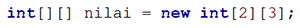

# JOBSHEET 11. ARRAY 2

## Tujuan
* Mahasiswa mampu memahami pembuatan array dua dimensi
* Mahasiswa mampu menyelesaikan studi kasus dengan memanfaatkan array dua dimensi

## Alat dan Bahan
* PC/Laptop
* Browser
* Koneksi internet
* Anaconda3 + Java kernel (opsional)

## Praktikum

### Percobaan 1: Deklarasi, Inisialisasi, dan Menampilkan Array 2 Dimensi
Pada Percobaan 1, kode program yang dibuat digunakan untuk menyimpan nilai praktikum dari 2 orang mahasiswa pada 3 mata kuliah yang berbeda.
1.	Buat array bertipe **integer** dengan nama **nilai** dengan kapasitas baris 2 elemen (menyatakan jumlah mahasiswa) dan kolom 3 elemen (menyatakan jumlah mata kuliah)



```Java
// Tuliskan kode program Percobaan 1 Langkah 1
int[][] nilai = new int[2] [3];
```

2. Isi masing-masing elemen array **nilai** sebagai berikut:


```Java
// Tuliskan kode program Percobaan 1 Langkah 2
nilai [0][0] = 75;
nilai [0][2] = 90;
nilai [0][1] = 88;
nilai [1][0] = 79;
nilai [1][1] = 82;
nilai [1][2] = 67;
```


    67


3. Tampilkan semua isi elemen array **nilai**


```Java
// Tuliskan kode program Percobaan 1 Langkah 2
System.out.println(nilai[0][0] + " " + nilai [0][1] + " " + nilai[0][2]);
System.out.println(nilai[1][0] + " " + nilai [1][1] + " " + nilai[1][2]);
```

    75 88 90
    79 82 67


#### Pertanyaan
1. Apakah pengisian elemen array harus dilakukan secara berurutan mulai dari indeks 0? Jelaskan!

// Tuliskan jawaban nomor 1

Tidak karena pengisian array bisa disesuaikan dengan kebutuhan kita, dimana kita bisa memilih indeks berapa yang akan kita isi dan yang kosong akan bernilai "0".

2. Lakukan modifikasi pada Percobaan 1 Langkah 3 untuk menampilkan semua isi elemen array **nilai** menggunakan perulangan *for*


```Java
// Tuliskan jawaban nomor 2
// Modifikasi menggunakan for
for (int x = 0; x < nilai.length; x++){
    for ( int y = 0; y < nilai[0].length; y++)
    {
        System.out.print(nilai[x][y] + " ");
    }
    System.out.println();
}
```

    75 88 90 
    79 82 67 


### Percobaan 2: Mengisi Elemen Array 2 Dimensi Menggunakan Input Keyboard
Pada Percobaan 2, kode program yang dibuat digunakan untuk menyimpan nilai rating restoran yang terdaftar pada aplikasi pemesanan makanan online. Rating diberikan oleh 4 orang pengguna kepada 2 restoran yang terdaftar.
1. Import dan deklarasikan Scanner dengan nama **sc**


```Java
// Tuliskan kode program Percobaan 2 Langkah 1
import java.util.Scanner;
Scanner in = new Scanner(System.in);
```

2.	Buat array bertipe **integer** dengan nama **rating** dengan kapasitas baris 4 elemen (menyatakan jumlah pengguna) dan kolom 2 elemen (menyatakan jumlah restoran)


```Java
// Tuliskan kode program Percobaan 2 Langkah 2
int[][] rating = new int[4][2];
```

3. Dengan menggunakan perulangan *for*, buat input untuk mengisi elemen array **rating**


```Java
// Tuliskan kode program Percobaan 2 Langkah 3
for (int i = 0; i < rating.length; i++) {
    for (int j = 0; j < rating[0].length; j++) {
        System.out.print("Masukan rating pengguna " + i + " untuk restoran " + j + " : ");
        rating[i][j] = in.nextInt();
    }
    System.out.println("");
}
```

    Masukan rating pengguna 0 untuk restoran 0 : 100
    Masukan rating pengguna 0 untuk restoran 1 : 90
    
    Masukan rating pengguna 1 untuk restoran 0 : 90
    Masukan rating pengguna 1 untuk restoran 1 : 80
    
    Masukan rating pengguna 2 untuk restoran 0 : 80
    Masukan rating pengguna 2 untuk restoran 1 : 70
    
    Masukan rating pengguna 3 untuk restoran 0 : 70
    Masukan rating pengguna 3 untuk restoran 1 : 60
    


4. Dengan menggunakan perulangan *for-each*, tampilkan semua isi elemen dari array **rating**


```Java
// Tuliskan kode program Percobaan 2 Langkah 4
for (int[] rtg : rating) {
    for (int r: rtg) {
        System.out.print(r + " ");
    }
    System.out.println("");
}
```

    100 90 
    90 80 
    80 70 
    70 60 


#### Pertanyaan
1. Pada Percobaan 2 Langkah 3, dapatkah posisi i ditukar dengan posisi j? Jelaskan alasannya!

// Tuliskan jawaban nomor 1


Tidak, karena i pada awal merupakan baris array dan j adalah kolom.

2. Tambahkan kode program untuk menentukan banyaknya baris dan kolom elemen array secara dinamis (baris dan kolom ditentukan saat program berjalan melalui input keyboard)!


```Java
// Tuliskan jawaban nomor 2
import java.util.Scanner;
Scanner in = new Scanner(System.in); 

System.out.print("Masukkan panjang baris array: ");
int a = in.nextInt();

System.out.print("Masukkan panjang kolom array: ");
int b = in.nextInt();
int[][] rating = new int[a][b];

for (int i=0; i<rating.length; i++){ 
    for (int j=0; j<rating[0].length; j++){ 
        System.out.print("Masukkan rating pengguna "+ i + " untuk restoran " + j + " : "); 
        rating[i][j] = in.nextInt(); 
    }
    System.out.println("");
}
```

    Masukkan panjang baris array: 4
    Masukkan panjang kolom array: 2
    Masukkan rating pengguna 0 untuk restoran 0 : 100
    Masukkan rating pengguna 0 untuk restoran 1 : 90
    
    Masukkan rating pengguna 1 untuk restoran 0 : 90
    Masukkan rating pengguna 1 untuk restoran 1 : 80
    
    Masukkan rating pengguna 2 untuk restoran 0 : 80
    Masukkan rating pengguna 2 untuk restoran 1 : 70
    
    Masukkan rating pengguna 3 untuk restoran 0 : 70
    Masukkan rating pengguna 3 untuk restoran 1 : 60
    


### Percobaan 3: Melakukan Operasi Aritmatika pada Elemen Array 2 Dimensi
Pada Percobaan 3, kode program yang dibuat digunakan untuk menghitung nilai rata-rata harga setiap bahan pokok selama 1 semester. Terdapat 3 bahan pokok yang dicatat harganya setiap akhir bulan. Program dibuat berdasarkan flowchart berikut.

1. Import dan deklarasikan Scanner dengan nama **sc**


```Java
// Tuliskan kode program Percobaan 3 Langkah 1
import java.util.Scanner;
Scanner scan = new Scanner(System.in);
```

2.	Buat array bertipe **integer** dengan nama **harga** dengan kapasitas baris 3 elemen (menyatakan jumlah bahan pokok) dan kolom 6 elemen (menyatakan jumlah bulan). Deklarasikan juga variabel **total** dan **rata** bertipe **double**


```Java
// Tuliskan kode program Percobaan 3 Langkah 2
int[][] harga = new int[2][2];
double total, rata;
```

3. Dengan menggunakan perulangan *for*, buat input untuk mengisi elemen array **harga**. Kemudian, perhitungan total harga dilakukan untuk setiap bulan (kolom) pada setiap bahan pokok (baris). Setelah itu, nilai rata-rata dihitung untuk setiap bahan pokok (tiap satu baris) dan ditampilkan


```Java
// Tuliskan kode program Percobaan 3 Langkah 3
for (int i = 0; i < harga.length; i++) {
    total = 0;
    rata = 0;
    for (int j = 0; j < harga[0].length; j++) {
        System.out.printf("Masukan harga [%d][%d]: ", i, j);
        harga[i][j] = scan.nextInt();
        total += harga[i][j];
    }
    rata = total / harga[0].length;
    System.out.printf("Rata-rata harga bahan ke-%d adalah %.2f\n", i, rata);
}
```

    Masukan harga [0][0]: 100000
    Masukan harga [0][1]: 50000
    Rata-rata harga bahan ke-0 adalah 75000.00
    Masukan harga [1][0]: 10000
    Masukan harga [1][1]: 5000
    Rata-rata harga bahan ke-1 adalah 7500.00


#### Pertanyaan
1. Jelaskan fungsi dari **rata = total / harga[0].length**!

// Tuliskan jawaban nomor 1

menghitung rata rata dimana hasil rata-rata didapat dari hasil bagi total dari seluruh harga yang disimpan dalam suatu kolom dam dibagi dengan jumlah length dari harga.

2. Mengapa insialisasi variabel **total = 0** dan **rata = 0** berada di dalam perulangan *for* yang pertama? Menurut Anda, apa yang terjadi jika inisialisasi kedua variabel tersebut diletakkan di luar perulangan *for* (setelah deklarasi array)?

// Tuliskan jawaban nomor 2

Inisialisasi variabel yang diperlukan didalam perulangan harus dilakukan di perulangan yang terluar karena nantinya nilai variabel diperlulan kembali jika kode proram masih berjalany dalam rangkaian perulangan.
Jika variabel diinisialisasi diluar perulangan nilainya hanya bisa diakses rangkaian perulangan satu kali saat melakukan looping ke2 atau selanjutnya hasilnya akan salah atau mungkin saja eror.


## Tugas

1. Perhatikan flowchart berikut.

Buat kode program sesuai dengan flowchart tersebut untuk mencari suhu tertinggi yang dicatat dari 5 kota di Jepang selama 7 hari berturut-turut!


```Java
// Tuliskan jawaban nomor 1
import java.util.Scanner;
Scanner sc = new Scanner(System.in);

double[][] suhu = new double [5][7]; //inisialisasi array 2D untuk suhu

double max=0; //deklarasi variabel max bernilai 0
int x,y;

for(x=0; x<suhu.length; x++){ //outer 
    for(y=0; y<suhu[0].length; y++){ //inner
        System.out.printf("Masukkan suhu kota ke %d hari ke %d : " ,(x+1),(y+1));
        suhu[x][y] = sc.nextDouble(); //inputan array suhu
        if(suhu[x][y]>max){ 
            max = suhu[x][y]; //jika suhu > max maka akan disimpan sebagai nilai max 
        }
    }
    System.out.println();
}
System.out.print("Suhu tertinggi dari 5 kota di Jepang selama 7 hari berturut-turut adalah "+ max); //cetak
```

    Masukkan suhu kota ke 1 hari ke 1 : 30
    Masukkan suhu kota ke 1 hari ke 2 : 40
    Masukkan suhu kota ke 1 hari ke 3 : 35
    Masukkan suhu kota ke 1 hari ke 4 : 27
    Masukkan suhu kota ke 1 hari ke 5 : 45
    Masukkan suhu kota ke 1 hari ke 6 : 37
    Masukkan suhu kota ke 1 hari ke 7 : 30
    
    Masukkan suhu kota ke 2 hari ke 1 : 30
    Masukkan suhu kota ke 2 hari ke 2 : 32
    Masukkan suhu kota ke 2 hari ke 3 : 35
    Masukkan suhu kota ke 2 hari ke 4 : 30
    Masukkan suhu kota ke 2 hari ke 5 : 37
    Masukkan suhu kota ke 2 hari ke 6 : 40
    Masukkan suhu kota ke 2 hari ke 7 : 35
    
    Masukkan suhu kota ke 3 hari ke 1 : 29
    Masukkan suhu kota ke 3 hari ke 2 : 30
    Masukkan suhu kota ke 3 hari ke 3 : 35
    Masukkan suhu kota ke 3 hari ke 4 : 27
    Masukkan suhu kota ke 3 hari ke 5 : 40
    Masukkan suhu kota ke 3 hari ke 6 : 39
    Masukkan suhu kota ke 3 hari ke 7 : 36
    
    Masukkan suhu kota ke 4 hari ke 1 : 40
    Masukkan suhu kota ke 4 hari ke 2 : 40
    Masukkan suhu kota ke 4 hari ke 3 : 35
    Masukkan suhu kota ke 4 hari ke 4 : 30
    Masukkan suhu kota ke 4 hari ke 5 : 25
    Masukkan suhu kota ke 4 hari ke 6 : 29
    Masukkan suhu kota ke 4 hari ke 7 : 35
    
    Masukkan suhu kota ke 5 hari ke 1 : 30
    Masukkan suhu kota ke 5 hari ke 2 : 39
    Masukkan suhu kota ke 5 hari ke 3 : 39
    Masukkan suhu kota ke 5 hari ke 4 : 31
    Masukkan suhu kota ke 5 hari ke 5 : 35
    Masukkan suhu kota ke 5 hari ke 6 : 33
    Masukkan suhu kota ke 5 hari ke 7 : 37
    
    Suhu tertinggi dari 5 kota di Jepang selama 7 hari berturut-turut adalah 45.0

#### 2. Terdapat hasil pencatatan data lima mahasiswa yang berisi informasi mengenai umur, berat badan (kg), dan tinggi badan (cm). Data tersebut disimpan ke dalam array dua dimensi.

*Keterangan: penyimpanan nilai dapat dilakukan melalui inisialisasi menggunakan operator assignment*
 * Tampilkan *berat badan terendah* di antara kelima mahasiswa tersebut
 * Tampilkan *rata-rata tinggi badan* dari kelima mahasiswa tersebut
 * Tampilkan nama mahasiswa dengan *umur tertua* di antara kelima mahasiswa tersebut


```Java
// Tuliskan jawaban nomor 2
int[][] dataFisik = {{19,51,155}, //inisialisasi array berserta isinya 
                     {18,55,163},
                     {18,45,153},
                     {20,46,158},
                     {19,58,160}};

String[] nama = {"Desi","Rofan","Lala","Beky","Ega"}; //inisialisasi array nama berserta isinya 

//PROGRAM HITUNG BERAT BADAN TERENDAH
int berat_terendah = dataFisik[0][1]; 

    for(int i = 0; i < dataFisik.length; i++)
        for(int j = 0; j < dataFisik[0].length; j++) {
            if(j == 1 && berat_terendah > dataFisik[i][j]) {
                berat_terendah = dataFisik[i][j];
            } 
        }
        
System.out.println("Mahasiswa dengan berat badan terendah adalah " + berat_terendah);
//cetak


//PROGRAM HITUNG RATA RATA TINGGI MAHASISWA
int tinggi_mhs = 0;

    for(int i = 0; i < dataFisik.length; i++)
        for(int j = 0; j < dataFisik[0].length; j++) {
            if(j == 2) {
                tinggi_mhs += dataFisik[i][j];
            } 
        }

System.out.println("Rata-rata tinggi badan para mahasiswa adalah " + ((double) tinggi_mhs/dataFisik.length));
//cetak


//PROGRAM HITUNG UMUR MAHASISWA TERTUA
int namaMhs_tertua = dataFisik[0][0];
int mahasiswa_tertua;

    for(int i = 0; i < dataFisik.length; i++)
        for(int j = 0; j < dataFisik[0].length; j++) {
            if(j == 0 && namaMhs_tertua < dataFisik[i][j]) {
                mahasiswa_tertua = i;
                namaMhs_tertua = dataFisik[i][j];
            } 
        }

System.out.printf("Mahasiswa dengan umur tertua bernama %s yang berumur umur %d", nama[mahasiswa_tertua], namaMhs_tertua );
//cetak
```

    Mahasiswa dengan berat badan terendah adalah 45
    Rata-rata tinggi badan para mahasiswa adalah 157.8
    Mahasiswa dengan umur tertua bernama Beky yang berumur umur 20


    java.io.PrintStream@68a2559f


```Java

```
