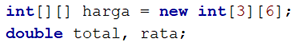

# JOBSHEET 11. ARRAY 2

## Tujuan
* Mahasiswa mampu memahami pembuatan array dua dimensi
* Mahasiswa mampu menyelesaikan studi kasus dengan memanfaatkan array dua dimensi

## Alat dan Bahan
* PC/Laptop
* Browser
* Koneksi internet
* Anaconda3 + Java kernel (opsional)

## Praktikum

### Percobaan 1: Deklarasi, Inisialisasi, dan Menampilkan Array 2 Dimensi
Pada Percobaan 1, kode program yang dibuat digunakan untuk menyimpan nilai praktikum dari 2 orang mahasiswa pada 3 mata kuliah yang berbeda.
1.	Buat array bertipe **integer** dengan nama **nilai** dengan kapasitas baris 2 elemen (menyatakan jumlah mahasiswa) dan kolom 3 elemen (menyatakan jumlah mata kuliah)


```Java
// Tuliskan kode program Percobaan 1 Langkah 1
int[][] nilai = new int[2][3]; //instansiasi array nilai bertipe interger dengan baris berjumlah 2 dan kolom berjumlah 3
```

2. Isi masing-masing elemen array **nilai** sebagai berikut:


```Java
// Tuliskan kode program Percobaan 1 Langkah 2
nilai[0][0] = 75;
nilai[0][1] = 90;
nilai[0][2] = 88;
nilai[1][0] = 79;
nilai[1][1] = 82;
nilai[1][2] = 67; //pengisian elemen array nilai
```


    67


3. Tampilkan semua isi elemen array **nilai**


```Java
// Tuliskan kode program Percobaan 1 Langkah 2
System.out.println(nilai[0][0] + " " + nilai[0][1] + " " + nilai [0][2]); 
System.out.println(nilai[1][0] + " " + nilai[1][1] + " " + nilai [1][2]); //menampilkan semua isi elemen array nilai
```

    75 90 88
    79 82 67


#### Pertanyaan
1. Apakah pengisian elemen array harus dilakukan secara berurutan mulai dari indeks 0? Jelaskan!

// Tuliskan jawaban nomor 1
- Tidak harus berurutan karena pengisian elemen array bisa dilakukan dengan mengakses indeks elemen yang akan diisi

2. Lakukan modifikasi pada Percobaan 1 Langkah 3 untuk menampilkan semua isi elemen array **nilai** menggunakan perulangan *for*


```Java
// Tuliskan jawaban nomor 2
for(int i=0; i<nilai.length; i++){
    for(int j=0; j<nilai[0].length; j++){
        System.out.print(nilai[i][j] + " ");
    }
    System.out.println();
}
```

    75 90 88 
    79 82 67 


### Percobaan 2: Mengisi Elemen Array 2 Dimensi Menggunakan Input Keyboard
Pada Percobaan 2, kode program yang dibuat digunakan untuk menyimpan nilai rating restoran yang terdaftar pada aplikasi pemesanan makanan online. Rating diberikan oleh 4 orang pengguna kepada 2 restoran yang terdaftar.
1. Import dan deklarasikan Scanner dengan nama **sc**


```Java
// Tuliskan kode program Percobaan 2 Langkah 1
import java.util.Scanner;
Scanner sc = new Scanner(System.in); //import dan deklarasi scanner
```

2.	Buat array bertipe **integer** dengan nama **rating** dengan kapasitas baris 4 elemen (menyatakan jumlah pengguna) dan kolom 2 elemen (menyatakan jumlah restoran)


```Java
// Tuliskan kode program Percobaan 2 Langkah 2
int[][] rating = new int[4][2]; //instansiasi array rating bertipe interger dengan baris berjumlah 4 dan kolom berjumlah 2
```

3. Dengan menggunakan perulangan *for*, buat input untuk mengisi elemen array **rating**


```Java
// Tuliskan kode program Percobaan 2 Langkah 3
for (int j=0; j<rating.length; j++){ //outer loop sebanyak panjang baris array rating
    for (int i=0; i<rating[0].length; i++){ //inner loop sebanyak panjang kolom array rating
        System.out.print("Masukkan rating pengguna "+ j + " untuk restoran " + i + " : "); //menampilkan tulisan dalam array beserta indeks i dan j
        rating[j][i] = sc.nextInt(); //inputan dimasukkan dalam array rating
    }
    System.out.println("");
}
```

    Masukkan rating pengguna 0 untuk restoran 0 : 1
    Masukkan rating pengguna 0 untuk restoran 1 : 2
    Masukkan rating pengguna 0 untuk restoran 2 : 3
    
    Masukkan rating pengguna 1 untuk restoran 0 : 4
    Masukkan rating pengguna 1 untuk restoran 1 : 5
    Masukkan rating pengguna 1 untuk restoran 2 : 6
    


 4. Dengan menggunakan perulangan *for-each*, tampilkan semua isi elemen dari array **rating**


```Java
// Tuliskan kode program Percobaan 2 Langkah 4
for (int[] rtg : rating){ //outer loop. mengurai array 2 dimensi
    for (int r: rtg){ //inner loop. mengurai elemen
        System.out.print(r + " "); //menampilkan isi elemen array rating
    }
    System.out.println(""); //ganti baris setiap inner loop selesai dieksekusi
}
```

    1 3 
    2 4 
    0 0 
    0 0 


#### Pertanyaan
1. Pada Percobaan 2 Langkah 3, dapatkah posisi i ditukar dengan posisi i? Jelaskan alasannya!

// Tuliskan jawaban nomor 1
- Bisa, karena i dan j hanyalah nama dari sebuah variabel

2. Tambahkan kode program untuk menentukan banyaknya baris dan kolom elemen array secara dinamis (baris dan kolom ditentukan saat program berjalan melalui input keyboard)!


```Java
// Tuliskan jawaban nomor 2
import java.util.Scanner;
Scanner sc = new Scanner(System.in); 

System.out.print("Masukkan panjang baris array: ");
int x = sc.nextInt();
System.out.print("Masukkan panjang kolom array: ");
int y = sc.nextInt();
int[][] rating = new int[x][y];

for (int i=0; i<rating.length; i++){ 
    for (int j=0; j<rating[0].length; j++){ 
        System.out.print("Masukkan rating pengguna "+ i + " untuk restoran " + j + " : "); 
        rating[i][j] = sc.nextInt(); 
    }
    System.out.println("");
}
```

    Masukkan panjang baris array: 2
    Masukkan panjang kolom array: 3
    Masukkan rating pengguna 0 untuk restoran 0 : 1
    Masukkan rating pengguna 0 untuk restoran 1 : 2
    Masukkan rating pengguna 0 untuk restoran 2 : 3
    
    Masukkan rating pengguna 1 untuk restoran 0 : 4
    Masukkan rating pengguna 1 untuk restoran 1 : 5
    Masukkan rating pengguna 1 untuk restoran 2 : 6
    


### Percobaan 3: Melakukan Operasi Aritmatika pada Elemen Array 2 Dimensi
Pada Percobaan 3, kode program yang dibuat digunakan untuk menghitung nilai rata-rata harga setiap bahan pokok selama 1 satu semester. Terdapat 3 bahan pokok yang dicatat harganya setiap akhir bulan. Program dibuat berdasarkan flowchart berikut.

1. Import dan deklarasikan Scanner dengan nama **sc**


```Java
// Tuliskan kode program Percobaan 3 Langkah 1
import java.util.Scanner;
Scanner sc = new Scanner(System.in); //import dan deklarasi scanner dgn nama sc
```

2.	Buat array bertipe **integer** dengan nama **harga** dengan kapasitas baris 3 elemen (menyatakan jumlah bahan pokok) dan kolom 6 elemen (menyatakan jumlah bulan). Deklarasikan juga variabel **total** dan **rata** bertipe **double**



```Java
// Tuliskan kode program Percobaan 3 Langkah 2
int[][] harga = new int[3][6]; //instansiasi array harga bertipe interger dengan baris berjumlah 3 dan kolom berjumlah 6
double total, rata; //deklarasi variabel total dan rata bertipe double
```

3. Dengan menggunakan perulangan *for*, buat input untuk mengisi elemen array **harga**. Kemudian, perhitungan total harga dilakukan untuk setiap bulan (kolom) pada setiap bahan pokok (baris). Setelah itu, nilai rata-rata dihitung untuk setiap bahan pokok (tiap satu baris) dan ditampilkan


```Java
// Tuliskan kode program Percobaan 3 Langkah 3
for (int i=0; i<harga.length; i++){ //outer loop. looping sebanyak panjang baris array harga
    total=0; //variabel total diberi nilai 0
    rata=0; //variabel rata diberi nilai 0
    for (int j=0; j<harga[0].length; j++){ //inner loop. looping sebanyak panjang kolom array harga
        System.out.printf("Masukkan harga[%d][%d]: ", i, j); 
        harga[i][j] = sc.nextInt(); //inputan dimasukkan ke dalam array harga
        total += harga[i][j]; //nilai dalam variabel total ditambah dengan nilai dalam array harga
    }
    rata = total / harga[0].length; //menghitung nilai dalam variabel rata dengan cara nilai dalam variabel total dibagi dengan panjang kolom array harga
    System.out.printf("Rata-rata harga bahan ke-%d adalah %.2f\n", i, rata);
}
```

    Masukkan harga[0][0]: 1000
    Masukkan harga[0][1]: 1000
    Masukkan harga[0][2]: 4000
    Masukkan harga[0][3]: 500
    Masukkan harga[0][4]: 2000
    Masukkan harga[0][5]: 100
    Rata-rata harga bahan ke-0 adalah 1433.33
    Masukkan harga[1][0]: 300
    Masukkan harga[1][1]: 2300
    Masukkan harga[1][2]: 6500
    Masukkan harga[1][3]: 300
    Masukkan harga[1][4]: 2500
    Masukkan harga[1][5]: 1900
    Rata-rata harga bahan ke-1 adalah 2300.00
    Masukkan harga[2][0]: 3000
    Masukkan harga[2][1]: 2900
    Masukkan harga[2][2]: 300
    Masukkan harga[2][3]: 200
    Masukkan harga[2][4]: 100
    Masukkan harga[2][5]: 2900
    Rata-rata harga bahan ke-2 adalah 1566.67


#### Pertanyaan
1. Jelaskan fungsi dari **rata = total / harga[0].length**!

// Tuliskan jawaban nomor 1
- menghitung nilai dalam variabel rata yaitu dengan cara total dibagi dengan panjang kolom array harga 

2. Mengapa insialisasi variabel **total = 0** dan **rata = 0** berada di dalam perulangan *for* yang pertama? Menurut Anda, apa yang terjadi jika inisialisasi kedua variabel tersebut diletakkan di luar perulangan *for* (setelah deklarasi array)?

// Tuliskan jawaban nomor 2
- untuk mereset variabel total dan rata pada setiap bahan. Jika inisialisasi diletakkan di luar perulangan for, maka saat menghitung total dan rerata pada bahan ke2 dan ke3, variabel total dan rata sudah terisi nilai dari bahan 1

## Tugas

1. Perhatikan flowchart berikut.

Buat kode program sesuai dengan flowchart tersebut untuk mencari suhu tertinggi yang dicatat dari 5 kota di Jepang selama 7 hari berturut-turut!


```Java
// Tuliskan jawaban nomor 1
import java.util.Scanner;
Scanner sc = new Scanner(System.in);

double[][] suhu = new double [5][7]; //inisialisasi array suhu bertipe double dengan jumlah 5 baris dan 7 kolom
int x,y;
double max=0; //deklarasi variabel max=0

for(x=0; x<suhu.length; x++){ //outer loop. looping setiap baris
    for(y=0; y<suhu[0].length; y++){ //inner loop. looping setiap kolom
        System.out.print("Masukkan suhu kota " +(x+1) +" hari ke " +(y+1) + " : ");
        suhu[x][y] = sc.nextDouble(); //inputan dimasukkan ke dalam array suhu
        if(suhu[x][y]>max){ 
            max = suhu[x][y]; //jika nilai inputan lebih besar dari nilai dalam variabel max maka inputan tersebut dimasukkan ke dalam variabel max
        }
    }
    System.out.println();
}
System.out.print("Suhu tertinggi dari 5 kota di Jepang selama 7 hari berturut-turut adalah "+ max); //menampilkan suhu tertinggi
```

    Masukkan suhu kota 1 hari ke 1 : 18
    Masukkan suhu kota 1 hari ke 2 : 27
    Masukkan suhu kota 1 hari ke 3 : 12
    Masukkan suhu kota 1 hari ke 4 : 22
    Masukkan suhu kota 1 hari ke 5 : 10
    Masukkan suhu kota 1 hari ke 6 : 19
    Masukkan suhu kota 1 hari ke 7 : 16
    
    Masukkan suhu kota 2 hari ke 1 : 18
    Masukkan suhu kota 2 hari ke 2 : 30
    Masukkan suhu kota 2 hari ke 3 : 33
    Masukkan suhu kota 2 hari ke 4 : 23
    Masukkan suhu kota 2 hari ke 5 : 26
    Masukkan suhu kota 2 hari ke 6 : 18
    Masukkan suhu kota 2 hari ke 7 : 30
    
    Masukkan suhu kota 3 hari ke 1 : 12
    Masukkan suhu kota 3 hari ke 2 : 13
    Masukkan suhu kota 3 hari ke 3 : 14
    Masukkan suhu kota 3 hari ke 4 : 15
    Masukkan suhu kota 3 hari ke 5 : 16
    Masukkan suhu kota 3 hari ke 6 : 8
    Masukkan suhu kota 3 hari ke 7 : 10
    
    Masukkan suhu kota 4 hari ke 1 : 33
    Masukkan suhu kota 4 hari ke 2 : 36
    Masukkan suhu kota 4 hari ke 3 : 26
    Masukkan suhu kota 4 hari ke 4 : 28
    Masukkan suhu kota 4 hari ke 5 : 18
    Masukkan suhu kota 4 hari ke 6 : 12
    Masukkan suhu kota 4 hari ke 7 : 16
    
    Masukkan suhu kota 5 hari ke 1 : 17
    Masukkan suhu kota 5 hari ke 2 : 14
    Masukkan suhu kota 5 hari ke 3 : 12
    Masukkan suhu kota 5 hari ke 4 : 10
    Masukkan suhu kota 5 hari ke 5 : 20
    Masukkan suhu kota 5 hari ke 6 : 22
    Masukkan suhu kota 5 hari ke 7 : 26
    
    Suhu tertinggi dari 5 kota di Jepang selama 7 hari berturut-turut adalah 36.0

2. Terdapat hasil pencatatan data lima mahasiswa yang berisi informasi mengenai umur, berat badan (kg), dan tinggi badan (cm). Data tersebut disimpan ke dalam array dua dimensi.

*Keterangan: penyimpanan nilai dapat dilakukan melalui inisialisasi menggunakan operator assignment*
 * Tampilkan *berat badan terendah* di antara kelima mahasiswa tersebut
 * Tampilkan *rata-rata tinggi badan* dari kelima mahasiswa tersebut
 * Tampilkan nama mahasiswa dengan *umur tertua* di antara kelima mahasiswa tersebut


```Java
// Tuliskan jawaban nomor 2
//inisialisasi array dataMhs beserta pengisian elemen 
int[][] dataMhs = {
    {19, 51, 155},
    {18, 55, 163},
    {18, 45, 153},
    {20, 46, 158},
    {19, 58, 160}
};

int i,j;
int minbb=100;
for(i=0; i<dataMhs.length; i++){ //outer loop. looping setiap baris
    for(j=0; j<dataMhs[1].length; j++){ //inner loop. looping kolom berindeks 1
        if(dataMhs[i][1] < minbb){
            minbb = dataMhs[i][1]; //jika nilai suatu elemen lebih kecil dari nilai dalam variabel min maka elemen tersebut dimasukkan ke dalam variabel min
        }
    }
}
System.out.print("Berat badan terendah dari kelima mahasiswa tersebut yaitu " + minbb);

double totaltb = 0;
double ratatb = 0;
for(i=0; i<dataMhs.length; i++){
    for(j=0; j<dataMhs[0].length; j++){ //inner loop. looping setiap kolom
    if(j == 2) //statement di bawah ini hanya akan dieksekusi jika kolom berindeks 2
        totaltb += dataMhs[i][j]; //menjumlahkan setiap data dalam kolom 2
    }
}
ratatb = totaltb / dataMhs.length; 
System.out.printf('\n' + "Total tinggi badan = " + totaltb);
System.out.print('\n'+ "Rerata tinggi badan dari kelima mahasiswa tersebut yaitu " + ratatb);

String[] nama = {"Desi", "Rofan", "Lala", "Beky", "Ega"}; //inisialisasi array nama

int indeks;
int tua=0;
for(i=0; i<dataMhs.length; i++){
    for(j=0; j<dataMhs[0].length; j++){
        if(dataMhs[i][0] > tua){
            tua = dataMhs[i][0]; //jika nilai suatu elemen lebih besar dari nilai dalam variabel tua maka elemen tersebut dimasukkan ke dalam variabel tua
            indeks = i; //memasukkan indeks baris yang elemennya masuk dalam variabel tua ke variabel indeks 
        }
    }
}
System.out.print('\n'+"Umur tertua dari kelima mahasiswa tersebut yaitu " +tua +" bernama " + nama[indeks]);
```

    Berat badan terendah dari kelima mahasiswa tersebut yaitu 45
    Total tinggi badan = 789.0
    Rerata tinggi badan dari kelima mahasiswa tersebut yaitu 157.8
    Umur tertua dari kelima mahasiswa tersebut yaitu 20 bernama Beky


```Java

```
