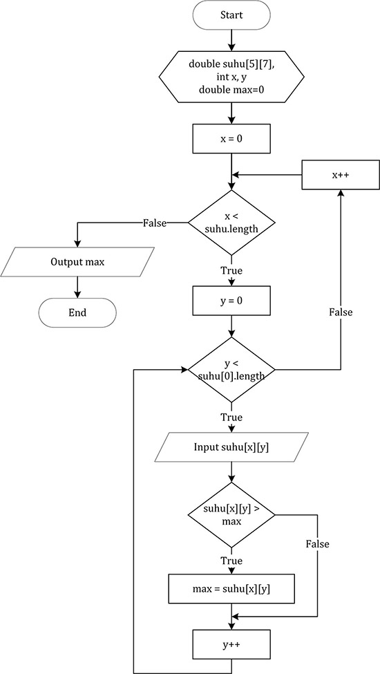

# JOBSHEET 11. ARRAY 2

## Tujuan
* Mahasiswa mampu memahami pembuatan array dua dimensi
* Mahasiswa mampu menyelesaikan studi kasus dengan memanfaatkan array dua dimensi

## Alat dan Bahan
* PC/Laptop
* Browser
* Koneksi internet
* Anaconda3 + Java kernel (opsional)

## Praktikum

### Percobaan 1: Deklarasi, Inisialisasi, dan Menampilkan Array 2 Dimensi
Pada Percobaan 1, kode program yang dibuat digunakan untuk menyimpan nilai praktikum dari 2 orang mahasiswa pada 3 mata kuliah yang berbeda.
1.	Buat array bertipe **integer** dengan nama **nilai** dengan kapasitas baris 2 elemen (menyatakan jumlah mahasiswa) dan kolom 3 elemen (menyatakan jumlah mata kuliah)


```Java
// Tuliskan kode program Percobaan 1 Langkah 1
int [][] nilai = new int [2][3] //mendeklarasikan array tipe int dengan 2 baris, 3 kolom
```

2. Isi masing-masing elemen array **nilai** sebagai berikut:


```Java
// Tuliskan kode program Percobaan 1 Langkah 2
nilai[0][0] = 75;
nilai[0][1] = 90;
nilai[0][2] = 88;
nilai[1][0] = 79;
nilai[1][1] = 82;
nilai[1][2] = 67; //mendeklarasikan tiap indeks array
```


    67


3. Tampilkan semua isi elemen array **nilai**


```Java
// Tuliskan kode program Percobaan 1 Langkah 2
System.out.println(nilai[0][0] + " " + nilai[0][1] + " " + nilai[0][2]);
System.out.println(nilai[1][0] + " " + nilai[1][1] + " " + nilai[1][2]); //untuk menampilkan semua data array nilai
```

    75 90 88
    79 82 67


#### Pertanyaan
1. Apakah pengisian elemen array harus dilakukan secara berurutan mulai dari indeks 0? Jelaskan!

// Tuliskan jawaban nomor 1:
 tidak harus urut, karena yang penting elemen array diisi dengan jelas sehingga mudah saat mengakses

2. Lakukan modifikasi pada Percobaan 1 Langkah 3 untuk menampilkan semua isi elemen array **nilai** menggunakan perulangan *for*


```Java
// Tuliskan jawaban nomor 2
for (int i=0; i<nilai.length; i++){  
    for (int j=0; j<nilai[0].length; j++){
        System.out.print(nilai [i][j] + " ");
    }System.out.println(" ");
}
```

    75 90 88  
    79 82 67  


### Percobaan 2: Mengisi Elemen Array 2 Dimensi Menggunakan Input Keyboard
Pada Percobaan 2, kode program yang dibuat digunakan untuk menyimpan nilai rating restoran yang terdaftar pada aplikasi pemesanan makanan online. Rating diberikan oleh 4 orang pengguna kepada 2 restoran yang terdaftar.
1. Import dan deklarasikan Scanner dengan nama **sc**


```Java
// Tuliskan kode program Percobaan 2 Langkah 1
import java.util.Scanner;
Scanner sc = new Scanner(System.in); //deklarasi library scanner
```

2.	Buat array bertipe **integer** dengan nama **rating** dengan kapasitas baris 4 elemen (menyatakan jumlah pengguna) dan kolom 2 elemen (menyatakan jumlah restoran)


```Java
// Tuliskan kode program Percobaan 2 Langkah 2
int[][] rating = new int[4][2]; //membuat array dengan nama rating dengan 4 baris, 2 kolom
```

3. Dengan menggunakan perulangan *for*, buat input untuk mengisi elemen array **rating**


```Java
// Tuliskan kode program Percobaan 2 Langkah 3
 //menuliskan perulangan for untuk menampilkan input untuk mengisi elemen array rating
for (int i=0; i<rating.length; i++) {     //outer loop panjang baris
    for (int j=0; j<rating[0].length; j++) {  //inner loop panjang kolom
        System.out.print("Masukkan rating pengguna " + i + " untuk restoran " + j + " : "); //menampilkan isi array
        rating[i][j] = sc.nextInt(); //nilai array sesuai dengan inputan pada rating
    }
    System.out.println("");
}
```

    Masukkan rating pengguna 0 untuk restoran 0 : 10
    Masukkan rating pengguna 0 untuk restoran 1 : 9
    
    Masukkan rating pengguna 1 untuk restoran 0 : 8
    Masukkan rating pengguna 1 untuk restoran 1 : 9
    
    Masukkan rating pengguna 2 untuk restoran 0 : 8
    Masukkan rating pengguna 2 untuk restoran 1 : 10
    
    Masukkan rating pengguna 3 untuk restoran 0 : 9
    Masukkan rating pengguna 3 untuk restoran 1 : 10
    


4. Dengan menggunakan perulangan *for-each*, tampilkan semua isi elemen dari array **rating**


```Java
// Tuliskan kode program Percobaan 2 Langkah 4
for (int[] rtg : rating) {  //outer loop baris
    for (int r: rtg) {  //inner loop kolom
        System.out.print(r + " "); //menampilkan isi array rating
    }
    System.out.println("");
}
```

    10 9 
    8 9 
    8 10 
    9 10 


#### Pertanyaan
1. Pada Percobaan 2 Langkah 3, dapatkah posisi i ditukar dengan posisi j? Jelaskan alasannya!

// Tuliskan jawaban nomor 1: 
bisa karena i dan j hanya inisialisasi variabel. karena nanti yang berpengaruh tergantung pada peletakan variabel pada kode program

2. Tambahkan kode program untuk menentukan banyaknya baris dan kolom elemen array secara dinamis (baris dan kolom ditentukan saat program berjalan melalui input keyboard)!


```Java
// Tuliskan jawaban nomor 2: 
System.out.print("Masukkan panjang baris array: ");
int x = sc.nextInt();
System.out.print("Masukkan panjang kolom array: ");
int y = sc.nextInt();
int[][] rating = new int[x][y];

for (int i=0; i<rating.length; i++){ 
    for (int j=0; j<rating[0].length; j++){ 
        System.out.print("Masukkan rating pengguna "+ i + " untuk restoran " + j + " : "); 
        rating[i][j] = sc.nextInt(); 
    }
    System.out.println("");
}
```

    Masukkan panjang baris array: 2
    Masukkan panjang kolom array: 2
    Masukkan rating pengguna 0 untuk restoran 0 : 9
    Masukkan rating pengguna 0 untuk restoran 1 : 10
    
    Masukkan rating pengguna 1 untuk restoran 0 : 8
    Masukkan rating pengguna 1 untuk restoran 1 : 9
    


### Percobaan 3: Melakukan Operasi Aritmatika pada Elemen Array 2 Dimensi
Pada Percobaan 3, kode program yang dibuat digunakan untuk menghitung nilai rata-rata harga setiap bahan pokok selama 1 semester. Terdapat 3 bahan pokok yang dicatat harganya setiap akhir bulan. Program dibuat berdasarkan flowchart berikut.

1. Import dan deklarasikan Scanner dengan nama **sc**


```Java
// Tuliskan kode program Percobaan 3 Langkah 1
import java.util.Scanner;   //deklarasi library scanner
Scanner sc = new Scanner(System.in);
```

2.	Buat array bertipe **integer** dengan nama **harga** dengan kapasitas baris 3 elemen (menyatakan jumlah bahan pokok) dan kolom 6 elemen (menyatakan jumlah bulan). Deklarasikan juga variabel **total** dan **rata** bertipe **double**


```Java
// Tuliskan kode program Percobaan 3 Langkah 2
int[][] harga = new int[3][6];  //deklarasi array harga 3 baris, 6 kolom
double total, rata; //deklarasi variabel total dan rata dengan tipe data double
```

3. Dengan menggunakan perulangan *for*, buat input untuk mengisi elemen array **harga**. Kemudian, perhitungan total harga dilakukan untuk setiap bulan (kolom) pada setiap bahan pokok (baris). Setelah itu, nilai rata-rata dihitung untuk setiap bahan pokok (tiap satu baris) dan ditampilkan


```Java
// Tuliskan kode program Percobaan 3 Langkah 3
for (int i=0; i<harga.length; i++) {  //outer loop panjang baris
    total = 0; //diberi nilai nol
    rata = 0; //diberi nilai nol
    for (int j=0; j<harga[0].length; j++) {  //inner loop panjang kolom
        System.out.printf("Masukkan harga[%d][%d]: ", i, j); 
        harga[i][j] = sc.nextInt(); //input pada array harga
        total += harga [i][j];  //menambah nilai pada variabel total dengan variabel harga
    }
    rata = total / harga[0].length;  //menghitung rata dengan membagi total dengan panjang kolom array
    System.out.printf("Rata-rata harga bahan ke-%d adalah %.2f\n", i, rata);
}
```

    Masukkan harga[0][0]: 1000
    Masukkan harga[0][1]: 2000
    Masukkan harga[0][2]: 3000
    Masukkan harga[0][3]: 2000
    Masukkan harga[0][4]: 2000
    Masukkan harga[0][5]: 2000
    Rata-rata harga bahan ke-0 adalah 2000.00
    Masukkan harga[1][0]: 2000
    Masukkan harga[1][1]: 1000
    Masukkan harga[1][2]: 1000
    Masukkan harga[1][3]: 2000
    Masukkan harga[1][4]: 2000
    Masukkan harga[1][5]: 2000
    Rata-rata harga bahan ke-1 adalah 1666.67
    Masukkan harga[2][0]: 4000
    Masukkan harga[2][1]: 4000
    Masukkan harga[2][2]: 4000
    Masukkan harga[2][3]: 4000
    Masukkan harga[2][4]: 4000
    Masukkan harga[2][5]: 4000
    Rata-rata harga bahan ke-2 adalah 4000.00


#### Pertanyaan
1. Jelaskan fungsi dari **rata = total / harga[0].length**!

// Tuliskan jawaban nomor 1:
 untuk menghitung rata rata dengan menggunakan variabel total dibagi dengan harga di panjang array kolom. harga[0].length untuk menginput panjang array harga

2. Mengapa insialisasi variabel **total = 0** dan **rata = 0** berada di dalam perulangan *for* yang pertama? Menurut Anda, apa yang terjadi jika inisialisasi kedua variabel tersebut diletakkan di luar perulangan *for* (setelah deklarasi array)?

// Tuliskan jawaban nomor 2: 
 untuk mereset variabel total dan rata pada setiap perulangan.
jika variabel total=0 dan rata=0 berada diluar perulangan maka perhitungan rata yg muncul tidak sesuai.

## Tugas

1. Perhatikan flowchart berikut.

Buat kode program sesuai dengan flowchart tersebut untuk mencari suhu tertinggi yang dicatat dari 5 kota di Jepang selama 7 hari berturut-turut!


```Java
// Tuliskan jawaban nomor 1
import java.util.Scanner;
Scanner sc = new Scanner(System.in);

double[][] suhu = new double [5][7]; //inisialisasi array suhu dengan 5 baris, 7 kolom
int x, y;
double max=0;

for (x=0; x<suhu.length; x++){ //outer loop baris
    for (y=0; y<suhu[0].length; y++){  //inner loop kolom
        System.out.print("Masukkan suhu kota " +(x+1)+ " hari ke "+(y+1)+ " : ");
        suhu[x][y] = sc.nextDouble(); //input pada array suhu
        if(suhu[x][y]>max){ //pemilihan
            max = suhu[x][y]; //untuk mencari suhu terbesar
        }
    }System.out.println();
}
System.out.print("Suhu tertinggi dari 5 kota di Jepang selama 7 hari adalah "+max); //menampilkan suhu yang tertinggi
```

    Masukkan suhu kota 1 hari ke 1 : 21
    Masukkan suhu kota 1 hari ke 2 : 22
    Masukkan suhu kota 1 hari ke 3 : 20
    Masukkan suhu kota 1 hari ke 4 : 22
    Masukkan suhu kota 1 hari ke 5 : 23
    Masukkan suhu kota 1 hari ke 6 : 21
    Masukkan suhu kota 1 hari ke 7 : 22
    
    Masukkan suhu kota 2 hari ke 1 : 10
    Masukkan suhu kota 2 hari ke 2 : 11
    Masukkan suhu kota 2 hari ke 3 : 12
    Masukkan suhu kota 2 hari ke 4 : 10
    Masukkan suhu kota 2 hari ke 5 : 13
    Masukkan suhu kota 2 hari ke 6 : 11
    Masukkan suhu kota 2 hari ke 7 : 10
    
    Masukkan suhu kota 3 hari ke 1 : 15
    Masukkan suhu kota 3 hari ke 2 : 16
    Masukkan suhu kota 3 hari ke 3 : 14
    Masukkan suhu kota 3 hari ke 4 : 17
    Masukkan suhu kota 3 hari ke 5 : 25
    Masukkan suhu kota 3 hari ke 6 : 15
    Masukkan suhu kota 3 hari ke 7 : 16
    
    Masukkan suhu kota 4 hari ke 1 : 20
    Masukkan suhu kota 4 hari ke 2 : 22
    Masukkan suhu kota 4 hari ke 3 : 23
    Masukkan suhu kota 4 hari ke 4 : 24
    Masukkan suhu kota 4 hari ke 5 : 22
    Masukkan suhu kota 4 hari ke 6 : 25
    Masukkan suhu kota 4 hari ke 7 : 22
    
    Masukkan suhu kota 5 hari ke 1 : 17
    Masukkan suhu kota 5 hari ke 2 : 18
    Masukkan suhu kota 5 hari ke 3 : 19
    Masukkan suhu kota 5 hari ke 4 : 20
    Masukkan suhu kota 5 hari ke 5 : 28
    Masukkan suhu kota 5 hari ke 6 : 10
    Masukkan suhu kota 5 hari ke 7 : 20
    
    Suhu tertinggi dari 5 kota di Jepang selama 7 hari adalah 28.0

2. Terdapat hasil pencatatan data lima mahasiswa yang berisi informasi mengenai umur, berat badan (kg), dan tinggi badan (cm). Data tersebut disimpan ke dalam array dua dimensi.

*Keterangan: penyimpanan nilai dapat dilakukan melalui inisialisasi menggunakan operator assignment*
 * Tampilkan *berat badan terendah* di antara kelima mahasiswa tersebut
 * Tampilkan *rata-rata tinggi badan* dari kelima mahasiswa tersebut
 * Tampilkan nama mahasiswa dengan *umur tertua* di antara kelima mahasiswa tersebut


```Java
// Tuliskan jawaban nomor 2
import java.util.Scanner;
Scanner sc = new Scanner(System.in);

int [][] data = {{19,51,155},  //deklarasi array data
                {18,55,163},
                {18,45,153},
                {20,46,158},
                {19,58,160}};
int i,j;
int minbb=100; 
for(i=0; i<data.length; i++){  //outer loop baris
    for(j=0; j<data[1].length; j++){  //inner loop kolom
        if(data[i][1] < minbb){  //menampilkan data terkecil pada kolom ke-1
            minbb = data[i][1];
        }
    }
}
System.out.print("Berat badan terendah dari kelima mahasiswa tersebut yaitu " + minbb); //output bb terendah

double totaltb = 0;
double ratatb = 0; //deklarasi variabel
for(i=0; i<data.length; i++){ //outer loop baris
    for(j=0; j<data[0].length; j++){ //inner loop kolom
    if(j == 2) //data berada pada kolom ke-2
        totaltb += data[i][j]; //menghitung total data
    }
}
ratatb = totaltb / data.length; //menghitung rata rata tinggi badan
System.out.printf('\n' + "Total tinggi badan = " + totaltb); 
System.out.print('\n'+ "Rerata tinggi badan dari kelima mahasiswa tersebut yaitu " + ratatb);

String[] nama = {"Desi", "Rofan", "Lala", "Beky", "Ega"}; //deklarasi array

int indeks;
int tua=0;
for(i=0; i<data.length; i++){
    for(j=0; j<data[0].length; j++){
        if(data[i][0] > tua){
            tua = data[i][0]; //memilih data yang nilainya lebih besar dari nilai tua
            indeks = i; //menampilkan data pada indeks i
        }
    }
}
System.out.print('\n'+"Umur tertua dari kelima mahasiswa tersebut yaitu " +tua +" bernama " + nama[indeks]);
```

    Berat badan terendah dari kelima mahasiswa tersebut yaitu 45
    Total tinggi badan = 789.0
    Rerata tinggi badan dari kelima mahasiswa tersebut yaitu 157.8
    Umur tertua dari kelima mahasiswa tersebut yaitu 20 bernama Beky


```Java

```
