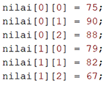
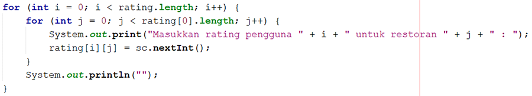

# JOBSHEET 11. ARRAY 2

## Tujuan
* Mahasiswa mampu memahami pembuatan array dua dimensi
* Mahasiswa mampu menyelesaikan studi kasus dengan memanfaatkan array dua dimensi

## Alat dan Bahan
* PC/Laptop
* Browser
* Koneksi internet
* Anaconda3 + Java kernel (opsional)

## Praktikum

### Percobaan 1: Deklarasi, Inisialisasi, dan Menampilkan Array 2 Dimensi
Pada Percobaan 1, kode program yang dibuat digunakan untuk menyimpan nilai praktikum dari 2 orang mahasiswa pada 3 mata kuliah yang berbeda.
1.	Buat array bertipe **integer** dengan nama **nilai** dengan kapasitas baris 2 elemen (menyatakan jumlah mahasiswa) dan kolom 3 elemen (menyatakan jumlah mata kuliah)


```Java
// Tuliskan kode program Percobaan 1 Langkah 1
int[][] nilai = new int[2][3];
```

2. Isi masing-masing elemen array **nilai** sebagai berikut:



```Java
// Tuliskan kode program Percobaan 1 Langkah 2
nilai[0][0] = 75;
nilai[0][1] = 90;
nilai[0][2] = 88;
nilai[1][0] = 79;
nilai[1][1] = 82;
nilai[1][2] = 67;
```


    67


3. Tampilkan semua isi elemen array **nilai**


```Java
// Tuliskan kode program Percobaan 1 Langkah 2
System.out.println(nilai[0][0] + " " + nilai[0][1] + " " + nilai[0][2]);
System.out.println(nilai[1][0] + " " + nilai[1][1] + " " + nilai[1][2]);
```

    75 90 88
    79 82 67


#### Pertanyaan
1. Apakah pengisian elemen array harus dilakukan secara berurutan mulai dari indeks 0? Jelaskan!


```Java
// Tuliskan jawaban nomor 1
Ya, apabila elemen array tidak dimulai dari 0 maka output yang dihasilkan tidak akan berurutan
```

2. Lakukan modifikasi pada Percobaan 1 Langkah 3 untuk menampilkan semua isi elemen array **nilai** menggunakan perulangan *for*


```Java
// Tuliskan jawaban nomor 2
int[][] nilai = new int[2][3];
nilai[0][0] = 75;
nilai[0][1] = 90;
nilai[0][2] = 88;
nilai[1][0] = 79;
nilai[1][1] = 82;
nilai[1][2] = 67;
for(int i = 0; i < rating.length; i++){
    for(int j = 0; j < rating[0].length; j++){
        System.out.println(nilai[i][j] + " ");
    }
}
```
    75 
    90 
    88 
    79 
    82 
    67 
### Percobaan 2: Mengisi Elemen Array 2 Dimensi Menggunakan Input Keyboard
Pada Percobaan 2, kode program yang dibuat digunakan untuk menyimpan nilai rating restoran yang terdaftar pada aplikasi pemesanan makanan online. Rating diberikan oleh 4 orang pengguna kepada 2 restoran yang terdaftar.
1. Import dan deklarasikan Scanner dengan nama **sc**


```Java
// Tuliskan kode program Percobaan 2 Langkah 1
import java.util.Scanner;
Scanner sc = new Scanner(System.in);
```

2.	Buat array bertipe **integer** dengan nama **rating** dengan kapasitas baris 4 elemen (menyatakan jumlah pengguna) dan kolom 2 elemen (menyatakan jumlah restoran)


```Java
// Tuliskan kode program Percobaan 2 Langkah 2
int[][] rating = new int[4][2];
```

3. Dengan menggunakan perulangan *for*, buat input untuk mengisi elemen array **rating**



```Java
// Tuliskan kode program Percobaan 2 Langkah 3
for(int i = 0; i < rating.length; i++){
    for(int j = 0; j < rating[0].length; j++){
        System.out.print("Masukkan rating pengguna " + i + " untuk restoran " + j + " : ");
        rating[i][j] = sc.nextInt();
    }
    System.out.println("");
}
```

    Masukkan rating pengguna 0 untuk restoran 0 : 80
    Masukkan rating pengguna 0 untuk restoran 1 : 90
    
    Masukkan rating pengguna 1 untuk restoran 0 : 50
    Masukkan rating pengguna 1 untuk restoran 1 : 100
    
    Masukkan rating pengguna 2 untuk restoran 0 : 20
    Masukkan rating pengguna 2 untuk restoran 1 : 60
    
    Masukkan rating pengguna 3 untuk restoran 0 : 40
    Masukkan rating pengguna 3 untuk restoran 1 : 50
    


4. Dengan menggunakan perulangan *for-each*, tampilkan semua isi elemen dari array **rating**


```Java
// Tuliskan kode program Percobaan 2 Langkah 4
for (int[] rtg : rating){
    for (int r : rtg){
        System.out.print(r + " ");
    }
    System.out.println("");
}
```

    80 90 
    50 100 
    20 60 
    40 50 


#### Pertanyaan
1. Pada Percobaan 2 Langkah 3, dapatkah posisi i ditukar dengan posisi i? Jelaskan alasannya!


```Java
// Tuliskan jawaban nomor 1
Bisa, dan tidak terjadi perubahan apapun dikarenakan interger tersebut hanya sebagai pelengkap mau diubah huruf apapun asal syarat nya terpenuhi masih bisa berjalan
```

2. Tambahkan kode program untuk menentukan banyaknya baris dan kolom elemen array secara dinamis (baris dan kolom ditentukan saat program berjalan melalui input keyboard)!

```Java
// Tuliskan jawaban nomor 2
import java.util.Scanner;
Scanner sc = new Scanner(System.in);
int[][] rating = new int[4][2];
int kolom, baris;
for(int j = 0; j < rating.length; j++){
    kolom = 0;
    baris = 0;
    for(int i = 0; i < rating[0].length; i++){
        System.out.print("Masukkan rating pengguna " + j + " untuk restoran " + i + " : ");
        rating[j][i] = sc.nextInt();
    }
}
System.out.println("Jumlah baris ada: " + rating.length);
System.out.println("Jumlah kolom ada: " + rating[0].length);
```
    Masukkan rating pengguna 0 untuk restoran 0 : 90
    Masukkan rating pengguna 0 untuk restoran 1 : 80
    Masukkan rating pengguna 1 untuk restoran 0 : 95
    Masukkan rating pengguna 1 untuk restoran 1 : 100
    Masukkan rating pengguna 2 untuk restoran 0 : 90
    Masukkan rating pengguna 2 untuk restoran 1 : 85
    Masukkan rating pengguna 3 untuk restoran 0 : 95
    Masukkan rating pengguna 3 untuk restoran 1 : 90
    Jumlah baris sekarang adalah: 4
    Jumlah kolom sekarang adalah: 2
#### Percobaan 3: Melakukan Operasi Aritmatika pada Elemen Array 2 Dimensi
Pada Percobaan 3, kode program yang dibuat digunakan untuk menghitung nilai rata-rata harga setiap bahan pokok selama 1 satu semester. Terdapat 3 bahan pokok yang dicatat harganya setiap akhir bulan. Program dibuat berdasarkan flowchart berikut.

1. Import dan deklarasikan Scanner dengan nama **sc**


```Java
// Tuliskan kode program Percobaan 3 Langkah 1
import java.util.Scanner;
Scanner sc = new Scanner(System.in);
```

2.	Buat array bertipe **integer** dengan nama **harga** dengan kapasitas baris 3 elemen (menyatakan jumlah bahan pokok) dan kolom 6 elemen (menyatakan jumlah bulan). Deklarasikan juga variabel **total** dan **rata** bertipe **double**


```Java
// Tuliskan kode program Percobaan 3 Langkah 2
int[][] harga = new int[3][6];
double total, rata;
```

3. Dengan menggunakan perulangan *for*, buat input untuk mengisi elemen array **harga**. Kemudian, perhitungan total harga dilakukan untuk setiap bulan (kolom) pada setiap bahan pokok (baris). Setelah itu, nilai rata-rata dihitung untuk setiap bahan pokok (tiap satu baris) dan ditampilkan


```Java
// Tuliskan kode program Percobaan 3 Langkah 3
for (int i = 0; i < harga.length; i++){
    total = 0;
    rata = 0;
    for (int j = 0; j < harga[0].length; j++){
        System.out.printf("Masukkan harga[%d][%d]: ", i, j);
        harga[i][j] = sc.nextInt();
        total += harga [i][j];
    }
    rata = total / harga[0].length;
    System.out.printf("Rata-rata harga bahan ke-%d adalah %.2f\n", i, rata);
}
```

    Masukkan harga[0][0]: 5000
    Masukkan harga[0][1]: 2000
    Masukkan harga[0][2]: 3000
    Masukkan harga[0][3]: 4000
    Masukkan harga[0][4]: 10000
    Masukkan harga[0][5]: 2000
    Rata-rata harga bahan ke-0 adalah 4333.33
    Masukkan harga[1][0]: 3000
    Masukkan harga[1][1]: 4000
    Masukkan harga[1][2]: 5000
    Masukkan harga[1][3]: 6000
    Masukkan harga[1][4]: 20000
    Masukkan harga[1][5]: 1000
    Rata-rata harga bahan ke-1 adalah 6500.00
    Masukkan harga[2][0]: 5000
    Masukkan harga[2][1]: 4000
    Masukkan harga[2][2]: 45000
    Masukkan harga[2][3]: 4500
    Masukkan harga[2][4]: 2000
    Masukkan harga[2][5]: 1000
    Rata-rata harga bahan ke-2 adalah 10250.00


#### Pertanyaan
1. Jelaskan fungsi dari **rata = total / harga[0].length**!


```Java
// Tuliskan jawaban nomor 1
Sebagai operator untuk menghitung rata-rata dari data total dan array harga
```

2. Mengapa insialisasi variabel **total = 0** dan **rata = 0** berada di dalam perulangan *for* yang pertama? Menurut Anda, apa yang terjadi jika inisialisasi kedua variabel tersebut diletakkan di luar perulangan *for* (setelah deklarasi array)?


```Java
// Tuliskan jawaban nomor 2
import java.util.Scanner;
Scanner sc = new Scanner(System.in);
int[][] harga = new int[3][6];
total = 0;
rata = 0;
double total, rata;
for (int i = 0; i < harga.length; i++){
    for (int j = 0; j < harga[0].length; j++){
        System.out.printf("Masukkan harga[%d][%d]: ", i, j);
        harga[i][j] = sc.nextInt();
        total += harga [i][j];
    }
    rata = total / harga[0].length;
    System.out.printf("Rata-rata harga bahan ke-%d adalah %.2f\n", i, rata);
}
```
    Masukkan harga[0][0]: 100
    Masukkan harga[0][1]: 100
    Masukkan harga[0][2]: 100
    Masukkan harga[0][3]: 100
    Masukkan harga[0][4]: 100
    Masukkan harga[0][5]: 100
    Rata-rata harga bahan ke-0 adalah 100.00
    Masukkan harga[1][0]: 0
    Masukkan harga[1][1]: 0
    Masukkan harga[1][2]: 0
    Masukkan harga[1][3]: 0
    Masukkan harga[1][4]: 0
    Masukkan harga[1][5]: 0
    Rata-rata harga bahan ke-1 adalah 100.00
    Masukkan harga[2][0]: 200
    Masukkan harga[2][1]: 200
    Masukkan harga[2][2]: 200
    Masukkan harga[2][3]: 200
    Masukkan harga[2][4]: 200
    Masukkan harga[2][5]: 200
    Rata-rata harga bahan ke-2 adalah 300.00
    Karena inisialisasi akan dilakukan di outerloop, apabila inisialisasi diletakkan di luar perulangan *for* (setelah deklarasi array)? maka yang terjadi adalah penambahan rata" pada setiap perhitungan rata"
## Tugas

1. Perhatikan flowchart berikut.

Buat kode program sesuai dengan flowchart tersebut untuk mencari suhu tertinggi yang dicatat dari 5 kota di Jepang selama 7 hari berturut-turut!


```Java
// Tuliskan jawaban nomor 1
import java.util.Scanner;
Scanner sc = new Scanner(System.in);
double[][] suhu = new double[5][7];
int x, y;
double max = 0;
for(int x = 0; x < suhu.length; x++){
    for(int y = 0; y < suhu[0].length; y++){
        System.out.printf("Masukkan suhu kota ke-%d hari ke-%d : ", x, y);
        suhu[x][y] = sc.nextDouble();
        if(suhu[x][y] > max) max = suhu[x][y];    
        }
    }
System.out.print("Suhu max adalah: " + max);
```
    Masukkan suhu kota ke-0 hari ke-0 : 30
    Masukkan suhu kota ke-0 hari ke-1 : 41
    Masukkan suhu kota ke-0 hari ke-2 : 40
    Masukkan suhu kota ke-0 hari ke-3 : 60
    Masukkan suhu kota ke-0 hari ke-4 : 90
    Masukkan suhu kota ke-0 hari ke-5 : 31
    Masukkan suhu kota ke-0 hari ke-6 : 77
    Masukkan suhu kota ke-1 hari ke-0 : 69
    Masukkan suhu kota ke-1 hari ke-1 : 79
    Masukkan suhu kota ke-1 hari ke-2 : 59
    Masukkan suhu kota ke-1 hari ke-3 : 49
    Masukkan suhu kota ke-1 hari ke-4 : 39
    Masukkan suhu kota ke-1 hari ke-5 : 29
    Masukkan suhu kota ke-1 hari ke-6 : 19
    Masukkan suhu kota ke-2 hari ke-0 : 12
    Masukkan suhu kota ke-2 hari ke-1 : 22
    Masukkan suhu kota ke-2 hari ke-2 : 25
    Masukkan suhu kota ke-2 hari ke-3 : 43
    Masukkan suhu kota ke-2 hari ke-4 : 30
    Masukkan suhu kota ke-2 hari ke-5 : 41
    Masukkan suhu kota ke-2 hari ke-6 : 60
    Masukkan suhu kota ke-3 hari ke-0 : 99
    Masukkan suhu kota ke-3 hari ke-1 : 87
    Masukkan suhu kota ke-3 hari ke-2 : 85
    Masukkan suhu kota ke-3 hari ke-3 : 65
    Masukkan suhu kota ke-3 hari ke-4 : 44
    Masukkan suhu kota ke-3 hari ke-5 : 42
    Masukkan suhu kota ke-3 hari ke-6 : 40
    Masukkan suhu kota ke-4 hari ke-0 : 41
    Masukkan suhu kota ke-4 hari ke-1 : 90
    Masukkan suhu kota ke-4 hari ke-2 : 32
    Masukkan suhu kota ke-4 hari ke-3 : 90
    Masukkan suhu kota ke-4 hari ke-4 : 78
    Masukkan suhu kota ke-4 hari ke-5 : 76
    Masukkan suhu kota ke-4 hari ke-6 : 85
    Suhu max adalah: 99.0
2. Terdapat hasil pencatatan data lima mahasiswa yang berisi informasi mengenai umur, berat badan (kg), dan tinggi badan (cm). Data tersebut disimpan ke dalam array dua dimensi.

*Keterangan: penyimpanan nilai dapat dilakukan melalui inisialisasi menggunakan operator assignment*
 * Tampilkan *berat badan terendah* di antara kelima mahasiswa tersebut
 * Tampilkan *rata-rata tinggi badan* dari kelima mahasiswa tersebut
 * Tampilkan nama mahasiswa dengan *umur tertua* di antara kelima mahasiswa tersebut


```Java
// Tuliskan jawaban nomor 2
int[][] data = {{19,51,155}, {18,55,163}, {18,45,153}, {20,46,158}, {19,58,160}};
String[] namaMahasiswa = {"Desi", "Rofan", "Lala", "Beky", "Ega"};
int terkecil = data[0][1]; 
int tertua = data[0][0];
int totalTinggi = 0;
int mhsTertua;
for(int i = 0; i < data.length; i++){
    for(int j = 0; j < data[0].length; j++) {
        if(j == 1 && terkecil > data[i][j]) terkecil = data[i][j];
        else if(j == 2) totalTinggi += data[i][j]; 
        else if(j == 0 && tertua < data[i][j]) {
            mhsTertua = i;
            tertua = data[i][j]; 
        }
    }
}
System.out.println("Berat badan terendah adalah " + terkecil);
System.out.println("Rata-rata tinggi badan adalah " + ((double) totalTinggi/data.length));
System.out.printf("Mahasiswa Tertua adalah %s yang berumur %d", namaMahasiswa[mhsTertua], tertua );
```
    Berat badan terendah adalah 45
    Rata-rata tinggi badan adalah 157.8
    Mahasiswa Tertua adalah Beky yang berumur 20