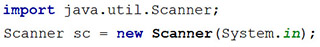

# JOBSHEET 11. ARRAY 2

## Tujuan
* Mahasiswa mampu memahami pembuatan array dua dimensi
* Mahasiswa mampu menyelesaikan studi kasus dengan memanfaatkan array dua dimensi

## Alat dan Bahan
* PC/Laptop
* Browser
* Koneksi internet
* Anaconda3 + Java kernel (opsional)

## Praktikum

### Percobaan 1: Deklarasi, Inisialisasi, dan Menampilkan Array 2 Dimensi
Pada Percobaan 1, kode program yang dibuat digunakan untuk menyimpan nilai praktikum dari 2 orang mahasiswa pada 3 mata kuliah yang berbeda.
1.	Buat array bertipe **integer** dengan nama **nilai** dengan kapasitas baris 2 elemen (menyatakan jumlah mahasiswa) dan kolom 3 elemen (menyatakan jumlah mata kuliah)


```Java
int [][] nilai = new int [2][3];
```

2. Isi masing-masing elemen array **nilai** sebagai berikut:


```Java
nilai [0][0] = 75;
nilai [0][1] = 90;
nilai [0][2] = 88;
nilai [1][0] = 79;
nilai [1][1] = 82;
nilai [1][2] = 67;
```


    67


3. Tampilkan semua isi elemen array **nilai**


```Java
System.out.println(nilai[0][0] + " " + nilai[0][1] + " " + nilai[0][2]);
System.out.println(nilai[1][0] + " " + nilai[1][1] + " " + nilai[1][2]);
```

    75 90 88
    79 82 67


#### Pertanyaan
1. Apakah pengisian elemen array harus dilakukan secara berurutan mulai dari indeks 0? Jelaskan!

Dengan menggunakan Array 2D tidak harus memulia dari 0

Tidak haru karene array bisa melakukan pengisan fariabe secara tidak berurutan

2. Lakukan modifikasi pada Percobaan 1 Langkah 3 untuk menampilkan semua isi elemen array **nilai** menggunakan perulangan *for*


```Java
for(int i = 0; i <= nilai.length; i++) for(int a = 0; a <= nilai.length; a++) 
    System.out.println(nilai[i][a]);
```

    75
    90
    88
    79
    82
    67


    ---------------------------------------------------------------------------

    java.lang.ArrayIndexOutOfBoundsException: Index 2 out of bounds for length 2

    	at .(#21:2)


### Percobaan 2: Mengisi Elemen Array 2 Dimensi Menggunakan Input Keyboard
Pada Percobaan 2, kode program yang dibuat digunakan untuk menyimpan nilai rating restoran yang terdaftar pada aplikasi pemesanan makanan online. Rating diberikan oleh 4 orang pengguna kepada 2 restoran yang terdaftar.
1. Import dan deklarasikan Scanner dengan nama **sc**


```Java
import java.util.Scanner;
Scanner sc = new Scanner(System.in);
```

2.	Buat array bertipe **integer** dengan nama **rating** dengan kapasitas baris 4 elemen (menyatakan jumlah pengguna) dan kolom 2 elemen (menyatakan jumlah restoran)


```Java
int[][] rating = new int[4][2];
```

3. Dengan menggunakan perulangan *for*, buat input untuk mengisi elemen array **rating**


```Java
for (int i = 0; i < rating.length; i++) {
    for (int j = 0; j < rating[0].length; j++) {
        System.out.print("Masukkan rating pengguna " + i + " untuk restoran " + j + " : ");
        rating[i][j] = sc.nextInt();
    }
    System.out.println("");
}
```

    Masukkan rating pengguna 0 untuk restoran 0 : 45
    Masukkan rating pengguna 0 untuk restoran 1 : 55
    
    Masukkan rating pengguna 1 untuk restoran 0 : 78
    Masukkan rating pengguna 1 untuk restoran 1 : 55
    
    Masukkan rating pengguna 2 untuk restoran 0 : 87
    Masukkan rating pengguna 2 untuk restoran 1 : 66
    
    Masukkan rating pengguna 3 untuk restoran 0 : 99
    Masukkan rating pengguna 3 untuk restoran 1 : 56
    


4. Dengan menggunakan perulangan *for-each*, tampilkan semua isi elemen dari array **rating**


```Java
for (int[] rtg : rating) {
    for (int r : rtg) {
        System.out.print(r + " ");
    }
    System.out.println("");
}
```

    45 55 
    78 55 
    87 66 
    99 56 


#### Pertanyaan
1. Pada Percobaan 2 Langkah 3, dapatkah posisi i ditukar dengan posisi i? Jelaskan alasannya!


2. Tambahkan kode program untuk menentukan banyaknya baris dan kolom elemen array secara dinamis (baris dan kolom ditentukan saat program berjalan melalui input keyboard)!


```Java

```

### Percobaan 3: Melakukan Operasi Aritmatika pada Elemen Array 2 Dimensi
Pada Percobaan 3, kode program yang dibuat digunakan untuk menghitung nilai rata-rata harga setiap bahan pokok selama 1 satu semester. Terdapat 3 bahan pokok yang dicatat harganya setiap akhir bulan. Program dibuat berdasarkan flowchart berikut.

1. Import dan deklarasikan Scanner dengan nama **sc**



```Java
import java.util.Scanner;
Scanner sc = new Scanner(System.in);
```

2.	Buat array bertipe **integer** dengan nama **harga** dengan kapasitas baris 3 elemen (menyatakan jumlah bahan pokok) dan kolom 6 elemen (menyatakan jumlah bulan). Deklarasikan juga variabel **total** dan **rata** bertipe **double**


```Java
int[][] harga = new int[3][6];
double total, rata;
```

3. Dengan menggunakan perulangan *for*, buat input untuk mengisi elemen array **harga**. Kemudian, perhitungan total harga dilakukan untuk setiap bulan (kolom) pada setiap bahan pokok (baris). Setelah itu, nilai rata-rata dihitung untuk setiap bahan pokok (tiap satu baris) dan ditampilkan


```Java
for (int i = 0; i < harga.length; i++) {
    total = 0;
    rata = 0;
    for (int j = 0; j < harga[0].length; j++) {
        System.out.printf("Masukkan harga[%d][%d]: ", i, j);
        harga[i][j] = sc.nextInt();
        total += harga[i][j];
    }
    rata = total / harga[0].length;
    System.out.printf("Rata-rata harga bahan ke-%d adalah %.2f\n", i, rata);
}
```

    Masukkan harga[0][0]: 45000
    Masukkan harga[0][1]: 45000
    Masukkan harga[0][2]: 46000
    Masukkan harga[0][3]: 457000
    Masukkan harga[0][4]: 458000
    Masukkan harga[0][5]: 459000
    Rata-rata harga bahan ke-0 adalah 251666.67
    Masukkan harga[1][0]: 12000
    Masukkan harga[1][1]: 13000
    Masukkan harga[1][2]: 14000
    Masukkan harga[1][3]: 15000
    Masukkan harga[1][4]: 16000
    Masukkan harga[1][5]: 17000
    Rata-rata harga bahan ke-1 adalah 14500.00
    Masukkan harga[2][0]: 21000
    Masukkan harga[2][1]: 22000
    Masukkan harga[2][2]: 23000
    Masukkan harga[2][3]: 24000
    Masukkan harga[2][4]: 25000
    Masukkan harga[2][5]: 26000
    Rata-rata harga bahan ke-2 adalah 23500.00


#### Pertanyaan
1. Jelaskan fungsi dari **rata = total / harga[0].length**!

Tidak bisa akan menyebapkan eror karena tidak sesua baris dan kolom nya

2. Mengapa insialisasi variabel **total = 0** dan **rata = 0** berada di dalam perulangan *for* yang pertama? Menurut Anda, apa yang terjadi jika inisialisasi kedua variabel tersebut diletakkan di luar perulangan *for* (setelah deklarasi array)?


```Java
System.out.print("Masukkan jumlah baris: ");
int baris = sc.nextInt();
System.out.print("Masukkan jumlah kolom: ");
int kolom = sc.nextInt();
int[][] rating = new int[baris][kolom];

System.out.println("Jumlah baris sekarang adalah: " + rating.length);
System.out.println("Jumlah kolom sekarang adalah: " + rating[0].length);
```

    Masukkan jumlah baris: 5
    Masukkan jumlah kolom: 5
    Jumlah baris sekarang adalah: 5
    Jumlah kolom sekarang adalah: 5


## Tugas

1. Perhatikan flowchart berikut.

Buat kode program sesuai dengan flowchart tersebut untuk mencari suhu tertinggi yang dicatat dari 5 kota di Jepang selama 7 hari berturut-turut!


```Java
import java.util.Scanner;
Scanner sc = new Scanner(System.in);

double[][] suhu = new double[5][7];
double max = 0;

for(int x = 0; x < suhu.length; x++) {
    for(int y = 0; y < suhu[0].length; y++) {
        System.out.print("Masukkan suhu: ");
        suhu[x][y] = sc.nextDouble();
        if(suhu[x][y] > max) max = suhu[x][y]; // Mengubah nilai variabel dengan data tertinggi
    }
}

System.out.println("Max = " + max);

```

    Masukkan suhu: 45
    Masukkan suhu: 12
    Masukkan suhu: 1
    Masukkan suhu: 13
    Masukkan suhu: 14
    Masukkan suhu: 15
    Masukkan suhu: 16
    Masukkan suhu: 17
    Masukkan suhu: 18
    Masukkan suhu: 19
    Masukkan suhu: 21
    Masukkan suhu: 22
    Masukkan suhu: 23
    Masukkan suhu: 24
    Masukkan suhu: 25
    Masukkan suhu: 26
    Masukkan suhu: 27
    Masukkan suhu: 28
    Masukkan suhu: 29
    Masukkan suhu: 31
    Masukkan suhu: 32
    Masukkan suhu: 33
    Masukkan suhu: 34
    Masukkan suhu: 35
    Masukkan suhu: 36
    Masukkan suhu: 37
    Masukkan suhu: 38
    Masukkan suhu: 39
    Masukkan suhu: 41
    Masukkan suhu: 42
    Masukkan suhu: 43
    Masukkan suhu: 44
    Masukkan suhu: 45
    Masukkan suhu: 46
    Masukkan suhu: 47
    Max = 47.0


2. Terdapat hasil pencatatan data lima mahasiswa yang berisi informasi mengenai umur, berat badan (kg), dan tinggi badan (cm). Data tersebut disimpan ke dalam array dua dimensi.

*Keterangan: penyimpanan nilai dapat dilakukan melalui inisialisasi menggunakan operator assignment*
 * Tampilkan *berat badan terendah* di antara kelima mahasiswa tersebut
 * Tampilkan *rata-rata tinggi badan* dari kelima mahasiswa tersebut
 * Tampilkan nama mahasiswa dengan *umur tertua* di antara kelima mahasiswa tersebut


```Java
int[][] mahasiswa = {{19,51,155},
                     {18,55,163},
                     {18,45,153},
                     {20,46,158},
                     {19,58,160}};
String[] namaMahasiswa = {"Desi", "Rofan", "Lala", "Beky", "Ega"};

int terendah = mahasiswa[0][1]; 
int tertua = mahasiswa[0][0];
int totalTinggi = 0;
int mahasiswaTertua;

for(int i = 0; i < mahasiswa.length; i++)
    for(int j = 0; j < mahasiswa[0].length; j++) {
        if(j == 1 && terendah > mahasiswa[i][j]) terendah = mahasiswa[i][j];
        else if(j == 2) totalTinggi += mahasiswa[i][j];
        else if(j == 0 && tertua < mahasiswa[i][j]) {
            mahasiswaTertua = i;
            tertua = mahasiswa[i][j];
        }
    }

System.out.println("Berat badan terendah adalah " + terendah);
System.out.println("Rata-rata tinggi badan adalah " + ((double) totalTinggi/mahasiswa.length));
System.out.printf("\nMahasiswa Tertua adalah %s dengan umur %d", namaMahasiswa[mahasiswaTertua], tertua );

```

    Berat badan terendah adalah 45
    Rata-rata tinggi badan adalah 157.8
    
    Mahasiswa Tertua adalah Beky dengan umur 20


    java.io.PrintStream@567460d6


