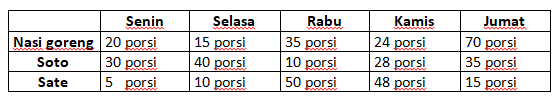

# JOBSHEET 13. Fungsi 1

## Tujuan
* Mahasiswa mampu memahami penggunaan fungsi static pada Java dengan parameter dan mengembalikan nilai.
* Mahasiswa mampu membuat program menggunakan fungsi static dan mengeksekusi fungsi tersebut.


## Alat dan Bahan
* PC/Laptop
* Browser
* Koneksi internet
* Anaconda3 + Java kernel (opsional)

## Praktikum

### Percobaan 1: Fungsi Void (tidak menggunakan return value)

1.	Buat fungsi **beriSalam** bertipe void yang digunakan untuk mencetak **“Halo! Selamat Pagi”**.


2. Eksekusi atau panggil fungsi **beriSalam**.


```Java
// Tuliskan kode program Percobaan 1 Langkah 1 & 2
static void beriSalam(){//membuat kode untuk menampilkan Halo selamat pagi
    System.out.println("Halo! Selamat Pagi");//menampilkan Halo selamat pagi
}
beriSalam();
```

    Halo! Selamat Pagi


3. Buat fungsi **beriUcapan** dengan sebuah parameter bertipe String.


4. Buatlah variabel **salam** bertipe String kemudian eksekusi atau panggil fungsi **beriUcapan** dengan mengisi parameternya dengan variable **salam** yang sudah dibuat.


```Java
// Tuliskan kode program Percobaan 1 Langkah 1, 2, 3 & 4
static void beriSalam(){ //fungsi 
    System.out.println("Halo! Selamat Pagi");
}

static void beriUcapan(String ucapan){ 
    System.out.println(ucapan);
}

    beriSalam();
    String salam = "Selamat datang di pemrogaman java";  //mengisi string 
    beriUcapan(salam); //mengirim string
```

    Halo! Selamat Pagi
    Selamat datang di pemrogaman java


#### Pertanyaan
1. Jelaskan perbedaan fungsi **beriSalam** dan **beriUcapan** pada praktikum 1!
beriSalam adalah kode untuk menampilkan string tidak berparameter, jika  beriUcapan adalah kode untuk menampilkan string berparameter

2. Jelaskan cara pemanggilan sebuah fungsi void yang berparameter dan tanpa parameter!
jika pemanggilan fungsi tanpa parameter pemaggilan fungsinnnya dilakukan dengan memanggil kode fungsinnya, jika fungsi berparameter pemanggilan fungsinnya harus didahului dengan nama fungsi nya.

### Percobaan 2: Fungsi dengan return value (Bukan void)
Pada Percobaan 2, kode program yang dibuat digunakan untuk menghitung luas persegi dengan membuat fungsi **luasPersegi** yang menggunakan parameter.
1. Buat fungsi **luasPersegi**  untuk menghitung luas persegi yang mengembalikan nilai luas (int) dan parameter masukan sisi (int).


2.	Eksekusi atau panggil fungsi luasPersegi dengan cara membuat variabel baru yaitu **luasan**, kemudian isi variabel tersebut dengan memanggil fungsi luasPersegi dan mengisi parameter sisi. Selanjutnya cetak variabel luasan untuk menampilkan luas persegi panjang


```Java
// Tuliskan kode program Percobaan 2 Langkah 1 & 2
static int luasPersegi(int sisi){ //kode fungsi 
    int luas = sisi*sisi; //untuk menghitung luas persegi
    return luas; //untuk mengembalikan output hasil menghitung luas persegi
}

int luasan = luasPersegi(5); 
System.out.println("Luas persegi dengan sisi 5 = " + luasan); //untuk menampilkan luas persegi
```

    Luas persegi dengan sisi 5 = 25


#### Pertanyaan
1. jelaskan mengapa ketika memanggil fungsi **luasPersegi** harus membuat variabel baru yaitu luasan?
karena kode fungsi luasPersegi sudah digunakan untuk pemanggilan menghitung luas persegi

2. Jelaskan kegunaan **return luas** pada percobaan 2 diatas!
untuk mengembalikan output hasil menghitung luas persegi

3. Modifikasilah program di percobaan 2, dengan membuat panjang **sisi** sebagai inputan!


```Java
// Tuliskan jawaban nomor 3
import java.util.Scanner;
Scanner sc = new Scanner(System.in);

static int luasPersegi(int sisi){
    int luas = sisi*sisi;
    return luas;
}
System.out.print("Masukkan panjang sisi: ");
int x = sc.nextInt(); 

int luasan = luasPersegi(x); 
System.out.printf("Luas persegi dengan sisi %d = %d", x, luasan);
```

    Masukkan panjang sisi: 5
    Luas persegi dengan sisi 5 = 25


    java.io.PrintStream@8196d0a


### Percobaan 3: Fungsi dapat meng-CALL Fungsi Lain
Pada Percobaan 3, kode program yang dibuat digunakan untuk mengimplementasikan bahwa fungsi dapat meng-CALL fungsi yang lain. Dimana dalam percobaan ini terdapat fungsi **Kali dan Kurang**. 
1. Buatlah fungsi **Kali** yang mengembalikan nilai H (int) dan parameter masukan C dan D (int).


2.	Buatlah fungsi **Kurang** yang mengembalikan nilai X (int) dan parameter masukan A dan B (int) dan memanggil fungsi Kali.


3. Lakukan import class Scanner sebagai inputan di langkah selajutnya.

4. Eksekusi atau panggil fungsi **Kurang** .


```Java
// Tuliskan kode program Percobaan 3 Langkah 1, 2, 3 & 4
static int Kali(int C, int D){ 
    int H; 
    H = (C+10) % (D+19); 
    return H; 
}

static int Kurang(int A, int B){ 
    int X;
    A = A+7;
    B = B+4;
    X = Kali(A, B); 
    return X; 
}

import java.util.Scanner;

int nilai1, nilai2;
Scanner sc = new Scanner(System.in); 
System.out.print("Masukkan nilai 1: ");
nilai1 = sc.nextInt();
System.out.print("Masukkan nilai 2: ");
nilai2 = sc.nextInt(); 
int hasil = Kurang(nilai1, nilai2); 
System.out.println("Hasil akhir adalah " + hasil);
```

    Masukkan nilai 1: 5
    Masukkan nilai 2: 6
    Hasil akhir adalah 22


#### Pertanyaan
1. Modifikasilah percobaan diatas dimana di fungsi **Kali** dapat memanggil fungsi **Kurang** kemudian eksekusi atau panggil fungsi Kali


```Java
// Tuliskan jawaban nomor 1
static int Kali(int C, int D){
    int H;
    C = C+10;
    D = D+19;
    H = Kurang(C, D);
    return H;
}

static int Kurang(int A, int B){
    int X;
    X = (A+7) - (B+4);
    return X;
}

import java.util.Scanner;

int nilai1, nilai2;
Scanner sc = new Scanner(System.in);
System.out.print("Masukkan nilai 1: ");
nilai1 = sc.nextInt();
System.out.print("Masukkan nilai 2: ");
nilai2 = sc.nextInt();
int hasil = Kali(nilai1, nilai2);
System.out.println("Hasil akhir adalah " + hasil);
```

    Masukkan nilai 1: 5
    Masukkan nilai 2: 6
    Hasil akhir adalah -7


2. Jelaskan alur jalannya program di percobaan 3 mulai dari input sampai keluar output!
memasukkan nilai 1 dan 2 sebagai inputan dan di eksekusi menggunakan fungsi kurang, lalu bilangan akan di tambah 7 dan ditambah 4 lalu nilai akan di return dan selanjutnya fungsi kali, bilangan akan ditambah dahulu lalu di moduluskan sebelum di return, setelah semua di return bilangan akhir/ hasil akhir akan muncul.

### Percobaan 4: Mengubah Program Tidak Menggunakan Fungsi dan Menggunakan Fungsi
Pada Percobaan 4, kode program yang dibuat digunakan untuk menghitung luas persegi panjang dan volume balok tanpa menggunakan fungsi dan dengan menggunakan fungsi.
1. Import dan deklarasikan Scanner dengan nama **input**


2. Buatlah inputan panjang, lebar, dan tinggi 


3. Hitung luas persegi panjang dan volume balok


```Java
// Tuliskan kode program Percobaan 4 Langkah 1, 2, & 3
import java.util.Scanner;
Scanner input = new Scanner(System.in);

int p,l,t,L,vol;

System.out.println("Masukkan panjang");
p = input.nextInt();
System.out.println("Masukkan lebar");
l = input.nextInt();
System.out.println("Masukkan tinggi");
t = input.nextInt();

//hitung
L = p*l;
System.out.println("Luas persegi panjang adalah " + L);

vol = p*l*t;
System.out.println("Volume balok adalah " + vol);

```

    Masukkan panjang
    4
    Masukkan lebar
    5
    Masukkan tinggi
    7
    Luas persegi panjang adalah 20
    Volume balok adalah 140


4. Program menghitung luas persegi dan volume balok diatas jika dibuatkan fungsi maka terdapat 3 fungsi yaitu hitungLuas, hitungVolume dan fungsi main, seperti dibawah ini:

Fungsi hitungLuas


Fungsi hitungVolume


5. Eksekusi/panggil fungsi **hitungLuas** dan **hitungVolume**


```Java
// Tuliskan kode program Percobaan 4 Langkah 1, 2, & 3
static int hitungLuas(int pjg, int lb){
    int luas = pjg*lb;
    return luas;
}

static int hitungVolume(int tinggi, int a, int b){
    int volume = hitungLuas(a,b)*tinggi;
    return volume;
}

Scanner input = new Scanner(System.in);
int p,l,t,L, vol;
System.out.println("Masukkan panjang");
p = input.nextInt();
System.out.println("Masukkan lebar");
l = input.nextInt();
System.out.println("Masukkan tinggi");
t = input.nextInt();

L = hitungLuas(p, l);
System.out.println("Luas persegi panjang adalah " + L);
vol = hitungVolume(t, p, l);
System.out.println("Volume Balok adalah " + vol);
```

    Masukkan panjang
    4
    Masukkan lebar
    6
    Masukkan tinggi
    7
    Luas persegi panjang adalah 24
    Volume Balok adalah 168


#### Pertanyaan
1. Jelaskan kegunaan parameter yang terdapat didalam fungsi hitungLuas dan hitungVolume!
digunakan untuk menyimpan nilai hitung luas dan volume

2. Setelah melakukan percobaan 4, menurut anda manakah program yg lebih efisien apakah menggunakan fungsi atau tanpa fungsi? Jelaskan!
menurut saya menggunakan fungsi dikarenakan jika kita membutuhkan tinggal memsakukkan kode fungsinya.

### Percobaan 5: Fungsi Menggunakan Array dan Variabel Global
Pada Percobaan 5, kode program yang dibuat digunakan untuk menghitung total nilai yang ada didalam array dengan membuat 3 fungsi yaitu isiarray, hitTol, dan tampilArray.
1. Buatlah **variable global total dan i** bertipe int


2. Buatlah fungsi **isiarray** bertipe int dengan parameter angka bertipe int 


3. Buatlah fungsi **tampilArray** bertipe **void** dengan parameter data array **arr** bertipe int


4. Buatlah fungsi **hitTot** bertipe int dengan parameter data array **arr** bertipe int


5. Import dan deklarasikan Scanner dengan nama **input**


6. Eksekusi atau panggil ketiga fungsi yaitu **isiarray, tampilArray, dan hitTot**, kemudian jalankan program!


```Java
// Tuliskan kode program Percobaan 4 Langkah 1 s/d 6
static int total = 0, i;

static int [] isiArray(int angka){
    Scanner input = new Scanner(System.in);
    int array[] = new int[angka];
    for(i = 0; i<array.length; i++){
        System.out.println("Masukkan data ke - " + i);
        array[i] =  input.nextInt();
    }
    return array;
}

static void tampilArray(int[] arr){
    for(i = 0; i<arr.length; i++){
        System.out.println("Nilai yang anda inputan ke - " + i);
        System.out.println(arr[i]);
    }
}

static int hitTot(int[] arr){
    for(i=0; i<arr.length; i++){
        total += arr[i];
    }
    return total;
}


import java.util.Scanner;
Scanner input = new Scanner(System.in);
System.out.println("Masukkan jumlah data yang ingin anda inputkan: ");
int jum = input.nextInt();
int []dataArray = isiArray(jum);
tampilArray(dataArray);
total = hitTot(dataArray);
System.out.println("Total nilai = " + total);
```

    Masukkan jumlah data yang ingin anda inputkan: 
    5
    Masukkan data ke - 0
    4
    Masukkan data ke - 1
    3
    Masukkan data ke - 2
    2
    Masukkan data ke - 3
    1
    Masukkan data ke - 4
    6
    Nilai yang anda inputan ke - 0
    4
    Nilai yang anda inputan ke - 1
    3
    Nilai yang anda inputan ke - 2
    2
    Nilai yang anda inputan ke - 3
    1
    Nilai yang anda inputan ke - 4
    6
    Total nilai = 16


#### Pertanyaan
1. Jelaskan mengapa fungsi tampil array dibuat bertipe void, sedangkan isiarray dan hitTot bertipe int!
karena array yang bertipe void tidak memerlukan return , sedangkan isiarray hitTot bertipe int memerlukan return

2. Menurut pendapat anda apakah fugsi isiarray dan hitTot dapat diganti dengan tipe void? Jelaskan dan buktikan dengan program!
tidak, karena hitTot memerlukan return


```Java
// Tuliskan jawaban nomor 2
static void int[] isiArray(int angka){
    Scanner input = new Scanner(System.in);
    int array[] = new int[angka];
    for(i = 0; i<array.length; i++){
        System.out.println("Masukkan data ke - " + i);
        array[i] =  input.nextInt();
    }

}

static void tampilArray(int[] arr){
    for(i = 0; i<arr.length; i++){
        System.out.println("Nilai yang anda inputan ke - " + i);
        System.out.println(arr[i]);
    }
}


static void hitTot(int[] arr){ 
    for(i=0; i<arr.length; i++){
        total += arr[i];
    }
}


import java.util.Scanner;
Scanner input = new Scanner(System.in);
System.out.println("Masukkan jumlah data yang ingin anda inputkan: ");
int jum = input.nextInt();
int []dataArray = isiArray(jum);
tampilArray(dataArray);
total = hitTot(dataArray);
System.out.println("Total nilai = " + total);

```


    |   static void int[] isiArray(int angka){

    illegal start of expression

    

    |   static void int[] isiArray(int angka){

    ';' expected

    

    |   static void int[] isiArray(int angka){

    ';' expected

    

    |   static void int[] isiArray(int angka){

    ';' expected

    

    |       int array[] = new int[angka];

    variable angka might not have been initialized

    


## Tugas

1. Buatlah sebuah static method yang bernama Max3(int bil1, int bil2, int bil3) yang menerima 3 buah parameter bilangan integer dan mengembalikan sebuah bilangan integer yang merupakan nilai maksimum diantara ketiga bilangan tersebut. 


```Java
// Tuliskan jawaban nomor 1
import java.util.Scanner;

Scanner masukan = new Scanner(System.in);
int bil1, bil2, bil3;
System.out.println("Program Mencari Nilai Max");
System.out.print("Masukan bilangan 1 = ");
bil1 = masukan.nextInt();
System.out.print("Masukan bilangan 2 = ");
bil2 = masukan.nextInt();
System.out.print("Masukan bilangan 3 = ");
bil3 = masukan.nextInt();
System.out.println();
System.out.println("Jumlah bil1+bil2 = "+(jumlah(bil1,bil2)));
System.out.println("Jumlah bil2+bil3 = "+(jumlah(bil2,bil3)));
System.out.println("Jumlah bil1+bil3 = "+(jumlah(bil1,bil3)));
String max="";

max = (jumlah(bil1,bil2))>=(jumlah(bil2,bil3))?""+(jumlah(bil1,bil2)):(jumlah(bil2,bil3)>=bil3)?""+(jumlah(bil2,bil3)):""+(jumlah(bil1,bil3));

System.out.println();
System.out.println("Mencari Nilai Terbesar");
System.out.println("Bilangan 1 = "+(jumlah(bil1,bil2)));
System.out.println("Bilangan 2 = "+(jumlah(bil2,bil3)));
System.out.println("Bilangan 3 = "+(jumlah(bil1,bil3)));
System.out.println();
System.out.println("Nilai Max adalah = "+max);

}
private static int jumlah(int a, int b) {
int hasil = a + b;
 
return hasil;
    
}
```

    Program Mencari Nilai Max
    Masukan bilangan 1 = 5
    Masukan bilangan 2 = 7
    Masukan bilangan 3 = 8// Program nya sebenarnya berjalan pak di Notepad++/cmd
    


    |   System.out.println("Jumlah bil1+bil2 = "+(jumlah(bil1,bil2)));

    cannot find symbol

      symbol:   method jumlah(int,int)

    


2. Disebuah restoran terdapat 3 menu yang dijual yaitu nasi goreng, soto, dan sate. Harga nasi goreng Rp. 20.000, soto Rp. 15.000, dan sate Rp. 25.000. Restoran tersebut buka dari hari senin sampai jumat. Berikut ini merupakan tabel pejualan perhari untuk masing-masing menu di restoran tersebut dari hari senin sampai jumat

 * Fungsi menampilkan menu favorit di hari selasa dan jumat (menu favorit diasumsikan adalah menu yang paling banyak terjual di hari tersebut)
 * Fungsi untuk menghitung pemasukan restoran tersebut mulai hari senin sampai jumat.
 * Fungsi untuk menghitung berapa porsi yang terjual untuk masing-masing menu yaitu nasi goreng, soto, dan sate mulai senin sampai jumat.


```Java
// Tuliskan jawaban nomor 2
int[][] penjualan = {{20,15,35,24,70},
                     {30,40,10,28,35},
                     {5,10,50,48,15}};
String[] menu = {"Nasi Goreng", "Soto", "Sate"};
String[] hari = {"Senin", "Selasa", "Rabu", "Kamis", "Jumat"}; 
static void menuFavorit(int hariKe) {
    
    hariKe -= 1; 
    int indexFavorit = 0, porsi = penjualan[0][hariKe]; 
    for(int i = 0; i < penjualan.length; i++)
        if(porsi < penjualan[i][hariKe]) indexFavorit = i; 
    printf("\nMakanan favorit pada hari %s adalah %s", hari[hariKe], menu[indexFavorit]); 
}


static void pemasukan() {
    double total = 0;
    for(int i = 0; i < penjualan.length; i++) for(int j = 0; j < penjualan[0].length; j++) {
        // Melakukan pengecekan pada masing masing kolom
        if(i == 0) total += (penjualan[i][j] * 20000);
        else if(i == 1) total += (penjualan[i][j] * 15000);
        else if(i == 2) total += (penjualan[i][j] * 25000);
    }
    printf("\nTotal pemasukan restoran: Rp.%.2f", total);
}

static void porsiYangTerjual(int porsiKe) {
   
    int total = 0;
    porsiKe -= 1;
    for(int i = 0; i < penjualan[0].length; i++) total += penjualan[porsiKe][i];
    printf("\nTotal porsi menu %s yang terjual adalah %d porsi", menu[porsiKe], total );
}


menuFavorit(2); 
menuFavorit(5); 

pemasukan(); 
porsiYangTerjual(1); 
porsiYangTerjual(2); 
porsiYangTerjual(3); 
```

    
    Makanan favorit pada hari Selasa adalah Soto
    Makanan favorit pada hari Jumat adalah Nasi Goreng
    Total pemasukan restoran: Rp.8625000.00
    Total porsi menu Nasi Goreng yang terjual adalah 164 porsi
    Total porsi menu Soto yang terjual adalah 143 porsi
    Total porsi menu Sate yang terjual adalah 128 porsi
