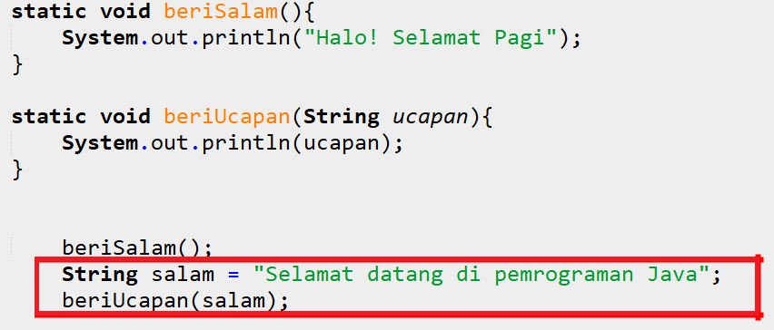
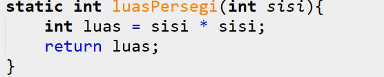

# JOBSHEET 13. Fungsi 1

## Tujuan
* Mahasiswa mampu memahami penggunaan fungsi static pada Java dengan parameter dan mengembalikan nilai.
* Mahasiswa mampu membuat program menggunakan fungsi static dan mengeksekusi fungsi tersebut.


## Alat dan Bahan
* PC/Laptop
* Browser
* Koneksi internet
* Anaconda3 + Java kernel (opsional)

## Praktikum

### Percobaan 1: Fungsi Void (tidak menggunakan return value)

1.	Buat fungsi **beriSalam** bertipe void yang digunakan untuk mencetak **“Halo! Selamat Pagi”**.


2. Eksekusi atau panggil fungsi **beriSalam**.


```Java
// Tuliskan kode program Percobaan 1 Langkah 1 & 2
static void beriSalam(){
  System.out.println("Halo! Selamat Pagi");
}
beriSalam();
```

    Halo! Selamat Pagi


3. Buat fungsi **beriUcapan** dengan sebuah parameter bertipe String.


4. Buatlah variabel **salam** bertipe String kemudian eksekusi atau panggil fungsi **beriUcapan** dengan mengisi parameternya dengan variable **salam** yang sudah dibuat.



```Java
// Tuliskan kode program Percobaan 1 Langkah 1, 2, 3 & 4
static void beriSalam(){
    System.out.println("Halo! Selamat Pagi");
}
static void beriUcapan(String ucapan){
    System.out.println(ucapan);
}
beriSalam();
String salam="Selamat datang di pemrograman Java";
beriUcapan(salam);
```

    Halo! Selamat Pagi
    Selamat datang di pemrograman Java


#### Pertanyaan
1. Jelaskan perbedaan fungsi **beriSalam** dan **beriUcapan** pada praktikum 1!

beriSalam= Pemanggilan fungsi dalam fungsi main beriUcapan= Parameter/ input untuk fungsi

2. Jelaskan cara pemanggilan sebuah fungsi void yang berparameter dan tanpa parameter!

Fungsi berparameter dengan variabel dan fungsi void tidak menggunakan variabel

### Percobaan 2: Fungsi dengan return value (Bukan void)
Pada Percobaan 2, kode program yang dibuat digunakan untuk menghitung luas persegi dengan membuat fungsi **luasPersegi** yang menggunakan parameter.
1. Buat fungsi **luasPersegi**  untuk menghitung luas persegi yang mengembalikan nilai luas (int) dan parameter masukan sisi (int).


2.	Eksekusi atau panggil fungsi luasPersegi dengan cara membuat variabel baru yaitu **luasan**, kemudian isi variabel tersebut dengan memanggil fungsi luasPersegi dan mengisi parameter sisi. Selanjutnya cetak variabel luasan untuk menampilkan luas persegi panjang


```Java
// Tuliskan kode program Percobaan 2 Langkah 1 & 2
static int luasPersegi(int sisi){
    int luas=sisi*sisi;
    return luas;
}

int luasan=luasPersegi(5);
System.out.println("Luas Persegi dengan sisi 5="+luasan);
```

    Luas Persegi dengan sisi 5=25


#### Pertanyaan
1. jelaskan mengapa ketika memanggil fungsi **luasPersegi** harus membuat variabel baru yaitu luasan?

Karena untuk pemanggilan fungsi.

2. Jelaskan kegunaan **return luas** pada percobaan 2 diatas!

Membuat fungsi di dalam class tersebut yang mengembalikan nilai luas (int) dan parameter masukan sisi (int).

3. Modifikasilah program di percobaan 2, dengan membuat panjang **sisi** sebagai inputan!


```Java
// Tuliskan jawaban nomor 2
Scanner sc = new Scanner (System.in);
static int luasPersegi (int sisi){
    int luas = sisi * sisi ;
    return luas;
}
int masuk = sc.nextInt();
int luasP = luasPersegi(masuk);
System.out.printf("Luas Persegi dengan sisi %d = %d ",masuk,luasP);
```

    2
    Luas Persegi dengan sisi 2 = 4 


    java.io.PrintStream@336ecff5


### Percobaan 3: Fungsi dapat meng-CALL Fungsi Lain
Pada Percobaan 3, kode program yang dibuat digunakan untuk mengimplementasikan bahwa fungsi dapat meng-CALL fungsi yang lain. Dimana dalam percobaan ini terdapat fungsi **Kali dan Kurang**. 
1. Buatlah fungsi **Kali** yang mengembalikan nilai H (int) dan parameter masukan C dan D (int).


2.	Buatlah fungsi **Kurang** yang mengembalikan nilai X (int) dan parameter masukan A dan B (int) dan memanggil fungsi Kali.


3. Lakukan import class Scanner sebagai inputan di langkah selajutnya.

4. Eksekusi atau panggil fungsi **Kurang** .


```Java
// Tuliskan kode program Percobaan 3 Langkah 1, 2, 3 & 4
static int Kali (int C,int D){
    int H;
    H=(C+10)%(D+19);
    return H;
}
static int Kurang (int A, int B){
    int X;
    A=A+7;
    B=B+4;
    X=Kali(A, B);
    return X;
}
int nilai1, nilai2;
Scanner input=new Scanner(System.in);
System.out.println("Masukkan Nilai 1:");
nilai1=input.nextInt();
System.out.println("Masukkan Nilai 2:");
nilai2=input.nextInt();
int hasil=Kurang(nilai1, nilai2);
System.out.println("Hasil akhir adalah " + hasil);
```

    Masukkan Nilai 1:
    2
    Masukkan Nilai 2:
    3
    Hasil akhir adalah 19


#### Pertanyaan
1. Modifikasilah percobaan diatas dimana di fungsi **Kali** dapat memanggil fungsi **Kurang** kemudian eksekusi atau panggil fungsi Kali


```Java
// Tuliskan jawaban nomor 1
static int Kurang (int C,int D){
    int H;
    H=(C+10)%(D+19);
    return H;
}
static int Kurang (int A, int B){
    int X;
    A=A+7;
    B=B+4;
    X=Kurang(A, B);
    return X;
}

int nilai1, nilai2;
Scanner input=new Scanner(System.in);
System.out.println("Masukkan Nilai 1:");
nilai1=input.nextInt();
System.out.println("Masukkan Nilai 2:");
nilai2=input.nextInt();
int hasil=Kali(nilai1, nilai2);
System.out.println("Hasil akhir adalah " + hasil);
```

    Masukkan Nilai 1:
    2
    Masukkan Nilai 2:
    3
    Hasil akhir adalah 12


2. Jelaskan alur jalannya program di percobaan 3 mulai dari input sampai keluar output!

input nilai 1 dan nilai 2 kemudian inputan dimasukkan ke dalam variabel masing-masing lalu akan di proses dengan fungsi kurang. 

### Percobaan 4: Mengubah Program Tidak Menggunakan Fungsi dan Menggunakan Fungsi
Pada Percobaan 4, kode program yang dibuat digunakan untuk menghitung luas persegi panjang dan volume balok tanpa menggunakan fungsi dan dengan menggunakan fungsi.
1. Import dan deklarasikan Scanner dengan nama **input**


2. Buatlah inputan panjang, lebar, dan tinggi 


3. Hitung luas persegi panjang dan volume balok


```Java
// Tuliskan kode program Percobaan 4 Langkah 1, 2, & 3
import java.util.Scanner;
Scanner input=new Scanner(System.in);
    int p,l,t,L,vol;

System.out.println("Masukkan panjang");
p=input.nextInt();
System.out.println("Masukkan lebar");
l=input.nextInt();
System.out.println("Masukkan tinggi");
t=input.nextInt();
L=p*l;
System.out.println("Luas Persegi Panjang adalah "+L);
vol=p*l*t;
System.out.println("Volume balok adalah "+vol);
```

    Masukkan panjang
    2
    Masukkan lebar
    3
    Masukkan tinggi
    4
    Luas Persegi Panjang adalah 6
    Volume balok adalah 24


4. Program menghitung luas persegi dan volume balok diatas jika dibuatkan fungsi maka terdapat 3 fungsi yaitu hitungLuas, hitungVolume dan fungsi main, seperti dibawah ini:

Fungsi hitungLuas


Fungsi hitungVolume


5. Eksekusi/panggil fungsi **hitungLuas** dan **hitungVolume**


```Java
// Tuliskan kode program Percobaan 4 Langkah 1, 2, & 3
static int hitungLuas(int pjg, int lb){
    int Luas=pjg*lb;
    return Luas;
}
static int hitungVolume(int tinggi, int a, int b){
    int volume=hitungLuas(a,b)*tinggi;
    return volume;
}

Scanner input=new Scanner (System.in);
int p , l, t, L, vol;
System.out.println("Masukkan panjang");
p=input.nextInt();
System.out.println("Masukkan lebar");
l=input.nextInt();
System.out.println("Masukkan tinggi");
t=input.nextInt();

L=hitungLuas(p,l);
System.out.println("Luas Persegi Panjang adalah "+L);
vol=hitungVolume(t,p,l);
System.out.println("Volume Balok adalah "+vol);
```

    Masukkan panjang
    2
    Masukkan lebar
    3
    Masukkan tinggi
    4
    Luas Persegi Panjang adalah 6
    Volume Balok adalah 24


#### Pertanyaan
1. Jelaskan kegunaan parameter yang terdapat didalam fungsi hitungLuas dan hitungVolume!

Fungsi parameter input untuk fungsi

2. Setelah melakukan percobaan 4, menurut anda manakah program yg lebih efisien apakah menggunakan fungsi atau tanpa fungsi? Jelaskan!

Lebih efisien menggunakan fungsi tetapi saya lebih suka tidak menggunakan fungsi, karena saya masih perlu belajar lagi materi fungsi.

### Percobaan 5: Fungsi Menggunakan Array dan Variabel Global
Pada Percobaan 5, kode program yang dibuat digunakan untuk menghitung total nilai yang ada didalam array dengan membuat 3 fungsi yaitu isiarray, hitTol, dan tampilArray.
1. Buatlah **variable global total dan i** bertipe int


2. Buatlah fungsi **isiarray** bertipe int dengan parameter angka bertipe int 


3. Buatlah fungsi **tampilArray** bertipe **void** dengan parameter data array **arr** bertipe int


4. Buatlah fungsi **hitTot** bertipe int dengan parameter data array **arr** bertipe int


5. Import dan deklarasikan Scanner dengan nama **input**


6. Eksekusi atau panggil ketiga fungsi yaitu **isiarray, tampilArray, dan hitTot**, kemudian jalankan program!


```Java
// Tuliskan kode program Percobaan 4 Langkah 1 s/d 6
static int total=0,i; //Variabel Global

static int[] isiarray(int angka){
    Scanner input=new Scanner(System.in);
    int array []=new int [angka];
    for(i=0; i<array.length; i++){
        System.out.println("Masukkan data ke- "+i);
        array[i]=input.nextInt();
    }
    return array;
}

static void tampilArray(int[]arr){
    for(i=0;i<arr.length;i++){
        System.out.println("Nilai yang anda inputkan ke- "+i);
        System.out.println(arr[i]);
}
}
static int hitTot(int[]arr){
    for (i=0; i<arr.length;i++){
        total+=arr[i];
    }
    return total;
}
import java.util.Scanner; //untuk mengambil fungsi scanner pada java.
Scanner input=new Scanner(System.in);

System.out.println("Masukkan jumlah data yang ingin anda inginkan:");
int jum=input.nextInt();
int[]dataArray=isiarray(jum);
tampilArray(dataArray);
total=hitTot(dataArray);
System.out.println("Total nilai="+total);
```

    Masukkan jumlah data yang ingin anda inginkan:
    2
    Masukkan data ke- 0
    3
    Masukkan data ke- 1
    4
    Nilai yang anda inputkan ke- 0
    3
    Nilai yang anda inputkan ke- 1
    4
    Total nilai=7


#### Pertanyaan
1. Jelaskan mengapa fungsi tampil array dibuat bertipe void, sedangkan isiarray dan hitTot bertipe int!

Karena fungsi tampilan array tidak menggunakan variabel, hitTot karena menggunakan parameter

2. Menurut pendapat anda apakah fugsi isiarray dan hitTot dapat diganti dengan tipe void? Jelaskan dan buktikan dengan program!

Eror karena tidak ada variabel yang menampung nilai untuk diproses di dalam fungsi.


```Java
// Tuliskan jawaban nomor 2
static int total=0,i; //Variabel Global

static int[] isiarray(int angka){
    Scanner input=new Scanner(System.in);
    int array []=new int [angka];
    for(i=0; i<array.length; i++){
        System.out.println("Masukkan data ke- "+i);
        array[i]=input.nextInt();
    }
    return array;
}

static void tampilArray(int[]arr){
    for(i=0;i<arr.length;i++){
        System.out.println("Nilai yang anda inputkan ke- "+i);
        System.out.println(arr[i]);
}
}
static int hitTot(){
    for (i=0; i<arr.length;i++){
        total+=arr[i];
    }
    return total;
}
import java.util.Scanner;
Scanner input=new Scanner(System.in);

System.out.println("Masukkan jumlah data yang ingin anda inginkan:");
int jum=input.nextInt();
int[]dataArray=isiarray(jum);
tampilArray(dataArray);
total=hitTot();
System.out.println("Total nilai="+total);
```

    Masukkan jumlah data yang ingin anda inginkan:
    2
    Masukkan data ke- 0
    3
    Masukkan data ke- 1
    4
    Nilai yang anda inputkan ke- 0
    3
    Nilai yang anda inputkan ke- 1
    4


    |   

    |   static int hitTot(){

    |       for (i=0; i<arr.length;i++){

    |           total+=arr[i];

    |       }

    |       return total;

    |   }

    Unresolved dependencies:

       - variable arr


## Tugas

1. Buatlah sebuah static method yang bernama Max3(int bil1, int bil2, int bil3) yang menerima 3 buah parameter bilangan integer dan mengembalikan sebuah bilangan integer yang merupakan nilai maksimum diantara ketiga bilangan tersebut. 


```Java
// Tuliskan jawaban nomor 1
Scanner masukan = new Scanner(System.in);
int bil1, bil2, bil3;
System.out.println("Program Mencari Nilai Max");
System.out.print("Masukan bilangan 1 = ");
bil1 = masukan.nextInt();
System.out.print("Masukan bilangan 2 = ");
bil2 = masukan.nextInt();
System.out.print("Masukan bilangan 3 = ");
bil3 = masukan.nextInt();
System.out.println();
System.out.println("Jumlah bil1+bil2 = "+(jumlah(bil1,bil2)));
System.out.println("Jumlah bil2+bil3 = "+(jumlah(bil2,bil3)));
System.out.println("Jumlah bil1+bil3 = "+(jumlah(bil1,bil3)));
String max="";

max = (jumlah(bil1,bil2))>=(jumlah(bil2,bil3))?""+(jumlah(bil1,bil2)):(jumlah(bil2,bil3)>=bil3)?""+(jumlah(bil2,bil3)):""+(jumlah(bil1,bil3));

System.out.println();
System.out.println("Mencari Nilai Terbesar");
System.out.println("Bilangan 1 = "+(jumlah(bil1,bil2)));
System.out.println("Bilangan 2 = "+(jumlah(bil2,bil3)));
System.out.println("Bilangan 3 = "+(jumlah(bil1,bil3)));
System.out.println();
System.out.println("Nilai Max adalah = "+max);

private static int jumlah(int a, int b) {
int hasil = a + b;
 
return hasil;
//Pembuatan Fungsi dengan parameter dan return value
    }
```

    Program Mencari Nilai Max
    Masukan bilangan 1 = 2
    Masukan bilangan 2 = 3
    Masukan bilangan 3 = 4
    
    Jumlah bil1+bil2 = 5
    Jumlah bil2+bil3 = 7
    Jumlah bil1+bil3 = 6
    
    Mencari Nilai Terbesar
    Bilangan 1 = 5
    Bilangan 2 = 7
    Bilangan 3 = 6
    
    Nilai Max adalah = 7


2. Disebuah restoran terdapat 3 menu yang dijual yaitu nasi goreng, soto, dan sate. Harga nasi goreng Rp. 20.000, soto Rp. 15.000, dan sate Rp. 25.000. Restoran tersebut buka dari hari senin sampai jumat. Berikut ini merupakan tabel pejualan perhari untuk masing-masing menu di restoran tersebut dari hari senin sampai jumat


Buatlah Fungsi sebagai berikut:
 * Fungsi menampilkan menu favorit di hari selasa dan jumat (menu favorit diasumsikan adalah menu yang paling banyak terjual di hari tersebut)
 * Fungsi untuk menghitung pemasukan restoran tersebut mulai hari senin sampai jumat.
 * Fungsi untuk menghitung berapa porsi yang terjual untuk masing-masing menu yaitu nasi goreng, soto, dan sate mulai senin sampai jumat.


```Java
// Tuliskan jawaban nomor 2
String[] hari = {"Senin", "Selasa", "Rabu", "Kamis", "Jumat"}; 
//hari

int[][] penjualan = {{20,15,35,24,70},
                     {30,40,10,28,35},
                     {5,10,50,48,15}};

String[] menu = {"Nasi goreng", "Soto", "Sate"}; 
//menu

static void menuFavorit(int hariKe) {
    hariKe -= 1; // Mengurangi parameter
    int indexFavorit = 0, porsi = penjualan[0][hariKe]; // Deklarasi awal 
    for(int i = 0; i < penjualan.length; i++)
        if(porsi < penjualan[i][hariKe]) indexFavorit = i; 
    //Pengecekan porsi tertingi
    printf("\nMenu favorit pada hari %s adalah %s", hari[hariKe], menu[indexFavorit]); 
    // Output hari dan menu favorit
}
static void porsiYangTerjual(int porsiKe) {
    int total = 0;
    porsiKe -= 1; // Mengurangi parameter 
    for(int i = 0; i < penjualan[0].length; i++) total += penjualan[porsiKe][i];
    printf("\nPorsi %s yang terjual adalah %d porsi", menu[porsiKe], total );
}


// Pemanggilan Fungsi
System.out.printf("==============Data Penjualan==============");
menuFavorit(2); // Hari Selasa
menuFavorit(5); //Hari Jumat

porsiYangTerjual(1); // Menu Nasi Goreng
porsiYangTerjual(2); // Menu Soto
porsiYangTerjual(3); // Menu Sate

```

    ==============Data Penjualan==============
    Menu favorit pada hari Selasa adalah Soto
    Menu favorit pada hari Jumat adalah Nasi goreng
    Porsi Nasi goreng yang terjual adalah 164 porsi
    Porsi Soto yang terjual adalah 143 porsi
    Porsi Sate yang terjual adalah 128 porsi


```Java

```


```Java

```
