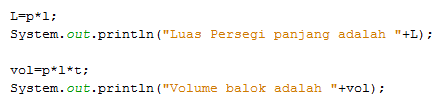

#### Nama  : Benaya Laskar Firdaus
#### Kelas  : 1A-MI
#### Nim     : 2131710083

# JOBSHEET 13. Fungsi 1

## Tujuan
* Mahasiswa mampu memahami penggunaan fungsi static pada Java dengan parameter dan mengembalikan nilai.
* Mahasiswa mampu membuat program menggunakan fungsi static dan mengeksekusi fungsi tersebut.


## Alat dan Bahan
* PC/Laptop
* Browser
* Koneksi internet
* Anaconda3 + Java kernel (opsional)

## Praktikum

### Percobaan 1: Fungsi Void (tidak menggunakan return value)

1.	Buat fungsi **beriSalam** bertipe void yang digunakan untuk mencetak **“Halo! Selamat Pagi”**.


2. Eksekusi atau panggil fungsi **beriSalam**.


```Java
// Tuliskan kode program Percobaan 1 Langkah 1 & 2
static void beriSalam(){
    System.out.println("Haloo! Selamat Pagi");
}
beriSalam();

```

    Haloo! Selamat Pagi


3. Buat fungsi **beriUcapan** dengan sebuah parameter bertipe String.


4. Buatlah variabel **salam** bertipe String kemudian eksekusi atau panggil fungsi **beriUcapan** dengan mengisi parameternya dengan variable **salam** yang sudah dibuat.


```Java
// Tuliskan kode program Percobaan 1 Langkah 1, 2, 3 & 4
static void beriSalam(){
    System.out.println("Halo! Selamat Pagi");
}
static void beriUcapan(String ucapan){
    System.out.println(ucapan);
}
    beriSalam();
String salam = "Selamat datang di pemrograman Java";
beriUcapan(salam);
```

    Halo! Selamat Pagi
    Selamat datang di pemrograman Java


#### Pertanyaan
1. Jelaskan perbedaan fungsi **beriSalam** dan **beriUcapan** pada praktikum 1!

2. Jelaskan cara pemanggilan sebuah fungsi void yang berparameter dan tanpa parameter!

1. beriSalam disini adalah fungsi kosong tanpa parameter yang berisi statement "Halo! Selamat Pagi"
    beriUcapan disini adalah fungsi yang berisi parameter string ucapan

2. Tanpa parameter hanya mengetik nama fungsi void, Fungsi(), jika berparameter mengetik nama fungsi dan parameternya Fungsi(parameter).

### Percobaan 2: Fungsi dengan return value (Bukan void)
Pada Percobaan 2, kode program yang dibuat digunakan untuk menghitung luas persegi dengan membuat fungsi **luasPersegi** yang menggunakan parameter.
1. Buat fungsi **luasPersegi**  untuk menghitung luas persegi yang mengembalikan nilai luas (int) dan parameter masukan sisi (int).


2.	Eksekusi atau panggil fungsi luasPersegi dengan cara membuat variabel baru yaitu **luasan**, kemudian isi variabel tersebut dengan memanggil fungsi luasPersegi dan mengisi parameter sisi. Selanjutnya cetak variabel luasan untuk menampilkan luas persegi panjang


```Java
// Tuliskan kode program Percobaan 2 Langkah 1 & 2
static int luasPersegi(int sisi){
    int luas = sisi * sisi;
    return luas;
}
int luasan = luasPersegi(5);
System.out.println("Luas Persegi ddengan sisi 5 = " + luasan);
```

    Luas Persegi ddengan sisi 5 = 25


#### Pertanyaan
1. jelaskan mengapa ketika memanggil fungsi **luasPersegi** harus membuat variabel baru yaitu luasan?

2. Jelaskan kegunaan **return luas** pada percobaan 2 diatas!

3. Modifikasilah program di percobaan 2, dengan membuat panjang **sisi** sebagai inputan!

#### jawaban
1.Agar fungsi luas persegi dapat dipanggil dan diproses di dalam variable yang baru bertipe interger.

2.Return luas untuk mengembalikkan nilai dari fungsi tersebut.


```Java
// jawaban untuk nomor 3

import java.util.Scanner;
Scanner input = new Scanner(System.in);
static int luasPersegi(int sisi){
    int luas = sisi * sisi;
    return luas;
}
int panjang;
System.out.println("Masukkan panjang sisi: ");
panjang = input.nextInt();
int luasan = luasPersegi(panjang);
System.out.printf("Luas Persegi dengan sisi %d = %d", panjang,luasan);
```

    Masukkan panjang sisi: 
    4
    Luas Persegi dengan sisi 4 = 16


    java.io.PrintStream@79a55e4d


### Percobaan 3: Fungsi dapat meng-CALL Fungsi Lain
Pada Percobaan 3, kode program yang dibuat digunakan untuk mengimplementasikan bahwa fungsi dapat meng-CALL fungsi yang lain. Dimana dalam percobaan ini terdapat fungsi **Kali dan Kurang**. 
1. Buatlah fungsi **Kali** yang mengembalikan nilai H (int) dan parameter masukan C dan D (int).


2.	Buatlah fungsi **Kurang** yang mengembalikan nilai X (int) dan parameter masukan A dan B (int) dan memanggil fungsi Kali.


3. Lakukan import class Scanner sebagai inputan di langkah selajutnya.

4. Eksekusi atau panggil fungsi **Kurang** .


```Java
// Tuliskan kode program Percobaan 3 Langkah 1, 2, 3 & 4
static int kali(int C, int D){
    int H;
    H = (C + 10) % (D + 19);
    return H;
}

static int kurang(int A, int B){
    int X;
    A = A + 7;
    B = B + 4;
    X = kali(A, B);
    return X;
}
int nilai1, nilai2;
Scanner input = new Scanner (System.in);
System.out.println("Masukkan Nilai 1: ");
nilai1 = input.nextInt();
System.out.println("Masukkan Nilai 2: ");
nilai2 = input.nextInt();
int hasil = kurang(nilai1, nilai2)
;
System.out.println("Hasil akhir adalah \n" + hasil);

```

    Masukkan Nilai 1: 
    4
    Masukkan Nilai 2: 
    5
    Hasil akhir adalah 
    21


#### Pertanyaan
1. Modifikasilah percobaan diatas dimana di fungsi **Kali** dapat memanggil fungsi **Kurang** kemudian eksekusi atau panggil fungsi Kali


```Java
// Tuliskan jawaban nomor 1
static int kurang(int C, int D){
    int H;
    H = (C + 10) % (D + 19);
    return H;
}

static int kali(int A, int B){
    int X;
    A = A + 7;
    B = B + 4;
    X = kurang(A, B);
    return X;
}
int nilai1, nilai2;
Scanner input = new Scanner (System.in);
System.out.println("Masukkan Nilai 1: ");
nilai1 = input.nextInt();
System.out.println("Masukkan Nilai 2: ");
nilai2 = input.nextInt();
int hasil = kurang(nilai1, nilai2)
;
System.out.println("Hasil akhir adalah \n" + hasil);

```

    Masukkan Nilai 1: 
    3
    Masukkan Nilai 2: 
    4
    Hasil akhir adalah 
    13


2. Jelaskan alur jalannya program di percobaan 3 mulai dari input sampai keluar output!

##### Jawaban nomor 2
alurnya yaitu saat user menginputkan angka, maka angka tersebut akan diproses kefungsi "kurang" lalu dilanjutkan ke fungsi "kali", lalu output data akan muncul setelah melalui tahapan proses tersebut.

### Percobaan 4: Mengubah Program Tidak Menggunakan Fungsi dan Menggunakan Fungsi
Pada Percobaan 4, kode program yang dibuat digunakan untuk menghitung luas persegi panjang dan volume balok tanpa menggunakan fungsi dan dengan menggunakan fungsi.
1. Import dan deklarasikan Scanner dengan nama **input**


2. Buatlah inputan panjang, lebar, dan tinggi 


3. Hitung luas persegi panjang dan volume balok



```Java
// Tuliskan kode program Percobaan 4 Langkah 1, 2, & 3
import java.util.Scanner;
Scanner input = new Scanner(System.in);

int p,l,t,L,vol;
System.out.println("Masukkan panjang");
p=input.nextInt();
System.out.println("Masukkan lebar");
l=input.nextInt();
System.out.println("Masukkan Tinggi");
t=input.nextInt();

L=p*l;
System.out.println("Luas persegi panjang adalah \n "  +L);

vol=p*l*t;
System.out.println("Volume balok adalah \n "  +vol);
```

    Masukkan panjang
    3
    Masukkan lebar
    4
    Masukkan Tinggi
    5
    Luas persegi panjang adalah 
     12
    Volume balok adalah 
     60


4. Program menghitung luas persegi dan volume balok diatas jika dibuatkan fungsi maka terdapat 3 fungsi yaitu hitungLuas, hitungVolume dan fungsi main, seperti dibawah ini:

Fungsi hitungLuas


Fungsi hitungVolume


5. Eksekusi/panggil fungsi **hitungLuas** dan **hitungVolume**


```Java
// Tuliskan kode program Percobaan 4 Langkah 1, 2, & 3
static int hitungVolume(int tinggi, int a, int b){
    int volume = hitungLuas(a,b)* tinggi;
    return volume;
}
static int hitungLuas(int pjg, int lb){
    int Luas = pjg * lb;
    return Luas;
}
Scanner input = new Scanner (System.in);
int p,l,v,t,L, vol;

System.out.println("Masukkan panjang");
p=input.nextInt();
System.out.println("Masukkan lebar");
l=input.nextInt();
System.out.println("Masukkan tinggi");
t=input.nextInt();

L = hitungLuas(p,l);//sebelumnya kan kita menginputkan angka p dan l yang berarti panjang dan lebar,di syntax ini kita memanggil fungsi hitungLuas dan di variabel pjg dan lb sudah terisi dengan nilai yang sudah di inputkan sebelumnya
System.out.println("Masukkan Persegi Panjang Adalah "+L);
vol=hitungVolume(t,p,l);//sama seperti di L
System.out.println("Volume balok adalah"+ vol);
```

    Masukkan panjang
    7
    Masukkan lebar
    8
    Masukkan tinggi
    4
    Masukkan Persegi Panjang Adalah 56
    Volume balok adalah224


#### Pertanyaan
1. Jelaskan kegunaan parameter yang terdapat didalam fungsi hitungLuas dan hitungVolume!

2. Setelah melakukan percobaan 4, menurut anda manakah program yg lebih efisien apakah menggunakan fungsi atau tanpa fungsi? Jelaskan!

#### Jawaban
1.Untuk diolah dan diinputkan sebuah data lalu diproses dalam fungsi

2.Menggunakan fungsi lebih efisien karena kita tidak perlu mengulang-ulang pekerjaan dan hanya memanggil fungsi saja.

### Percobaan 5: Fungsi Menggunakan Array dan Variabel Global
Pada Percobaan 5, kode program yang dibuat digunakan untuk menghitung total nilai yang ada didalam array dengan membuat 3 fungsi yaitu isiarray, hitTol, dan tampilArray.
1. Buatlah **variable global total dan i** bertipe int


2. Buatlah fungsi **isiarray** bertipe int dengan parameter angka bertipe int 


3. Buatlah fungsi **tampilArray** bertipe **void** dengan parameter data array **arr** bertipe int


4. Buatlah fungsi **hitTot** bertipe int dengan parameter data array **arr** bertipe int


5. Import dan deklarasikan Scanner dengan nama **input**


6. Eksekusi atau panggil ketiga fungsi yaitu **isiarray, tampilArray, dan hitTot**, kemudian jalankan program!


```Java
// Tuliskan kode program Percobaan 4 Langkah 1 s/d 6
static int total=0,i;

static int[] isiarray (int angka) {
    Scanner input = new Scanner (System.in);
    int  array[]=new int[angka];
    for (i=0; i<array.length; i++){
        System.out.println("Masukkan data ke- "+i);
        array[i]=input.nextInt();
    }
    return array;
}

static void tampilArray(int [] arr){
    for (i=0; i<arr.length; i++){
        System.out.println("Nilai yang anda inputkan ke "+i);
        System.out.println(arr[i]);
    }
}
static int hitTot(int []arr){
    for (i=0; i<arr.length; i++){
        total+=arr[i];
    }
    return total;
}
import java.util.Scanner;
Scanner input = new Scanner(System.in);

System.out.println("Masukkan jumlah data yang ingin anda inputkan:\n ");
int jum=input.nextInt();
int []dataArray=isiarray(jum);
tampilArray(dataArray);
total=hitTot(dataArray);
System.out.println("Total Nilai =\n "+total);
```

    Masukkan jumlah data yang ingin anda inputkan:
     
    3
    Masukkan data ke- 0
    4
    Masukkan data ke- 1
    5
    Masukkan data ke- 2
    3
    Nilai yang anda inputkan ke 0
    4
    Nilai yang anda inputkan ke 1
    5
    Nilai yang anda inputkan ke 2
    3
    Total Nilai =
     12


## Pertanyaan
1. Jelaskan mengapa fungsi tampil array dibuat bertipe void, sedangkan isiarray dan hitTot bertipe int!

karena di isiarray dan hittot harus menginputkan data, tetapi di tampilArray hanya menampilkan saja

2. Menurut pendapat anda apakah fugsi isiarray dan hitTot dapat diganti dengan tipe void? Jelaskan dan buktikan dengan program!


```Java
// Tuliskan jawaban nomor 2
import java.util.Scanner;
Scanner input = new Scanner(System.in);
static int total = 0,i;

static int [] isiarray (int angka){
    Scanner input =new Scanner (System.in);
    int array[]= new int [angka];
    for (i = 0; i<array.length; i++){
        System.out.println("Masukkan data ke - "+(i+1));
        array[i] = input.nextInt();
    }
    return array;
}

static void tampilArray(int [] arr){
    for (i=0; i<arr.length; i++){
        System.out.println("Nilai yang anda inputkan ke "+(i+1));
        System.out.println(arr[i]);
    }
}
static void hitTot(int [] arr){
    for(i=0; i<arr.length; i++){
        total += arr[i];
    }
    return total;
}
System.out.println("Masukkan jumlah data yang ingin anda inputkan: ");
int jum = input.nextInt();
int []dataArray = isiarray(jum);
tampilArray(dataArray);
total= hitTot(dataArray);
System.out.println("Total nilai= "+total)
//jawaban
//tidak bisa/eror karena dalam fungsi yang disebutkan harus menginputkan atau mengimput sebuah rumus dan juga perlu di return

```


    |       return total;

    incompatible types: unexpected return value

    


## Tugas

1. Buatlah sebuah static method yang bernama Max3(int bil1, int bil2, int bil3) yang menerima 3 buah parameter bilangan integer dan mengembalikan sebuah bilangan integer yang merupakan nilai maksimum diantara ketiga bilangan tersebut. 


```Java
// Tuliskan jawaban nomor 1
static int Max3(int A, int B, int C){//fungsi ini digunakan untuk mencari nilai terbesar
    int l = 0;
        if(A>B && A>C){
            l = A;
        }else if(B>A && B>C){
            l = B;
        } else{
            l = C;
        }
    return l;
}
import java.util.Scanner;
Scanner sc = new Scanner(System.in);
int bil1,bil2,bil3,max;
System.out.print("bil 1 = ");
bil1=sc.nextInt();
System.out.print("bil 2 = ");
bil2=sc.nextInt();
System.out.print("bil 3 = ");
bil3=sc.nextInt();

max=Max3(bil1,bil2,bil3);//dalam kode disamping digunakkan untuk memanggil fungsi Max3/fungsi untuk mencari nilai terbesar
System.out.print("Nilai Terbesar adalah = "+ max)

```

    bil 1 = 3
    bil 2 = 2
    bil 3 = 4
    Nilai Terbesar adalah = 4

2. Disebuah restoran terdapat 3 menu yang dijual yaitu nasi goreng, soto, dan sate. Harga nasi goreng Rp. 20.000, soto Rp. 15.000, dan sate Rp. 25.000. Restoran tersebut buka dari hari senin sampai jumat. Berikut ini merupakan tabel pejualan perhari untuk masing-masing menu di restoran tersebut dari hari senin sampai jumat


Buatlah Fungsi sebagai berikut:
 * Fungsi menampilkan menu favorit di hari selasa dan jumat (menu favorit diasumsikan adalah menu yang paling banyak terjual di hari tersebut)
 * Fungsi untuk menghitung pemasukan restoran tersebut mulai hari senin sampai jumat.
 * Fungsi untuk menghitung berapa porsi yang terjual untuk masing-masing menu yaitu nasi goreng, soto, dan sate mulai senin sampai jumat.


```Java
// Tuliskan jawaban nomor 2
static String hari[] = {"Senin","Selasa","Rabu","Kamis","Jumat"};
static String menuMakan[]= {"Nasi Goreng","Soto","Sate"};
static int porsi[][] = {{20,15,35,24,70},
                        {30,40,10,28,35},
                        {5,10,50,48,15}};
static void Fav(){
    int max = 0;
    int max1 = 0;
    String menu1="";
    String menu2="";
     for(int i = 0; i<porsi.length; i++){
             if(porsi[i][1]>max)//if disini yaitu untuk mencari porsi terbesar dan juga mencari nama makanan
             {
                  max = porsi[i][1];
                  menu1 = menuMakan[i];
             }
             if(porsi[i][3]>max1)
             {
                  max1 = porsi[i][3];
                  menu2 = menuMakan[i];
             }
             
             
         
     }
        System.out.println("Favorit di hari selasa adalah "+max+" Porsi "+menu1);
        System.out.println("Favorit di hari jumat adalah "+max1+ " Porsi "+menu2);
}

Fav();
static void upeti(){
    int nasgor = 0 ;
    int uangNasgor  = 0 ;
    int soto = 0 ;
    int uangSoto  = 0 ;
    int sate = 0 ;
    int uangSate  = 0 ;
    int totPem = 0;
    for(int i = 0; i<porsi.length; i++){//disamping adalah sebuah fungsi untuk menjumlah semua pemasokan
        for(int j = 0; j<porsi[0].length; j++){
           if (i == 0){
               nasgor += porsi[i][j];
           }
            
        }
    }
     for(int i = 0; i<porsi.length; i++){
        for(int j = 0; j<porsi[0].length; j++){
           if (i == 1){
               soto += porsi[i][j];
           }
        }
     }
      for(int i = 0; i<porsi.length; i++){
        for(int j = 0; j<porsi[0].length; j++){
           if (i == 2){
               sate += porsi[i][j];
           }
        }
     }
    uangNasgor = nasgor * 20000 ;
    uangSoto = soto * 15000 ;
    uangSate = sate * 25000 ;
    totPem = uangNasgor + uangSoto + uangSate;
    System.out.println("\nPemasokan uang dari Nasi Goreng pada hari senin sampai jum'at adalah Rp." +uangNasgor) ;
     System.out.println("Pemasokan uang dari Soto pada hari senin sampai jum'at adalah Rp." +uangSoto) ;
     System.out.println("Pemasokan uang dari Sate pada hari senin sampai jum'at adalah Rp." +uangSate) ;
    System.out.println("\nTotal pemasokan semuanya adalah Rp." +totPem) ;
    
}

upeti();
    static void pors(){//disamping adalah sebuah fungsi untuk menjumlah semua porsi
        int sego = 0;
        int sto = 0;
        int ste = 0;
        for(int i = 0; i<porsi.length; i++){
        for(int j = 0; j<porsi[0].length; j++){
           if (i == 0){
               sego += porsi[i][j];
           }
            
        }
    }
     for(int i = 0; i<porsi.length; i++){
        for(int j = 0; j<porsi[0].length; j++){
           if (i == 1){
               sto += porsi[i][j];
           }
        }
     }
      for(int i = 0; i<porsi.length; i++){
        for(int j = 0; j<porsi[0].length; j++){
           if (i == 2){
               ste += porsi[i][j];
           }
        }
     }
        System.out.println("\nPorsi Nasi Goreng pada hari senin sampai jum'at yang terjual yaitu " +sego+ " Porsi");
        System.out.println("Porsi Soto pada hari senin sampai jum'at yang terjual yaitu " +sto+ " Porsi");
        System.out.println("Porsi Sate pada hari senin sampai jum'at yang terjual yaitu " +ste+ " Porsi");
    }
pors()
```

    Favorit di hari selasa adalah 40 Porsi Soto
    Favorit di hari jumat adalah 48 Porsi Sate
    
    Pemasokan uang dari Nasi Goreng pada hari senin sampai jum'at adalah Rp.3280000
    Pemasokan uang dari Soto pada hari senin sampai jum'at adalah Rp.2145000
    Pemasokan uang dari Sate pada hari senin sampai jum'at adalah Rp.3200000
    
    Total pemasokan semuanya adalah Rp.8625000
    
    Porsi Nasi Goreng pada hari senin sampai jum'at yang terjual yaitu 164 Porsi
    Porsi Soto pada hari senin sampai jum'at yang terjual yaitu 143 Porsi
    Porsi Sate pada hari senin sampai jum'at yang terjual yaitu 128 Porsi


```Java

```
