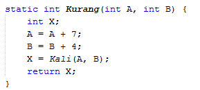

# JOBSHEET 13. Fungsi 1

## Tujuan
* Mahasiswa mampu memahami penggunaan fungsi static pada Java dengan parameter dan mengembalikan nilai.
* Mahasiswa mampu membuat program menggunakan fungsi static dan mengeksekusi fungsi tersebut.


## Alat dan Bahan
* PC/Laptop
* Browser
* Koneksi internet
* Anaconda3 + Java kernel (opsional)

## Praktikum

### Percobaan 1: Fungsi Void (tidak menggunakan return value)

1.	Buat fungsi **beriSalam** bertipe void yang digunakan untuk mencetak **“Halo! Selamat Pagi”**.


2. Eksekusi atau panggil fungsi **beriSalam**.


```Java
// Tuliskan kode program Percobaan 1 Langkah 1 & 2
static void beriSalam(){
    System.out.println("Halo! Selamat Pagi");
}
beriSalam();
```

3. Buat fungsi **beriUcapan** dengan sebuah parameter bertipe String.


4. Buatlah variabel **salam** bertipe String kemudian eksekusi atau panggil fungsi **beriUcapan** dengan mengisi parameternya dengan variable **salam** yang sudah dibuat.


```Java
// Tuliskan kode program Percobaan 1 Langkah 1, 2, 3 & 4
static void beriSalam(){
    System.out.println("Halo! Selamat Pagi");
}
static void beriUcapan(String ucapan){
    System.out.println(ucapan);
}
beriSalam();
String salam = "Selamat datang di pemrograman Java";
beriUcapan(salam);
```

    Halo! Selamat Pagi
    Selamat datang di pemrograman Java


#### Pertanyaan
1. Jelaskan perbedaan fungsi **beriSalam** dan **beriUcapan** pada praktikum 1!
>**beriSalam** langsung menampilkan string
>
>**beriUcapan** akan mengikuti string yang diberikan diluar fungsi

2. Jelaskan cara pemanggilan sebuah fungsi void yang berparameter dan tanpa parameter!
>Void berparameter harus dipanggil dengan variabel diluar fungsi
>
>Sedangkan void tanpa parameter tidak memerlukan variabel

### Percobaan 2: Fungsi dengan return value (Bukan void)
Pada Percobaan 2, kode program yang dibuat digunakan untuk menghitung luas persegi dengan membuat fungsi **luasPersegi** yang menggunakan parameter.
1. Buat fungsi **luasPersegi**  untuk menghitung luas persegi yang mengembalikan nilai luas (int) dan parameter masukan sisi (int).


2.	Eksekusi atau panggil fungsi luasPersegi dengan cara membuat variabel baru yaitu **luasan**, kemudian isi variabel tersebut dengan memanggil fungsi luasPersegi dan mengisi parameter sisi. Selanjutnya cetak variabel luasan untuk menampilkan luas persegi panjang


```Java
// Tuliskan kode program Percobaan 2 Langkah 1 & 2
static int luasPersegi(int sisi){
    int luas = sisi * sisi;
    return luas;
}
int luasan = luasPersegi(5);
System.out.println("Luas Persegi dengan sisi 5 = " + luasan);
```

    Luas Persegi dengan sisi 5 = 25


#### Pertanyaan
1. jelaskan mengapa ketika memanggil fungsi **luasPersegi** harus membuat variabel baru yaitu luasan?
>Karena akan digunakan untuk menampilkan fungsi

2. Jelaskan kegunaan **return luas** pada percobaan 2 diatas!
>Untuk mengembalikan nilai luas ke pemanggil

3. Modifikasilah program di percobaan 2, dengan membuat panjang **sisi** sebagai inputan!


```Java
import java.util.Scanner;
Scanner input = new Scanner(System.in);
```


```Java
// Tuliskan jawaban nomor 2
static int luasPersegi(int sisi){
    int luas = sisi * sisi;
    return luas;
}
System.out.print("Masukkan sisi: ");
int sisi = input.nextInt();
int luasan = luasPersegi(sisi);//Mengganti nilai parameter dengan inputan
System.out.printf("Luas Persegi dengan sisi %d = %d", sisi, luasan);
```

    Masukkan sisi: 2
    Luas Persegi dengan sisi 2 = 4


    java.io.PrintStream@486928aa


### Percobaan 3: Fungsi dapat meng-CALL Fungsi Lain
Pada Percobaan 3, kode program yang dibuat digunakan untuk mengimplementasikan bahwa fungsi dapat meng-CALL fungsi yang lain. Dimana dalam percobaan ini terdapat fungsi **Kali dan Kurang**. 
1. Buatlah fungsi **Kali** yang mengembalikan nilai H (int) dan parameter masukan C dan D (int).


2.	Buatlah fungsi **Kurang** yang mengembalikan nilai X (int) dan parameter masukan A dan B (int) dan memanggil fungsi Kali.


3. Lakukan import class Scanner sebagai inputan di langkah selajutnya.

4. Eksekusi atau panggil fungsi **Kurang** .


```Java
// Tuliskan kode program Percobaan 3 Langkah 1, 2, 3 & 4
static int Kali(int C, int D){
    int H;
    H = (C + 10) % (D + 19);
    return H;
}

static int Kurang(int A, int B){
    int X;
    A = A + 7;
    B = B + 4;
    X = Kali(A, B);
    return X;
}

int nilai1, nilai2;
Scanner input = new Scanner(System.in);
System.out.println("Masukkan Nilai 1: ");
nilai1 = input.nextInt();
System.out.println("Masukkan Nilai 2: ");
nilai2 = input.nextInt();
int hasil = Kurang(nilai1, nilai2);
System.out.println("Hasil akhir adalah " + hasil);
```

    Masukkan Nilai 1: 
    1
    Masukkan Nilai 2: 
    2
    Hasil akhir adalah 18


#### Pertanyaan
1. Modifikasilah percobaan diatas dimana di fungsi **Kali** dapat memanggil fungsi **Kurang** kemudian eksekusi atau panggil fungsi Kali


```Java
// Tuliskan jawaban nomor 1
static int Kali(int C, int D){
    int H;
    H = (C + 10) % (D + 19);
    H = Kurang(H, H);//Memanggil fungsi kurang
    return H;
}

static int Kurang(int A, int B){
    int X;
    A = A + 7;
    B = B + 4;
    X = A - B;
    return X;
}

int nilai1, nilai2;
Scanner input = new Scanner(System.in);
System.out.println("Masukkan Nilai 1: ");
nilai1 = input.nextInt();
System.out.println("Masukkan Nilai 2: ");
nilai2 = input.nextInt();
int hasil = Kali(nilai1, nilai2);//Mengganti pemanggilan fungsi Kurang menjadi fungsi Kali
System.out.println("Hasil akhir adalah " + hasil);
```

    Masukkan Nilai 1: 
    2
    Masukkan Nilai 2: 
    3
    Hasil akhir adalah 3


2. Jelaskan alur jalannya program di percobaan 3 mulai dari input sampai keluar output!
>Pertama menyiapkan program fungsi Kali yang berisi modulus antara c+10 dengan d+19, dimana c dan d diambil dari data fungsi berikutnya, yaitu fungsi Kurang
>
>Dalam fungsi Kurang terdapat operasi A+7 dan B+4, dimana A dan B didapat dari nilai inputan pengguna
>
>Program input nilai1 dan nilai2, setelah itu memanggil fungsi Kurang dengan parameter nilai inputan tadi. Kemudian menampilkan hasil

### Percobaan 4: Mengubah Program Tidak Menggunakan Fungsi dan Menggunakan Fungsi
Pada Percobaan 4, kode program yang dibuat digunakan untuk menghitung luas persegi panjang dan volume balok tanpa menggunakan fungsi dan dengan menggunakan fungsi.
1. Import dan deklarasikan Scanner dengan nama **input**


2. Buatlah inputan panjang, lebar, dan tinggi 


3. Hitung luas persegi panjang dan volume balok


```Java
// Tuliskan kode program Percobaan 4 Langkah 1, 2, & 3
int p,l,t,L,vol;

System.out.println("Masukkan panjang");
p = input.nextInt();
System.out.println("Masukkan lebar");
l = input.nextInt();
System.out.println("Masukkan tinggi");
t = input.nextInt();

L = p * l;
System.out.println("Luas Persegi panjang adalah " + L);

vol = p * l * t;
System.out.println("Volume balok adalah " + vol);
```

    Masukkan panjang
    2
    Masukkan lebar
    2
    Masukkan tinggi
    3
    Luas Persegi panjang adalah 4
    Volume balok adalah 12


4. Program menghitung luas persegi dan volume balok diatas jika dibuatkan fungsi maka terdapat 3 fungsi yaitu hitungLuas, hitungVolume dan fungsi main, seperti dibawah ini:

Fungsi hitungLuas


Fungsi hitungVolume


5. Eksekusi/panggil fungsi **hitungLuas** dan **hitungVolume**


```Java
// Tuliskan kode program Percobaan 4 Langkah 1, 2, & 3
static int hitungLuas(int pjg, int lb){
    int Luas = pjg * lb;
    return Luas;
}

static int hitungVolume(int tinggi, int a, int b){
    int volume = hitungLuas(a,b) * tinggi;
    return volume;
}

int p,l,t,L,vol;

System.out.println("Masukkan panjang");
p = input.nextInt();
System.out.println("Masukkan lebar");
l = input.nextInt();
System.out.println("Masukkan tinggi");
t = input.nextInt();

L = hitungLuas(p,l);
System.out.println("Luas Persegi panjang adalah " + L);
vol = hitungVolume(t,p,l);
System.out.println("Volume balok adalah " + vol);
```

    Masukkan panjang
    3
    Masukkan lebar
    3
    Masukkan tinggi
    4
    Luas Persegi panjang adalah 9
    Volume balok adalah 36


#### Pertanyaan
1. Jelaskan kegunaan parameter yang terdapat didalam fungsi hitungLuas dan hitungVolume!
>Parameter dalam fungsi **hitungLuas** digunakan untuk menentukan nilai dari variabel pjg dan lb 
>
>Parameter dalam fungsi **hitungVolume** digunakan untuk menentukan nilai dari variabel tinggi, a, dan b

2. Setelah melakukan percobaan 4, menurut anda manakah program yg lebih efisien apakah menggunakan fungsi atau tanpa fungsi? Jelaskan!
>Lebih efektif menggunakan fungsi, karena tidak perlu mengetik kode program lagi

### Percobaan 5: Fungsi Menggunakan Array dan Variabel Global
Pada Percobaan 5, kode program yang dibuat digunakan untuk menghitung total nilai yang ada didalam array dengan membuat 3 fungsi yaitu isiarray, hitTol, dan tampilArray.
1. Buatlah **variable global total dan i** bertipe int


2. Buatlah fungsi **isiarray** bertipe int dengan parameter angka bertipe int 


3. Buatlah fungsi **tampilArray** bertipe **void** dengan parameter data array **arr** bertipe int


4. Buatlah fungsi **hitTot** bertipe int dengan parameter data array **arr** bertipe int


5. Import dan deklarasikan Scanner dengan nama **input**


6. Eksekusi atau panggil ketiga fungsi yaitu **isiarray, tampilArray, dan hitTot**, kemudian jalankan program!


```Java
// Tuliskan kode program Percobaan 4 Langkah 1 s/d 6
static int total = 0, i;

static int[] isiarray(int angka){
    int array[] = new int[angka];
    for(i=0; i<array.length; i++){
        System.out.println("Masukkan data ke- " + i);
        array[i]=input.nextInt();
    }
    return array;
}

static void tampilArray(int[] arr){
    for(i=0; i<arr.length; i++){
        System.out.println("Nilai yang anda inputkan ke " + i);
        System.out.println(arr[i]);
    }
}

static int hitTot(int[] arr){
    for(i=0; i<arr.length; i++){
        total+=arr[i];
    }
    return total;
}

System.out.println("Masukkan jumlah data yang ingin anda inputkan: ");
int jum = input.nextInt();
int[] dataArray = isiarray(jum);
tampilArray(dataArray);
total = hitTot(dataArray);
System.out.println("Total nilai =  " + total);
```

    Masukkan jumlah data yang ingin anda inputkan: 
    4
    Masukkan data ke- 0
    1
    Masukkan data ke- 1
    3
    Masukkan data ke- 2
    5
    Masukkan data ke- 3
    2
    Nilai yang anda inputkan ke 0
    1
    Nilai yang anda inputkan ke 1
    3
    Nilai yang anda inputkan ke 2
    5
    Nilai yang anda inputkan ke 3
    2
    Total nilai =  11


#### Pertanyaan
1. Jelaskan mengapa fungsi tampil array dibuat bertipe void, sedangkan isiarray dan hitTot bertipe int!
>Karena pada fungsi **tampilArray** hanya digunakan untuk menampilkan data dari isi array

2. Menurut pendapat anda apakah fugsi isiarray dan hitTot dapat diganti dengan tipe void? Jelaskan dan buktikan dengan program!


```Java
// Tuliskan jawaban nomor 2
//Tidak bisa, karena jika void\ tidak akan bisa dikonversikan ke int
static int total = 0, i;

static void isiarray(int angka){
    int array[] = new int[angka];
    for(i=0; i<array.length; i++){
        System.out.println("Masukkan data ke- " + i);
        array[i]=input.nextInt();
    }
}

static void tampilArray(int[] arr){
    for(i=0; i<arr.length; i++){
        System.out.println("Nilai yang anda inputkan ke " + i);
        System.out.println(arr[i]);
    }
}

static void hitTot(int[] arr){
    for(i=0; i<arr.length; i++){
        total+=arr[i];
    }
}

System.out.println("Masukkan jumlah data yang ingin anda inputkan: ");
int jum = input.nextInt();
int[] dataArray = isiarray(jum);
tampilArray(dataArray);
total = hitTot(dataArray);
System.out.println("Total nilai =  " + total);
```

    Masukkan jumlah data yang ingin anda inputkan: 
    3


    |   int[] dataArray = isiarray(jum);

    incompatible types: void cannot be converted to int[]

    


## Tugas

1. Buatlah sebuah static method yang bernama Max3(int bil1, int bil2, int bil3) yang menerima 3 buah parameter bilangan integer dan mengembalikan sebuah bilangan integer yang merupakan nilai maksimum diantara ketiga bilangan tersebut. 


```Java
// Tuliskan jawaban nomor 1
static int Max3(int bil1, int bil2, int bil3)//fungsi max dengan 3 parameter
{
    int max = 0;
    if(bil1 > max)
    {
        max = bil1;
        if(bil2 > bil1 && bil2 > bil3)
        {
            max = bil2;
        }
        else if(bil3 > bil1 && bil3 > bil2)
        {
            max = bil3;
        }
    }
    return max;
}
System.out.print("Masukkan bilangan 1: ");
int bil1 = input.nextInt();//untuk parameter 1
System.out.print("Masukkan bilangan 2: ");
int bil2 = input.nextInt();//untuk parameter 2
System.out.print("Masukkan bilangan 3: ");
int bil3 = input.nextInt();//untuk parameter 3

int max = Max3(bil1, bil2, bil3);
System.out.println("Nilai maksimum adalah " + max);
```

    Masukkan bilangan 1: 3
    Masukkan bilangan 2: 5
    Masukkan bilangan 3: 2
    Nilai maksimum adalah 5


2. Disebuah restoran terdapat 3 menu yang dijual yaitu nasi goreng, soto, dan sate. Harga nasi goreng Rp. 20.000, soto Rp. 15.000, dan sate Rp. 25.000. Restoran tersebut buka dari hari senin sampai jumat. Berikut ini merupakan tabel pejualan perhari untuk masing-masing menu di restoran tersebut dari hari senin sampai jumat


Buatlah Fungsi sebagai berikut:
 * Fungsi menampilkan menu favorit di hari selasa dan jumat (menu favorit diasumsikan adalah menu yang paling banyak terjual di hari tersebut)
 * Fungsi untuk menghitung pemasukan restoran tersebut mulai hari senin sampai jumat.
 * Fungsi untuk menghitung berapa porsi yang terjual untuk masing-masing menu yaitu nasi goreng, soto, dan sate mulai senin sampai jumat.


```Java
import java.util.Scanner;
Scanner input = new Scanner(System.in);
```


```Java
// Tuliskan jawaban nomor 2
static int total = 0;
static int i, j;
static String makanan[] = {"Nasi Goreng", "Soto", "Sate"};//untuk penamaan baris
static String hari[] = {"Senin", "Selasa", "Rabu", "Kamis", "Jumat"};//untuk penamaan kolom

static int[][] dataMakan()//Fungsi untuk input data porsi makanan
{
    int array[][] = new int[makanan.length][hari.length];
    for(i=0; i<array.length; i++)
    {
        for(j=0; j<array[0].length; j++)
        {
            System.out.printf("Masukkan porsi %s hari %s: ", makanan[i], hari[j]);
            array[i][j] = input.nextInt();
        }
    }
    return array;
}

static void menuFav(int[][] arrFav)//Fungsi untuk menampilkan makanan favorit(maks)
{
    String menuSelasa = "", menuJumat = "";
    int max1 = 0, max2 = 0;
    for(i=0; i<arrFav.length; i++)
    {
        for(j=0; j<arrFav[0].length; j++)
        {
            if(arrFav[i][1] > max1)
            {
                menuSelasa = makanan[j];
                max1 = arrFav[i][1];
            }
            if(arrFav[i][4] > max2)
            {
                menuJumat = makanan[j];
                max2 = arrFav[i][4];
            }
        }
    }
    System.out.println("");
    System.out.println("Makanan favorit hari Selasa adalah " + menuSelasa);
    System.out.println("Makanan favorit hari Jumat adalah " + menuJumat);
}

static int pemasukan(int h1, int h2, int h3)//Fungsi untuk menghitung pemasukan dengan parameter dari fungsi jumMenu
{
    h1 *= 20000;
    h2 *= 15000;
    h3 *= 25000;
    total = h1 + h2 + h3;
    System.out.println("");
    System.out.println("Total pemasukan adalah " + total);
    return total;
}

static void jumMenu(int[][] jumMenu)//Fungsi untuk menghitung jumlah porsi senin sampai jumat
{
    int menu1 = 0, menu2 = 0, menu3 = 0, harga;
    for(i=0; i<jumMenu[0].length; i++)
    {
        menu1 += jumMenu[0][i];
        menu2 += jumMenu[1][i];
        menu3 += jumMenu[2][i];
    }
    System.out.println("");
    System.out.println("Jumlah porsi Nasi Goreng mulai dari Senin sampai Jumat adalah " + menu1);
    System.out.println("Jumlah porsi Soto mulai dari Senin sampai Jumat adalah " + menu2);
    System.out.println("Jumlah porsi Sate mulai dari Senin sampai Jumat adalah " + menu3);
    harga = pemasukan(menu1, menu2, menu3);//pemanggilan fungsi pemasukan dengan 3 parameter
}

int[][] dataArray = dataMakan();//pemanggilan fungsi dataMakan
menuFav(dataArray);//pemanggilan fungsi menuFav
jumMenu(dataArray);//pemanggilan fungsi jumMenu
```

    Masukkan porsi Nasi Goreng hari Senin: 23
    Masukkan porsi Nasi Goreng hari Selasa: 24
    Masukkan porsi Nasi Goreng hari Rabu: 25
    Masukkan porsi Nasi Goreng hari Kamis: 21
    Masukkan porsi Nasi Goreng hari Jumat: 33
    Masukkan porsi Soto hari Senin: 43
    Masukkan porsi Soto hari Selasa: 51
    Masukkan porsi Soto hari Rabu: 25
    Masukkan porsi Soto hari Kamis: 34
    Masukkan porsi Soto hari Jumat: 25
    Masukkan porsi Sate hari Senin: 22
    Masukkan porsi Sate hari Selasa: 43
    Masukkan porsi Sate hari Rabu: 51
    Masukkan porsi Sate hari Kamis: 23
    Masukkan porsi Sate hari Jumat: 43
    
    Makanan favorit hari Selasa adalah Nasi Goreng
    Makanan favorit hari Jumat adalah Nasi Goreng
    
    Jumlah porsi Nasi Goreng mulai dari Senin sampai Jumat adalah 126
    Jumlah porsi Soto mulai dari Senin sampai Jumat adalah 178
    Jumlah porsi Sate mulai dari Senin sampai Jumat adalah 182
    
    Total pemasukan adalah 9740000

