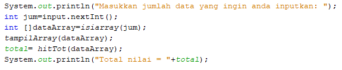

# JOBSHEET 13. Fungsi 1

## Tujuan
* Mahasiswa mampu memahami penggunaan fungsi static pada Java dengan parameter dan mengembalikan nilai.
* Mahasiswa mampu membuat program menggunakan fungsi static dan mengeksekusi fungsi tersebut.


## Alat dan Bahan
* PC/Laptop
* Browser
* Koneksi internet
* Anaconda3 + Java kernel (opsional)

## Praktikum

### Percobaan 1: Fungsi Void (tidak menggunakan return value)

1.	Buat fungsi **beriSalam** bertipe void yang digunakan untuk mencetak **“Halo! Selamat Pagi”**.


2. Eksekusi atau panggil fungsi **beriSalam**.


```Java
// Tuliskan kode program Percobaan 1 Langkah 1 & 2
static void beriSalam(){
    System.out.println("Halo! Selamat Pagi");
}
beriSalam();
//langkah ini bertujuan untuk membuat fungsi void dan memanggilnya
```

    Halo! Selamat Pagi


3. Buat fungsi **beriUcapan** dengan sebuah parameter bertipe String.


4. Buatlah variabel **salam** bertipe String kemudian eksekusi atau panggil fungsi **beriUcapan** dengan mengisi parameternya dengan variable **salam** yang sudah dibuat.


```Java
// Tuliskan kode program Percobaan 1 Langkah 1, 2, 3 & 4
static void beriSalam(){
    System.out.println("Halo! Selamat pagi");
}
static void beriUcapan(String ucapan){
    System.out.println(ucapan);
}
beriSalam();
String salam="Selamat datang di pemrograman Java";
beriUcapan(salam);

/*pada langkah ini mencoba untuk membuat fungsi void berparameter dan tidak berparameter serta mencoba
untuk memanggil masing-masing fungsi*/
```

    Halo! Selamat pagi
    Selamat datang di pemrograman Java


#### Pertanyaan
1. Jelaskan perbedaan fungsi **beriSalam** dan **beriUcapan** pada praktikum 1!
- beriSalam merupakan fungsi tanpa parameter.
- beriUcapan merupakan fungsi dengan parameter

2. Jelaskan cara pemanggilan sebuah fungsi void yang berparameter dan tanpa parameter!
- pemanggilan fungsi void berparameter ialah dengan mengetik namaFungsi(parameter) nya.
- sedangkan pemanggilan fungsi void tanpa parameter ialah langsung dengan mengetik namaFungsi() tanpa perlu mengisi parameter.

### Percobaan 2: Fungsi dengan return value (Bukan void)
Pada Percobaan 2, kode program yang dibuat digunakan untuk menghitung luas persegi dengan membuat fungsi **luasPersegi** yang menggunakan parameter.
1. Buat fungsi **luasPersegi**  untuk menghitung luas persegi yang mengembalikan nilai luas (int) dan parameter masukan sisi (int).


2.	Eksekusi atau panggil fungsi luasPersegi dengan cara membuat variabel baru yaitu **luasan**, kemudian isi variabel tersebut dengan memanggil fungsi luasPersegi dan mengisi parameter sisi. Selanjutnya cetak variabel luasan untuk menampilkan luas persegi panjang


```Java
// Tuliskan kode program Percobaan 2 Langkah 1 & 2
static int luasPersegi(int sisi){
    int luas = sisi*sisi;
    return luas;
}
int luasan = luasPersegi(5);
System.out.println("Luas Persegi dengan sisi 5 = "+luasan);
/*pada langkah ini dibuat sebuah fungsi int  yang menghitung luas persegi, dan nilainya direturn ke fungsi.
memanggil dengan membuat variabel yang memiliki nilai fungsi dengan parameter.*/
```

    Luas Persegi dengan sisi 5 = 25


#### Pertanyaan
1. jelaskan mengapa ketika memanggil fungsi **luasPersegi** harus membuat variabel baru yaitu luasan?
- karena fungsi luasPersegi hanya mengolah data yaitu mengalikan sisi sisi, lalu mereturn nilainya. Sehingga untuk memanggil hasilnya, nilai yang direturn perlu dimasukkan dalam sebuah variabel baru lalu memanggil variabel tersebut.

2. Jelaskan kegunaan **return luas** pada percobaan 2 diatas!
- return luas; berfungsi untuk mengembalikan nilai luas yang telah diolah ke fungsi.

3. Modifikasilah program di percobaan 2, dengan membuat panjang **sisi** sebagai inputan!


```Java
// Tuliskan jawaban nomor 2
import java.util.Scanner;
Scanner input = new Scanner(System.in);

static int luasPersegi(int sisi){
    int luas = sisi * sisi;
    return luas;
}
int panjang;
System.out.println("Masukkan panjang sisi! ");
panjang=input.nextInt();
int luasan = luasPersegi(panjang);
System.out.printf("Luas persegi dengan sisi %d = %d",panjang,luasan);
/*langkah ini sama dengan sebelumnya, hanya menambahkan scanner agar
user dapat menginput angka sesuai keinginan untuk diproses oleh fungsi*/
```

    Masukkan panjang sisi! 
    7
    Luas persegi dengan sisi 7 = 49


    java.io.PrintStream@e640a44


### Percobaan 3: Fungsi dapat meng-CALL Fungsi Lain
Pada Percobaan 3, kode program yang dibuat digunakan untuk mengimplementasikan bahwa fungsi dapat meng-CALL fungsi yang lain. Dimana dalam percobaan ini terdapat fungsi **Kali dan Kurang**. 
1. Buatlah fungsi **Kali** yang mengembalikan nilai H (int) dan parameter masukan C dan D (int).


2.	Buatlah fungsi **Kurang** yang mengembalikan nilai X (int) dan parameter masukan A dan B (int) dan memanggil fungsi Kali.


3. Lakukan import class Scanner sebagai inputan di langkah selajutnya.

4. Eksekusi atau panggil fungsi **Kurang** .


```Java
// Tuliskan kode program Percobaan 3 Langkah 1, 2, 3 & 4
static int Kali(int C, int D){
    int H;
    H = (C + 10) % (D + 19);
    return H;
}

static int Kurang(int A, int B){
    int X;
    A = A + 7;
    B = B + 4;
    X = Kali(A, B);
    return X;
}

int nilai1, nilai2;
Scanner input = new Scanner(System.in);
System.out.println("Masukkan nilai 1: ");
nilai1=input.nextInt();
System.out.println("Masukkan nilai 2: ");
nilai2=input.nextInt();
int hasil = Kurang(nilai1, nilai2);
System.out.println("Hasil akhir adalah " + hasil);

/*pada langkah ini dibuat 2 fungsi non-void berparameter yang mengandung blok perintah untuk
menghitung dan mencoba untuk memanggil suatu fungsi didalam sebuah fungsi.*/
```

    Masukkan nilai 1: 
    4
    Masukkan nilai 2: 
    6
    Hasil akhir adalah 21


#### Pertanyaan
1. Modifikasilah percobaan diatas dimana di fungsi **Kali** dapat memanggil fungsi **Kurang** kemudian eksekusi atau panggil fungsi Kali


```Java
// Tuliskan jawaban nomor 1
static int Kurang(int C, int D){
    int H;
    H = (C + 10) % (D + 19);
    return H;
}

static int Kali(int A, int B){
    int X;
    A = A + 7;
    B = B + 4;
    X = Kurang(A, B);
    return X;
}

int nilai1, nilai2;
Scanner input = new Scanner(System.in);
System.out.println("Masukkan nilai 1: ");
nilai1=input.nextInt();
System.out.println("Masukkan nilai 2: ");
nilai2=input.nextInt();
int hasil = Kali(nilai1, nilai2);
System.out.println("Hasil akhir adalah " + hasil);

//langkah ini sama dengan sebelunya, hanya memodifikasi nama fungsi, agar fungsi kali dapat memanggil fungsi kurang
```

    Masukkan nilai 1: 
    79
    Masukkan nilai 2: 
    4
    Hasil akhir adalah 15


2. Jelaskan alur jalannya program di percobaan 3 mulai dari input sampai keluar output!
- awalnya menginput dua kali, untuk nilai1 dan nilai2. lalu mendeklarasikan variabel int hasil, dengan nilai hasil memanggil fungsi Kurang berparameter nilai1 dan nilai2. Kemudian nilai1 dan nilai2 diolah pada fungsi Kurang. Fungsi Kurang kemudian memanggil fungsi Kali, lalu diproses lebih lanjut. Setelah itu hasil pada fungsi Kali direturn ke fungsi Kali lalu direturn ke fungsi Kurang. Setelah direturn maka didapat nilai variabel hasil. Terakhir memberikan output berupa hasil pemrosesan nilai1 dan nilai2 dengan memanggil variabel hasil.

### Percobaan 4: Mengubah Program Tidak Menggunakan Fungsi dan Menggunakan Fungsi
Pada Percobaan 4, kode program yang dibuat digunakan untuk menghitung luas persegi panjang dan volume balok tanpa menggunakan fungsi dan dengan menggunakan fungsi.
1. Import dan deklarasikan Scanner dengan nama **input**


2. Buatlah inputan panjang, lebar, dan tinggi 


3. Hitung luas persegi panjang dan volume balok


```Java
// Tuliskan kode program Percobaan 4 Langkah 1, 2, & 3
import java.util.Scanner;
Scanner input = new Scanner(System.in);

int p,l,t,L,vol;

System.out.println("Masukkan panjang ");
p=input.nextInt();
System.out.println("Masukkan lebar ");
l=input.nextInt();
System.out.println("Masukkan tinggi ");
t=input.nextInt();

L=p*l;
System.out.println("Luas persegi panjang adalah "+L);

vol=p*l*t;
System.out.println("Volume balok adalah "+vol);
/*pada langkah percobaan ini membuat sebuah rumus menghitung luas dan
volume tanpa menggunakan fungsi, dengan panjang, lebar, dan tinggi yang diinput sendiri oleh user*/
```

    Masukkan panjang 
    4
    Masukkan lebar 
    5
    Masukkan tinggi 
    10
    Luas persegi panjang adalah 20
    Volume balok adalah 200


4. Program menghitung luas persegi dan volume balok diatas jika dibuatkan fungsi maka terdapat 3 fungsi yaitu hitungLuas, hitungVolume dan fungsi main, seperti dibawah ini:

Fungsi hitungLuas


Fungsi hitungVolume


5. Eksekusi/panggil fungsi **hitungLuas** dan **hitungVolume**


```Java
// Tuliskan kode program Percobaan 4 Langkah 1, 2, & 3
static int hitungLuas(int pjg, int lb){
    int Luas=pjg*lb;
    return Luas;
}
static int hitungVolume(int tinggi, int a, int b){
    int volume=hitungLuas(a,b)*tinggi;
    return volume;
}

Scanner input = new Scanner (System.in);
int p,l,t,L,vol;
System.out.println("Masukkan panjang ");
p=input.nextInt();
System.out.println("Masukkan lebar ");
l=input.nextInt();
System.out.println("Masukkan tinggi ");
t=input.nextInt();

L=hitungLuas(p,l);
System.out.println("Luas persegi panjang adalah "+L);
vol=hitungVolume(t,p,l);
System.out.println("Volume balok adalah "+vol);
/*langkah ini hampir sama dengan sebelumnya, hanya berbeda pada rumus, dimana kali ini tiap rumus dimasukkan dalam fungsi
yang berbeda, dan dapat dipanggil sesuai kebutuhan*/
```

    Masukkan panjang 
    5
    Masukkan lebar 
    
    4
    Masukkan tinggi 
    10
    Luas persegi panjang adalah 20
    Volume balok adalah 200


#### Pertanyaan
1. Jelaskan kegunaan parameter yang terdapat didalam fungsi hitungLuas dan hitungVolume!
- Parameter dalam kedua fungsi tersebut adalah untuk diinput kan kedalam fungsi sehingga dapat diolah oleh fungsi.

2. Setelah melakukan percobaan 4, menurut anda manakah program yg lebih efisien apakah menggunakan fungsi atau tanpa fungsi? Jelaskan!
- Untuk sekali pemakaian, lebih efisien tanpa fungsi, akan tetapi untuk penggunaan berulang, menggunakan fungsi menjadi lebih efisien karena hanya perlu memanggil fungsi tanpa perlu menulis ulang blok perintah.

### Percobaan 5: Fungsi Menggunakan Array dan Variabel Global
Pada Percobaan 5, kode program yang dibuat digunakan untuk menghitung total nilai yang ada didalam array dengan membuat 3 fungsi yaitu isiarray, hitTol, dan tampilArray.
1. Buatlah **variable global total dan i** bertipe int


2. Buatlah fungsi **isiarray** bertipe int dengan parameter angka bertipe int 


3. Buatlah fungsi **tampilArray** bertipe **void** dengan parameter data array **arr** bertipe int


4. Buatlah fungsi **hitTot** bertipe int dengan parameter data array **arr** bertipe int


5. Import dan deklarasikan Scanner dengan nama **input**


6. Eksekusi atau panggil ketiga fungsi yaitu **isiarray, tampilArray, dan hitTot**, kemudian jalankan program!




```Java
// Tuliskan kode program Percobaan 4 Langkah 1 s/d 6
static int total=0, i;
static int[] isiArray(int angka){
    Scanner input = new Scanner (System.in);
    int array[] = new int[angka];
    for (i=0; i<array.length; i++){
        System.out.println("Masukkan data ke- "+i);
        array[i]=input.nextInt();
    }
    return array;
}
static void tampilArray(int [] arr){
    for(i=0; i<arr.length; i++){
        System.out.println("Nilai yang anda inputkan ke "+i);
        System.out.println(arr[i]);
    }
}
static int hitTot(int []arr){
    for (i=0; i<arr.length; i++){
        total+=arr[i];
    }
    return total;
}
import java.util.Scanner;
Scanner input = new Scanner(System.in);
System.out.println("masukkan jumlah data yang ingin anda inputkan : ");
int jum=input.nextInt();
int []dataArray=isiArray(jum);
tampilArray(dataArray);
total=hitTot(dataArray);
System.out.println("Total nilai = "+total);

/*pada percobaan ini, membuat 3 fungsi yang saling berkaitan satu sama lain, dan pengaplikasian fungsi untuk array. 
Hampir sama dengan pengoperasian array biasa, hanya setiap operasi pada percobaan ini dikelompokkan pada fungsi-fungsi
yang memanggil satu sama lain*/
```

    masukkan jumlah data yang ingin anda inputkan : 
    2
    Masukkan data ke- 0
    1
    Masukkan data ke- 1
    3
    Nilai yang anda inputkan ke 0
    1
    Nilai yang anda inputkan ke 1
    3
    Total nilai = 4


#### Pertanyaan
1. Jelaskan mengapa fungsi tampil array dibuat bertipe void, sedangkan isiarray dan hitTot bertipe int!
- fungsi tampilArray dibuat bertipe void karena tidak perlu nilai return dan hanya digunakan untuk mencari nilai dalam operasi.
- fungsi isiArray dan hitHot bertipe int karena memerlukan nilai return agar operasi dapat berjalan.

2. Menurut pendapat anda apakah fugsi isiarray dan hitTot dapat diganti dengan tipe void? Jelaskan dan buktikan dengan program!


```Java
// Tuliskan jawaban nomor 2
/* menurut saya tidak bisa, karena membutuhkan return sementara untuk tipe void tidak bisa menggunakan
return untuk mengembalikan nilai yang telah diolah dalam operasi di fungsi*/
static int total=0, i;
static void[] isiArray(int angka){
    Scanner input = new Scanner (System.in);
    int array[] = new int[angka];
    for (i=0; i<array.length; i++){
        System.out.println("Masukkan data ke- "+i);
        array[i]=input.nextInt();
    }
    return array;
}
static void tampilArray(int [] arr){
    for(i=0; i<arr.length; i++){
        System.out.println("Nilai yang anda inputkan ke "+i);
        System.out.println(arr[i]);
    }
}
static void hitTot(int []arr){
    for (i=0; i<arr.length; i++){
        total+=arr[i];
    }
    return total;
}
import java.util.Scanner;
Scanner input = new Scanner(System.in);
System.out.println("masukkan jumlah data yang ingin anda inputkan : ");
int jum=input.nextInt();
int []dataArray=isiArray(jum);
tampilArray(dataArray);
total=hitTot(dataArray);
System.out.println("Total nilai = "+total);
//langkah ini hanya mengganti tipe fungsi menjadi void untuk membuktikan apakah tetap berjalan normal atau error
```


    |   static void[] isiArray(int angka){

    illegal start of expression

    

    |   static void[] isiArray(int angka){

    ';' expected

    

    |   static void[] isiArray(int angka){

    '.class' expected

    

    |   static void[] isiArray(int angka){

    ';' expected

    

    |   static void[] isiArray(int angka){

    unexpected type

      required: value

      found:    class

    

    |       int array[] = new int[angka];

    cannot find symbol

      symbol:   variable angka

    


## Tugas

1. Buatlah sebuah static method yang bernama Max3(int bil1, int bil2, int bil3) yang menerima 3 buah parameter bilangan integer dan mengembalikan sebuah bilangan integer yang merupakan nilai maksimum diantara ketiga bilangan tersebut. 


```Java
// Tuliskan jawaban nomor 1
static int Max3(int bil1, int bil2, int bil3){
    int maks=0;
    if(bil1>bil2 && bil1 > bil3){
        maks=bil1;
    } else if(bil2>bil1 && bil2>bil3){
        maks=bil2;
    } else if(bil3>bil1 && bil3>bil2){
        maks=bil3;
    }
    return maks;
}
int tertinggi=Max3(1,2,3);
System.out.print(tertinggi);
//untuk mencari nilai tertinggi, dibuat fungsi yang mencari nilai tertinggi dengan membandingkan setiap angka
```

    3

2. Disebuah restoran terdapat 3 menu yang dijual yaitu nasi goreng, soto, dan sate. Harga nasi goreng Rp. 20.000, soto Rp. 15.000, dan sate Rp. 25.000. Restoran tersebut buka dari hari senin sampai jumat. Berikut ini merupakan tabel pejualan perhari untuk masing-masing menu di restoran tersebut dari hari senin sampai jumat


Buatlah Fungsi sebagai berikut:
 * Fungsi menampilkan menu favorit di hari selasa dan jumat (menu favorit diasumsikan adalah menu yang paling banyak terjual di hari tersebut)
 * Fungsi untuk menghitung pemasukan restoran tersebut mulai hari senin sampai jumat.
 * Fungsi untuk menghitung berapa porsi yang terjual untuk masing-masing menu yaitu nasi goreng, soto, dan sate mulai senin sampai jumat.


```Java
// Tuliskan jawaban nomor 2
String hari[] = {"Senin", "Selasa", "Rabu", "Kamis", "Jumat"};
String menu[] = {"Nasi goreng", "Soto", "Sate"};
int porsi[][]=  {{20,15,35,24,70},{30,40,10,28,35},{5,10,50,48,15}};

static void favoritSelasa(){
    if(porsi[0][1] > porsi[1][1] && porsi[0][1]>porsi[2][1]){
        System.out.print("Menu favorit pada hari Selasa adalah nasi goreng");
    } else if (porsi[1][1] > porsi[0][1] && porsi[1][1]>porsi[2][1]){
        System.out.print("Menu favorit pada hari Selasa adalah soto");
    } else if (porsi[2][1] > porsi[1][1] && porsi[2][1]>porsi[0][1]){
        System.out.print("Menu favorit pada hari Selasa adalah sate");
    }
    
}

static void favoritJumat(){
    if(porsi[0][4] > porsi[1][4] && porsi[0][4]>porsi[2][4]){
        System.out.print("Menu favorit pada hari Jumat adalah nasi goreng");
    } else if (porsi[1][4] > porsi[0][4] && porsi[1][4]>porsi[2][4]){
        System.out.print("Menu favorit pada hari Jumat adalah soto");
    } else if (porsi[2][4] > porsi[1][4] && porsi[2][4]>porsi[0][4]){
        System.out.print("Menu favorit pada hari Jumat adalah sate");
    }
    
}

static void pemasukanDanTotal(){
    double total;
    double total1=0;
    double total2=0;
    double total3=0;
    for(int i=0; i<porsi[0].length; i++){
        total1+=porsi[0][i];
    }
    for(int i=0; i<porsi[1].length; i++){
        total2+=porsi[1][i];
    }
    for(int i=0; i<porsi[2].length; i++){
        total3+=porsi[2][i];
    }
    total=(total1*20000)+(total2*15000)+(total3*25000);
    System.out.println("Total porsi nasi goreng adalah "+total1);
    System.out.println("Total porsi soto adalah "+total2);
    System.out.println("Total porsi sate adalah "+total3);
    System.out.print("Total pemasukan ialah Rp"+total);
}


favoritSelasa();
System.out.println();
favoritJumat();
System.out.println();
pemasukanDanTotal();

/*membuat fungsi-fungsi yang menampilkan menu favorit pada hari tertentu, total porsi penjualan dalam seminggu, dan total
penghasilan dalam seminggu. dengan masing-masing cara membandingkan tiap porsi makanan terjual pada hari yang diinginkan.
lalu mentotal penjualan tiap menu dan dikalikan harga jual, lalu ditambahkan untuk mendapatkan total penghasilan*/
```

    Menu favorit pada hari Selasa adalah soto
    Menu favorit pada hari Jumat adalah nasi goreng
    Total porsi nasi goreng adalah 164.0
    Total porsi soto adalah 143.0
    Total porsi sate adalah 128.0
    Total pemasukan ialah Rp8625000.0


```Java

```
