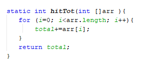

# JOBSHEET 13. Fungsi 1
Nabila Rasyidah / 2131710047 

## Tujuan
* Mahasiswa mampu memahami penggunaan fungsi static pada Java dengan parameter dan mengembalikan nilai.
* Mahasiswa mampu membuat program menggunakan fungsi static dan mengeksekusi fungsi tersebut.


## Alat dan Bahan
* PC/Laptop
* Browser
* Koneksi internet
* Anaconda3 + Java kernel (opsional)

## Praktikum

### Percobaan 1: Fungsi Void (tidak menggunakan return value)

1.	Buat fungsi **beriSalam** bertipe void yang digunakan untuk mencetak **“Halo! Selamat Pagi”**.


2. Eksekusi atau panggil fungsi **beriSalam**.


```Java
// Tuliskan kode program Percobaan 1 Langkah 1 & 2
static void beriSalam(){  //deklarasi nama fungsi
    System.out.println("Halo! Selamat Pagi");  //statement
}
beriSalam();  //memanggil fungsi beriSalam
```

    Halo! Selamat Pagi


3. Buat fungsi **beriUcapan** dengan sebuah parameter bertipe String.


4. Buatlah variabel **salam** bertipe String kemudian eksekusi atau panggil fungsi **beriUcapan** dengan mengisi parameternya dengan variable **salam** yang sudah dibuat.


```Java
// Tuliskan kode program Percobaan 1 Langkah 1, 2, 3 & 4
static void beriSalam(){  //fungsi tanpa parameter
    System.out.println("Halo! Selamat Pagi");  //statement
}
static void beriUcapan(String ucapan){  //fungsi berparameter
    System.out.println(ucapan);
}
beriSalam(); //memanggil fungsi
String salam = "Selamat datang di pemrograman Java";
beriUcapan(salam); //memanggil fungsi
```

    Halo! Selamat Pagi
    Selamat datang di pemrograman Java


#### Pertanyaan
1. Jelaskan perbedaan fungsi **beriSalam** dan **beriUcapan** pada praktikum 1!

~beriSalam untuk menampilkan 'Halo! Selamat Pagi' tanpa parameter


~beriUcapan untuk menampilkan 'Selamat datang di pemrograman Java' dengan parameter

2. Jelaskan cara pemanggilan sebuah fungsi void yang berparameter dan tanpa parameter!

~void berparameter: memanggil dengan varibel pada fungsi. cont beriUcapan(salam);

~void tanpa parameter: memanggil fungsi saja. cont beriSalam()

### Percobaan 2: Fungsi dengan return value (Bukan void)
Pada Percobaan 2, kode program yang dibuat digunakan untuk menghitung luas persegi dengan membuat fungsi **luasPersegi** yang menggunakan parameter.
1. Buat fungsi **luasPersegi**  untuk menghitung luas persegi yang mengembalikan nilai luas (int) dan parameter masukan sisi (int).


2.	Eksekusi atau panggil fungsi luasPersegi dengan cara membuat variabel baru yaitu **luasan**, kemudian isi variabel tersebut dengan memanggil fungsi luasPersegi dan mengisi parameter sisi. Selanjutnya cetak variabel luasan untuk menampilkan luas persegi panjang


```Java
// Tuliskan kode program Percobaan 2 Langkah 1 & 2
static int luasPersegi(int sisi){ //fungsi luasPersegi
    int luas = sisi * sisi;
    return luas; //mengembalikan nilai
}
int luasan = luasPersegi(5); //luasan digunakan untuk menyimpan hasil proses pada fungsi luasPersegi
System.out.println("Luas Persegi dengan sisi 5 = " + luasan); //output sesuai pada variabel luasan
```

    Luas Persegi dengan sisi 5 = 25


#### Pertanyaan
1. jelaskan mengapa ketika memanggil fungsi **luasPersegi** harus membuat variabel baru yaitu luasan?

karena luasan sebagai tempat hasil proses dari fungsi luas

2. Jelaskan kegunaan **return luas** pada percobaan 2 diatas!

return mengembalikan nilai atau mengeluarkan nilai pada proses dalam fungsi

3. Modifikasilah program di percobaan 2, dengan membuat panjang **sisi** sebagai inputan!


```Java
// Tuliskan jawaban nomor 3
import java.util.Scanner; //deklarasi scanner
Scanner sc = new Scanner(System.in);

static int luasPersegi(int sisi){ //fungsi luasPersegi
    int luas = sisi*sisi;
    return luas; 
}
System.out.print("Masukkan panjang sisi: ");
int x = sc.nextInt(); //inputan panjang sisi dimasukkan dalam variabel x

int luasan = luasPersegi(x); //memanggil fungsi luasPersegi dengan parameter sisi dari variabel x
System.out.printf("Luas persegi dengan sisi %d = %d", x, luasan); //output
```

    Masukkan panjang sisi: 3
    Luas persegi dengan sisi 3 = 9


    java.io.PrintStream@3794e99a


### Percobaan 3: Fungsi dapat meng-CALL Fungsi Lain
Pada Percobaan 3, kode program yang dibuat digunakan untuk mengimplementasikan bahwa fungsi dapat meng-CALL fungsi yang lain. Dimana dalam percobaan ini terdapat fungsi **Kali dan Kurang**. 
1. Buatlah fungsi **Kali** yang mengembalikan nilai H (int) dan parameter masukan C dan D (int).


2.	Buatlah fungsi **Kurang** yang mengembalikan nilai X (int) dan parameter masukan A dan B (int) dan memanggil fungsi Kali.


3. Lakukan import class Scanner sebagai inputan di langkah selajutnya.

4. Eksekusi atau panggil fungsi **Kurang** .


```Java
// Tuliskan kode program Percobaan 3 Langkah 1, 2, 3 & 4
static int Kali(int C, int D){ //fungsi Kali
    int H;
    H = (C + 10) % (D + 19);
    return H; //mengembalikan nilai H
}
static int Kurang(int A, int B){ //fungsi Kurang
    int X;
    A = A + 7;
    B = B +4;
    X = Kali(A, B); //hasil dari Kali, dimasukkan pada X
    return X; //mengembalikan nilai X
}
int nilai1, nilai2;
Scanner input = new Scanner (System.in);
System.out.println("Masukkan Nilai 1: ");
nilai1 = input.nextInt();
System.out.println("Masukkan Nilai 2: ");
nilai2 = input.nextInt();
int hasil = Kurang(nilai1, nilai2); //nilai 1 dan nilai 2 akan menjadi parameter pada fungsi Kurang
System.out.println("Hasil akhir adalah " + hasil); //output
```

    Masukkan Nilai 1: 
    2
    Masukkan Nilai 2: 
    2
    Hasil akhir adalah 19


#### Pertanyaan
1. Modifikasilah percobaan diatas dimana di fungsi **Kali** dapat memanggil fungsi **Kurang** kemudian eksekusi atau panggil fungsi Kali


```Java
// Tuliskan jawaban nomor 1
static int Kurang(int C, int D){
    int H;
    H = (C + 10) % (D + 19);
    return H; //mengembalikan nilai
}
static int Kali(int A, int B){
    int X;
    A = A + 7;
    B = B +4;
    X = Kurang(A, B); //memanggil fungsi Kurang
    return X; //mengembalikan nilai
}
int nilai1, nilai2;
Scanner input = new Scanner (System.in);
System.out.println("Masukkan Nilai 1: ");
nilai1 = input.nextInt();
System.out.println("Masukkan Nilai 2: ");
nilai2 = input.nextInt();
int hasil = Kali(nilai1, nilai2); //memanggil fungsi kali
System.out.println("Hasil akhir adalah " + hasil); //output
```

    Masukkan Nilai 1: 
    3
    Masukkan Nilai 2: 
    3
    Hasil akhir adalah 20


2. Jelaskan alur jalannya program di percobaan 3 mulai dari input sampai keluar output!

Pertama, input nilai 1 dan nilai 2. kemudian, melihat dari variabel hasil, nilai1 dan nilai2 merujuk pada int A dan B. kemudian variabel A dan B diproses. setelah itu memproses A menjadi C dan B menjadi D. Lalu diproses dan disimpan pada variabel H. output yang ditampilkan adalah hasil dari H tsb.

### Percobaan 4: Mengubah Program Tidak Menggunakan Fungsi dan Menggunakan Fungsi
Pada Percobaan 4, kode program yang dibuat digunakan untuk menghitung luas persegi panjang dan volume balok tanpa menggunakan fungsi dan dengan menggunakan fungsi.
1. Import dan deklarasikan Scanner dengan nama **input**


2. Buatlah inputan panjang, lebar, dan tinggi 


3. Hitung luas persegi panjang dan volume balok


```Java
// Tuliskan kode program Percobaan 4 Langkah 1, 2, & 3
import java.util.Scanner;
Scanner input = new Scanner(System.in);

int p,l,t,L,vol;  //deklarasi variabel

System.out.println("Masukkan panjang");
p=input.nextInt();
System.out.println("Masukkan lebar");
l=input.nextInt();
System.out.println("Masukkan tinggi");
t=input.nextInt();

L = p*l; 
System.out.println("Luas Persegi panjang adalah "+L);
vol = p*l*t;
System.out.println("Volume balok adalah "+vol);
```

    Masukkan panjang
    6
    Masukkan lebar
    5
    Masukkan tinggi
    4
    Luas Persegi panjang adalah 30
    Volume balok adalah 120


4. Program menghitung luas persegi dan volume balok diatas jika dibuatkan fungsi maka terdapat 3 fungsi yaitu hitungLuas, hitungVolume dan fungsi main, seperti dibawah ini:

Fungsi hitungLuas


Fungsi hitungVolume


5. Eksekusi/panggil fungsi **hitungLuas** dan **hitungVolume**


```Java
// Tuliskan kode program Percobaan 4 Langkah 1, 2, & 3
static int hitungLuas (int pjg, int lb){  //fungsi berparameter 
    int Luas = pjg*lb;
    return Luas;
}
static int hitungVolume (int tinggi, int a, int b){
    int volume = hitungLuas(a,b)*tinggi;
    return volume;
}
Scanner input = new Scanner (System.in);
int p,l,t,L, vol;
System.out.println("Masukkan panjang");
p=input.nextInt();
System.out.println("Masukkan lebar");
l=input.nextInt();
System.out.println("Masukkan tinggi");
t=input.nextInt();

L = hitungLuas(p,l); //memanggil fungsi hitungLuas
System.out.println("Luas Persegi Panjang adalah "+L);
vol = hitungVolume(t,p,l); //memanggil fungsi hitungVolume
System.out.println("Volume Balok adalah "+vol);
```

    Masukkan panjang
    5
    Masukkan lebar
    
    4
    Masukkan tinggi
    3
    Luas Persegi Panjang adalah 20
    Volume Balok adalah 60


#### Pertanyaan
1. Jelaskan kegunaan parameter yang terdapat didalam fungsi hitungLuas dan hitungVolume!

kegunaan parameter adalah untuk menampung nilai untuk diproses pada fungsi. parameter juga berperan sebagai input

*hitungLuas*: Digunakan untuk menyimpan pjg dan lb
    
*hitungVolume*: Digunakan untuk menyimpan tinggi, a, b

2. Setelah melakukan percobaan 4, menurut anda manakah program yg lebih efisien apakah menggunakan fungsi atau tanpa fungsi? Jelaskan!

sepertinya fungsi lebih efisien untuk digunakan. namun saat ini saya masih berusaha untuk memahami penggunaan fungsi

### Percobaan 5: Fungsi Menggunakan Array dan Variabel Global
Pada Percobaan 5, kode program yang dibuat digunakan untuk menghitung total nilai yang ada didalam array dengan membuat 3 fungsi yaitu isiarray, hitTol, dan tampilArray.
1. Buatlah **variable global total dan i** bertipe int


2. Buatlah fungsi **isiarray** bertipe int dengan parameter angka bertipe int 


3. Buatlah fungsi **tampilArray** bertipe **void** dengan parameter data array **arr** bertipe int


4. Buatlah fungsi **hitTot** bertipe int dengan parameter data array **arr** bertipe int



5. Import dan deklarasikan Scanner dengan nama **input**


6. Eksekusi atau panggil ketiga fungsi yaitu **isiarray, tampilArray, dan hitTot**, kemudian jalankan program!


```Java
// Tuliskan kode program Percobaan 4 Langkah 1 s/d 6
static int total=0, i; //deklarasi variabel
static int [] isiarray (int angka){ //fungsi isiarray
    Scanner input = new Scanner (System.in);
    int array[] = new int[angka];
    for(i=0; i<array.length; i++){
        System.out.println("Masukkan data ke- "+i);
        array[i]=input.nextInt();
    }
    return array; //mengembalikan nilai array
}
static void tampilArray(int [] arr){  //fungsi tampilArray
    for(i=0; i<arr.length; i++){
         System.out.println("Nilai yang Anda inputkan ke "+i);
         System.out.println(arr[i]);
    }
}
static int hitTot(int [] arr ){  //fungsi hitTot
    for(i=0; i<arr.length; i++){
        total+=arr[i];
    }
    return total; //mengembalikan nilai total
}

import java.util.Scanner; //deklarasi scanner
Scanner input = new Scanner(System.in);
System.out.println("Masukkan jumlah data yang ingin Anda inputkan: ");
int jum=input.nextInt();
int []dataArray=isiarray(jum); //output fungsi isiarray
tampilArray(dataArray);
total= hitTot(dataArray); //hasil dari total dataArray
System.out.println("Total nilai = "+total);
```

    Masukkan jumlah data yang ingin Anda inputkan: 
    2
    Masukkan data ke- 0
    11
    Masukkan data ke- 1
    12
    Nilai yang Anda inputkan ke 0
    11
    Nilai yang Anda inputkan ke 1
    12
    Total nilai = 23


#### Pertanyaan
1. Jelaskan mengapa fungsi tampil array dibuat bertipe void, sedangkan isiarray dan hitTot bertipe int!

karena void tidak memakai return, dan pada fungsi tampilarray tidak mengembalikan nilai. 

pada fungsi isiArray dan hitTot tidak memakai void karena nilai yg ada didalamnya membutuhkan return untuk mengembalikan hasil.

2. Menurut pendapat anda apakah fugsi isiarray dan hitTot dapat diganti dengan tipe void? Jelaskan dan buktikan dengan program!


```Java
// Tuliskan jawaban nomor 2
//tidak bisa karena membutuhkan return untuk operasi pada fungsi
//namun, sepertinya bisa jika variabel diganti dengan variabel global dan letaknya berurutan

static int total=0, i;

static void isiarray (int angka){
    Scanner input = new Scanner(System.in);
    int array[] = new int [angka];
    for(int i = 0; i < array.length; i++) {
        System.out.println("Masukkan data ke-"+i);
        array[i] = input.nextInt();
    }return array;
}
static int tampilArray(int [] arr){
    for (i = 0; i < arr.length; i++) {
        System.out.println("Nilai yang anda inputkan ke " + i);
        System.out.println(arr[i]);
    }return i;
}
static void hitTot(int []arr) {
    for(i = 0; i <arr.length; i++){
        total += arr[i];
    }return total;
}

import java.util.Scanner;
Scanner input = new Scanner(System.in);

System.out.println("Masukkan jumlah data yang ingin anda inputkan: ");
int jum = input.nextInt();
int []dataArray = isiarray(jum);
tampilArray(dataArray);
total = hitTot(dataArray);
System.out.println("Total nilai = " + total);
```


    |       }return array;

    incompatible types: unexpected return value

    


## Tugas

1. Buatlah sebuah static method yang bernama Max3(int bil1, int bil2, int bil3) yang menerima 3 buah parameter bilangan integer dan mengembalikan sebuah bilangan integer yang merupakan nilai maksimum diantara ketiga bilangan tersebut. 


```Java
// Tuliskan jawaban nomor 1
static int Max3(int b1, int b2, int b3){
    int max = 0;
        if(b1>b2 && b1>b3){
            max = b1;
        }else if(b2>b1 && b2>b3){
            max = b2;
        } else{
            max = b3;
        }
    return max; //mengembalikan nilai
}
import java.util.Scanner;
Scanner sc = new Scanner(System.in);
int bil1,bil2,bil3,maks;
System.out.print("bil pertama = ");
bil1=sc.nextInt();
System.out.print("bil kedua = ");
bil2=sc.nextInt();
System.out.print("bil ketiga = ");
bil3=sc.nextInt();

maks = Max3(bil1,bil2,bil3);
System.out.print("Nilai Terbesar = "+ maks) //memanggil fungsi max3
```

    bil pertama = 6
    bil kedua = 4
    bil ketiga = 2
    Nilai Terbesar = 6

#### 2. Disebuah restoran terdapat 3 menu yang dijual yaitu nasi goreng, soto, dan sate. Harga nasi goreng Rp. 20.000, soto Rp. 15.000, dan sate Rp. 25.000. Restoran tersebut buka dari hari senin sampai jumat. Berikut ini merupakan tabel pejualan perhari untuk masing-masing menu di restoran tersebut dari hari senin sampai jumat


Buatlah Fungsi sebagai berikut:
 * Fungsi menampilkan menu favorit di hari selasa dan jumat (menu favorit diasumsikan adalah menu yang paling banyak terjual di hari tersebut)
 * Fungsi untuk menghitung pemasukan restoran tersebut mulai hari senin sampai jumat.
 * Fungsi untuk menghitung berapa porsi yang terjual untuk masing-masing menu yaitu nasi goreng, soto, dan sate mulai senin sampai jumat.


```Java
// Tuliskan jawaban nomor 2
String hari[] = {"Senin", "Selasa", "Rabu", "Kamis", "Jumat"};
String menu[] = {"Nasi goreng", "Soto", "Sate"};
int porsi[][]=  {{20,15,35,24,70},{30,40,10,28,35},{5,10,50,48,15}};

static void favoritSelasa(){
    if(porsi[0][1] > porsi[1][1] && porsi[0][1]>porsi[2][1]){
        System.out.print("Menu favorit pada hari Selasa adalah nasi goreng");
    } else if (porsi[1][1] > porsi[0][1] && porsi[1][1]>porsi[2][1]){
        System.out.print("Menu favorit pada hari Selasa adalah soto");
    } else if (porsi[2][1] > porsi[1][1] && porsi[2][1]>porsi[0][1]){
        System.out.print("Menu favorit pada hari Selasa adalah sate");
    }
    
}

static void favoritJumat(){
    if(porsi[0][4] > porsi[1][4] && porsi[0][4]>porsi[2][4]){
        System.out.print("Menu favorit pada hari Jumat adalah nasi goreng");
    } else if (porsi[1][4] > porsi[0][4] && porsi[1][4]>porsi[2][4]){
        System.out.print("Menu favorit pada hari Jumat adalah soto");
    } else if (porsi[2][4] > porsi[1][4] && porsi[2][4]>porsi[0][4]){
        System.out.print("Menu favorit pada hari Jumat adalah sate");
    }
    
}

static void pemasukanDanTotal(){
    double total;
    double total1=0;
    double total2=0;
    double total3=0;
    for(int i=0; i<porsi[0].length; i++){
        total1+=porsi[0][i];
    }
    for(int i=0; i<porsi[1].length; i++){
        total2+=porsi[1][i];
    }
    for(int i=0; i<porsi[2].length; i++){
        total3+=porsi[2][i];
    }
    total=(total1*20000)+(total2*15000)+(total3*25000);
    System.out.println("Total porsi nasi goreng adalah "+total1);
    System.out.println("Total porsi soto adalah "+total2);
    System.out.println("Total porsi sate adalah "+total3);
    System.out.print("Total pemasukan ialah Rp"+total);
}


favoritSelasa();
System.out.println();
favoritJumat();
System.out.println();
pemasukanDanTotal();
```

    Menu favorit pada hari Selasa adalah soto
    Menu favorit pada hari Jumat adalah nasi goreng
    Total porsi nasi goreng adalah 164.0
    Total porsi soto adalah 143.0
    Total porsi sate adalah 128.0
    Total pemasukan ialah Rp8625000.0
