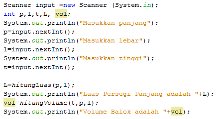

# JOBSHEET 13. Fungsi 1

## Tujuan
* Mahasiswa mampu memahami penggunaan fungsi static pada Java dengan parameter dan mengembalikan nilai.
* Mahasiswa mampu membuat program menggunakan fungsi static dan mengeksekusi fungsi tersebut.


## Alat dan Bahan
* PC/Laptop
* Browser
* Koneksi internet
* Anaconda3 + Java kernel (opsional)

## Praktikum

### Percobaan 1: Fungsi Void (tidak menggunakan return value)

1.	Buat fungsi **beriSalam** bertipe void yang digunakan untuk mencetak **“Halo! Selamat Pagi”**.


2. Eksekusi atau panggil fungsi **beriSalam**.


```Java
// Tuliskan kode program Percobaan 1 Langkah 1 & 2
static void beriSalam(){
    System.out.println("Halo ! Selamat Pagi");
}
beriSalam();
```

    Halo ! Selamat Pagi


Penjelasan : Untuk membuat dan memanggil fungsi void 

3. Buat fungsi **beriUcapan** dengan sebuah parameter bertipe String.


4. Buatlah variabel **salam** bertipe String kemudian eksekusi atau panggil fungsi **beriUcapan** dengan mengisi parameternya dengan variable **salam** yang sudah dibuat.


```Java
// Tuliskan kode program Percobaan 1 Langkah 1, 2, 3 & 4
static void beriSalam(){
    System.out.println("Halo ! Selamat Pagi");
}

static void beriUcapan(String ucapan){
    System.out.println(ucapan);
}

    beriSalam();
    String salam = "Selamat datang di pemrograman Java";
    beriUcapan(salam);
```

    Halo ! Selamat Pagi
    Selamat datang di pemrograman Java


Penjelasan : Untuk membuat fungsi void berparameter maupun tidak berparameter 

#### Pertanyaan
1. Jelaskan perbedaan fungsi **beriSalam** dan **beriUcapan** pada praktikum 1!

Jawaban pertanyaan no.1

- beriSalam : fungsi tanpa parameter

- beriUcapan : fungsi berparameter

2. Jelaskan cara pemanggilan sebuah fungsi void yang berparameter dan tanpa parameter!

Jawaban pertanyaan no.2

- berparameter : dengan mengetik namaFungsi(parameter)

- tanpa parameter : langsung dengan mengetik namaFungsi() tanpa mengisi parameter

### Percobaan 2: Fungsi dengan return value (Bukan void)
Pada Percobaan 2, kode program yang dibuat digunakan untuk menghitung luas persegi dengan membuat fungsi **luasPersegi** yang menggunakan parameter.
1. Buat fungsi **luasPersegi**  untuk menghitung luas persegi yang mengembalikan nilai luas (int) dan parameter masukan sisi (int).


2.	Eksekusi atau panggil fungsi luasPersegi dengan cara membuat variabel baru yaitu **luasan**, kemudian isi variabel tersebut dengan memanggil fungsi luasPersegi dan mengisi parameter sisi. Selanjutnya cetak variabel luasan untuk menampilkan luas persegi panjang


```Java
// Tuliskan kode program Percobaan 2 Langkah 1 & 2
static int luasPersegi(int sisi){
    int luas = sisi * sisi;
    return luas;
}

    int luasan = luasPersegi(5);
    System.out.println("Luas Persegi dengan sisi 5 = " + luasan);
```

    Luas Persegi dengan sisi 5 = 25


Penjelasan : Int yang menghitung luas, kemudian akan me return fungsi. Serta memanggil dengan membuat variabel yang memiliki nilai fungsi dengan parameter.

#### Pertanyaan
1. jelaskan mengapa ketika memanggil fungsi **luasPersegi** harus membuat variabel baru yaitu luasan?

Jawaban pertanyaan no.1 
- Karena fungsi luasPersegi yaitu mengalikan sisi, lalu mereturn nilainya. Sehingga hasilnya, nilai yang telah direturn akan dimasukkan ke dalam variabel baru lalu kemudian akan dipanggil

2. Jelaskan kegunaan **return luas** pada percobaan 2 diatas!

Jawaban pertanyaan no.2
- Untuk mengembalikan nilai luas yang telah diolah ke dalam fungsi.

3. Modifikasilah program di percobaan 2, dengan membuat panjang **sisi** sebagai inputan!


```Java
// Tuliskan jawaban nomor 2
import java.util.Scanner;
Scanner sc = new Scanner(System.in);

static int luasPersegi(int sisi){
    int luas = sisi*sisi;
    return luas;
}
int pjg;
System.out.print("Masukkan panjang sisi: ");
int x = sc.nextInt(); 
int luasan = luasPersegi(x); 
System.out.printf("Luas persegi dengan sisi %d = %d", x, luasan);
```

    Masukkan panjang sisi: 6
    Luas persegi dengan sisi 6 = 36


    java.io.PrintStream@1df55f7a


Penjelasan : Menambahkan scanner agar dapat diinput manual melalui keyboard sesuai keinginan.

###### Percobaan 3: Fungsi dapat meng-CALL Fungsi Lain
Pada Percobaan 3, kode program yang dibuat digunakan untuk mengimplementasikan bahwa fungsi dapat meng-CALL fungsi yang lain. Dimana dalam percobaan ini terdapat fungsi **Kali dan Kurang**. 
1. Buatlah fungsi **Kali** yang mengembalikan nilai H (int) dan parameter masukan C dan D (int).


2.	Buatlah fungsi **Kurang** yang mengembalikan nilai X (int) dan parameter masukan A dan B (int) dan memanggil fungsi Kali.


3. Lakukan import class Scanner sebagai inputan di langkah selajutnya.

4. Eksekusi atau panggil fungsi **Kurang** .


```Java
// Tuliskan kode program Percobaan 3 Langkah 1, 2, 3 & 4
static int Kali(int C, int D) {
int H;
H = (C + 10) % (D + 19);
return H;
}

static int Kurang(int A, int B){
int X;
A = A + 7;
B = B + 4;
X = Kali(A, B);
return X;
}

import java.util.Scanner;
Scanner input = new Scanner(System.in);

int nilai1, nilai2;
Scanner input = new Scanner (System.in);
System.out.println("Masukkan Nilai 1 : ");
nilai1 = input.nextInt();
System.out.println("Masukkan Nilai 2 : ");
nilai2 = input.nextInt();
int hasil = Kurang(nilai1,nilai2);
System.out.println("Hasil akhir adalah : " + hasil);
```

    Masukkan Nilai 1 : 
    7
    Masukkan Nilai 2 : 
    3
    Hasil akhir adalah : 24


Penjelasan : Dibuat 2 fungsi non-void berparameter yang mengandung blok perintah menghitung dan mencoba untuk memanggil suatu fungsi didalam fungsi.

###### Pertanyaan
1. Modifikasilah percobaan diatas dimana di fungsi **Kali** dapat memanggil fungsi **Kurang** kemudian eksekusi atau panggil fungsi Kali


```Java
// Tuliskan jawaban nomor 1
static int Kurang(int C, int D){
    int H;
    H = (C + 10) % (D + 19);
    return H;
}

static int Kali(int A, int B){
    int X;
    A = A + 7;
    B = B + 4;
    X = Kurang(A, B);
    return X;
}

int nilai1, nilai2;
Scanner input = new Scanner(System.in);
System.out.println("Masukkan nilai 1: ");
nilai1=input.nextInt();
System.out.println("Masukkan nilai 2: ");
nilai2=input.nextInt();
int hasil = Kali(nilai1, nilai2);
System.out.println("Hasil akhir adalah " + hasil);
```

    Masukkan nilai 1: 
    4
    Masukkan nilai 2: 
    5
    Hasil akhir adalah 21


Penjelasan : Memodifikasi nama fungsi, agar fungsi kali dapat memanggil fungsi kurang

2. Jelaskan alur jalannya program di percobaan 3 mulai dari input sampai keluar output!

Jawaban pertanyaan no.2
- Menginput nilai1 dan nilai2.
- Mendeklarasikan variabel int hasil, dengan nilai hasil memanggil fungsi Kurang berparameter nilai1 dan nilai2. 
- Kemudian diolah pada fungsi Kurang. 
- Memanggil fungsi Kali, lalu diproses lebih lanjut. 
- Hasil pada fungsi Kali direturn ke fungsi Kali lalu direturn ke fungsi Kurang. 
- Memberikan output berupa hasil pemrosesan nilai1 dan nilai2 dengan memanggil variabel hasil.

### Percobaan 4: Mengubah Program Tidak Menggunakan Fungsi dan Menggunakan Fungsi
Pada Percobaan 4, kode program yang dibuat digunakan untuk menghitung luas persegi panjang dan volume balok tanpa menggunakan fungsi dan dengan menggunakan fungsi.
1. Import dan deklarasikan Scanner dengan nama **input**


2. Buatlah inputan panjang, lebar, dan tinggi 


3. Hitung luas persegi panjang dan volume balok


```Java
// Tuliskan kode program Percobaan 4 Langkah 1, 2, & 3
import java.util.Scanner;
Scanner input = new Scanner(System.in);

int p,l,t,L,vol;

System.out.println("Masukkan panjang : ");
p=input.nextInt();
System.out.println("Masukkan lebar : ");
l=input.nextInt();
System.out.println("Masukkan tinggi : ");
t=input.nextInt();

L=p*l;
System.out.println("Luas Persegi Panjang adalah "+L);

vol=p*l*t;
System.out.println("Volume Balok adalah : "+vol);
```

    Masukkan panjang : 
    8
    Masukkan lebar : 
    2
    Masukkan tinggi : 
    9
    Luas Persegi Panjang adalah 16
    Volume Balok adalah : 144


Penjelasan : Membuat sebuah rumus menghitung luas dan volume tanpa menggunakan fungsi.

4. Program menghitung luas persegi dan volume balok diatas jika dibuatkan fungsi maka terdapat 3 fungsi yaitu hitungLuas, hitungVolume dan fungsi main, seperti dibawah ini:

Fungsi hitungLuas


Fungsi hitungVolume


5. Eksekusi/panggil fungsi **hitungLuas** dan **hitungVolume**




```Java
// Tuliskan kode program Percobaan 4 Langkah 1, 2, & 3
static int hitungLuas (int pjg, int lb){
    int Luas=pjg*lb;
    return Luas;
}

static int hitungVolume (int tinggi, int a, int b){
    int volume= hitungLuas(a,b)*tinggi;
    return volume;
}

Scanner input = new Scanner (System.in);
int p,l,t,L, vol;
System.out.println("Masukkan panjang : ");
p=input.nextInt();
System.out.println("Masukkan lebar : ");
l=input.nextInt();
System.out.println("Masukkan tinggi : ");
t=input.nextInt();

L=hitungLuas(p,l);
System.out.println("Luas Persegi Panjang adalah : "+L);
vol=hitungVolume(t,p,l);
System.out.println("Volume Balok adalah : "+vol);
```

    Masukkan panjang : 
    7
    Masukkan lebar : 
    8
    Masukkan tinggi : 
    9
    Luas Persegi Panjang adalah : 56
    Volume Balok adalah : 504


Penjelasan : Membuat sebuah rumus menghitung luas dan volume ke dalam fungsi dan dipanggil sesuai kebutuhan.

#### Pertanyaan
1. Jelaskan kegunaan parameter yang terdapat didalam fungsi hitungLuas dan hitungVolume!

Jawaban pertanyaan no.1
- Untuk diinput kan kedalam fungsi sehingga dapat diolah oleh fungsi

2. Setelah melakukan percobaan 4, menurut anda manakah program yg lebih efisien apakah menggunakan fungsi atau tanpa fungsi? Jelaskan!

Jawaban pertanyaan no.2
- Untuk sekali pemakaian, lebih efisien tanpa fungsi, akan tetapi untuk penggunaan berulang, menggunakan fungsi menjadi lebih efisien karena hanya perlu memanggil fungsi tanpa perlu menulis ulang blok perintah

### Percobaan 5: Fungsi Menggunakan Array dan Variabel Global
Pada Percobaan 5, kode program yang dibuat digunakan untuk menghitung total nilai yang ada didalam array dengan membuat 3 fungsi yaitu isiarray, hitTol, dan tampilArray.
1. Buatlah **variable global total dan i** bertipe int


2. Buatlah fungsi **isiarray** bertipe int dengan parameter angka bertipe int 


3. Buatlah fungsi **tampilArray** bertipe **void** dengan parameter data array **arr** bertipe int


4. Buatlah fungsi **hitTot** bertipe int dengan parameter data array **arr** bertipe int


5. Import dan deklarasikan Scanner dengan nama **input**


6. Eksekusi atau panggil ketiga fungsi yaitu **isiarray, tampilArray, dan hitTot**, kemudian jalankan program!


```Java
// Tuliskan kode program Percobaan 4 Langkah 1 s/d 6
static int total=0,i;

static int [] isiarray (int angka){
    Scanner input = new Scanner (System.in);
    int array[]=new int[angka];
    for (i=0; i<array.length; i++) {
    System.out.println("Masukkan data ke- "+i);
    array[i]=input.nextInt();
    }
    return array;
}

static void tampilArray(int [] arr){
    for (i=0; i<arr.length; i++){
        System.out.println("Nilai yang anda inputkan ke- "+i);
        System.out.println(arr[i]);
    }
}

static int hitTot(int []arr ){
    for (i=0; i<arr.length; i++){
        total+=arr[i];
    }
    return total;
}

import java.util.Scanner;
Scanner input = new Scanner(System.in);

System.out.println("Masukkan jumlah data yang ingin anda inputkan : ");
int jum=input.nextInt();
int []dataArray=isiarray(jum);
tampilArray(dataArray);
total=hitTot(dataArray);
System.out.println("Total nilai = "+total);
```

    Masukkan jumlah data yang ingin anda inputkan : 
    2
    Masukkan data ke- 0
    5
    Masukkan data ke- 1
    9
    Nilai yang anda inputkan ke- 0
    5
    Nilai yang anda inputkan ke- 1
    9
    Total nilai = 14


Penjelasan : Membuat 3 fungsi yang saling berkaitan lalu mengaplikasikannya untuk array. Setiap operasi dikelompokkan pada fungsi-fungsi yang memanggil satu sama lain

#### Pertanyaan
1. Jelaskan mengapa fungsi tampil array dibuat bertipe void, sedangkan isiarray dan hitTot bertipe int!

Jawaban pertanyaan no.1
- fungsi tampilArray dibuat bertipe void karena tidak perlu nilai return dan hanya digunakan untuk mencari nilai dalam operasi.
- fungsi isiArray dan hitHot bertipe int karena memerlukan nilai return agar operasi dapat berjalan.

2. Menurut pendapat anda apakah fugsi isiarray dan hitTot dapat diganti dengan tipe void? Jelaskan dan buktikan dengan program!

Jawaban pertanyaan no. 2
- Tidak bisa karena membutuhkan return


```Java
// Tuliskan jawaban nomor 2
static int total=0, i;
static void[] isiArray(int angka){
    Scanner input = new Scanner (System.in);
    int array[] = new int[angka];
    for (i=0; i<array.length; i++){
        System.out.println("Masukkan data ke- "+i);
        array[i]=input.nextInt();
    }
    return array;
}
static void tampilArray(int [] arr){
    for(i=0; i<arr.length; i++){
        System.out.println("Nilai yang anda inputkan ke "+i);
        System.out.println(arr[i]);
    }
}
static void hitTot(int []arr){
    for (i=0; i<arr.length; i++){
        total+=arr[i];
    }
    return total;
}
import java.util.Scanner;
Scanner input = new Scanner(System.in);
System.out.println("masukkan jumlah data yang ingin anda inputkan : ");
int jum=input.nextInt();
int []dataArray=isiArray(jum);
tampilArray(dataArray);
total=hitTot(dataArray);
System.out.println("Total nilai = "+total);
```


    |   static void[] isiArray(int angka){

    illegal start of expression

    

    |   static void[] isiArray(int angka){

    ';' expected

    

    |   static void[] isiArray(int angka){

    '.class' expected

    

    |   static void[] isiArray(int angka){

    ';' expected

    

    |   static void[] isiArray(int angka){

    unexpected type

      required: value

      found:    class

    

    |       int array[] = new int[angka];

    cannot find symbol

      symbol:   variable angka

    


## Tugas

1. Buatlah sebuah static method yang bernama Max3(int bil1, int bil2, int bil3) yang menerima 3 buah parameter bilangan integer dan mengembalikan sebuah bilangan integer yang merupakan nilai maksimum diantara ketiga bilangan tersebut. 


```Java
// Tuliskan jawaban nomor 1
static int Max3(int bil1, int bil2, int bil3){
    int maks=0;
    if(bil1>bil2 && bil1 > bil3){
        maks=bil1;
    } else if(bil2>bil1 && bil2>bil3){
        maks=bil2;
    } else if(bil3>bil1 && bil3>bil2){
        maks=bil3;
    }
    return maks;
}
int tertinggi=Max3(1,2,3);
System.out.print(tertinggi);
```

    3

Penjelasan : Untuk mencari nilai tertinggi, dibuat fungsi yang mencari nilai tertinggi dengan membandingkan setiap angka

2. Disebuah restoran terdapat 3 menu yang dijual yaitu nasi goreng, soto, dan sate. Harga nasi goreng Rp. 20.000, soto Rp. 15.000, dan sate Rp. 25.000. Restoran tersebut buka dari hari senin sampai jumat. Berikut ini merupakan tabel pejualan perhari untuk masing-masing menu di restoran tersebut dari hari senin sampai jumat


Buatlah Fungsi sebagai berikut:
 * Fungsi menampilkan menu favorit di hari selasa dan jumat (menu favorit diasumsikan adalah menu yang paling banyak terjual di hari tersebut)
 * Fungsi untuk menghitung pemasukan restoran tersebut mulai hari senin sampai jumat.
 * Fungsi untuk menghitung berapa porsi yang terjual untuk masing-masing menu yaitu nasi goreng, soto, dan sate mulai senin sampai jumat.


```Java
// Tuliskan jawaban nomor 2
String hari[] = {"Senin", "Selasa", "Rabu", "Kamis", "Jumat"};
String menu[] = {"Nasi goreng", "Soto", "Sate"};
int porsi[][]=  {{20,15,35,24,70},{30,40,10,28,35},{5,10,50,48,15}};

static void favoritSelasa(){
    if(porsi[0][1] > porsi[1][1] && porsi[0][1]>porsi[2][1]){
        System.out.print("Menu favorit pada hari Selasa adalah nasi goreng");
    } else if (porsi[1][1] > porsi[0][1] && porsi[1][1]>porsi[2][1]){
        System.out.print("Menu favorit pada hari Selasa adalah soto");
    } else if (porsi[2][1] > porsi[1][1] && porsi[2][1]>porsi[0][1]){
        System.out.print("Menu favorit pada hari Selasa adalah sate");
    }
    
}

static void favoritJumat(){
    if(porsi[0][4] > porsi[1][4] && porsi[0][4]>porsi[2][4]){
        System.out.print("Menu favorit pada hari Jumat adalah nasi goreng");
    } else if (porsi[1][4] > porsi[0][4] && porsi[1][4]>porsi[2][4]){
        System.out.print("Menu favorit pada hari Jumat adalah soto");
    } else if (porsi[2][4] > porsi[1][4] && porsi[2][4]>porsi[0][4]){
        System.out.print("Menu favorit pada hari Jumat adalah sate");
    }
    
}

static void pemasukanDanTotal(){
    double total;
    double total1=0;
    double total2=0;
    double total3=0;
    for(int i=0; i<porsi[0].length; i++){
        total1+=porsi[0][i];
    }
    for(int i=0; i<porsi[1].length; i++){
        total2+=porsi[1][i];
    }
    for(int i=0; i<porsi[2].length; i++){
        total3+=porsi[2][i];
    }
    total=(total1*20000)+(total2*15000)+(total3*25000);
    System.out.println("Total porsi nasi goreng adalah "+total1);
    System.out.println("Total porsi soto adalah "+total2);
    System.out.println("Total porsi sate adalah "+total3);
    System.out.print("Total pemasukan ialah Rp"+total);
}


favoritSelasa();
System.out.println();
favoritJumat();
System.out.println();
pemasukanDanTotal();
```

    Menu favorit pada hari Selasa adalah soto
    Menu favorit pada hari Jumat adalah nasi goreng
    Total porsi nasi goreng adalah 164.0
    Total porsi soto adalah 143.0
    Total porsi sate adalah 128.0
    Total pemasukan ialah Rp8625000.0

Penjelasan : Membuat fungsi yang menampilkan menu favorit pada hari tertentu, total porsi penjualan, dan total penghasilan. Masing-masing cara membandingkan tiap porsi makanan terjual pada hari yang diinginkan. lalu totak penjualan tiap menu dan dikalikan harga jual, Kemudian ditambahkan untuk mendapatkan total penghasilan.
