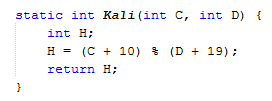

# JOBSHEET 13. Fungsi 1

## Tujuan
* Mahasiswa mampu memahami penggunaan fungsi static pada Java dengan parameter dan mengembalikan nilai.
* Mahasiswa mampu membuat program menggunakan fungsi static dan mengeksekusi fungsi tersebut.


## Alat dan Bahan
* PC/Laptop
* Browser
* Koneksi internet
* Anaconda3 + Java kernel (opsional)

## Praktikum

### Percobaan 1: Fungsi Void (tidak menggunakan return value)

1.	Buat fungsi **beriSalam** bertipe void yang digunakan untuk mencetak **“Halo! Selamat Pagi”**.


2. Eksekusi atau panggil fungsi **beriSalam**.


```Java
// Tuliskan kode program Percobaan 1 Langkah 1 & 2
static void beriSalam(){
    System.out.println("Halo! Selamat Pagi");
}
beriSalam();
```

    Halo! Selamat Pagi


3. Buat fungsi **beriUcapan** dengan sebuah parameter bertipe String.


4. Buatlah variabel **salam** bertipe String kemudian eksekusi atau panggil fungsi **beriUcapan** dengan mengisi parameternya dengan variable **salam** yang sudah dibuat.


```Java
// Tuliskan kode program Percobaan 1 Langkah 1, 2, 3 & 4
static void beriSalam(){
    System.out.println("Halo! Selamat Pagi");
}
    static void beriUcapan(String ucapan){
        System.out.println(ucapan);
    }
beriSalam();
String salam = "Selamat datang di pemrograman Java";
beriUcapan(salam);
```

    Halo! Selamat Pagi
    Selamat datang di pemrograman Java


#### Pertanyaan
1. Jelaskan perbedaan fungsi **beriSalam** dan **beriUcapan** pada praktikum 1!
    
    beriSalam = Fungsi yang tanpa memiliki parameter didalamnya
    
    beriUcapan = Fungsi yang memiliki parameter didalamnya

2. Jelaskan cara pemanggilan sebuah fungsi void yang berparameter dan tanpa parameter!

    Berparameter : Diharuskan untuk memasukkan parameter kedalam deklarasi fungsi yang akan dioutput
    
    Tanpa parameter : Tidak perlu untuk memasukkan parameter kedalam deklarasi fungsi yang akan dioutput

### Percobaan 2: Fungsi dengan return value (Bukan void)
Pada Percobaan 2, kode program yang dibuat digunakan untuk menghitung luas persegi dengan membuat fungsi **luasPersegi** yang menggunakan parameter.
1. Buat fungsi **luasPersegi**  untuk menghitung luas persegi yang mengembalikan nilai luas (int) dan parameter masukan sisi (int).


2.	Eksekusi atau panggil fungsi luasPersegi dengan cara membuat variabel baru yaitu **luasan**, kemudian isi variabel tersebut dengan memanggil fungsi luasPersegi dan mengisi parameter sisi. Selanjutnya cetak variabel luasan untuk menampilkan luas persegi panjang


```Java
// Tuliskan kode program Percobaan 2 Langkah 1 & 2
static int luasPersegi(int sisi){
    int luas = sisi * sisi;
    return luas;
}
int luasan = luasPersegi(5);
System.out.println("Luas Persegi dengan sisi 5 = " + luasan);
```

    Luas Persegi dengan sisi 5 = 25
#### Pertanyaan
1. jelaskan mengapa ketika memanggil fungsi **luasPersegi** harus membuat variabel baru yaitu luasan?

    Dikarenakan yang akan dipanggil adalah hasil dari fungsi tersebut dan bukan olahan data, sehingga diperlukan variabel baru

2. Jelaskan kegunaan **return luas** pada percobaan 2 diatas!

    Untuk melakukan pengembalian nilai luas pada fungsi

3. Modifikasilah program di percobaan 2, dengan membuat panjang **sisi** sebagai inputan!


```Java
// Tuliskan jawaban nomor 2
static int luasPersegi(int sisi){
    int luas = sisi * sisi;
    return luas;
}
import java.util.Scanner; //Inputan sisi melalui keyboard
Scanner sc = new Scanner(System.in);
int sisi;
System.out.print("Masukkan angka: ");
sisi = sc.nextInt();
int luasan = luasPersegi(sisi);
System.out.println("Luas Persegi adalah " + luasan);
```

    Masukkan angka: 7
    Luas Persegi adalah 49
### Percobaan 3: Fungsi dapat meng-CALL Fungsi Lain
Pada Percobaan 3, kode program yang dibuat digunakan untuk mengimplementasikan bahwa fungsi dapat meng-CALL fungsi yang lain. Dimana dalam percobaan ini terdapat fungsi **Kali dan Kurang**. 
1. Buatlah fungsi **Kali** yang mengembalikan nilai H (int) dan parameter masukan C dan D (int).


2.	Buatlah fungsi **Kurang** yang mengembalikan nilai X (int) dan parameter masukan A dan B (int) dan memanggil fungsi Kali.


3. Lakukan import class Scanner sebagai inputan di langkah selajutnya.

4. Eksekusi atau panggil fungsi **Kurang** .


```Java
// Tuliskan kode program Percobaan 3 Langkah 1, 2, 3 & 4
static int Kali(int C, int D){
    int H;
    H = (C + 10) % (D + 19);
    return H;
}
static int Kurang(int A, int B){
    int X;
    A = A + 7;
    B = B + 4;
    X = Kali(A, B);
    return X;
}
import java.util.Scanner;
int nilai1, nilai2;
Scanner input = new Scanner(System.in);
System.out.println("Masukkan Nilai 1: ");
nilai1 = input.nextInt();
System.out.println("Masukkan Nilai 2: ");
nilai2 = input.nextInt();
int hasil = Kurang(nilai1, nilai2);
System.out.println("Hasil akhir adalah " + hasil);
```

    Masukkan Nilai 1: 
    25
    Masukkan Nilai 2: 
    30
    Hasil akhir adalah 42
#### Pertanyaan
1. Modifikasilah percobaan diatas dimana di fungsi **Kali** dapat memanggil fungsi **Kurang** kemudian eksekusi atau panggil fungsi Kali


```Java
// Tuliskan jawaban nomor 1
static int Kali(int C, int D){
    int H;
    H = (C + 10) % (D + 19);
    H = Kurang(A, B); // Digunakan untuk memanggil fungsi kurang
    return H;
}
static int Kurang(int A, int B){
    int X;
    A = A + 7;
    B = B + 4;
    X = A - B;
    return X;
}
import java.util.Scanner;
int nilai1, nilai2;
Scanner input = new Scanner(System.in);
System.out.println("Masukkan Nilai 1: ");
nilai1 = input.nextInt();
System.out.println("Masukkan Nilai 2: ");
nilai2 = input.nextInt();
int hasil = Kali(nilai1, nilai2);
System.out.println("Hasil akhir adalah " + hasil);
```

    Masukkan Nilai 1: 
    7
    Masukkan Nilai 2: 
    5
    Hasil akhir adalah 5
2. Jelaskan alur jalannya program di percobaan 3 mulai dari input sampai keluar output!

    Berawal dari memasukkan 2 inputan yaitu nilai1 dan nilai2, lalu akan dideklarasikan variable hasil dengan memanggil fungsi Kurang yang berparameter nilai1 dan nilai2, setelah itu fungsi Kurang akan memanggil fungsi Kali lalu direturn (dipanggil ulang) ke fungsi Kurang, setelah return selesai maka akan mendapatkan nilai variabel hasil yang akan menjadi output yang merupakan hasil dari pemrosesan nilai1 dan nilai2 
### Percobaan 4: Mengubah Program Tidak Menggunakan Fungsi dan Menggunakan Fungsi
Pada Percobaan 4, kode program yang dibuat digunakan untuk menghitung luas persegi panjang dan volume balok tanpa menggunakan fungsi dan dengan menggunakan fungsi.
1. Import dan deklarasikan Scanner dengan nama **input**


2. Buatlah inputan panjang, lebar, dan tinggi 


3. Hitung luas persegi panjang dan volume balok


```Java
// Tuliskan kode program Percobaan 4 Langkah 1, 2, & 3
import java.util.Scanner;
Scanner input = new Scanner(System.in);
int p,l,t,vol;
System.out.println("Masukkan panjang");
p = input.nextInt();
System.out.println("Masukkan lebar");
l = input.nextInt();
System.out.println("Masukkan tinggi");
t = input.nextInt();
L = p * l;
System.out.println("Luas Persegi panjang adalah "+L);
vol = p * l * t;
System.out.println("Volume balok adalah "+vol);
```
    
    Masukkan panjang
    3
    Masukkan lebar
    4
    Masukkan tinggi
    5
    Luas Persegi panjang adalah 12
    Volume balok adalah 60
4. Program menghitung luas persegi dan volume balok diatas jika dibuatkan fungsi maka terdapat 3 fungsi yaitu hitungLuas, hitungVolume dan fungsi main, seperti dibawah ini:

Fungsi hitungLuas


Fungsi hitungVolume


5. Eksekusi/panggil fungsi **hitungLuas** dan **hitungVolume**


```Java
// Tuliskan kode program Percobaan 4 Langkah 1, 2, & 3
static int hitungLuas (int pjg, int lb){
    int luas = pjg * lb;
    return luas;
}
static int hitungVolume (int tinggi, int a, int b){
    int volume = hitungLuas(a,b) * tinggi;
    return volume;
}
import java.util.Scanner;
Scanner input = new Scanner(System.in);
int p,l,t,vol;
System.out.println("Masukkan panjang");
p = input.nextInt();
System.out.println("Masukkan lebar");
l = input.nextInt();
System.out.println("Masukkan tinggi");
t = input.nextInt();
L = hitungLuas(p, l);
System.out.println("Luas Persegi panjang adalah "+L);
vol = hitungVolume(t, p, l);
System.out.println("Volume balok adalah "+vol);
```

    Masukkan panjang
    5
    Masukkan lebar
    6
    Masukkan tinggi
    7
    Luas Persegi panjang adalah 30
    Volume balok adalah 210

#### Pertanyaan
1. Jelaskan kegunaan parameter yang terdapat didalam fungsi hitungLuas dan hitungVolume!

    Sebagai operator aritmatika dalam deklarasi fungsi yang akan diolah

2. Setelah melakukan percobaan 4, menurut anda manakah program yg lebih efisien apakah menggunakan fungsi atau tanpa fungsi? Jelaskan!

    Dengan fungsi dikarenakan kita tidak perlu menuliskan rumus operator aritmatikanya lagi, jadi kita hanya perlu memanggil parameter yang telah ditulis diawal tadi

### Percobaan 5: Fungsi Menggunakan Array dan Variabel Global
Pada Percobaan 5, kode program yang dibuat digunakan untuk menghitung total nilai yang ada didalam array dengan membuat 3 fungsi yaitu isiarray, hitTol, dan tampilArray.
1. Buatlah **variable global total dan i** bertipe int


2. Buatlah fungsi **isiarray** bertipe int dengan parameter angka bertipe int 


3. Buatlah fungsi **tampilArray** bertipe **void** dengan parameter data array **arr** bertipe int


4. Buatlah fungsi **hitTot** bertipe int dengan parameter data array **arr** bertipe int


5. Import dan deklarasikan Scanner dengan nama **input**


6. Eksekusi atau panggil ketiga fungsi yaitu **isiarray, tampilArray, dan hitTot**, kemudian jalankan program!


```Java
// Tuliskan kode program Percobaan 4 Langkah 1 s/d 6
static int total = 0, i;
static int [] isiarray (int angka){
    Scanner input = new Scanner(System.in);
    int array[] = new int[angka];
    for (i = 0; i < array.length; i++){
        System.out.println("Masukkan data ke- "+i);
        array[i] = input.nextInt();
    }
    return array;
}
static void tampilArray(int [] arr){
    for (i = 0; i < arr.length; i++){
        System.out.println("Nilai yang diinputkan ke "+i);
        System.out.println(arr[i]);
    }
}
static int hitTot(int [] arr){
    for (i = 0; i < arr.length; i++){
        total += arr[i];
    }
    return total;
}
import java.util.Scanner;
Scanner input = new Scanner(System.in);
System.out.println("Masukkan jumlah data yang ingin anda inputkan: ");
int jum = input.nextInt();
int [] dataArray = isiarray(jum);
tampilArray(dataArray);
total = hitTot(dataArray);
System.out.println("Total nilai = "+total);
```

    Masukkan jumlah data yang ingin anda inputkan: 
    4
    Masukkan data ke- 0
    3
    Masukkan data ke- 1
    7
    Masukkan data ke- 2
    5
    Masukkan data ke- 3
    2
    Nilai yang diinputkan ke 0
    3
    Nilai yang diinputkan ke 1
    7
    Nilai yang diinputkan ke 2
    5
    Nilai yang diinputkan ke 3
    2
    Total nilai = 17
#### Pertanyaan
1. Jelaskan mengapa fungsi tampil array dibuat bertipe void, sedangkan isiarray dan hitTot bertipe int!

    Karena tampil array hanya dipergunakan untuk mencari nilai dalam data array

    Sedangkan isiarray dan hitTot digunakan untuk melakukan operasi yang dimana hal tersebut memerlukan return agar operasi dapat berjalan     

2. Menurut pendapat anda apakah fugsi isiarray dan hitTot dapat diganti dengan tipe void? Jelaskan dan buktikan dengan program!


```Java
// Tuliskan jawaban nomor 2
static int total = 0, i;
static void [] isiarray (int angka){
    Scanner input = new Scanner(System.in);
    int array[] = new int[angka];
    for (i = 0; i < array.length; i++){
        System.out.println("Masukkan data ke- "+i);
        array[i] = input.nextInt();
    }
    return array;
}
static void tampilArray(int [] arr){
    for (i = 0; i < arr.length; i++){
        System.out.println("Nilai yang diinputkan ke "+i);
        System.out.println(arr[i]);
    }
}
static void hitTot(int [] arr){
    for (i = 0; i < arr.length; i++){
        total += arr[i];
    }
    return total;
}
import java.util.Scanner;
Scanner input = new Scanner(System.in);
System.out.println("Masukkan jumlah data yang ingin anda inputkan: ");
int jum = input.nextInt();
int [] dataArray = isiarray(jum);
tampilArray(dataArray);
total = hitTot(dataArray);
System.out.println("Total nilai = "+total);
```
    Masukkan jumlah data yang ingin anda inputkan: 
    3

    |   int [] dataArray = isiarray(jum);
    incompatible types: void cannot be converted to int[]

    Tidak bisa diubah dikarenakan nilai void tidak bisa dikonversi atau diubah menjadi tipe data int

## Tugas

1. Buatlah sebuah static method yang bernama Max3(int bil1, int bil2, int bil3) yang menerima 3 buah parameter bilangan integer dan mengembalikan sebuah bilangan integer yang merupakan nilai maksimum diantara ketiga bilangan tersebut. 


```Java
// Tuliskan jawaban nomor 1
import java.util.Scanner;
Scanner in = new Scanner(System.in);
int bil1, bil2, bil3;
System.out.print("Masukan bilangan pertama: ");
bil1 = in.nextInt();    //Input Parameter 1
System.out.print("Masukan bilangan kedua: ");
bil2 = in.nextInt();    //Input Parameter 2
System.out.print("Masukan bilangan ketiga: ");
bil3 = in.nextInt();    //Input Parameter 3
    //Digunakan untuk mencari nilai max dengan 3 Parameter
    static int terbesar(int a, int b, int c){
    int maks;
    maks = (a > b)?a:b;
    maks = (maks > c)?maks:c;
    return maks;
}   //Digunakan untuk mencari nilai min dengan 3 Parameter
    static int terkecil(int a, int b, int c){
    int min;
    min = (a < b)?a:b;
    min = (min < c)?min:c;
    return min;
}
System.out.println();
System.out.println("Nilai Terbesar adalah "+(terbesar(bil1,bil2,bil3)));
System.out.println("Nilai Terkecil adalah "+(terkecil(bil1,bil2,bil3)));
```

    Masukan bilangan pertama: 10
    Masukan bilangan kedua: 20
    Masukan bilangan ketiga: 15

    Nilai Terbesar adalah 20
    Nilai Terkecil adalah 10
2. Disebuah restoran terdapat 3 menu yang dijual yaitu nasi goreng, soto, dan sate. Harga nasi goreng Rp. 20.000, soto Rp. 15.000, dan sate Rp. 25.000. Restoran tersebut buka dari hari senin sampai jumat. Berikut ini merupakan tabel pejualan perhari untuk masing-masing menu di restoran tersebut dari hari senin sampai jumat


Buatlah Fungsi sebagai berikut:
 * Fungsi menampilkan menu favorit di hari selasa dan jumat (menu favorit diasumsikan adalah menu yang paling banyak terjual di hari tersebut)
 * Fungsi untuk menghitung pemasukan restoran tersebut mulai hari senin sampai jumat.
 * Fungsi untuk menghitung berapa porsi yang terjual untuk masing-masing menu yaitu nasi goreng, soto, dan sate mulai senin sampai jumat.


```Java
// Tuliskan jawaban nomor 2
int[][] menu = {{20,15,35,24,70}, 
                {30,40,10,28,35},
                {5,10,50,48,15}};
String[] namaMenu = {"Nasi Goreng", "Soto", "Sate"};
String[] namaHari = {"Senin", "Selasa", "Rabu", "Kamis", "Jumat"};
static void tmplFav(int letak){
    int menuTertinggi = menu[0][letak]; 
    int bykJual = 0; 
    for(int i = 0; i < menu.length; i++){ 
    if(menu[i][letak] > menuTertinggi){ 
        menuTertinggi = menu[i][letak]; 
        bykJual = i;  
    }
}System.out.printf("\nPorsi tertinggi di hari %s dengan jumlah %d porsi adalah %s", namaHari[bykJual], menuTertinggi, namaMenu[bykJual]);
}

static void angkaMasuk(){
    int totHitung = 0;  
    for(int i = 0; i < menu.length; i++){
        for(int j = 0; j < menu[0].length; j++){
            if (j == 0){ 
                totHitung += menu[i][j]*20000; 
            } else if (j == 1){ 
                totHitung += menu[i][j]*15000; 
            } else if (j == 2){
                totHitung += menu[i][j]*25000; 
            }
        }
    }
    System.out.printf("\nJumlah pemasukan Senin-Jumat adalah Rp %d", totHitung);
}

static void jumlahPorsi(int menPorsi){ 
    int totHitung = 0, jmlhPorsi = 0; 
    for(int j = 0; j<menu[0].length; j++){ 
            totHitung += menu[menPorsi][j]; 
        }
    jmlhPorsi = totHitung; 
    System.out.printf("\nPorsi yang terjual dari %s berjumlah %d porsi",namaMenu[menPorsi], jmlhPorsi); 
}

tmplFav(1);
tmplFav(4);

angkaMasuk();

jumlahPorsi(0);
jumlahPorsi(1);
jumlahPorsi(2);
```

    Porsi tertinggi di hari Selasa dengan jumlah 40 porsi adalah Soto
    Porsi tertinggi di hari Jumat dengan jumlah 70 porsi adalah Nasi Goreng
    Jumlah pemasukan Senin-Jumat adalah Rp 4450000
    Porsi yang terjual dari Nasi Goreng berjumlah 164 porsi
    Porsi yang terjual dari Soto berjumlah 143 porsi
    Porsi yang terjual dari Sate berjumlah 128 porsi