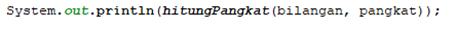

# JOBSHEET 14. Fungsi 2

## NAMA : AHMAD SHODIKIN
## NIM      : 2131710132

## Tujuan
* Mahasiswa memahami konsep fungsi rekursif
* Mahasiswa mampu mengimplementasikan fungsi rekursif dalam kode program


## Alat dan Bahan
* PC/Laptop
* Browser
* Koneksi internet
* Anaconda3 + Java kernel (opsional)

## Praktikum

### Percobaan 1
Pada percobaan ini akan dilakukan pembuatan program untuk menghitung nilai faktorial dari suatu bilangan dengan menggunakan fungsi rekursif. Selain itu, akan dibuat juga fungsi untuk menghitung nilai faktorial dengan menggunakan algoritma iteratif sebagai pembandingnya

1. Buat fungsi static dengan nama **faktorialRekursif()**, dengan tipe data kembalian fungsi int dan memiliki 1 parameter dengan tipe data int berupa bilangan yang akan dihitung nilai faktorialnya

    


```Java
// Tuliskan kode program Percobaan 1 Langkah 1
static int faktorialRekursif(int n){ 
    if (n == 0){
        return (1);
    } else {
        return (n * faktorialRekursif(n-1));
    }
}
```

2. Buat lagi fungsi static dengan nama **faktorialIteratif()**, dengan tipe data kembalian fungsi int dan memiliki 1 parameter dengan tipe data int berupa bilangan yang akan dihitung nilai faktorialnya.

    


```Java
// Tuliskan kode program Percobaan 1 Langkah 2
static int faktorialIteratif(int n){
    int faktor = 1;
    for (int i = n; i>= 1; i--) {
        faktor = faktor * i;
    }
    return faktor;
}
```

3. Lakukan pemanggilan terhadap kedua fungsi yang telah dibuat sebelumnya, dan tampilkan hasil yang didapatkan.

    


```Java
// Tuliskan kode program Percobaan 1 Langkah 1, 2, 3
static int faktorialRekursif(int n){ //fungsi rekursif
    if(n == 0){ //basecall
        return(1);
    } else {
    return (n *faktorialRekursif (n - 1)); //recursion call 
}
}

    
static int faktorialIteratif(int n){ //fungsi faktorial iteratif
    int faktor = 1;
    for (int i = n; i>= 1; i--) { //looping
        faktor = faktor * i;
    }
    return faktor; //mengembalikan nilai akhir
}

System.out.println(faktorialRekursif(5)); //memanggil fungsi faktorial rekursif
System.out.println(faktorialIteratif(5)); //memanggil fungsi faktorial iteratif 
```

    120
    120


4. Jika ditelusuri, pada saat pemanggilan fungsi faktorialRekursif(5),maka proses yang terjadi dapat diilustrasikan sebagai berikut:

    

#### Pertanyaan
1. Apa yang dimaksud dengan fungsi rekursif? 

    = fungsi rekursif adalah situasi dimana fungsi memanggil dirinya sendiri;
    
2. Bagaimana contoh kasus penggunaan fungsi rekursif ?

    = diimplementasikan dalam perhitungan faktorial, dan beberapa perulangan;
    
3. Pada Percobaan1, apakah hasil yang diberikan fungsi faktorialRekursif() dan fungsi faktorialIteratif() sama?    Jelaskan perbedaan alur jalannya program pada penggunaan fungsi rekursif dan fungsi iteratif!

    = hasil yang dihasilkan tetap sama dikarenakan menggunakan bilangan awal yang sama namun berbeda proses.
    = alur jalan fungsi rekursi menggunaakan perulangan dimana dilakukan dengan cara melakukan pemanggilan fungsi dan di dalam fungsi terdapat if else atau kondisi . berbeda dengan fungsi rekursi yang dimana perulangan nya menggunakan for untuk melakukan kalkulasi sebuah hitungan.

### Percobaan 2
Pada percobaan ini akan dilakukan pembuatan program untuk menghitung pangkat sebuah bilangan dengan menggunakan fungsi rekursif.

1. Buat fungsi static dengan nama **hitungPangkat()**, dengan tipe data kembalian fungsi int dan memiliki 2 parameter dengan tipe data int berupa bilangan yang akan dihitung pangkatnya dan bilangan pangkatnya

    

2.	Deklarasikan Scanner dengan nama sc
3.	Buatlah dua buah variabel bertipe int dengan nama bilangan dan pangkat
4.	Tambahkan kode berikut ini untuk menerima input dari keyboard

    

5. Lakukan pemanggilan fungsi hitungPangkat yang telah dibuat sebelumnya dengan mengirimkan dua nilai parameter.

    


```Java
// Tuliskan kode program Percobaan 2 Langkah 1 - 5
import java.util.Scanner;
Scanner sc = new Scanner(System.in);

int bilangan, pangkat; //inisialisai data

static int hitungPangkat(int x, int y){ //fungsi hitung pangkat dengan parameter x, y
    if(y == 0){ //base/kondisi
        return (1);
    } else {
        return (x * hitungPangkat(x, y - 1));
    }
}

System.out.print("Bilangan yang dihitung: ");
bilangan = sc.nextInt();
System.out.print("Pangkat: ");
pangkat = sc.nextInt();

System.out.println(hitungPangkat(bilangan, pangkat));
```

    Bilangan yang dihitung: 5
    Pangkat: 3
    125


#### Pertanyaan
1. Pada Percobaan2, terdapat pemanggilan fungsi rekursif hitungPangkat(bilangan, pangkat) pada fungsi main, kemudian dilakukan pemanggilan fungsi hitungPangkat() secara berulangkali. Jelaskan sampai kapan proses pemanggilan fungsi tersebut akan dijalankan!

= perulangan akan dijalankan ketika pemanggilan fungsi itu sendiri dilakukan. 

### Percobaan 3
Pada percobaan ini akan dilakukan pembuatan program untuk menghitung jumlah uang nasabah yang disimpan di Bank setelah mendapatkan bunga selama beberapa tahun dengan menggunakan fungsi rekursif. 

1. Buat fungsi static dengan nama **hitungBunga()**, dengan tipe data kembalian fungsi double dan memiliki 2 parameter dengan tipe  data int berupa saldo nasabah dan lamanya menabung. Pada kasus ini dianggap bunga yang ditentukan oleh bank adalah 11% per tahun. Karena perhitungan bunga adalah bunga * saldo, sehingga untuk menghitung besarnya uang setelah ditambah bunga adalah saldo + bunga * saldo. Dalam hal ini, besarnya bunga adalah 0.11 * saldo, dan saldo dianggap 1 * saldo, sehingga 1 * saldo + 0.11 * saldo dapat diringkas menjadi 1.11 * saldo untuk perhitungan saldo setelah ditambah bunga (dalam setahun).

    

2.	Deklarasikan Scanner dengan nama sc
3.	Buatlah sebuah variabel bertipa double dengan nama saldoAwal dan sebuah variabel bertipe int bernama tahun
4.	Tambahkan kode berikut ini untuk menerima input dari keyboard

 

5. Lakukan pemanggilan fungsi hitungBunga yang telah dibuat sebelumnya dengan mengirimkan dua nilai parameter.

    


```Java
// Tuliskan kode program Percobaan 3 Langkah 1 - 5
import java.util.Scanner;
Scanner sc = new Scanner(System.in);

double saldoAwal;
int tahun;

static double hitungBunga(double saldo, int tahun){
    if (tahun == 0){
        return (saldo); //mengembalikan nilai saldo
    } else {
        return (1.11 * hitungBunga(saldo, tahun - 1)); //mengembalikan nilai serta mengkalkulasi data
    }
}

System.out.print("Jumlah saldo awal: ");
saldoAwal = sc.nextInt();
System.out.print("Lamanya menabung (tahun): ");
tahun = sc.nextInt();

System.out.print("Jumlah uang setelah " + tahun + " tahun: ");
System.out.println(hitungBunga(saldoAwal, tahun));
```

    Jumlah saldo awal: 12000
    Lamanya menabung (tahun): 2
    Jumlah uang setelah 2 tahun: 14785.200000000003


#### Pertanyaan
1. Pada Percobaan3, sebutkan blok kode program manakah yang merupakan “base case” dan “recursion call”!
+ base case ada pada blok kode {if (tahun == 0)} dimana base case digunakan untuk mengisi nilai batas/ sebuah kondisi terpenuhi.
+ recursion call ada pada blok kode {return } . dimana kode ini berfungsi untuk mengembalikan nilai yang akan disetorkan kembali kepada fungsi pemanggilnya.

## Tugas

1. Buatlah program untuk menampilkan bilangan n sampai 0 dengan menggunakan fungsi rekursif dan fungsi iteratif. (**DeretDescendingRekursif**).


```Java
// Tuliskan jawaban tugas nomor 1
import java.util.Scanner;
Scanner sc = new Scanner(System.in);
int bil;

static int tampilIteratif(int bil){
    for (int i = bil; i>= 1; i--) { //perulangan menggunakan for
        System.out.print(i + " ");
    }
    return 0;
}

static int tampilRekursif(int bil){
    if (bil == 0){ //base / kondisi 
    return 0; 
    } else {
        System.out.print(bil + " ");
        return (tampilRekursif(bil - 1)); //recursioncall dan mengubah nilai di parameter
    }           
}

System.out.print("masukkan bilangan: ");
bil = sc.nextInt();

System.out.println(tampilIteratif(bil) + " = menggunakan Iteratif");
System.out.println(tampilRekursif(bil) + " = menggunakan rekursif");
```

    masukkan bilangan: 5
    5 4 3 2 1 0 = menggunakan Iteratif
    5 4 3 2 1 0 = menggunakan rekursif


##### 2. Buatlah program yang di dalamnya terdapat fungsi rekursif untuk menghitung bilangan faktorial. Misalniya f = 8, maka akan dihasilkan 1+2+3+4+5+6+7+8 = 36 (**PenjumlahanRekursif**).


```Java
// Tuliskan jawaban tugas nomor 2
int i = 1; //nilai awal
static int jumlahRekursif(int bil){
    if(bil == 0){
        return(0);
    } else {
        if(i == 8){ //kondisi untuk menentukan kapan samadengan di keluarkan
            System.out.printf("%d = ", i);
        } else {
            System.out.printf(i + " + ");
            i++;
        }   
        return (jumlahRekursif(bil-1) + bil); //mengembalikan nilai dan memanggil fungsi kurang dari jumlah awal lalu ditambah
}
}
System.out.print(jumlahRekursif(8));
```

    1 + 2 + 3 + 4 + 5 + 6 + 7 + 8 = 36

3.	Buat program yang di dalamnya terdapat fungsi rekursif untuk mengecek apakah suatu bilangan n merupakan bilangan prima atau bukan. n dikatakan bukan bilangan prima jika ia habis dibagi dengan bilangan kurang dari n. (**CekPrimaRekursif**).


```Java
// Tuliskan jawaban tugas nomor 3
import java.util.Scanner;
Scanner sc = new Scanner(System.in);

int bilangan, prim = 0; //inisialisasi bilangan dan prima = 0;
int n = bilangan;

static int cekPrima(int bil){
    if (bil > 0 ){ //basecall / kondisi jika bilangan lebih dari 0
        if((bil % bilangan == 0)){ // dilakukan cek jika bilangan dibagi pembilang adalah 0
            prim++; 
            return (cekPrima(bil-1)); //recursioncall
        } 
        return (cekPrima(bil-1)); //recursioncall
    } //if pertama 
    
    //menentukan output prima atau bukan
    if(prim > 2 || bil <= 1){ // pengecekan bilangan prima 
        System.out.print("Adalah bilangan prima");
        return bilangan; 
    }else{
        System.out.print("Bukan bilangan prima");
         return bilangan;
    }
}


System.out.print("Masukkan bilangan: ");
bilangan = sc.nextInt();

cekPrima(bilangan); //fungsi cekPrima dipanggil
```

    Masukkan bilangan: 98
    Adalah bilangan prima


    98


4.	Sepasang marmut yang baru lahir (jantan dan betina) ditempatkan pada suatu pembiakan.  Setelah dua bulan pasangan marmut tersebut melahirkan sepasang marmut kembar (jantan dan betina). Setiap pasangan marmut yang lahir juga akan melahirkan sepasang marmut juga setiap 2 bulan.  Berapa pasangan marmut yang ada pada akhir bulan ke-12? Buatlah programnya menggunakan fungsi rekursif! (**Fibonacci**).
Berikut ini adalah ilustrasinya dalam bentuk tabel.

 


```Java
// Tuliskan jawaban tugas nomor 4
int i, j = 0; //inisialisasi data
Scanner sc = new Scanner(System.in);

static int fibonacci(int fib){
    if(fib == 0 || fib == 1){ // pengecekan bilangan saama dengan 0 atau 1 
      return fib; //mengembalikan nilai akhir
    } else {
      return (fibonacci(fib-1) + fibonacci(fib-2)); //mengembalikan kepada fungsi
    }
  }

System.out.print("Masukkan bulan: "); 
int n = sc.nextInt();
System.out.print("Hasil total pasangan: ");
System.out.print(fibonacci(n));
```

    Masukkan bulan: 12
    Hasil total pasangan: 144


```Java

```
