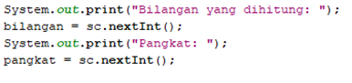

# JOBSHEET 14. Fungsi 2

## Tujuan
* Mahasiswa memahami konsep fungsi rekursif
* Mahasiswa mampu mengimplementasikan fungsi rekursif dalam kode program


## Alat dan Bahan
* PC/Laptop
* Browser
* Koneksi internet
* Anaconda3 + Java kernel (opsional)

## Praktikum

### Percobaan 1
Pada percobaan ini akan dilakukan pembuatan program untuk menghitung nilai faktorial dari suatu bilangan dengan menggunakan fungsi rekursif. Selain itu, akan dibuat juga fungsi untuk menghitung nilai faktorial dengan menggunakan algoritma iteratif sebagai pembandingnya

1. Buat fungsi static dengan nama **faktorialRekursif()**, dengan tipe data kembalian fungsi int dan memiliki 1 parameter dengan tipe data int berupa bilangan yang akan dihitung nilai faktorialnya

    


```Java
// Tuliskan kode program Percobaan 1 Langkah 1

static int faktorialRekursif(int n) { // membuat fungsi bertipe int
   if (n == 0) { / base case
      return (1); // jika n = 0, maka akan bernilai 1
   } else {
       return (n * faktorialRekursif(n - 1)); // recursion call, output dikembalikan merupakan hasil dari di n * hasil pemanggil fungsi n -1
   }
}
```

2. Buat lagi fungsi static dengan nama **faktorialIteratif()**, dengan tipe data kembalian fungsi int dan memiliki 1 parameter dengan tipe data int berupa bilangan yang akan dihitung nilai faktorialnya.

    


```Java
// Tuliskan kode program Percobaan 1 Langkah 2

static int faktorialIteratif(int n) {
   int faktor = 1;
   for (int i = n; i >= 1; i--) {
      faktor = faktor * i;
   }
   return faktor;
}
```

3. Lakukan pemanggilan terhadap kedua fungsi yang telah dibuat sebelumnya, dan tampilkan hasil yang didapatkan.

    


```Java
// Tuliskan kode program Percobaan 1 Langkah 1, 2, 3

static int faktorialRekursif(int n) {
   if (n == 0) {
      return (1);
   } else {
       return (n * faktorialRekursif(n - 1));
   }
}
static int faktorialIteratif(int n) {
   int faktor = 1;
   for (int i = n; i >= 1; i--) {
      faktor = faktor * i;
   }
   return faktor;
}
System.out.println(faktorialRekursif(5));
System.out.println(faktorialIteratif(5));
```

    120
    120


4. Jika ditelusuri, pada saat pemanggilan fungsi faktorialRekursif(5),maka proses yang terjadi dapat diilustrasikan sebagai berikut:

    

#### Pertanyaan
1. Apa yang dimaksud dengan fungsi rekursif? merupakan teknik memanggil dirinya sendiri secara berulang-ulang sampai ada kondisi yang menghentikannya
2. Bagaimana contoh kasus penggunaan fungsi rekursif? untuk menghitung faktorial, pangkat, fibonanci.
3. Pada Percobaan1, apakah hasil yang diberikan fungsi faktorialRekursif() dan fungsi faktorialIteratif() sama? Jelaskan perbedaan alur jalannya program pada penggunaan fungsi rekursif dan fungsi iteratif! jelas tidak sama, fungsi faktorialRekursif() menggunakan fungsi rekursif untuk menjalannkan kode tersebut dan menggunakan kode for (perulangan) biasa.

### Percobaan 2
Pada percobaan ini akan dilakukan pembuatan program untuk menghitung pangkat sebuah bilangan dengan menggunakan fungsi rekursif.

1. Buat fungsi static dengan nama **hitungPangkat()**, dengan tipe data kembalian fungsi int dan memiliki 2 parameter dengan tipe data int berupa bilangan yang akan dihitung pangkatnya dan bilangan pangkatnya

    

2.	Deklarasikan Scanner dengan nama sc
3.	Buatlah dua buah variabel bertipe int dengan nama bilangan dan pangkat
4.	Tambahkan kode berikut ini untuk menerima input dari keyboard

    

5. Lakukan pemanggilan fungsi hitungPangkat yang telah dibuat sebelumnya dengan mengirimkan dua nilai parameter.

    


```Java
// Tuliskan kode program Percobaan 2 Langkah 1 - 5

int bilangan, pangkat; // variabel 
Scanner sc = new Scanner (System.in); // scanner

static int hitungPangkat ( int x, int y){ // membuatfungsi bertipe int
    if (y == 0){ // base case
        return(1); // jika nilai y=0 maka akan output kembali bernilai 1
    }else{
        return (x * hitungPangkat(x, y - 1)); // recursion call, nilai dikembalikan
    }
}

System.out.print("Bilangan yang dihitung: ");
bilangan = sc.nextInt();
System.out.print("Pangkat: ");
pangkat = sc.nextInt();

System.out.println(hitungPangkat(bilangan, pangkat));
```

    Bilangan yang dihitung: 5
    Pangkat: 2
    25


#### Pertanyaan
1. Pada Percobaan2, terdapat pemanggilan fungsi rekursif hitungPangkat(bilangan, pangkat) pada fungsi main, kemudian dilakukan pemanggilan fungsi hitungPangkat() secara berulangkali. Jelaskan sampai kapan proses pemanggilan fungsi tersebut akan dijalankan! pemanggilan proses tersebut dilakukan sampai nilai dalam variabel y tidak 0, melihat dari fungsi rekursif sendiri yang berarti teknik memanggil dirinya sendiri secara berulang-ulang sampai ada kondisi yang menghentikannya.

### Percobaan 3
Pada percobaan ini akan dilakukan pembuatan program untuk menghitung jumlah uang nasabah yang disimpan di Bank setelah mendapatkan bunga selama beberapa tahun dengan menggunakan fungsi rekursif. 

1. Buat fungsi static dengan nama **hitungBunga()**, dengan tipe data kembalian fungsi double dan memiliki 2 parameter dengan tipe  data int berupa saldo nasabah dan lamanya menabung. Pada kasus ini dianggap bunga yang ditentukan oleh bank adalah 11% per tahun. Karena perhitungan bunga adalah bunga * saldo, sehingga untuk menghitung besarnya uang setelah ditambah bunga adalah saldo + bunga * saldo. Dalam hal ini, besarnya bunga adalah 0.11 * saldo, dan saldo dianggap 1 * saldo, sehingga 1 * saldo + 0.11 * saldo dapat diringkas menjadi 1.11 * saldo untuk perhitungan saldo setelah ditambah bunga (dalam setahun).

    

2.	Deklarasikan Scanner dengan nama sc
3.	Buatlah sebuah variabel bertipa double dengan nama saldoAwal dan sebuah variabel bertipe int bernama tahun
4.	Tambahkan kode berikut ini untuk menerima input dari keyboard

 

5. Lakukan pemanggilan fungsi hitungBunga yang telah dibuat sebelumnya dengan mengirimkan dua nilai parameter.

    


```Java
// Tuliskan kode program Percobaan 3 Langkah 1 - 5

double saldoAwal; // deklarasi variabel
int tahun; // deklarasi variabel
Scanner sc = new Scanner (System.in); // deklarasi scanner

static double hitungBunga(double saldo, int tahun){ // fungsi bertipe double
    if (tahun == 0){ // base case
        return (saldo); // jika nilai dalam tahun = 0, output dikembalikan dalam saldo
    }else{
        return (1.11 * hitungBunga(saldo, tahun - 1));// recursion call, output tadi dikembalikan dengan 1.11 dikali hasil pemanggilan tahun - 1
    }
}

System.out.print("Jumlah saldo awal: ");
saldoAwal = sc.nextInt();
System.out.print("Lamanya menabung (tahun): ");
tahun = sc.nextInt();

System.out.print ("Jumlah uang setelah " + tahun + " tahun: ");
System.out.print (hitungBunga(saldoAwal, tahun));
```

    Jumlah saldo awal: 100
    Lamanya menabung (tahun): 12
    Jumlah uang setelah 12 tahun: 349.8450596935638

#### Pertanyaan
1. Pada Percobaan 3, sebutkan blok kode program manakah yang merupakan “base case” dan “recursion call”! 

Base Case : if (tahun == 0){
Recursion call : }else{
                    return (1.11 * hitungBunga(saldo, tahun - 1));


## Tugas

1. Buatlah program untuk menampilkan bilangan n sampai 0 dengan menggunakan fungsi rekursif dan fungsi iteratif. (**DeretDescendingRekursif**).


```Java
// Tuliskan jawaban tugas nomor 1

static void deretDescendingRekursif(int n) { // membuat void dengan parameter int n
    if(n >= 0) {
        System.out.print(n);
        deretDescendingRekursif(n - 1); // jika n >= 0 maka n tersebut akan dikeluarkan dan memanggil rekursif dengan n - 1
    }
}
static void deretDescendingIteratif(int n) { // fungsi void iteratif
    for(int i = n; i >= 0; i--) System.out.print(i); // perulangan untuk output 
}
deretDescendingRekursif(5); // pemanggilan fungsi rekursif
System.out.println();
deretDescendingIteratif(5); // pemanggilan fungsi iteratif
System.out.println();
```

    543210
    543210


2. Buatlah program yang di dalamnya terdapat fungsi rekursif untuk menghitung bilangan faktorial. Misalniya f = 8, maka akan dihasilkan 1+2+3+4+5+6+7+8 = 36 (**PenjumlahanRekursif**).


```Java
// Tuliskan jawaban tugas nomor 2

int i = 0; // deklarasi variabel
static int faktorialRekursif(int n) { // fungsi rekursif dengan parameter int
    if (i == n) // base case
        return 0; // keluaran akan 0 dengan semua hasil n
    else {
        i++; // 
        System.out.print( " + "+i);
        return(i + faktorialRekursif(n));// membalikan nilai
    }
}
System.out.println(" = "+ faktorialRekursif(8));
```

     + 1 + 2 + 3 + 4 + 5 + 6 + 7 + 8 = 36


3.	Buat program yang di dalamnya terdapat fungsi rekursif untuk mengecek apakah suatu bilangan n merupakan bilangan prima atau bukan. n dikatakan bukan bilangan prima jika ia habis dibagi dengan bilangan kurang dari n. (**CekPrimaRekursif**).


```Java
int n ; // deklarasi variabel

int cekPrima(int p){ // deklarasi fungsi dengan tipe int berparameter int 
    if (p == 1){ // base case
        return 1; // jika p adalah 1 maka akan dikeluarkan 1
        
    }else if(n%p==0){
        return 0; // jika n modulus 0 makan akan dikeluarkan 0
        
    }else{
        return cekPrima(p-1);
    }
}

System.out.print("Masukkan nilai: ");
n = sc.nextInt();
    if(n>1){ // base case
        int p = cekPrima(n-1); //deklarasi
        if (p==1){
            printf("%d Bilangan Prima\n", n);
            
        }else{
            printf("%d Bilangan Bukan Prima\n", n);
        }
    }else{
        printf("Bilangan Buka Prima\n", n);
    } // seluruhnya merupakan output untuk masing masing kondisi

```

    Masukkan nilai: 7
    7 Bilangan Prima


4.	Sepasang marmut yang baru lahir (jantan dan betina) ditempatkan pada suatu pembiakan.  Setelah dua bulan pasangan marmut tersebut melahirkan sepasang marmut kembar (jantan dan betina). Setiap pasangan marmut yang lahir juga akan melahirkan sepasang marmut juga setiap 2 bulan.  Berapa pasangan marmut yang ada pada akhir bulan ke-12? Buatlah programnya menggunakan fungsi rekursif! (**Fibonacci**).
Berikut ini adalah ilustrasinya dalam bentuk tabel.

 


```Java
// Tuliskan jawaban tugas nomor 4

import java.util.Scanner; // import library scanner
Scanner in = new Scanner(System.in);// deklarasi scanner

static int pembiakan(int n, int a, int b) { // deklarasi static dengan tipe int berparameter int
     if (n == 0) return a;
     if (n == 1) return b;
     System.out.println("Bulan : " + n);
     return pembiakan(n - 1, b, a + b); //return pada fungsi pembiakan
}

printf("Masukkan bulan: ");
int bulan = in.nextInt(); 
printf("Pada bulan ke %d terdapat %d pasangan ", bulan , pembiakan(bulan, 0, 1));
```

    Masukkan bulan: 12
    Bulan : 12
    Bulan : 11
    Bulan : 10
    Bulan : 9
    Bulan : 8
    Bulan : 7
    Bulan : 6
    Bulan : 5
    Bulan : 4
    Bulan : 3
    Bulan : 2
    Pada bulan ke 12 terdapat 144 pasangan 


```Java

```
