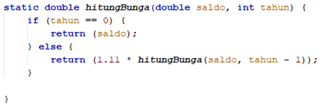
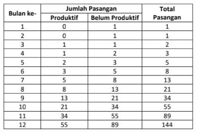

# JOBSHEET 14. Fungsi 2

## Tujuan
* Mahasiswa memahami konsep fungsi rekursif
* Mahasiswa mampu mengimplementasikan fungsi rekursif dalam kode program


## Alat dan Bahan
* PC/Laptop
* Browser
* Koneksi internet
* Anaconda3 + Java kernel (opsional)

## Praktikum

### Percobaan 1
Pada percobaan ini akan dilakukan pembuatan program untuk menghitung nilai faktorial dari suatu bilangan dengan menggunakan fungsi rekursif. Selain itu, akan dibuat juga fungsi untuk menghitung nilai faktorial dengan menggunakan algoritma iteratif sebagai pembandingnya

1. Buat fungsi static dengan nama **faktorialRekursif()**, dengan tipe data kembalian fungsi int dan memiliki 1 parameter dengan tipe data int berupa bilangan yang akan dihitung nilai faktorialnya

    


```Java
// Tuliskan kode program Percobaan 1 Langkah 1
static int faktorialRekursif(int n){ //membuat fungsi faktorialRekursif bertipe int berparamtere int n
    if (n==0){ //base case. rekursi berakhir jika nilai n=0
        return(1); //jika n bernilai 0, output bernilai 1
    } else {
        return (n*faktorialRekursif(n-1)); //recursion call. nilai output yang dikembalikan yaitu hasil dari nilai dalam n dikalikan dengan hasil dari pemanggilan fungsi dengan parameter n-1
    }
}
```

2. Buat lagi fungsi static dengan nama **faktorialIteratif()**, dengan tipe data kembalian fungsi int dan memiliki 1 parameter dengan tipe data int berupa bilangan yang akan dihitung nilai faktorialnya.

    


```Java
// Tuliskan kode program Percobaan 1 Langkah 2
static int faktorialIteratif(int n){ //membuat fungsi faktorialIteratif bertipe int berparamtere int n
    int faktor = 1; //deklarasi variabel faktor bertipe int dengan nilai = 1
    for (int i=n; i>=1; i--){ //looping untuk menghitung variabel faktor dengan setiap indeks sampai i=1
        faktor = faktor *i;
    }
    return faktor; //nilai output dikembalikan ke variabel faktor
}
```

3. Lakukan pemanggilan terhadap kedua fungsi yang telah dibuat sebelumnya, dan tampilkan hasil yang didapatkan.

    


```Java
// Tuliskan kode program Percobaan 1 Langkah 1, 2, 3
System.out.println(faktorialRekursif(5)); //mencetak dan memanggil fungsi faktorialRekursif dengan parameter 5
System.out.println(faktorialIteratif(5)); //mencetak dan memanggil fungsi faktorialIteratif dengan parameter 5
```

    120
    120


4. Jika ditelusuri, pada saat pemanggilan fungsi faktorialRekursif(5),maka proses yang terjadi dapat diilustrasikan sebagai berikut:

    

#### Pertanyaan
1. Apa yang dimaksud dengan fungsi rekursif?
2. Bagaimana contoh kasus penggunaan fungsi rekursif ?
3. Pada Percobaan1, apakah hasil yang diberikan fungsi faktorialRekursif() dan fungsi faktorialIteratif() sama? Jelaskan perbedaan alur jalannya program pada penggunaan fungsi rekursif dan fungsi iteratif!


#### Jawab
1. Fungsi rekursif adalah fungsi yang memanggil dirinya sendiri sehingga proses terjadi secara berulang-ulang sampai base case terpenuhi.
2. Pangkat, faktorial, fibonanci, dll.
3. Hasil yang diberikan sama. Pada fungsi rekursif, program akan berhenti berjalan jika base case terpenuhi, sedangkan pada iteratif program akan berhenti berjalan jika syarat perulangan bernilai false.

### Percobaan 2
Pada percobaan ini akan dilakukan pembuatan program untuk menghitung pangkat sebuah bilangan dengan menggunakan fungsi rekursif.

1. Buat fungsi static dengan nama **hitungPangkat()**, dengan tipe data kembalian fungsi int dan memiliki 2 parameter dengan tipe data int berupa bilangan yang akan dihitung pangkatnya dan bilangan pangkatnya

    

2.	Deklarasikan Scanner dengan nama sc
3.	Buatlah dua buah variabel bertipe int dengan nama bilangan dan pangkat
4.	Tambahkan kode berikut ini untuk menerima input dari keyboard

    

5. Lakukan pemanggilan fungsi hitungPangkat yang telah dibuat sebelumnya dengan mengirimkan dua nilai parameter.

    


```Java
// Tuliskan kode program Percobaan 2 Langkah 1 - 5
static int hitungPangkat(int x, int y){ //membuat fungsi hitungPangkat bertipe int dengan parameter int x dan int y
    if (y==0){ //base case. akan menghentikan perulangan jika terpenuhi
        return(1); //jika nilai dalam variabel y = 0 maka output yang dikembalikan bernilai 1
    } else { //recursion call
        return (x*hitungPangkat(x, y-1)); //recursion call. nilai yang dikembalikan yaitu hasil dari x dikalikan hasil dari pemanggilan fungsi dengan parameter x, y-1
    }
}

import java.util.Scanner; //import library scanner
Scanner sc = new Scanner(System.in); //deklarasi scanner
int bilangan, pangkat; //deklarasi variabel bilangan dan pangkat bertipe int

System.out.print("Bilangan yang dihitung: ");
bilangan = sc.nextInt(); //menampung inputan dalam variabel bilangan
System.out.print("Pangkat: ");
pangkat = sc.nextInt(); //menampung inputan dalam variabel pangkat

System.out.println(hitungPangkat(bilangan, pangkat)); //memanggil fungsi hitungPangkat dengan parameter bilangan, pangkat

```

    Bilangan yang dihitung: 4
    Pangkat: 3
    64


#### Pertanyaan
1. Pada Percobaan2, terdapat pemanggilan fungsi rekursif hitungPangkat(bilangan, pangkat) pada fungsi main, kemudian dilakukan pemanggilan fungsi hitungPangkat() secara berulangkali. Jelaskan sampai kapan proses pemanggilan fungsi tersebut akan dijalankan!

#### Jawab
1. Pemanggilan fungsi akan terus dijalankan selama nilai dalam variabel y tidak bernilai 0. Jika nilai dalam variabel y tidak bernilai 0 maka fungsi hitungPangkat akan terus dipanggil dalam blok recursion call.


### Percobaan 3
Pada percobaan ini akan dilakukan pembuatan program untuk menghitung jumlah uang nasabah yang disimpan di Bank setelah mendapatkan bunga selama beberapa tahun dengan menggunakan fungsi rekursif. 

1. Buat fungsi static dengan nama **hitungBunga()**, dengan tipe data kembalian fungsi double dan memiliki 2 parameter dengan tipe  data int berupa saldo nasabah dan lamanya menabung. Pada kasus ini dianggap bunga yang ditentukan oleh bank adalah 11% per tahun. Karena perhitungan bunga adalah bunga * saldo, sehingga untuk menghitung besarnya uang setelah ditambah bunga adalah saldo + bunga * saldo. Dalam hal ini, besarnya bunga adalah 0.11 * saldo, dan saldo dianggap 1 * saldo, sehingga 1 * saldo + 0.11 * saldo dapat diringkas menjadi 1.11 * saldo untuk perhitungan saldo setelah ditambah bunga (dalam setahun).

    

2.	Deklarasikan Scanner dengan nama sc
3.	Buatlah sebuah variabel bertipa double dengan nama saldoAwal dan sebuah variabel bertipe int bernama tahun
4.	Tambahkan kode berikut ini untuk menerima input dari keyboard

 

5. Lakukan pemanggilan fungsi hitungBunga yang telah dibuat sebelumnya dengan mengirimkan dua nilai parameter.

    


```Java
// Tuliskan kode program Percobaan 3 Langkah 1 - 5
static double hitungBunga(double saldo, int tahun){ //membuat fungsi hitungBunga bertipe double dengan parameter double saldo dan int tahun
    if(tahun==0){ //base case. perulangan akan terhenti jika terpenuhi
        return(saldo); //jika nilai dalam variabel tahun bernilai 0, output yang dikembalikan yaitu nilai dalam variabel saldo
    } else {
        return (1.11 * hitungBunga(saldo, tahun-1)); //recursion call. output yang dikembalikan yaitu hasil dari 1.11 dikalikan hasil dari pemanggilan fungsi dengan parameter saldo, tahun-1
    }
}

import java.util.Scanner; // import library scanner
Scanner sc = new Scanner(System.in); //deklarasi scanner
double saldoAwal; //deklarasi variabel saldoAwal bertipe double
int tahun; //deklarasi variabel tahun bertipe int

System.out.print("Jumlah saldo awal: ");
saldoAwal = sc.nextDouble(); //memasukkan inputan dalam variabel saldoAwal
System.out.print("Lamanya menabung (tahun): ");
tahun = sc.nextInt(); //memasukkan inputan dalam variabel tahun

System.out.print("Jumlah uang setelah "+tahun+" tahun: ");
System.out.println(hitungBunga(saldoAwal, tahun)); //memanggil fungsi hitungBunga dengan parameter saldoAwal, tahun
```

    Jumlah saldo awal: 1500000
    Lamanya menabung (tahun): 5
    Jumlah uang setelah 5 tahun: 2527587.2326500015


#### Pertanyaan
1. Pada Percobaan3, sebutkan blok kode program manakah yang merupakan “base case” dan “recursion call”!

#### Jawab
- Base case : tahun == 0
- Recursion call : 1.11*hitungBunga(saldo, tahun-1)

## Tugas

1. Buatlah program untuk menampilkan bilangan n sampai 0 dengan menggunakan fungsi rekursif dan fungsi iteratif. (**DeretDescendingRekursif**).


```Java
// Tuliskan jawaban tugas nomor 1
static void rekursif(int n){ //membuat fungsi void rekursif dengan parameter int n
    if(n>=0){ 
        System.out.println(n);
        rekursif(n-1); 
        //jika n bernilai lebih dari sama dengan 0 maka n akan dicetak dan memanggil lagi fungsi rekursif dengan parameter n-1 
    }
}

static void iteratif(int n){ //membuat fungsi void iteratif dengan parameter int n
    for (int i=n; i>=0; i--){ //perulangan untuk mencetak i dari n hingga 0
        System.out.println(i);
    }
}

rekursif(8); //memanggil fungsi rekursif dengan parameter 8
iteratif(8); //memanggil fungsi iteratif dengan parameter 8
```

    8
    7
    6
    5
    4
    3
    2
    1
    0
    8
    7
    6
    5
    4
    3
    2
    1
    0


2. Buatlah program yang di dalamnya terdapat fungsi rekursif untuk menghitung bilangan faktorial. Misalniya f = 8, maka akan dihasilkan 1+2+3+4+5+6+7+8 = 36 (**PenjumlahanRekursif**).


```Java
// Tuliskan jawaban tugas nomor 2
static int penjumlahan(int f){ //membuat fungsi penjumlahan bertipe int dengan parameter int f
    if (f == 0){ //base case. perulangan akan berhenti jika terpenuhi
        return (0); //jika variabel f bernilai 0 maka output yang dikembalikan yaitu 0
    } else {
        return (f+penjumlahan(f-1)); //recursion call. akan terus berjalan sampai mendekati base case
    }
}

System.out.println(penjumlahan(8)); //memanggil fungsi penjumlahan dengan parameter 8
```

    36


3.	Buat program yang di dalamnya terdapat fungsi rekursif untuk mengecek apakah suatu bilangan n merupakan bilangan prima atau bukan. n dikatakan bukan bilangan prima jika ia habis dibagi dengan bilangan kurang dari n. (**CekPrimaRekursif**).


```Java
// Tuliskan jawaban tugas nomor 3
static boolean cekPrima (int n, int i){ //membuat fungsi cekPrima bertipe boolean dengan parameter int n dan int i
    if (n%i == 0){ //base case
        return false; //jika n habis dibagi i maka nilai false akan dikembalikan ke pemanggil fungsi
    } else { 
        cekPrima(n, i+1); //recursion call
        return true; //jika recursion call terpenuhi maka nilai true akan dikembalikan ke pemanggil
    }
}

import java.util.Scanner; //import library scanner
Scanner sc = new Scanner(System.in); //deklarasi scanner

System.out.print("Masukkan angka yang akan dicek: ");
int angka = sc.nextInt(); //memasukkan inputan ke variabel angka
if(cekPrima(angka, 2)){ //nilai dalam variabel angka akan dicek dengan memanggil fungsi cekPrima dengan parameter angka,2
    System.out.println("Bilangan "+ angka + " bilangan prima");
} else {
    System.out.println("Bilangan "+ angka + " bukan bilangan prima");
}
```

    Masukkan angka yang akan dicek: 5
    Bilangan 5 bilangan prima


4.	Sepasang marmut yang baru lahir (jantan dan betina) ditempatkan pada suatu pembiakan.  Setelah dua bulan pasangan marmut tersebut melahirkan sepasang marmut kembar (jantan dan betina). Setiap pasangan marmut yang lahir juga akan melahirkan sepasang marmut juga setiap 2 bulan.  Berapa pasangan marmut yang ada pada akhir bulan ke-12? Buatlah programnya menggunakan fungsi rekursif! (**Fibonacci**).
Berikut ini adalah ilustrasinya dalam bentuk tabel.

 


```Java
// Tuliskan jawaban tugas nomor 4
static int marmut(int n){ //membuat fungsi marmut bertipe int dengan parameter int n
    if (n == 0 || n == 1){ //base case
        return n; //jika n bernilai 0 atau 1 maka output yang dikembalikan bernilai n
    } else {
        return (marmut(n-1) + marmut(n-2)); //recursion call. hasil dari pemanggilan fungsi marmut dengan parameter n-1 ditambahkan hasil dari pemanggilan fungsi marmut dengan parameter n-2
    }
}

System.out.println(marmut(12)); //memanggil fungsi marmut dengan parameter 12
```

    144

