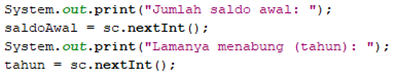

# JOBSHEET 14. Fungsi 2

## Tujuan
* Mahasiswa memahami konsep fungsi rekursif
* Mahasiswa mampu mengimplementasikan fungsi rekursif dalam kode program


## Alat dan Bahan
* PC/Laptop
* Browser
* Koneksi internet
* Anaconda3 + Java kernel (opsional)

## Praktikum

### Percobaan 1
Pada percobaan ini akan dilakukan pembuatan program untuk menghitung nilai faktorial dari suatu bilangan dengan menggunakan fungsi rekursif. Selain itu, akan dibuat juga fungsi untuk menghitung nilai faktorial dengan menggunakan algoritma iteratif sebagai pembandingnya

1. Buat fungsi static dengan nama **faktorialRekursif()**, dengan tipe data kembalian fungsi int dan memiliki 1 parameter dengan tipe data int berupa bilangan yang akan dihitung nilai faktorialnya

    


```Java
// Tuliskan kode program Percobaan 1 Langkah 1
static int faktorialRekursif(int n) { //membuat fungsi faktorialRekursif bertipe int berparamtere int n
    if (n == 0) { // base case
        return (1);
    } else {
        return (n * faktorialRekursif(n - 1)); // recursion call
    }
}
```

2. Buat lagi fungsi static dengan nama **faktorialIteratif()**, dengan tipe data kembalian fungsi int dan memiliki 1 parameter dengan tipe data int berupa bilangan yang akan dihitung nilai faktorialnya.

    


```Java
// Tuliskan kode program Percobaan 1 Langkah 2
static int faktorialIteratif(int n) { //membuat fungsi faktorialIteratif bertipe int berparamtere int n
    int faktor = 1; // instansiasi variabel faktor
    for (int i = n; i >= 1; i--) { // looping untuk menghitung variabel faktor dengan setiap indeks sampai i=1
        faktor = faktor * i;
    }
    return faktor; // menampung hasil perhitungan dan ditampung untuk proses selanjutnya
}
```

3. Lakukan pemanggilan terhadap kedua fungsi yang telah dibuat sebelumnya, dan tampilkan hasil yang didapatkan.

    


```Java
// Tuliskan kode program Percobaan 1 Langkah 1, 2, 3
static int faktorialRekursif(int n) { 
    if (n == 0) {
        return (1);
    } else {
        return (n * faktorialRekursif(n - 1));
    }
}

static int faktorialIteratif(int n) {
    int faktor = 1;
    for (int i = n; i >= 1; i--) {
        faktor = faktor * i;
    }
    return faktor;
}

System.out.println(faktorialRekursif(5)); // memanggil fungsi faktorialRekursif
System.out.println(faktorialIteratif(5)); // memanggil fungsi faktorialIteratif
```

    120
    120


4. Jika ditelusuri, pada saat pemanggilan fungsi faktorialRekursif(5),maka proses yang terjadi dapat diilustrasikan sebagai berikut:

    

#### Pertanyaan
1. Apa yang dimaksud dengan fungsi rekursif?
2. Bagaimana contoh kasus penggunaan fungsi rekursif ?
3. Pada Percobaan1, apakah hasil yang diberikan fungsi faktorialRekursif() dan fungsi faktorialIteratif() sama? Jelaskan perbedaan alur jalannya program pada penggunaan fungsi rekursif dan fungsi iteratif!


JAWABAN

1. Fungsi rekursif adalah fungsi untuk memanggil fungsi itu sendiri  sehingga proses pemanggilan fungsi akan terjadi secara berulang-ulang.

2. diimplementasikan dalam perhitungan faktorial, pangkat, dan beberapa perulangan

3. Iya sama. Pada fungsi rekursif, perulangan akan berhenti jika kondisi benar. Sedangkan pada fungsi iteratif, perulangan akan berhenti jika kondisi salah.

### Percobaan 2
Pada percobaan ini akan dilakukan pembuatan program untuk menghitung pangkat sebuah bilangan dengan menggunakan fungsi rekursif.

1. Buat fungsi static dengan nama **hitungPangkat()**, dengan tipe data kembalian fungsi int dan memiliki 2 parameter dengan tipe data int berupa bilangan yang akan dihitung pangkatnya dan bilangan pangkatnya

    

2.	Deklarasikan Scanner dengan nama sc
3.	Buatlah dua buah variabel bertipe int dengan nama bilangan dan pangkat
4.	Tambahkan kode berikut ini untuk menerima input dari keyboard

    

5. Lakukan pemanggilan fungsi hitungPangkat yang telah dibuat sebelumnya dengan mengirimkan dua nilai parameter.

    


```Java
// Tuliskan kode program Percobaan 2 Langkah 1 - 5
static int hitungPangkat(int x, int y) { // membuat fungsi hitungPangkat bertipe int dengan parameter int x dan int y
    if (y == 0) { // base case
        return (1);
    } else { // recursion call
        return (x * hitungPangkat(x, y - 1));
    }
}

import java.util.Scanner; // import library scanner
Scanner sc = new Scanner(System.in); // deklarasi scanner
int bilangan, pangkat; // deklarasi variabel

System.out.print("Bilangan yang dihitung: ");
bilangan = sc.nextInt();  // memasukkan bilangan
System.out.print("Pangkat: ");
pangkat = sc.nextInt();  // memasukkan pangkat

System.out.println(hitungPangkat(bilangan, pangkat)); // memanggil fungsi hitungPangkat
```

    Bilangan yang dihitung: 7
    Pangkat: 4
    2401


#### Pertanyaan
1. Pada Percobaan2, terdapat pemanggilan fungsi rekursif hitungPangkat(bilangan, pangkat) pada fungsi main, kemudian dilakukan pemanggilan fungsi hitungPangkat() secara berulangkali. Jelaskan sampai kapan proses pemanggilan fungsi tersebut akan dijalankan!

JAWABAN

perulangan akan dijalankan ketika pemanggilan fungsi itu sendiri dilakukan

### Percobaan 3
Pada percobaan ini akan dilakukan pembuatan program untuk menghitung jumlah uang nasabah yang disimpan di Bank setelah mendapatkan bunga selama beberapa tahun dengan menggunakan fungsi rekursif. 

1. Buat fungsi static dengan nama **hitungBunga()**, dengan tipe data kembalian fungsi double dan memiliki 2 parameter dengan tipe  data int berupa saldo nasabah dan lamanya menabung. Pada kasus ini dianggap bunga yang ditentukan oleh bank adalah 11% per tahun. Karena perhitungan bunga adalah bunga * saldo, sehingga untuk menghitung besarnya uang setelah ditambah bunga adalah saldo + bunga * saldo. Dalam hal ini, besarnya bunga adalah 0.11 * saldo, dan saldo dianggap 1 * saldo, sehingga 1 * saldo + 0.11 * saldo dapat diringkas menjadi 1.11 * saldo untuk perhitungan saldo setelah ditambah bunga (dalam setahun).

    

2.	Deklarasikan Scanner dengan nama sc
3.	Buatlah sebuah variabel bertipa double dengan nama saldoAwal dan sebuah variabel bertipe int bernama tahun
4.	Tambahkan kode berikut ini untuk menerima input dari keyboard

 

5. Lakukan pemanggilan fungsi hitungBunga yang telah dibuat sebelumnya dengan mengirimkan dua nilai parameter.

    


```Java
// Tuliskan kode program Percobaan 3 Langkah 1 - 5
static double hitungBunga(double saldo, int tahun) { // membuat fungsi hitungBunga bertipe double dengan parameter double saldo dan int tahun
    if (tahun == 0) { // base case
        return (saldo);
    } else {
        return (1.11 * hitungBunga(saldo, tahun - 1)); // recursion call
    }
}
import java.util.Scanner; // untuk memasukkan inputan dari keyboard
Scanner sc = new Scanner(System.in); // deklarasi scanner
double saldoAwal; int tahun; // deklarasi variabel

System.out.print("Jumlah saldo awal: ");
saldoAwal = sc.nextInt(); // memasukkan saldo awal
System.out.print("Lamanya menabung (tahun): ");
tahun = sc.nextInt(); // memasukkan tahun

System.out.print("Jumlah uang setelah " + tahun + " tahun: "); // menampilkan jumlah uang
System.out.println(hitungBunga(saldoAwal, tahun)); // memanggil fungsi hitungBunga
```

    Jumlah saldo awal: 15000000
    Lamanya menabung (tahun): 5
    Jumlah uang setelah 5 tahun: 2.5275872326500013E7


#### Pertanyaan
1. Pada Percobaan3, sebutkan blok kode program manakah yang merupakan “base case” dan “recursion call”!

JAWABAN

- Base case
if (tahun == 0) {
    return (saldo);
    
- Recursion call : 
} else {
    return (1.11 * hitungBunga(saldo, tahun  - 1));

## Tugas

1. Buatlah program untuk menampilkan bilangan n sampai 0 dengan menggunakan fungsi rekursif dan fungsi iteratif. (**DeretDescendingRekursif**).


```Java
// Tuliskan jawaban tugas nomor 1
static void deretDescendingRekursif(int n) {//membuat fungsi void deretDescendingrekursif dengan parameter int n 
    if(n >= 0) { // base case 
        System.out.print(n);
        deretDescendingRekursif(n - 1); // recursion call
    }
}

static void deretDescendingIteratif(int n) { // deklarasi fungsi iteratif
    for(int i = n; i >= 0; i--) System.out.print(i);
}

deretDescendingRekursif(7); // memanggil fungsi rekursif
System.out.println(); // menampilkan hasil fungsi
deretDescendingIteratif(7); // memanggik fungsi iteratif
```

    76543210
    76543210

2. Buatlah program yang di dalamnya terdapat fungsi rekursif untuk menghitung bilangan faktorial. Misalniya f = 8, maka akan dihasilkan 1+2+3+4+5+6+7+8 = 36 (**PenjumlahanRekursif**).


```Java
// Tuliskan jawaban tugas nomor 2
int i = 1; //nilai awal
static int jumlahRekursif(int bil){
    if(bil == 0){
        return(0);
    } else {
        if(i == 12){ //kondisi untuk menentukan kapan samadengan di keluarkan
            System.out.printf("%d = ", i);
        } else {
            System.out.printf(i + " + ");
            i++;
        }   
        return (jumlahRekursif(bil-1) + bil); //mengembalikan nilai dan memanggil fungsi kurang dari jumlah awal lalu ditambah
}
}
System.out.print(jumlahRekursif(12));
```

    1 + 2 + 3 + 4 + 5 + 6 + 7 + 8 + 9 + 10 + 11 + 12 = 78

3.	Buat program yang di dalamnya terdapat fungsi rekursif untuk mengecek apakah suatu bilangan n merupakan bilangan prima atau bukan. n dikatakan bukan bilangan prima jika ia habis dibagi dengan bilangan kurang dari n. (**CekPrimaRekursif**).


```Java
// Tuliskan jawaban tugas nomor 3
static boolean cekPrima (int n, int i){ //membuat fungsi cekPrima bertipe boolean dengan parameter int n dan int i
    if (n%i == 0){ //base case
        return false; //jika n habis dibagi i maka nilai false akan dikembalikan ke pemanggil fungsi
    } else { 
        cekPrima(n, i+1); //recursion call
        return true; //jika recursion call terpenuhi maka nilai true akan dikembalikan ke pemanggil
    }
}

import java.util.Scanner; //import library scanner
Scanner sc = new Scanner(System.in); //deklarasi scanner

System.out.print("Masukkan angka yang akan dicek: ");
int angka = sc.nextInt(); //memasukkan inputan ke variabel angka
if(cekPrima(angka, 2)){ //nilai dalam variabel angka akan dicek dengan memanggil fungsi cekPrima dengan parameter angka,2
    System.out.println("Bilangan "+ angka + " bilangan prima");
} else {
    System.out.println("Bilangan "+ angka + " bukan bilangan prima");
}
```

    Masukkan angka yang akan dicek: 9
    Bilangan 9 bilangan prima


4.	Sepasang marmut yang baru lahir (jantan dan betina) ditempatkan pada suatu pembiakan.  Setelah dua bulan pasangan marmut tersebut melahirkan sepasang marmut kembar (jantan dan betina). Setiap pasangan marmut yang lahir juga akan melahirkan sepasang marmut juga setiap 2 bulan.  Berapa pasangan marmut yang ada pada akhir bulan ke-12? Buatlah programnya menggunakan fungsi rekursif! (**Fibonacci**).
Berikut ini adalah ilustrasinya dalam bentuk tabel.

 


```Java
// Tuliskan jawaban tugas nomor 4
int i, j = 0; //inisialisasi data
Scanner sc = new Scanner(System.in);

static int fibonacci(int fib){
    if(fib == 0 || fib == 1){ // pengecekan bilangan saama dengan 0 atau 1 
      return fib; //mengembalikan nilai akhir
    } else {
      return (fibonacci(fib-1) + fibonacci(fib-2)); //mengembalikan kepada fungsi
    }
  }

System.out.print("Masukkan bulan: "); 
int n = sc.nextInt();
System.out.print("Hasil total pasangan: ");
System.out.print(fibonacci(n));
```

    Masukkan bulan: 2
    Hasil total pasangan: 1


```Java

```
