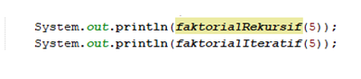

# JOBSHEET 14. Fungsi 2

## Tujuan
* Mahasiswa memahami konsep fungsi rekursif
* Mahasiswa mampu mengimplementasikan fungsi rekursif dalam kode program


## Alat dan Bahan
* PC/Laptop
* Browser
* Koneksi internet
* Anaconda3 + Java kernel (opsional)

## Praktikum

### Percobaan 1
Pada percobaan ini akan dilakukan pembuatan program untuk menghitung nilai faktorial dari suatu bilangan dengan menggunakan fungsi rekursif. Selain itu, akan dibuat juga fungsi untuk menghitung nilai faktorial dengan menggunakan algoritma iteratif sebagai pembandingnya

1. Buat fungsi static dengan nama **faktorialRekursif()**, dengan tipe data kembalian fungsi int dan memiliki 1 parameter dengan tipe data int berupa bilangan yang akan dihitung nilai faktorialnya

    


```Java
// Tuliskan kode program Percobaan 1 Langkah 1
static int faktorialRekursif(int n) {
      if (n == 0){
          return (1);
      } else {
          return (n * faktorialRekursif(n-1));
      }
    
}
```

> Code diatas merupakan fungsi untuk membuat faktorial. fungsi diatas bertipe int yang berparameter int, di fungsi ini jika parameter yang dikirim bukan sama dengan 0 maka komputer akan mereturn parameter (n) dikali angka hasil fungsinya sendiri yang parameternya (n) dikurangi satu, program ini akan terus berjalan karena memanggil fungsinya sendiri ssampai ketika angka parameter atau n sama dengan 0 maka program akan berhenti dan akan mereturn outputnya.

2. Buat lagi fungsi static dengan nama **faktorialIteratif()**, dengan tipe data kembalian fungsi int dan memiliki 1 parameter dengan tipe data int berupa bilangan yang akan dihitung nilai faktorialnya.

    


```Java
// Tuliskan kode program Percobaan 1 Langkah 2
static int faktorialIteratif(int n) {
    int faktor = 1;
    for (int i = n; i >= 1; i--){
        faktor = faktor * i;
   }
return faktor;
}
```

> kode diatas merupakan fungsi untuk membuat faktorial. fungsi diatas bertipe int yang berparameter int, di fungsi ini terdapat deklarasi variabel 'faktor'  bertipe integer lalu ada perulangan for yang berinisialisasi i sama n (parameter yang dikirim pemanggil), perulangan ini tetap berjalan sama i sama dengan 1 dan setiap putaran i dikurangi satu angka didalam perulangan ini variabel faktor dikali dengan i.

3. Lakukan pemanggilan terhadap kedua fungsi yang telah dibuat sebelumnya, dan tampilkan hasil yang didapatkan.

    


```Java
// Tuliskan kode program Percobaan 1 Langkah 1, 2, 3
static int faktorialRekursif(int n) {
      if (n == 0){
          return 1;
      } else {
          return (n * faktorialRekursif(n-1));
      }
    
}
static int faktorialIteratif(int n) {
    int faktor = 1;
    for (int i = n; i >= 1; i--){
        faktor = faktor * i;
   }
return faktor;
}
System.out.println(faktorialRekursif(5));
System.out.println(faktorialIteratif(5));
```

    120
    120


> kode diatas berisi pendeklarasian fungsi untuk membuat faktorial. fungsi diatas bertipe int yang berparameter int, di fungsi ini jika parameter yang dikirim bukan sama dengan 0 maka komputer akan mereturn parameter (n) dikali angka hasil fungsinya sendiri yang parameternya (n) dikurangi satu, program ini akan terus berjalan karena memanggil fungsinya sendiri ssampai ketika angka parameter atau n sama dengan 0 maka program akan berhenti dan akan mereturn outputnya. selanjuntya pada fungsi kedua merupakan fungsi untuk membuat faktorial juga. fungsi diatas bertipe int yang berparameter int, di fungsi ini terdapat deklarasi variabel 'faktor'  bertipe integer lalu ada perulangan for yang berinisialisasi i sama n (parameter yang dikirim pemanggil), perulangan ini tetap berjalan sama i sama dengan 1 dan setiap putaran i dikurangi satu angka didalam perulangan ini variabel faktor dikali dengan i. lalu pada bagian fungsi main berisi perintah untuk mencetak fungsi pertama dan kedua yang.

4. Jika ditelusuri, pada saat pemanggilan fungsi faktorialRekursif(5),maka proses yang terjadi dapat diilustrasikan sebagai berikut:

    

#### Pertanyaan
1. Apa yang dimaksud dengan fungsi rekursif?
2. Bagaimana contoh kasus penggunaan fungsi rekursif ?
3. Pada Percobaan1, apakah hasil yang diberikan fungsi faktorialRekursif() dan fungsi faktorialIteratif() sama? Jelaskan perbedaan alur jalannya program pada penggunaan fungsi rekursif dan fungsi iteratif!


> 1. Fungsi rekursif adalah fungsi yang memanggil dirinya sendiri. Hal ini bisa terjadi karena di dalam suatu fungsi rekursi, terdapat statement/baris program yang memanggil fungsi itu sendiri. Ketika suatu fungsi rekursif dipanggil/dijalankan dan kemudian proses eksekusi sudah sampai pada statement pemanggilan fungsi itu sendiri, maka fungsi tersebut akan dipanggil/dijalankan kembali. Dan lagi, ketika proses eksekusi sudah sampai pada statement pemanggilan fungsi itu sendiri, maka fungsi tersebut akan dipanggil/dijalankan kembali, begitu seterusnya hingga didapatkan suatu konsdisi akhir dimana proses pemanggilan fungsi tersebut tidak dilakukan lagi.

>2. contoh kasus penggunaan fungsi rekursif adalah menghitung faktorial sebuah angka, atau membuat dsebuah deret.

>3. Hasil dari fungsi faltorialRekursif() dan fungsi faktorialIteratif() sama, perbedaan dari kedua fungsi tersebut adalah alurnya, yang pertama adalah faktorialRekursif(), di fungsi ini jika parameter yang dikirim bukan sama dengan 0 maka komputer akan mereturn parameter (n) dikali angka hasil fungsinya sendiri yang parameternya (n) dikurangi satu, program ini akan terus berjalan karena memanggil fungsinya sendiri sampai ketika angka parameter atau n sama dengan 0 maka program akan berhenti dan akan mereturn outputnya. yang kedua adalah fungsi faktorialIteratif(), fungsi ini menggunakan perulangan for yang dimulai dengan inisialisasi i sama dengan n atau parameter yang dikirim, selanjunya nilai faktor diperoleh dari faktor = faktor * i, program ini terus berjalan sampai i sama dengan 1 dan setiap putaran, i dikurangi satu angka.

### Percobaan 2
Pada percobaan ini akan dilakukan pembuatan program untuk menghitung pangkat sebuah bilangan dengan menggunakan fungsi rekursif.

1. Buat fungsi static dengan nama **hitungPangkat()**, dengan tipe data kembalian fungsi int dan memiliki 2 parameter dengan tipe data int berupa bilangan yang akan dihitung pangkatnya dan bilangan pangkatnya

    

2.	Deklarasikan Scanner dengan nama sc
3.	Buatlah dua buah variabel bertipe int dengan nama bilangan dan pangkat
4.	Tambahkan kode berikut ini untuk menerima input dari keyboard

    

5. Lakukan pemanggilan fungsi hitungPangkat yang telah dibuat sebelumnya dengan mengirimkan dua nilai parameter.

    


```Java
// Tuliskan kode program Percobaan 2 Langkah 1 - 5
import java.util.Scanner;

static int hitungPangkat(int x, int y){
    if (y == 0){
        return (1);
    } else {
        return (x * hitungPangkat(x, y-1));
    }
}
Scanner input = new Scanner(System.in);
int bilangan, pangkat;
System.out.print("Bilangan yang di hitung : ");
bilangan = input.nextInt();
System.out.print("Pangkat : ");
pangkat = input.nextInt();
System.out.println("Hasil dari " + bilangan + " pangkat " + pangkat + " adalah : " + hitungPangkat(bilangan, pangkat));
```

    Bilangan yang di hitung : 5
    Pangkat : 3
    Hasil dari 5 pangkat 3 adalah : 125


> kode diatas berisi pendeklarisian fungsi yang bertipe integer dan menerima parameter int juga, yang berisi perintah jika y bukan sama dengn 0 maka akan memanggil kembali fungsinya sendiri agar operasi perpangkatan x bisa berjalan san setiap putaran angka y berkurang satu angka, program ini akan terus berjalan sampai angka y sama dengan 0 karena jika y sama dengan 0 maka program berhenti dan akan mereturn hasilnya. selanjutnya pada blok bagian fungsi main dideklarasikan class Scanner kemudian dideklarasikan bahwa biilangan dan pangkat merupakan data bertipe integer kemudia user diminta untuk memasukkan dua data, kemudian komputer akan mencetak hasil dari pemanggilan fungsi 'hitungPangkat' yang bahan operasi perhitungannya berasal dari inputan user.

#### Pertanyaan
1. Pada Percobaan2, terdapat pemanggilan fungsi rekursif hitungPangkat(bilangan, pangkat) pada fungsi main, kemudian dilakukan pemanggilan fungsi hitungPangkat() secara berulangkali. Jelaskan sampai kapan proses pemanggilan fungsi tersebut akan dijalankan!

> 1. Pemanggilan fungsi tersebut akan terus berjalan sampai y sama dengan 0, jika y sama dengan nol maka komputer akan mereturn hasilnya.

### Percobaan 3
Pada percobaan ini akan dilakukan pembuatan program untuk menghitung jumlah uang nasabah yang disimpan di Bank setelah mendapatkan bunga selama beberapa tahun dengan menggunakan fungsi rekursif. 

1. Buat fungsi static dengan nama **hitungBunga()**, dengan tipe data kembalian fungsi double dan memiliki 2 parameter dengan tipe  data int berupa saldo nasabah dan lamanya menabung. Pada kasus ini dianggap bunga yang ditentukan oleh bank adalah 11% per tahun. Karena perhitungan bunga adalah bunga * saldo, sehingga untuk menghitung besarnya uang setelah ditambah bunga adalah saldo + bunga * saldo. Dalam hal ini, besarnya bunga adalah 0.11 * saldo, dan saldo dianggap 1 * saldo, sehingga 1 * saldo + 0.11 * saldo dapat diringkas menjadi 1.11 * saldo untuk perhitungan saldo setelah ditambah bunga (dalam setahun).

    

2.	Deklarasikan Scanner dengan nama sc
3.	Buatlah sebuah variabel bertipa double dengan nama saldoAwal dan sebuah variabel bertipe int bernama tahun
4.	Tambahkan kode berikut ini untuk menerima input dari keyboard

 

5. Lakukan pemanggilan fungsi hitungBunga yang telah dibuat sebelumnya dengan mengirimkan dua nilai parameter.

    


```Java
// Tuliskan kode program Percobaan 3 Langkah 1 - 5
import java.util.Scanner;
static double hitungBunga(double saldo, int tahun){
    if (tahun == 0){
        return (saldo);
    } else {
        return (1.11 * hitungBunga(saldo, tahun - 1));
    }
}

Scanner sc = new Scanner (System.in);
double saldoAwal;
int tahun;

System.out.print("Jumlah Saldo awal : Rp.");
saldoAwal = sc.nextInt();
System.out.print("Lama menabung (Tahun) : ");
tahun = sc.nextInt();

System.out.print("Jumlah uang setelah " + tahun + "tahun adalah : ");
System.out.println(hitungBunga(saldoAwal, tahun));
```

    Jumlah Saldo awal : Rp.20000
    Lama menabung (Tahun) : 2
    Jumlah uang setelah 2tahun adalah : 24642.000000000007


> kode diatas berisi pendeklarisian fungsi yang bertipe double dan menerima parameter double dan int , yang berisi perintah jika variabel tahun bukan sama dengn 0 maka akan memanggil kembali fungsinya sendiri agar operasi perhitungan bunga berjalan setiap putaran angka variabel tahun berkurang satu angka, program ini akan terus berjalan sampai variabel tahun sama dengan 0 karena jika variabel tahun sama dengan 0 maka program berhenti dan akan mereturn hasilnya. selanjutnya pada blok bagian fungsi main dideklarasikan class Scanner kemudian dideklarasikan bahwa variabel 'saldoAwal' bertipe double dan variabel tahun bertipe integer kemudia user diminta untuk memasukkan data ke dalam kedua variabel tersebut, kemudian komputer akan mencetak hasil dari pemanggilan fungsi 'hitungBunga' yang bahan operasi perhitunganya berasal dari inputan user.

#### Pertanyaan
1. Pada Percobaan3, sebutkan blok kode program manakah yang merupakan “base case” dan “recursion call”!


```Java
// Tuliskan kode program Percobaan 3 Langkah 1 - 5
import java.util.Scanner;
static double hitungBunga(double saldo, int tahun){
    if (tahun == 0){ /* Base Case */
        return (saldo); /* Base Case */
        } 
        else { /* Recursion case */
        return (1.11 * hitungBunga(saldo, tahun - 1)); /* Recursion case */
    }
}

Scanner sc = new Scanner (System.in);
double saldoAwal;
int tahun;

System.out.print("Jumlah Saldo awal : Rp.");
saldoAwal = sc.nextInt();
System.out.print("Lama menabung (Tahun) : ");
tahun = sc.nextInt();

System.out.print("Jumlah uang setelah " + tahun + "tahun adalah : ");
System.out.println(hitungBunga(saldoAwal, tahun));
```

    Jumlah Saldo awal : Rp.3000
    Lama menabung (Tahun) : 5
    Jumlah uang setelah 5tahun adalah : 5055.174465300002


## Tugas

1. Buatlah program untuk menampilkan bilangan n sampai 0 dengan menggunakan fungsi rekursif dan fungsi iteratif. (**DeretDescendingRekursif**).


```Java
// Tuliskan jawaban tugas nomor 1
static int deret1(int n) {
      if (n == 0){
          return 0;
      } else {
          System.out.print(n + " ");
          return (deret1(n-1));
      }
    
}
static int deret2(int n) {
    for (int i = n; i >=1; i--){
        System.out.print(i + " ");
   }
    return (0);
}
import java.util.Scanner;
Scanner input = new Scanner (System.in);
int angka;

System.out.print("Masukkan Sebuah Angka : ");
angka = input.nextInt();
System.out.print("Output Fungsi Rekursif : ");
System.out.println(deret1(angka));
System.out.print("Output Fungsi Iteratif : ");
System.out.println(deret2(angka));
```

    Masukkan Sebuah Angka : 5
    Output Fungsi Rekursif : 5 4 3 2 1 0
    Output Fungsi Iteratif : 5 4 3 2 1 0


>kode diatas berisi pendeklarisian fungsi yang bertipe int dan menerima parameter int , yang berisi perintah jika variabel n bukan sama dengn 0 maka akan mencetak isi variabel n lalu memanggil kembali fungsinya sendiri lalu setiap putaran angka variabel n berkurang satu angka sehingga pada putaran berikutnya nilai n yang dicetak berkurang 1, program ini akan terus berjalan sampai variabel n sama dengan 0 karena jika variabel n sama dengan 0 maka program berhenti dan akan mereturn angka 0 (Fungsi Rekursif). Selanjutnya difungsi kedua yang akan menjadi fungsi Iteratif di fungsi ini ada perulangan for berinisialisasi i sama dengan variabel n, perulangan tetap berjalan sampai i sama dengan 1, setiap putaran i dikurangi satu angka yang berisi perintah mencetak variabel i, setelah perulangan selesai komputer akan mereturn angka 0,selanjutnya pada blok bagian fungsi main dideklarasikan class Scanner kemudian dideklarasikan bahwa variabel 'angka' bertipe integer, kemudian user diminta untuk memasukkan data yang data nya nanti akan dimasukkan ke fungsi rekursif dan fungsi Iteratif, kemudian komputer akan mencetak hasil dari pemanggilan fungsi 'deret1'(fungsi rekursif) juga hasil pemanggilan fungsi 'deret2' (Fungsi Iteratif) yang bahan pengolahan operasi kedua fungsi ini berasal dari inputan user.

2. Buatlah program yang di dalamnya terdapat fungsi rekursif untuk menghitung bilangan faktorial. Misalniya f = 8, maka akan dihasilkan 1+2+3+4+5+6+7+8 = 36 (**PenjumlahanRekursif**).


```Java
static void number(int n) {
 for(int i = 1;; i++){
     if(i == n){
         System.out.print(i + " = ");
         break;
     }
     System.out.print(i + " + ");
 }
}
static int penjumlahanRekursif(int n) {
      if (n == 0){
          return 0;
      } else {
          return (n + penjumlahanRekursif(n-1));
      }
}
import java.util.Scanner;
Scanner input = new Scanner (System.in);
int angka;

System.out.print("Masukkan Sebuah Angka : ");
angka = input.nextInt();

number(angka);
System.out.print(penjumlahanRekursif(angka));
```

    Masukkan Sebuah Angka : 5
    1 + 2 + 3 + 4 + 5 = 15

> kode diatas berisi pendeklarisian fungsi void yang menerima parameter int, fungsi ini digunakan untuk mencetak proses operasi penjumlahan, fungsi ini menggunakan perulangan for untuk mencetak proses dari operasi penjumlahannya. selanjutnya fungsi kedua digunakan untuk menghitung hasil dari operasi penjumlahan. dan pada bagian fungsi main user diminta untuk memasukkan angka yang angkanya nanti akan digunakan untuk parameter kedua fungsi.


```Java
/* cara lain tugas no.2 */
import java.util.Scanner;
Scanner input = new Scanner (System.in);
int angka;

System.out.print("Masukkan Sebuah Angka : ");
angka = input.nextInt();

int i = 1;
System.out.print("1");
static int penjumlahanRekursif(int n) {
      if (i == n){
          return 1;
      } else {
          i++;
          System.out.print(" + " + i);
          return (i + penjumlahanRekursif(n));
      }
}
System.out.print(" = " + penjumlahanRekursif(angka));
```

    Masukkan Sebuah Angka : 5
    1 + 2 + 3 + 4 + 5 = 15

> pada bagian fungsi main user diminta untuk memasukkan angka yang nantinya akan menjadi parameter fungsi 'penjumlahanRekursif' didalam fungsi ini komputer akan mencetak proses operasi dan mencetak hasil dari operasi setealh itu diakhir terdapat perintah untuk mencetak hasil pemanggilan fungsi 'penjumlahanRekursif'

3.	Buat program yang di dalamnya terdapat fungsi rekursif untuk mengecek apakah suatu bilangan n merupakan bilangan prima atau bukan. n dikatakan bukan bilangan prima jika ia habis dibagi dengan bilangan kurang dari n. (**CekPrimaRekursif**).


```Java
// Tuliskan jawaban tugas nomor 3
import java.util.Scanner;
int masuk = 0;
int prima;
static int cek(int n){
    if(n>0){
        if(a % n == 0){
            masuk++;
            return cek(n - 1) ;
        }
            else {
            return cek(n -1);
        }
    }
    else if(masuk > 2 || a <= 1){
        System.out.print("Bukan bilangan prima");
         return a;
     }
    else if(masuk == 2){
        System.out.print("Benar bilangan prima ");
         return a;
        }
    return cek(n -1);
}

Scanner sc = new Scanner (System.in);
int a;
System.out.print("Masukkan Sebuah angka : ");
a = sc.nextInt();
prima = cek(a);
```

    Masukkan Sebuah angka : 3
    Benar bilangan prima 

> difungsi ini terdapat fungsi untuk mengecek parameter apakah bilangan itu merupakan bilangan prima, dengan cara parameter di modulo dengan angkanya sendiri apakah hasilnya 0 jika true maka angaka tersbut ditandai jika false maka akan mengcall fungsinya sendiri dengan kondisi parameter dikurangi satu angka sampai parameter sama dengan 1 lalu dicek jika sebuah angka hanya lolos 2 kali syarat percabangan 'if(a % n == 0)'  maka akan dicetak 'benar ini bilangan prima' dan jika sebuah angka lolos lebih dari 2 kali syaratpercabangan 'if(a % n == 0)' atau angka yang dimasukkan user <= 1 maka akan di tampilkan 'bukan bilangan prima' lalu dibagian fungsi main user diminta memasukkan angka lalu ada perintah memanggil fungsi cek bilangan prima dengan parameter angka yang sudah diinput user.

4.	Sepasang marmut yang baru lahir (jantan dan betina) ditempatkan pada suatu pembiakan.  Setelah dua bulan pasangan marmut tersebut melahirkan sepasang marmut kembar (jantan dan betina). Setiap pasangan marmut yang lahir juga akan melahirkan sepasang marmut juga setiap 2 bulan.  Berapa pasangan marmut yang ada pada akhir bulan ke-12? Buatlah programnya menggunakan fungsi rekursif! (**Fibonacci**).
Berikut ini adalah ilustrasinya dalam bentuk tabel.

 


```Java
import java.util.Scanner;
static int marmut(int n){
      if (n == 1 || n == 2){
          return 1;
      } else {
          return (marmut (n-2) + (n-1));
      }
}

Scanner sc = new Scanner (System.in);
int a;
System.out.print("Masukkan bulan ke : ");
a = sc.nextInt();
System.out.print("jadi selama " + a + " bulan terdapat " + marmut(a) + " pasangan brodiee");
```

> pada fungsi marmut terdapat program untuk mencari suku fibonacci ke-n yang rumunsya yaitu un = (n-2) + (n-1) lalu hasilnya akan direturn. pada fungsi main user diminta memasukkan angka lalu ada perintah memanggil fungsi untuk mencari suku fibonacci ke-n dengan parameter atau n sama dengan angak yang dimasukkan user.
