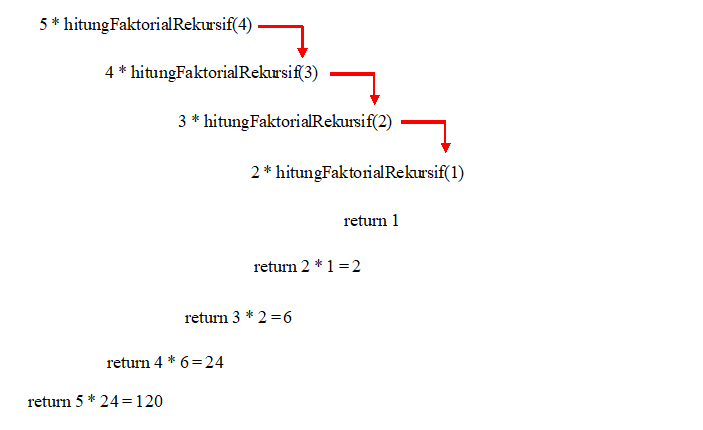

# JOBSHEET 14. Fungsi 2

## Perbaikan
#### Nama   : Rama Wijaya
#### Kelas  : 1A
#### NIM    : 2131710107

## Tujuan
* Mahasiswa memahami konsep fungsi rekursif
* Mahasiswa mampu mengimplementasikan fungsi rekursif dalam kode program


## Alat dan Bahan
* PC/Laptop
* Browser
* Koneksi internet
* Anaconda3 + Java kernel (opsional)

## Praktikum

### Percobaan 1
Pada percobaan ini akan dilakukan pembuatan program untuk menghitung nilai faktorial dari suatu bilangan dengan menggunakan fungsi rekursif. Selain itu, akan dibuat juga fungsi untuk menghitung nilai faktorial dengan menggunakan algoritma iteratif sebagai pembandingnya

1. Buat fungsi static dengan nama **faktorialRekursif()**, dengan tipe data kembalian fungsi int dan memiliki 1 parameter dengan tipe data int berupa bilangan yang akan dihitung nilai faktorialnya

    


```Java
// Tuliskan kode program Percobaan 1 Langkah 1
static int faktorialRekursif(int n) {
    if (n == 0) {
        return (1);
    } else {
        return (n * faktorialRekursif(n - 1));
    }
}
```

2. Buat lagi fungsi static dengan nama **faktorialIteratif()**, dengan tipe data kembalian fungsi int dan memiliki 1 parameter dengan tipe data int berupa bilangan yang akan dihitung nilai faktorialnya.

    


```Java
// Tuliskan kode program Percobaan 1 Langkah 2
static int faktorialIteratif(int n) {
    int faktor = l;
    for (int i = n; i >= l; i--) {
        faktor = faktor * i;
    }
    return faktor;
}
```

3. Lakukan pemanggilan terhadap kedua fungsi yang telah dibuat sebelumnya, dan tampilkan hasil yang didapatkan.

    


```Java
// Tuliskan kode program Percobaan 1 Langkah 1, 2, 3
static int faktorialRekursif(int n) {
    if (n == 0) {
        return (1);
    } else {
        return (n * faktorialRekursif(n - 1));
    }
}
static int faktorialIteratif(int n) {
    int faktor = 1;
    for (int i = n; i >= 1; i--) {
        faktor = faktor * i;
    }
    return faktor;
}
System.out.println(faktorialRekursif(5));
System.out.println(faktorialIteratif(5));
```

    120
    120


4. Jika ditelusuri, pada saat pemanggilan fungsi faktorialRekursif(5),maka proses yang terjadi dapat diilustrasikan sebagai berikut:

    

#### Pertanyaan
1. Apa yang dimaksud dengan fungsi rekursif?
2. Bagaimana contoh kasus penggunaan fungsi rekursif ?
3. Pada Percobaan1, apakah hasil yang diberikan fungsi faktorialRekursif() dan fungsi faktorialIteratif() sama? Jelaskan perbedaan alur jalannya program pada penggunaan fungsi rekursif dan fungsi iteratif!


**Jawaban**

1. Fungsi rekursif adalah fungsi yang memanggil dirinya sendiri. Oleh karena itu, proses pemanggilan fungsi akan terjadi secara berulang-ulang.


2. Contoh kasus penggunaan fungsi rekursif yaitu dalam kasus pemecahan hasil faktorial suatu bilangan dan kasus pemecahan hasil perhitungan pangkat.


3. Sama, pada penggunaan fungsi faktorialRekursif() tersebut memanggil dirinya sendiri secara berulang-ulang, maka harus ada kondisi yang membatasi pengulangan tersebut. Jika tidak, maka proses tidak akan pernah berhenti sampai memori yang digunakan untuk menampung proses tersebut tidak dapat menampung lagi. Sedangkan pada fungsi faktorialIteratif(), perulangan dilakukan dalam batasan syarat tertentu. Ketika syarat tersebut tidak terpenuhi lagi, maka perulangan akan terhenti. Keduanya sama saja harus memasukkan statement untuk melakukan perulangannya.

### Percobaan 2
Pada percobaan ini akan dilakukan pembuatan program untuk menghitung pangkat sebuah bilangan dengan menggunakan fungsi rekursif.

1. Buat fungsi static dengan nama **hitungPangkat()**, dengan tipe data kembalian fungsi int dan memiliki 2 parameter dengan tipe data int berupa bilangan yang akan dihitung pangkatnya dan bilangan pangkatnya

    

2.	Deklarasikan Scanner dengan nama sc
3.	Buatlah dua buah variabel bertipe int dengan nama bilangan dan pangkat
4.	Tambahkan kode berikut ini untuk menerima input dari keyboard

    

5. Lakukan pemanggilan fungsi hitungPangkat yang telah dibuat sebelumnya dengan mengirimkan dua nilai parameter.

    


```Java
// Tuliskan kode program Percobaan 2 Langkah 1 - 5
static int hitungPangkat(int x, int y) {
    if (y == 0) {
        return (1);
    } else {
        return (x * hitungPangkat(x, y - 1));
    }
}
import java.util.Scanner;
Scanner sc = new Scanner (System.in);
int bilangan;
int pangkat;

System.out.print("Bilangan yang dihitung: ");
bilangan = sc.nextInt();
System.out.print("Pangkat: ");
pangkat = sc.nextInt();
System.out.println(hitungPangkat(bilangan, pangkat));
```

    Bilangan yang dihitung: 4
    Pangkat: 2
    16


#### Pertanyaan
1. Pada Percobaan2, terdapat pemanggilan fungsi rekursif hitungPangkat(bilangan, pangkat) pada fungsi main, kemudian dilakukan pemanggilan fungsi hitungPangkat() secara berulangkali. Jelaskan sampai kapan proses pemanggilan fungsi tersebut akan dijalankan!

**Jawaban**


Pemanggilan fungsi akan berhenti jika pangkatnya telah bernilai 0. Setiap fungsi dipanggil, nilai fungsi akan berkurang 1.

### Percobaan 3
Pada percobaan ini akan dilakukan pembuatan program untuk menghitung jumlah uang nasabah yang disimpan di Bank setelah mendapatkan bunga selama beberapa tahun dengan menggunakan fungsi rekursif. 

1. Buat fungsi static dengan nama **hitungBunga()**, dengan tipe data kembalian fungsi double dan memiliki 2 parameter dengan tipe  data int berupa saldo nasabah dan lamanya menabung. Pada kasus ini dianggap bunga yang ditentukan oleh bank adalah 11% per tahun. Karena perhitungan bunga adalah bunga * saldo, sehingga untuk menghitung besarnya uang setelah ditambah bunga adalah saldo + bunga * saldo. Dalam hal ini, besarnya bunga adalah 0.11 * saldo, dan saldo dianggap 1 * saldo, sehingga 1 * saldo + 0.11 * saldo dapat diringkas menjadi 1.11 * saldo untuk perhitungan saldo setelah ditambah bunga (dalam setahun).

    

2.	Deklarasikan Scanner dengan nama sc
3.	Buatlah sebuah variabel bertipa double dengan nama saldoAwal dan sebuah variabel bertipe int bernama tahun
4.	Tambahkan kode berikut ini untuk menerima input dari keyboard

 

5. Lakukan pemanggilan fungsi hitungBunga yang telah dibuat sebelumnya dengan mengirimkan dua nilai parameter.

    


```Java
// Tuliskan kode program Percobaan 3 Langkah 1 - 5
static double hitungBunga(double saldo, int tahun) {
    if (tahun == 0) { 
        return (saldo);
    } else {
        return (1.11 * hitungBunga(saldo, tahun - 1));
    }
}

import java.util.Scanner;
Scanner sc = new Scanner (System.in); 
double saldoAwal;
double saldo;
int tahun;
System.out.print("Jumlah saldo awal: ");
saldoAwal = sc.nextInt();
System.out.print("Lamanya menabung (tahun): ");
tahun = sc.nextInt();

System.out.print("Jumlah uang setelah " + tahun + " tahun: ");
System.out.println(hitungBunga(saldoAwal, tahun));
```

    Jumlah saldo awal: 4000000
    Lamanya menabung (tahun): 2
    Jumlah uang setelah 2 tahun: 4928400.0


#### Pertanyaan
1. Pada Percobaan3, sebutkan blok kode program manakah yang merupakan “base case” dan “recursion call”!

**Jawaban**

Base case terletak pada 
```Java 
if (tahun == 0) {
    return (saldo);
}     
 ```
Recursion call terletak pada 
```Java 
else {
        return (1.11 * hitungBunga(saldo, tahun - 1));
    }
```

## Tugas

1. Buatlah program untuk menampilkan bilangan n sampai 0 dengan menggunakan fungsi rekursif dan fungsi iteratif. (**DeretDescendingRekursif**).


```Java
// Tuliskan jawaban tugas nomor 1
static void deretDescendingRekursif(int i){
    if(i == 0){
        System.out.println(i);
    }else{
        System.out.print(i + " ");
        deretDescendingRekursif(i - 1);
    }
}
static void deretDescendingIteratif(int j){
    for(int i = j; i >= 0; i--){
        System.out.print(i + " ");
    }
    System.out.println();
}
import java.util.Scanner;
Scanner sc = new Scanner(System.in);
int input;

System.out.print("Masukkan Bilangan N: ");
input = sc.nextInt();
System.out.println("Hasil Fungsi Rekursif");
deretDescendingRekursif(input);
System.out.println("Hasil Fungsi Iteratif");
deretDescendingIteratif(input);
```

    Masukkan Bilangan N: 12
    Hasil Fungsi Rekursif
    12 11 10 9 8 7 6 5 4 3 2 1 0
    Hasil Fungsi Iteratif
    12 11 10 9 8 7 6 5 4 3 2 1 0 


**Penjelasan Script Program:** 

Fungsi main
1. ***import java.util.Scanner; Scanner sc = new Scanner(System.in);*** = melakukan deklarasi Scanner sebagai sc. Ini digunakan untuk memberi inputan dari user kepada program.
2. ***int input;*** = mendeklarasikan int input yang berguna untuk menerima inputan dari user.
3. ***System.out.print("Masukkan bilangan N: "); input = sc.nextInt();*** = input diinisialisasi dengan inputan dari user.
4. ***System.out.println("Hasil fungsi rekursif"); deretDescendingRekursif(input);*** = menampilkan dan menghitung hasil fungsi deretDescendingRekursif.
5. ***System.out.println("Hasil fungsi iteratif"); deretDescendingIteratif(input);*** = menampilkan dan menghitung hasil fungsi deretDescendingIteratif.

Fungsi deretDescendingRekursif
1. ***static void deretDescendingRekursif(int i){*** = pada fungsi ini menerima parameter berupa int i yang mana ini adalah int input (diinisialisasi sebagai i).
2. ***if(i == 0){ System.out.println(i); }else{ System.out.print(i + " "); deretDescendingRekursif(i - 1);}}*** = pada fungsi ini terdapat pemilihan yang mana jika nilai i sama dengan 0 maka akan menampilkan nilai i itu sendiri. Dan jika nilai i tidak sama dengan 0 maka akan menampilkan bilangan i dan juga memanggil fungsi deretDescendingRekursif itu sendiri sehingga terjadi perulangan yang mengurangi nilai i satu dan akan berhenti sampai nilai i sama dengan 0. 

Fungsi deretDescendingIteratif
1. ***static void deretDescendingIteratif(int j)*** = pada fungsi ini menerima parameter int berupa j yang mana berasal dari fungsi main dengan variabel input.
2. ***for(int i = j; i >= 0; i--){ System.out.print(i + " ");} System.out.println();}*** = pada fungsi ini langsung terjadi perulangan yang mana nilai j sama dengan i dan perulangan akan terjadi terus-menerus. Jika nilai i lebih besar atau sama dengan 0 dengan pengurangan satu pada nilai i setiap perulangannya. Ketika berulang maka akan menghasilkan output nilai i itu sendiri.

2. Buatlah program yang di dalamnya terdapat fungsi rekursif untuk menghitung bilangan faktorial. Misalniya f = 8, maka akan dihasilkan 1+2+3+4+5+6+7+8 = 36 (**PenjumlahanRekursif**).


```Java
// Tuliskan jawaban tugas nomor 2
static int penjumlahanRekursif(int a){
    if(a > 0){
        return (penjumlahanRekursif(a - 1) + a);
    }else{
        return (0);
    }
}
import java.util.Scanner;
Scanner sc = new Scanner(System.in);
int input;

System.out.print("Masukkan Nilai F: ");
input = sc.nextInt();
for(int y = 1; y <= input; y++){
    if(y == input){
        System.out.print(y + " = ");
    }else{
        System.out.print(y + " + ");
    }
}
System.out.println(penjumlahanRekursif(input));
```

    Masukkan Nilai F: 8
    1 + 2 + 3 + 4 + 5 + 6 + 7 + 8 = 36


**Penjelasan Script Program:** 

Fungsi main
1. ***import java.util.Scanner; Scanner sc = new Scanner(System.in);*** = melakukan deklarasi Scanner sebagai sc. Ini digunakan untuk memberi inputan dari user kepada program.
2. ***int input;*** = membuat variabel input guna menerima inputan dari user.
3. ***System.out.print("Masukkan Nilai F: "); input = sc.nextInt();*** = Melakukan inisialisasi variabel input dengan memasukkan dari user.
4. ***for(int y = 1; y <= input; y++){ if(y == input){ System.out.print(y + " = "); }else{ System.out.print(y + " + ");}}*** = melakukan perulangan guna menampilkan visualisasi penjumlahan yang akan dilakukan.
5. ***if(y == input){ System.out.print(y + " = ");*** = dalam perulangan di atas terdapat if else yang mana jika y (variabel looping) bernilai sama dengan inputan maka akan menampilkan nilai y.
6. ***}else{ System.out.print(y + " + ");}*** = jika tidak, maka akan menampilkan nilai y saat itu.
7. ***System.out.println(penjumlahanRekursif(input));*** = selanjutnya adalah memanggil fungsi penjumlahanRekursif dan memberikan parameter variabel input.

Fungsi penjumlahanRekursif
1. ***static int penjumlahanRekursif(int a){*** = menerima parameter input dengan inisialisasi a.
2. ***if(a > 0){ return (penjumlahanRekursif(a - 1) + a); }else{ return (0); }}*** = melakukan pemilihan if else. Jika a > 0 maka program akan memanggil fungsi penjumlahanRekursif dengan parameter nilai a-1. Dan jika nilai a sama dengan 0 maka program akan mereturn 0.

3.	Buat program yang di dalamnya terdapat fungsi rekursif untuk mengecek apakah suatu bilangan n merupakan bilangan prima atau bukan. n dikatakan bukan bilangan prima jika ia habis dibagi dengan bilangan kurang dari n. (**CekPrimaRekursif**).


```Java
// Tuliskan jawaban tugas nomor 3
static void cekPrimaRekursif(int a, int b){
    if(b < 2){
          System.out.print(a + " Bukan Bilangan Prima");
    }else if(b > 2){
        if(0 != a % (b-1)){
            cekPrimaRekursif(a, (b-1));
    }else{
            System.out.print(a + " Bukan Bilangan Prima");
        }
    }else{
        System.out.print(a + " Adalah Bilangan Prima");
    }
}
import java.util.Scanner;
Scanner sc = new Scanner(System.in);
System.out.print("Masukkan Bilangan: ");
int input = sc.nextInt();
cekPrimaRekursif(input, input);
```

    Masukkan Bilangan: 2
    2 Adalah Bilangan Prima

**Penjelasan Script Program:** 

Fungsi main
1. ***import java.util.Scanner; Scanner sc = new Scanner(System.in);*** = melakukan deklarasi Scanner sebagai sc. Ini digunakan untuk memberi inputan dari user kepada program.
2. ***System.out.print("Masukkan Bilangan: "); int input = sc.nextInt()*** = menerima input dari user yang disimpan ke dalam variabel input.
3. ***cekPrimaRekursif(input, input);*** = memanggil fungsi cekPrimaRekursif dengan input sebagai parameter.

Fungsi cekPrimaRekursif
1. ***static void cekPrimaRekursif(int a, int b){*** = menerima parameter dengan nama a, b.
2. ***if(b < 2){ System.out.print(a + " Bukan Bilangan Prima");*** = jika b kurang dari 2 maka akan menampilkan output bukan bilangan prima. 
2. **else if(b > 2){ if(0 != a % (b-1)){ cekPrimaRekursif(a, (b-1)); }else{ System.out.print(a + " Bukan Bilangan Prima");} }else{ System.out.print(a + " Adalah Bilangan Prima");}}** = kemudian melakukan pemilihan bahwa b adalah lebih dari 2. Jika tidak maka program akan menampilkan bilangan prima. Jika b > 2 maka akan dilakukan perulangan kembali untuk mendapatkan nilai mod bilangan a ke bilangan sebelumnya dengan pemanggilan fungsi cekPrimaRekursif dengan parameter b-1. Jika ada modulus yang 0, maka program akan menyatakan jika bilangan tersebut adalah bukan bilangan prima dan jika tidak ada hasil mod 0, bilangan tersebut dinyatakan sebagai bilangan prima.

4.	Sepasang marmut yang baru lahir (jantan dan betina) ditempatkan pada suatu pembiakan.  Setelah dua bulan pasangan marmut tersebut melahirkan sepasang marmut kembar (jantan dan betina). Setiap pasangan marmut yang lahir juga akan melahirkan sepasang marmut juga setiap 2 bulan.  Berapa pasangan marmut yang ada pada akhir bulan ke-12? Buatlah programnya menggunakan fungsi rekursif! (**Fibonacci**).
Berikut ini adalah ilustrasinya dalam bentuk tabel.

 


```Java
// Tuliskan jawaban tugas nomor 4
static int fibonacci(int bulan){
    if(bulan <= 1){
        return(bulan);
    }else{
        return (fibonacci(bulan-2)+fibonacci(bulan-1));
    }
}

import java.util.Scanner;
Scanner sc = new Scanner(System.in);
System.out.print("Masukkan Bulan: ");
int bulan = sc.nextInt();
int hasil = fibonacci(bulan);
System.out.println("Pasangan marmut pada bulan ke-"+bulan+ " adalah "+hasil);
```

    Masukkan Bulan: 12
    Pasangan marmut pada bulan ke-12 adalah 144


**Penjelasan Script Program:** 

Fungsi main
1. ***import java.util.Scanner; Scanner sc = new Scanner(System.in);*** = melakukan deklarasi Scanner sebagai sc. Ini digunakan untuk memberi inputan dari user kepada program.
2. ***System.out.print("Masukkan Bulan: "); int bulan = sc.nextInt();*** = menerima inputan bulan dari user dengan variabel bulan.
3. ***int hasil = fibonacci(bulan);*** = membuat sebuah variabel untuk menerima hasil perhitungan.
4. ***System.out.println("Pasangan marmut pada bulan ke-"+bulan+ " adalah "+hasil);*** = menampilkan hasil perhitungan.

Fungsi fibonacci
1. ***static int fibonacci(int bulan){*** = menerima parameter dari input yang diinisialisasi dengan nama bulan.
2. ***if(bulan <= 1){ return(bulan); }else{ return (fibonacci(bulan-2)+fibonacci(bulan-1));}}*** = melakukan pemilihan jika bulan kurang dari 1 atau sama dengan 0, maka akan menghasilkan parameter bulan itu sendiri. Jika tidak, maka akan melakukan pemanggilan fungsi fibonacci 2 kali dengan pengulangan nilai parameter.