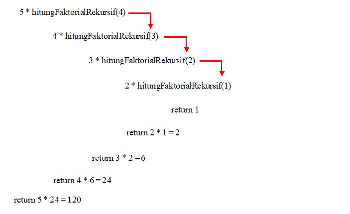
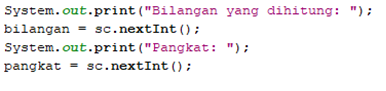
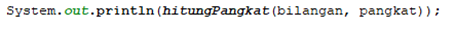
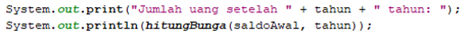
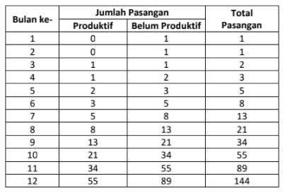

# JOBSHEET 14. Fungsi 2

## Tujuan
* Mahasiswa memahami konsep fungsi rekursif
* Mahasiswa mampu mengimplementasikan fungsi rekursif dalam kode program


## Alat dan Bahan
* PC/Laptop
* Browser
* Koneksi internet
* Anaconda3 + Java kernel (opsional)

## Praktikum

### Percobaan 1
Pada percobaan ini akan dilakukan pembuatan program untuk menghitung nilai faktorial dari suatu bilangan dengan menggunakan fungsi rekursif. Selain itu, akan dibuat juga fungsi untuk menghitung nilai faktorial dengan menggunakan algoritma iteratif sebagai pembandingnya

1. Buat fungsi static dengan nama **faktorialRekursif()**, dengan tipe data kembalian fungsi int dan memiliki 1 parameter dengan tipe data int berupa bilangan yang akan dihitung nilai faktorialnya

    


```Java
// Tuliskan kode program Percobaan 1 Langkah 1
static int faktorialRekursif(int n) {
    if (n == 0) {
        return (1);
    } else {
        return (n * faktorialRekursif(n - 1));
    }
}
```

Penjelasan :
- static int .... = Untuk membuat fungsi bertipe int berparameter int n
- if (n==0){ = Base case
- return(1); = Output bernilai 1
- return (n*fak..... = Recursion call. 

2. Buat lagi fungsi static dengan nama **faktorialIteratif()**, dengan tipe data kembalian fungsi int dan memiliki 1 parameter dengan tipe data int berupa bilangan yang akan dihitung nilai faktorialnya.

    


```Java
// Tuliskan kode program Percobaan 1 Langkah 2
static int faktorialIteratif(int n) {
    int faktor = 1;
    for (int i = n; i >= l; i--) {
        faktor = faktor * i;
    }
    return faktor;
}
```

Penjelasan :
- static .... = Deklarasi fungsi iteratif
- int faktor = 1; = Instansiasi variabel faktor dari tipe data int
- for (int i ..... = Base case
- faktor = faktor * i; = Operasi perhitungan 
- return faktor; = Untuk menampung hasil perhitungan di proses selanjutnya

3. Lakukan pemanggilan terhadap kedua fungsi yang telah dibuat sebelumnya, dan tampilkan hasil yang didapatkan.

    


```Java
// Tuliskan kode program Percobaan 1 Langkah 1, 2, 3
static int faktorialRekursif(int n) {
    if (n == 0) {
        return (1);
    } else {
        return (n * faktorialRekursif(n - 1));
    }
}

static int faktorialIteratif(int n) {
    int faktor = 1;
    for (int i = n; i >= 1; i--) {
        faktor = faktor * i;
    }
    return faktor;
}

System.out.println(faktorialRekursif(5));
System.out.println(faktorialIteratif(5));
```

    120
    120


Penjelasan :
- System.out.println(faktorialRekursif(5)); = Mencetak dan memanggil fungsi faktorialRekursif berparameter 5
- System.out.println(faktorialIteratif(5)); = Mencetak dan memanggil fungsi faktorialIteratif berparameter 5

4. Jika ditelusuri, pada saat pemanggilan fungsi faktorialRekursif(5),maka proses yang terjadi dapat diilustrasikan sebagai berikut:

    

#### Pertanyaan
1. Apa yang dimaksud dengan fungsi rekursif?
- Teknik memanggil fungsi itu sendiri secara berulang-ulang sampai ada kondisi terpenuhi, lalu menghentikannya.

2. Bagaimana contoh kasus penggunaan fungsi rekursif ?
- Seperti menghitung faktorial

3. Pada Percobaan1, apakah hasil yang diberikan fungsi faktorialRekursif() dan fungsi faktorialIteratif() sama? Jelaskan perbedaan alur jalannya program pada penggunaan fungsi rekursif dan fungsi iteratif!
- Sama, Jika rekursif akan berhenti berjalan jika base case terpenuhi, sedangkan pada iteratif akan berhenti berjalan perulangan bernilai false.

### Percobaan 2
Pada percobaan ini akan dilakukan pembuatan program untuk menghitung pangkat sebuah bilangan dengan menggunakan fungsi rekursif.

1. Buat fungsi static dengan nama **hitungPangkat()**, dengan tipe data kembalian fungsi int dan memiliki 2 parameter dengan tipe data int berupa bilangan yang akan dihitung pangkatnya dan bilangan pangkatnya

    

2.	Deklarasikan Scanner dengan nama sc
3.	Buatlah dua buah variabel bertipe int dengan nama bilangan dan pangkat
4.	Tambahkan kode berikut ini untuk menerima input dari keyboard

    

5. Lakukan pemanggilan fungsi hitungPangkat yang telah dibuat sebelumnya dengan mengirimkan dua nilai parameter.

    


```Java
// Tuliskan kode program Percobaan 2 Langkah 1 - 5
static int hitungPangkat(int x, int y){
    if (y == 0) {
        return (1);
    } else {
        return (x * hitungPangkat(x, y - 1));
    }
}

import java.util.Scanner;
Scanner sc = new Scanner(System.in);

int bilangan, pangkat;

System.out.print("Bilangan yang dihitung : ");
bilangan = sc.nextInt();
System.out.print("Pangkat : ");
pangkat = sc.nextInt();

System.out.println(hitungPangkat(bilangan, pangkat));
```

    Bilangan yang dihitung : 4
    Pangkat : 2
    16


Penjelasan :
- static int hitungPangkat... = Deklarasi fungsi 
- if (y == 0) { = Base case
- import java.util.Scanner; = Untuk menginputkan dari keyboard
- Scanner sc = new Scanner.... = Library Scanner
- int bilangan, pangkat; = deklarasi variabel bertipe int
- System.out.print("Bilangan .... bilangan = sc.... = Menginput dari variabel bilangan
- System.out.print("Pangkat..... pangkat = sc.... = Menginput dari variabel pangkat
- System.out.println(hitung..... = Memanggil fungsi

#### Pertanyaan
1. Pada Percobaan2, terdapat pemanggilan fungsi rekursif hitungPangkat(bilangan, pangkat) pada fungsi main, kemudian dilakukan pemanggilan fungsi hitungPangkat() secara berulangkali. Jelaskan sampai kapan proses pemanggilan fungsi tersebut akan dijalankan!
- Sampai kondisi terpenuhi

### Percobaan 3
Pada percobaan ini akan dilakukan pembuatan program untuk menghitung jumlah uang nasabah yang disimpan di Bank setelah mendapatkan bunga selama beberapa tahun dengan menggunakan fungsi rekursif. 

1. Buat fungsi static dengan nama **hitungBunga()**, dengan tipe data kembalian fungsi double dan memiliki 2 parameter dengan tipe  data int berupa saldo nasabah dan lamanya menabung. Pada kasus ini dianggap bunga yang ditentukan oleh bank adalah 11% per tahun. Karena perhitungan bunga adalah bunga * saldo, sehingga untuk menghitung besarnya uang setelah ditambah bunga adalah saldo + bunga * saldo. Dalam hal ini, besarnya bunga adalah 0.11 * saldo, dan saldo dianggap 1 * saldo, sehingga 1 * saldo + 0.11 * saldo dapat diringkas menjadi 1.11 * saldo untuk perhitungan saldo setelah ditambah bunga (dalam setahun).

    

2.	Deklarasikan Scanner dengan nama sc
3.	Buatlah sebuah variabel bertipa double dengan nama saldoAwal dan sebuah variabel bertipe int bernama tahun
4.	Tambahkan kode berikut ini untuk menerima input dari keyboard

 

5. Lakukan pemanggilan fungsi hitungBunga yang telah dibuat sebelumnya dengan mengirimkan dua nilai parameter.

    


```Java
// Tuliskan kode program Percobaan 3 Langkah 1 - 5
static double hitungBunga(double saldo, int tahun) {
    if (tahun == 0) {
        return (saldo);
    } else {
        return (1.11 * hitungBunga(saldo, tahun - 1));
    }
}

import java.util.Scanner;
Scanner sc = new Scanner(System.in);

double saldoAwal;
int tahun;

System.out.print("Jumlah saldo awal : ");
saldoAwal = sc.nextInt();
System.out.print("Lamanya menabung (tahun) : ");
tahun = sc.nextInt();

System.out.print("Jumlah uang setelah " + tahun + " tahun : ");
System.out.println(hitungBunga(saldoAwal, tahun));
```

    Jumlah saldo awal : 2000000
    Lamanya menabung (tahun) : 2
    Jumlah uang setelah 2 tahun : 2464200.0


Penjelasan :
- static double hitung..... = Membuat fungsi
- if (tahun == 0) { = Base case
- import java.util.Scanner; = Untuk menginputkan dari keyboard
- Scanner sc = new Scanner.... = Library Scanner
- double saldoAwal; int tahun; = Deklarasi variabel bertipe double
- System.out.print("Jumlah ..... saldoAwal = sc..... = Menginput saldo awal
- System.out.print("Lamanya..... tahun = sc.... = Menginput tahun
- System.out.println(hitungBunga(saldo..... = Memanggil fungsi hitungBunga

#### Pertanyaan
1. Pada Percobaan3, sebutkan blok kode program manakah yang merupakan “base case” dan “recursion call”!
- Base case = tahun == 0
- Recursion call = 1.11*hitungBunga(saldo, tahun-1)

## Tugas

1. Buatlah program untuk menampilkan bilangan n sampai 0 dengan menggunakan fungsi rekursif dan fungsi iteratif. (**DeretDescendingRekursif**).


```Java
// Tuliskan jawaban tugas nomor 1
static void deretDescendingRekursif(int n) {
    if(n >= 0) {
        System.out.print(n);
        deretDescendingRekursif(n - 1);
    }
}

static void deretDescendingIteratif(int n) {
    for(int i = n; i >= 0; i--) System.out.print(i);
}

deretDescendingRekursif(5);
System.out.println();
deretDescendingIteratif(5);
```

    543210
    543210

Penjelasan :
- static void deret = Deklarasi fungsi
- if(n >= 0) = Base case
- System.out.print(n); deretDescendingRekursif(n - 1); = Recursion call
- deretDescendingRekursif(5); = Pemanggilan fungsi
- System.out.println(); = Tampil hasil fungsi

2. Buatlah program yang di dalamnya terdapat fungsi rekursif untuk menghitung bilangan faktorial. Misalniya f = 8, maka akan dihasilkan 1+2+3+4+5+6+7+8 = 36 (**PenjumlahanRekursif**).


```Java
// Tuliskan jawaban tugas nomor 2
int i = 1;
printf("1");
static int penjumlahanRekursif(int x) {
    if (i == x) return 1;
    else {
        i++;
        printf("+ %d ", i);
        return(i + penjumlahanRekursif(x));
    }
}

System.out.println(" = "+ penjumlahanRekursif(8));
```

    1+ 2 + 3 + 4 + 5 + 6 + 7 + 8  = 36


Penjelasan :
- int i = 1; = Instansiasi variabel bertipe int
- static int penjumlahanRekursif(int x) = Deklarasi fungsi rekursif
- if (i == x) = Base case
- return(i + penjumlahanRekursif(x)); = Recursion call
- System.out.println(" = "+ penjumlahanRekursif(8)); = Pemanggil fungsi

3.	Buat program yang di dalamnya terdapat fungsi rekursif untuk mengecek apakah suatu bilangan n merupakan bilangan prima atau bukan. n dikatakan bukan bilangan prima jika ia habis dibagi dengan bilangan kurang dari n. (**CekPrimaRekursif**).


```Java
// Tuliskan jawaban tugas nomor 3
import java.util.Scanner;
Scanner sc = new Scanner(System.in);

int x ;

int cekPrima(int y){ 
    if (y == 1){ 
        return 1;
        
    }else if(x%y==0){ 
        return 0;
        
    }else{
        return cekPrima(y-1);  
    }
}

System.out.print("Masukkan Bilangan: "); 
x = sc.nextInt(); 
    if(x>1){ 
        int y = cekPrima(x-1); 
        if (y==1){ 
            printf("%d Bilangan Prima\n", x);
            
        }else{ 
            printf("%d Bukan Bilangan Prima\n", x);
        }
    }else{
        printf("Bukan Bilangan Prima\n", x);
    }
```

    Masukkan Bilangan: 3
    3 Bilangan Prima


Penjelasan : 
- import java.util.Scanner; = Untuk menginputkan dari keyboard
- Scanner sc = new Scanner.... = Library Scanner
- int x; = Deklarasi variabel bertipe int
- int cekPrima = Deklarasi fungsi rekursif
- if (y == 1) = Base case
- return cekPrima = Recursion call
- x = sc.nextInt(); = Menginput dari keyboard
- if (y==1){ printf("%d Bilangan Prima\n", x); = Jika hasil perhitungan 1 atau bilangan itu sendiri maka merupakan Bil Prima
- else{ printf("%d Bukan Bilangan Prima\n", x); = Jika hasil perhitungan selain itu maka bukan Bil Prima

4.	Sepasang marmut yang baru lahir (jantan dan betina) ditempatkan pada suatu pembiakan.  Setelah dua bulan pasangan marmut tersebut melahirkan sepasang marmut kembar (jantan dan betina). Setiap pasangan marmut yang lahir juga akan melahirkan sepasang marmut juga setiap 2 bulan.  Berapa pasangan marmut yang ada pada akhir bulan ke-12? Buatlah programnya menggunakan fungsi rekursif! (**Fibonacci**).
Berikut ini adalah ilustrasinya dalam bentuk tabel.

 


```Java
// Tuliskan jawaban tugas nomor 4
import java.util.Scanner;
Scanner sc = new Scanner(System.in);

static int fibonacci(int n, int a, int b) { 
     if (n == 0) return a; 
     if (n == 1) return b; 
     return fibonacci(n - 1, b, a + b); 
}

System.out.print("Masukkan bulan : "); 
int n = sc.nextInt();
System.out.print("Pasangan : ");
System.out.print(fibonacci(12, 0, 1));
```

    Masukkan bulan : 12
    Pasangan : 144

Penjelasan :
- import java.util.Scanner; = Untuk menginputkan dari keyboard
- Scanner sc = new Scanner.... = Library Scanner
- static int fibonacci(int n ..... = Deklarasi fungsi rekursif
- if (n == 0) return a; if (n == 1) return b; = Base case
- return fibonacci ..... = Recursion call
- System.out.print... = Cetak fungsi
- int n = sc.nextInt(); = Menginput n
- System.out.print(fibonacci(12, 0, 1)); = Menampilkan hasil fibonacci
